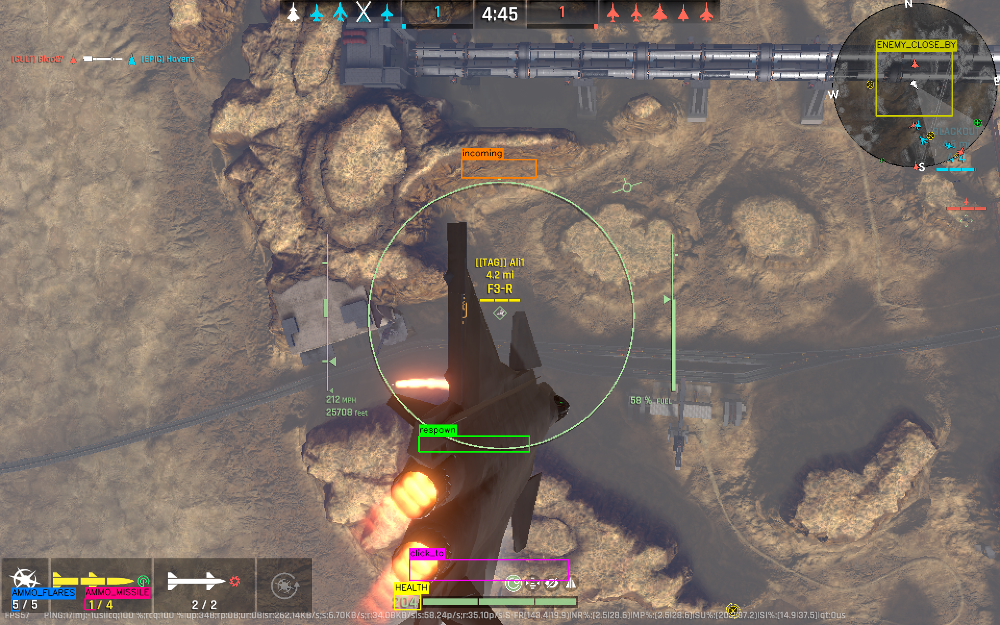
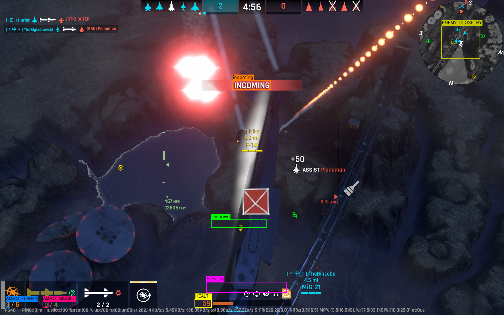
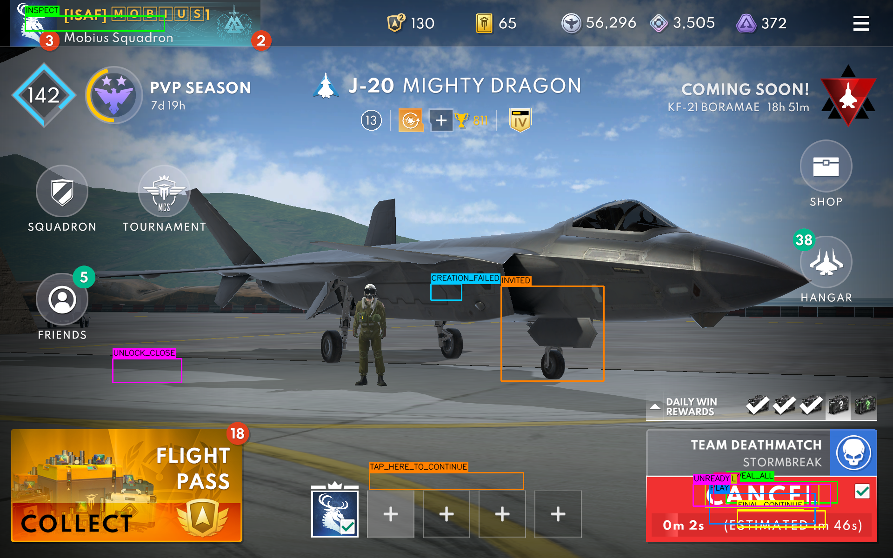
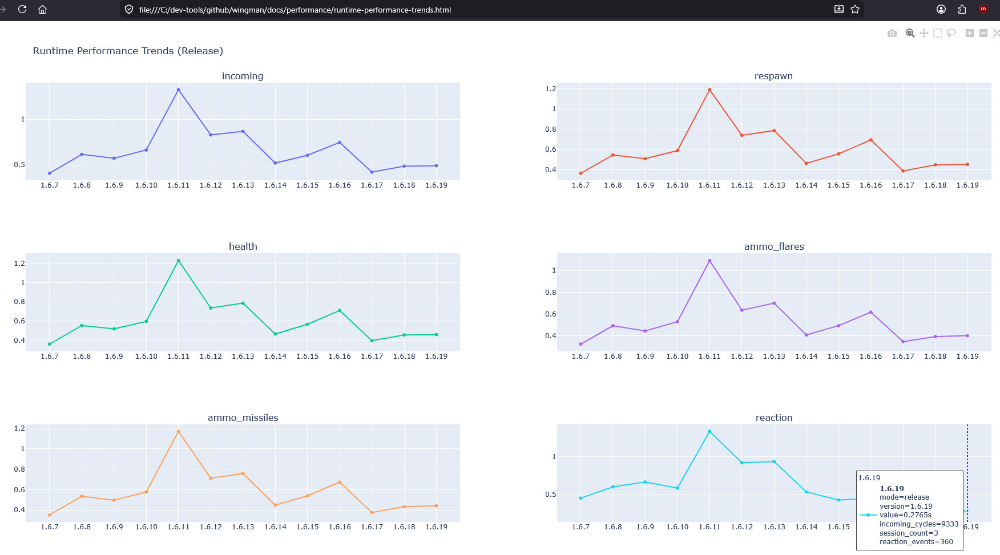

# MetalStorm Wingman

AI wingman automation for MetalStorm (PC), built to run unattended mission loops, support live manual takeover, and evolve toward squad-level AI tactics.

Current version: v1.6.19





---

## Vision

One pilot. One or more AI wingmen. A coordinated squad.

Wingman is designed to scale from single-instance automation to multi-instance coordination where each agent can hold a role (aggressive, loiter, target-painting, support) and adapt as match state changes.

---

## What It Does Today

Press `m` and Wingman can run the full loop:

1. Lobby detection and PLAY/READY click flow.
2. Matchmaking confirmation in GAME_WAITING (CANCEL + fallback logic).
3. GAME_STARTING handling and transition to GAME_BATTLE.
4. Mission execution (J20/Loiter), incoming response, health/ammo handling.
5. Respawn detection and restart flow.
6. Match-end click-through and return to lobby.

Manual takeover is always available with maneuver keys (`i`, `j`, `k`, `l`), moving into GAME_BATTLE_MANUAL behavior.

### Current Capabilities

| Capability | Status |
|------------|--------|
| Formal FSM with lobby/waiting/starting/battle/manual/end transitions | ✅ |
| Unattended loop trigger (`m`) and mission hotkeys (`u`, `y`) | ✅ |
| Incoming missile detection and flare response | ✅ |
| Health/ammo OCR-driven mission behavior | ✅ |
| Respawn detection with restart controls | ✅ |
| Lobby popup handling and click-through end-state handling | ✅ |
| Game lobby stall guard (v1.6.19) | ✅ |
| Offline crop calibration tooling | ✅ |
| Performance tracking and preview/release chart workflows | ✅ |
| Replay integration harness with assertion engine (ADR 037) | ✅ |
| Runtime replay gate (ADR 044, PATH1) | ✅ |
| Live-screen capture gate (ADR 045, PATH1) | ✅ |
| Real screenshot OCR integration tests (PATH1/PATH2) | ✅ |

---

## Runtime Performance

The chart below tracks loop execution time per release from v1.6.7 through v1.6.19.

Versions v1.6.17–v1.6.19 contain no behavioral changes — they are dedicated performance-tracking releases used to capture a stable baseline before Phase 3 (behavior-tree tactical decisions). v1.6.19 adds an improved game lobby stall guard on top of that baseline.



---

## Validation Lanes

Wingman includes layered validation from fast checks to runtime-realistic gates:

- `make test`: core pytest suite and HTML report.
- `make rr-path1-gate`: ADR044 runtime replay gate (full `wingman.main` loop + replay assertions validator).
- `make rr-live-path1-gate`: ADR045 live-screen gate (desktop presenter + real monitor capture + live validator).
- `make ocr` (or `make ti`): ADR037 PATH1/PATH2 real-OCR integration tests.
- `make tp`: fast preview bundle (`test` + ADR044 + ADR045 + performance previews).
- `make tp-full`: full preview bundle (`tp` + ADR037 PATH1/PATH2 OCR lane).

---

## Quick Start

### Setup

```bash
uv sync --all-groups
```

### Run

```bash
make r
make rd
```

- `make r`: run Wingman normally
- `make rd`: run with DEBUG logs in `wingman.log`

### Core Validation Commands

```bash
make test
make tp
make tp-full
make rr-path1-gate
make rr-live-path1-gate
make ocr
```

- `make test`: main automated test report workflow
- `make tp`: fast preview (test + ADR044/ADR045 gates + performance preview artifacts)
- `make tp-full`: full preview (adds ADR037 PATH1/PATH2 OCR lane)
- `make rr-path1-gate`: deterministic runtime replay gate for PATH1
- `make rr-live-path1-gate`: live-screen runtime gate for PATH1
- `make ocr`: real-OCR integration tests for PATH1 and PATH2

---

## Runtime Hotkeys

| Key | Action |
|-----|--------|
| `m` | Start unattended mode |
| `u` | Start J20 mission |
| `y` | Start loiter mission |
| `end` | Cancel active mission |
| `i` / `j` / `k` / `l` | Manual maneuver takeover |
| `x` | Toggle weapon loop |
| `p` | Manual padlock cooldown trigger |
| `v` | Save debug screenshot with crop overlays |
| `b` | Inject simulated respawn OCR result (testing) |
| `backspace` | Exit script (runtime mode) |

Note: automated replay/capture test lanes disable hotkeys to avoid accidental interruption during CI-style runs.

---

## Calibration and Crop Workflow

```bash
make calibrate
make calibrate-crop CROP=respawn
make add-crops
```

---

## Roadmap and Aspirations

The near-term path is to complete robust replay-path fixture coverage and then move up the AI stack:

- Phase 2 complete: stable automation + OCR perception + FSM + performance tooling
- Phase 3 planned: behavior-tree tactical decisions
- Future: reinforcement learning, deep vision policy learning, multi-agent coordination

Roadmap doc:

- `docs/PROJECT_AI_ROADMAP.md`

Architecture decisions and workflow docs are tracked under:

- `docs/adr/`
- `docs/workflow/`

---

## Documentation Index

- Setup and usage: `docs/job-aids/001-setup-and-usage.md`
- Calibration: `docs/job-aids/006-calibrate-crop-regions.md`
- Performance workflow: `docs/job-aids/008-performance-regression-workflow.md`
- Contribution guide: `CONTRIBUTING.md`
