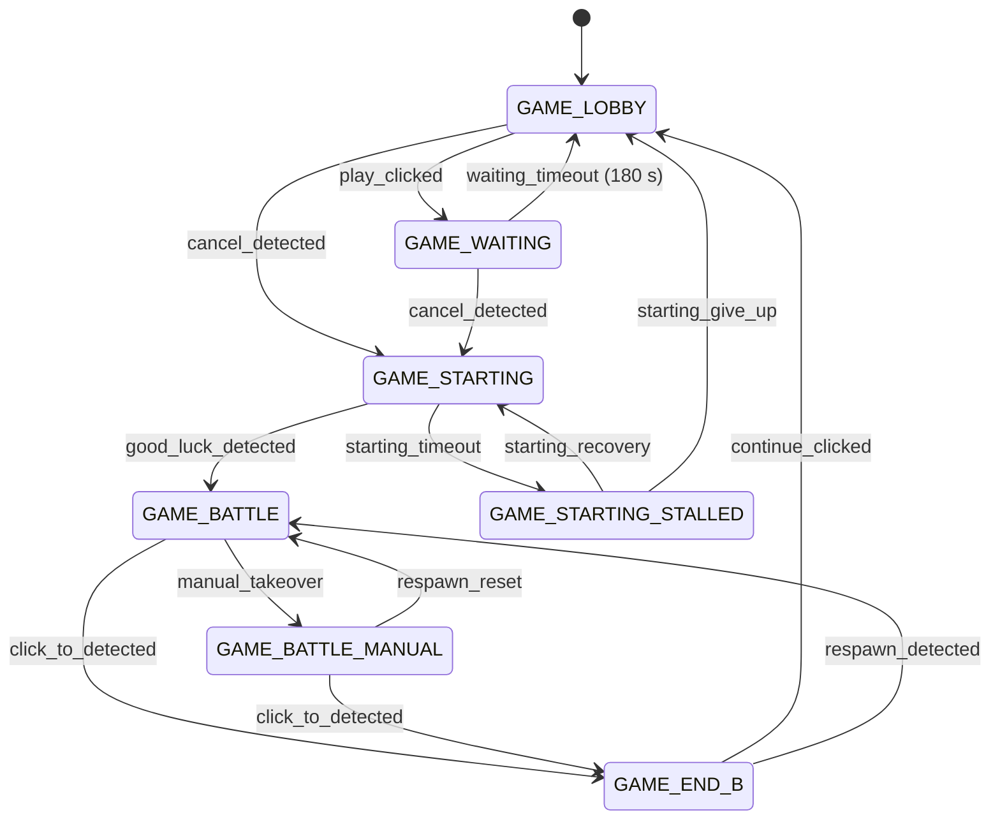

# MetalStorm Wingman

An AI wingman for MetalStorm (PC). Runs as your squadron partner — fully autonomous across multiple matches — or alongside you as a manual-override co-pilot you can take control of at any time. The long-term goal is a squadron of AI wingmen flying together, each running an independent Wingman instance.

**Current version:** v1.6.6


---

## The Vision

> **One human pilot. One or more AI wingmen. A full squad.**

Each Wingman instance runs on its own emulator or game window. Together they form a squadron — queuing together, launching together, and covering each other in battle. A human player can fly alongside them, or hand off entirely and let the squadron run unattended.

Individual instances can be tuned for different roles: aggressive search-and-destroy, defensive loiter, or target-painting to keep enemies occupied while the human lands kills.

---

## What It Does Today

Press `m` once. Wingman runs the full match loop from there:

1. Detects the lobby and clicks the play button
2. Waits for matchmaking to confirm, then waits for "Good Luck"
3. Launches the J20 mission (afterburner + search-and-destroy loop)
4. Deploys flares automatically when INCOMING missile is detected
5. Ejects and dives when missiles are empty, waits for respawn
6. Restarts the mission after respawn
7. Detects match end, clicks through the results screen, and loops

Take control at any time by pressing a maneuver key (`i` / `k` / `j` / `l`) — Wingman cancels its active mission, transitions to manual mode, and stays out of the way until you're done.

### Capabilities

| Feature | Status |
|---------|--------|
| Full unattended match loop (`m` key) | ✅ Working |
| Manual override — maneuver keys cancel autopilot | ✅ Working |
| J20 and Loiter missions | ✅ Working |
| Formal FSM (LOBBY / WAITING / STARTING / BATTLE / END) | ✅ Working |
| Game-starting stall detection + recovery | ✅ Working |
| Respawn detection + auto-restart | ✅ Working |
| Incoming missile detection + auto-flare | ✅ Working |
| Health monitoring — mission restart on death | ✅ Working |
| Ammo tracking — missiles and flares remaining | ✅ Working |
| Eject and dive when missiles empty | ✅ Working |
| Enemy proximity detection | ✅ Working |
| 30s no-enemy disengage — rolls right, restarts mission | ✅ Working |
| Matchmaking CANCEL confirmation + PLAY re-click if queue drops | ✅ Working |
| GAME_WAITING 180s timeout → GAME_LOBBY recovery | ✅ Working |
| Manual-takeover mode (GAME_BATTLE_MANUAL) — auto-restart suppressed | ✅ Working |
| Search and destroy loop (auto-padlock + auto-fire) | ✅ Working |
| Target-painting mode (suppresses last missile) | ✅ Working |
| Lobby popup handling (Reveal All, Tap Here, Unlock Close, Inspect, Invited, Event Refresh, Final Continue) | ✅ Working |
| "Click to Continue" auto-click at match end | ✅ Working |
| CPU-only OCR — no GPU required | ✅ Working |
| Offline crop calibration — no live game needed | ✅ Working |
| Multi-instance — run one per emulator window for a full squad | ✅ Working |

---

## How It Works

On each loop tick, Wingman captures a screen region and runs EasyOCR against named crop areas to read game state. Three OCR workers run in parallel on a background thread pool so the main mission logic is never blocked.

### Game state machine

Wingman tracks which phase of the match it's in using a formal state machine:



Each state change fires callbacks (cancel mission, start mission loop, etc.). Invalid transitions are rejected rather than silently ignored.

### Crop regions

OCR targets are defined in `config.yaml` as named regions with percentage coordinates relative to the capture frame:

```yaml
crops:
  respawn:
    coords: [[0.4188, 0.6978], [0.5292, 0.7233]]
    text: [RESPAWN]
  incoming:
    coords: [[0.4618, 0.2556], [0.5361, 0.2844]]
    text: [MING, ARNING]
  click_to:
    coords: [[0.4097, 0.8956], [0.5687, 0.9289]]
    text: [CLICKTO, LICKTO, CLICK]
```

Use the calibration tool to set or adjust any crop region offline against reference screenshots.

**OCR performance (CPU-only):** avg ~3.25s/cycle. Enabling GPU (CUDA) drops this to <200ms — see [GPU setup guide](docs/TODO-enable-gpu-ocr.md).

---

## Getting Started

See [Job Aid 001 — Setup and Usage](docs/job-aids/001-setup-and-usage.md) for full requirements, installation steps, and configuration options.

### Quick start

```powershell
# Install uv if needed
pipx install uv

# Install dependencies
uv sync --all-groups

# Run (INFO log to console)
make r

# Run with DEBUG log written to wingman.log
make rd
```

### Runtime hotkeys

| Key | Action |
|-----|--------|
| `m` | Start unattended mode (full match loop) |
| `u` | Start J20 mission manually |
| `y` | Start loiter mission manually |
| `end` | Cancel current mission |
| `i` / `k` / `j` / `l` | Manual maneuver — cancels active mission |
| `x` | Toggle weapon fire loop |
| `p` | Padlock camera (manual press sets a 10s cooldown) |
| `v` | Save debug screenshot with crop overlays |
| `backspace` | Exit |

---

## Calibrating Crop Regions

If the capture window moves or a crop needs adjustment, recalibrate offline using static reference screenshots — no live game required.

```bash
# Recalibrate every crop interactively
make calibrate

# Recalibrate a single named crop
make calibrate-crop CROP=respawn

# Add and calibrate crops from test_screenshots/to_be_added/
# (filename stem becomes the crop name)
make add-crops
```

See [Job Aid 006 — Calibrate Crop Regions](docs/job-aids/006-calibrate-crop-regions.md) for the full calibration workflow.

---

## Where It's Going

| Phase | Goal | Status |
|-------|------|--------|
| 1–2 | Automation + text-based perception | ✅ Done |
| 2 | Named crop regions + offline calibration tooling | ✅ Done |
| 2 | Full lobby popup handling | ✅ Done |
| 2 | Health, ammo, and enemy proximity detection | ✅ Done |
| 2 | Search and destroy loop | ✅ Done |
| 2 | Formal FSM (transitions library) | ✅ Done |
| 2 | Manual override — maneuver keys hand off to human pilot | ✅ Done |
| 3 | Behaviour trees — adaptive tactics based on game state | Planned |
| 3 | Squadron coordination — multiple instances queue and launch together | Planned |
| 4 | Reinforcement learning — bot learns from experience | Future |
| 5–6 | Deep RL + vision, multi-agent swarm tactics | Research |

See [docs/PROJECT_AI_ROADMAP.md](docs/PROJECT_AI_ROADMAP.md) for the full roadmap.

---

## Contributing

See [CONTRIBUTING.md](CONTRIBUTING.md) for development workflow, testing expectations, and PR guidance.
