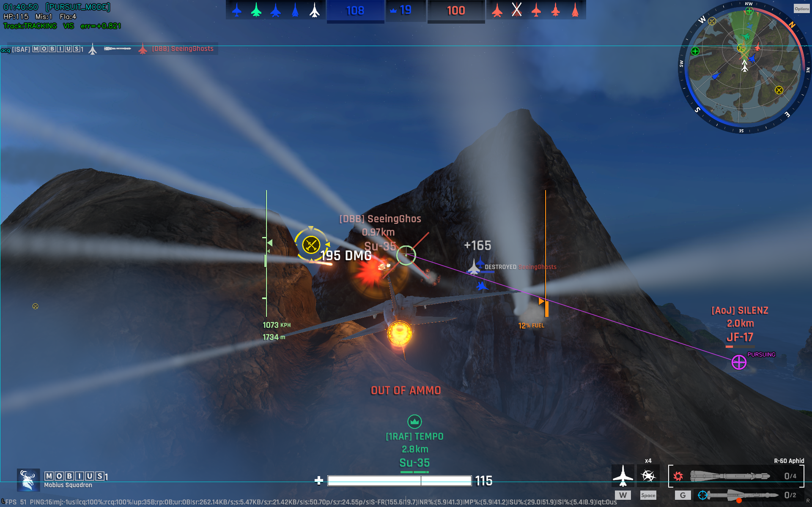
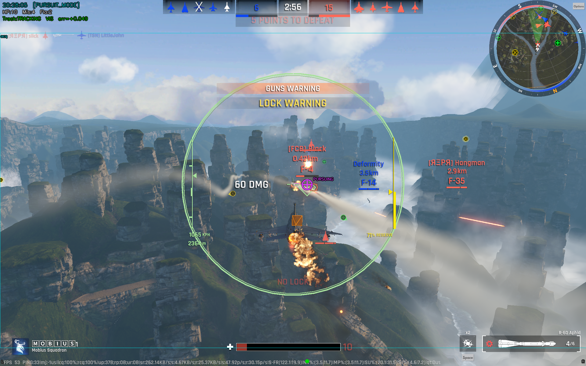
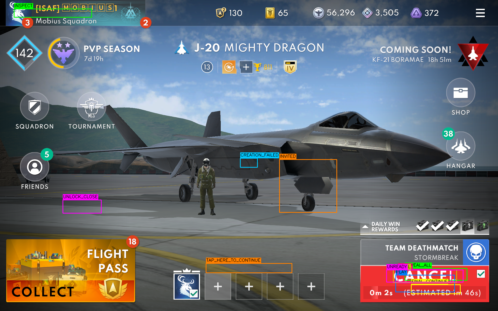
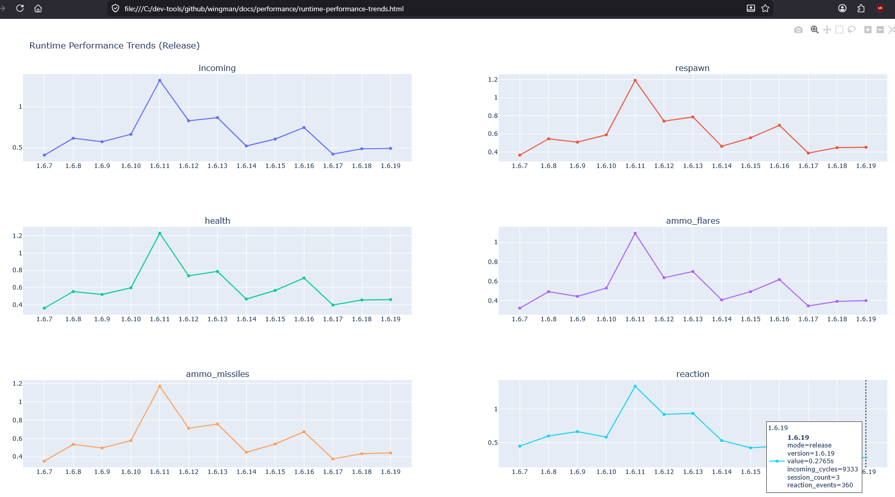

# MetalStorm Wingman

Wingman flies a fighter jet in MetalStorm (PC) on its own. It reads the screen,
decides what to do, and presses the keys, for hours at a time, on an ordinary
CPU.

Current version: v1.8.11 — runs on **Windows** and **Linux** (GNOME Wayland, Ubuntu 24.04), on **CPU only**, from a low-end laptop to a desktop workstation.



*Wingman mid-fight. It has just destroyed one enemy (`DESTROYED`) and is
already chasing the next, a JF-17 2 km away, under the magenta marker.*

- **Unattended for hours.** Lobby, matchmaking, battle, respawn and match end,
  with no input.
- **Survives missiles.** 90% ten-second survival after a missile warning with
  evasion on, against 68% without (122 engagements, [ADR 070](docs/adr/070-missile-evade-tactic.md)).
- **Reacts fast.** 0.49 s on average from missile warning to flares, measured
  on the release performance baseline.
- **Any jet, in progress.** [ACS](#acs-one-combat-mode-for-any-fighter)
  (Autonomy Core System) is one combat mode for any fighter, meant to replace
  the per-jet mission scripts.
- **Stays out of your way.** On Linux the game runs on its own display, so you
  can keep using your computer while it plays.

---

## Vision

One pilot. One or more AI wingmen. A coordinated squad.

Wingman is designed to scale from single-instance automation to multi-instance coordination where each agent can hold a role (aggressive, loiter, target-painting, support) and adapt as match state changes.

**Mobius Squadron.** In game, Wingman flies as `[ISAF] 🄼🄾🄱🄸🅄🅂1` in Mobius
Squadron, named after Ace Combat's Mobius 1, the ace some fans believe was an
AI. Human pilots are welcome to join: see
[Job Aid 013](docs/job-aids/013-join-mobius-squadron.md).

---

## Why This Project Exists

Beyond the game itself, Wingman is an R&D reference architecture for AI-driven automation. MetalStorm is the testbed where patterns get built and proven — OCR-driven state machines, replay-based testing, calibration tooling, performance regression tracking — and those patterns are meant to be reproduced into other projects, not imported as a shared library. Other repos (e.g. `mos-docker/tests/automated`, [dojo](https://github.com/mhouse1/dojo), [ROE](https://github.com/mhouse1/ROE)) already reuse patterns and reusable subsystems that started in Wingman, the test harness among them.

---

## What It Does Today

Wingman flies MetalStorm unattended for hours at a time. A session is: launch,
then walk away. A state machine drives lobby → matchmaking → battle → match end
→ lobby continuously, the behavior tree makes the in-battle decisions, and
per-session statistics are written on exit.

One full match cycle:

1. Lobby, popups and matchmaking are handled end to end, into battle.
2. In battle, the configured mission flies the aircraft. The behavior tree
   handles navigation, climb and disengage, and ACS chases the enemies it can
   see (see [Roadmap](#roadmap)).
3. Incoming missile: flare bursts plus an evasive manoeuvre ([ADR 070](docs/adr/070-missile-evade-tactic.md)).
4. Missiles empty: ACS pursuit on the secondary weapon. With every rack empty
   it flies to the resupply point to rearm
   ([ADR 152](docs/adr/152-pursuit-resupply-priority.md), in live trial). The
   eject-and-dive for a rearmed respawn remains when pursuit is off or its
   time cap expires.
5. Respawn detection (dual-sensor, [ADR 064](docs/adr/064-dual-sensor-respawn-detection.md)) and immediate restart the moment
   health returns.
6. Match-end click-through and return to lobby, then the loop repeats.

Manual takeover is always available: press **Enter** at the game window (see
Runtime Hotkeys). A respawn returns control to wingman and restarts the
mission, so the aircraft is never left flying uncommanded.

### Current Capabilities

| Capability | Status |
|------------|--------|
| Fully unattended match loop: hours-long sessions with zero input | ✅ |
| Behavior-tree tactic selection (Engage, MissileEvade, Climb, Disengage, Eject), with shadow-first rollout of new tactics (ADR [024](docs/adr/024-phase3-behavior-tree-architecture.md)/[070](docs/adr/070-missile-evade-tactic.md)/[073](docs/adr/073-climb-tactic-shadow-first.md)) | ✅ |
| ACS any-jet combat: target tracking, icon-directed search, two-axis pursuit, boresight firing (Design [011](docs/hldd/011-acs-mode-hldd.md)/[015](docs/hldd/015-target-tracking-pursuit-mode-hldd.md)) | ⚙️ in progress |
| Incoming-missile detection (template matching with OCR fallback) and flare response ([ADR 046](docs/adr/046-incoming-template-matching-replacement.md)) | ✅ |
| Dual-sensor respawn detection and immediate restart when health returns (ADR [064](docs/adr/064-dual-sensor-respawn-detection.md)/[059](docs/adr/059-health-gated-immediate-mission-restart.md)) | ✅ |
| Missiles-empty eject with a telemetry-verified dive (ADR [056](docs/adr/056-game-battle-eject-fsm-state.md)/[069](docs/adr/069-eject-impulse-rotation-and-ballistic-descent.md)) | ✅ |
| Resupply priority in pursuit: steers to the resupply point as missiles run out, and rearms instead of ejecting ([ADR 152](docs/adr/152-pursuit-resupply-priority.md)) | ⚙️ live trial |
| Ground-crash recovery: nose-up on the afterburner when altitude and descent rate predict an impact, with the airbrake in a steep dive, including inside an ACS pursuit (ADR [086](docs/adr/086-climb-exit-attitude-and-time-to-ground-recovery.md)/[137](docs/adr/137-emergency-climb-airbrake-and-crash-instrument.md)/[148](docs/adr/148-a-dive-recovery-flies-through-a-pursuit.md)/[159](docs/adr/159-the-emergency-climbs-nose-up-carries-the-afterburner.md)) | ✅ |
| Terrain-ahead detection: a sky-occlusion check that logs only; a colour-free, motion-based replacement is designed and spiked offline ([Design 001](docs/hldd/001-terrain-avoidance-hldd.md)) | ⚙️ shadow only |
| Metric HUD telemetry (altitude, speed, flight-path angle) feeding eject, evade and climb (ADR [038](docs/adr/038-game-battle-altitude-speed-signals-for-phase3-and-eject-dive.md)/[067](docs/adr/067-metric-hud-units-pitch-normalization-recalibration.md)) | ✅ |
| Manual takeover at any moment, and no key ever left held on exit ([SAF-001](docs/requirements/001-safety.md), [SAF-007](docs/requirements/001-safety.md)) | ✅ |
| Per-mission and per-session statistics, including per-engagement survival (ADR [055](docs/adr/055-mission-level-statistics-tracker.md)/[070](docs/adr/070-missile-evade-tactic.md)) | ✅ |
| Layered validation: replay harness, runtime gates, real-OCR lanes, StrictDoc requirements (ADR [037](docs/adr/037-timed-screenshot-replay-integration-testing.md)/[044](docs/adr/044-runtime-screenshot-driven-automation-lane.md)/[045](docs/adr/045-dual-lane-runtime-validation-replay-and-live-screen.md)/[066](docs/adr/066-strictdoc-requirements-adoption.md)) | ✅ |
| Linux: one-command launch, nested display, XTest input without root (ADR [053](docs/adr/053-linux-one-command-launch.md)/[099](docs/adr/099-nested-display-lane-for-unattended-operation.md)) | ✅ |

Every component, with its design and open questions:
[`docs/architecture.md`](docs/architecture.md).

### How it sees the game

Wingman perceives the game only through the screen: OCR on named crop regions,
template matching, and colour masks.

| Pursuit | Lobby |
|---|---|
|  |  |
| The tracker's lock (magenta `PURSUING` marker) and the band it scans, between the cyan lines. | Each labelled box is a named crop region that OCR reads to find buttons and popups, such as `PLAY`, `UNREADY` and `INVITED`. |

---

## Quick Start

### Prerequisites

```bash
uv sync --all-groups
```

**Linux only (one-time setup):** See [`docs/job-aids/010-run-metalstorm-on-linux.md`](docs/job-aids/010-run-metalstorm-on-linux.md) for the full checklist. The short version:

1. Install MetalStorm via Heroic Games Launcher (Flatpak) with Proton-GE.
2. Install `umu-run` standalone — Makefile variables `UMU_RUN`, `PROTON_ROOT`, `WINE_PREFIX`, `GAME_EXE` point to your install.
3. Run `make r` once to trigger the one-time PipeWire screen-share dialog; subsequent runs skip it automatically. (Not needed while the nested display lane is enabled — it captures its own X server directly and never uses the portal.)
4. Set MetalStorm's Controls mode to **Controller / Joystick** in-game settings (required for pitch input under Wine — see [ADR 051](docs/adr/051-linux-pitch-control-joystick-binding.md)).
5. Configure in-game keybindings as described in [`docs/job-aids/011-wingman-keybindings.md`](docs/job-aids/011-wingman-keybindings.md).

No `sudo`, no `input` group membership, no root access required.

### Run

```bash
make r     # run Wingman (INFO console only)
make rd    # run with DEBUG logs written to wingman.log
```

On Linux, `make r` automatically launches MetalStorm via `umu-run` if it is not already running, waits for the lobby to appear, then starts Wingman. No manual game launch step is needed.

On Windows, launch MetalStorm manually before running `make r`.

**Only one wingman runs at a time.** A second instance is refused at startup
([SAF-014](docs/requirements/001-safety.md)): two of them inject into the same display and fight each other and the
operator, and neither can detect the other — each behaves correctly in
isolation, so nothing shows up in either log.

### Using the computer while Wingman runs

By default (`nested.enabled: true` in `wingman/config.yaml`) the game runs on its
own nested X display. Wingman captures and injects there, so its keystrokes
cannot reach whatever you are typing in — you can use the machine normally while
a session runs. Your hotkeys still work: wingman watches for them on both your
display and the nested one, so they register whether you are looking at the game
or at an X11 window of your own. (Native-Wayland windows such as VS Code cannot
be observed by any X11 listener — a pre-existing limitation.)

```bash
make rd              # honours nested.enabled
make rd NESTED=0     # force the on-screen lane for one run
make nested-status   # is the lane up, and what holds focus
make nested-stop     # tear the nested server down
```

Stopping a session:

- **`z`** — finish the round, then close MetalStorm and the nested display.
- **Backspace** — two-stage. The first press stops wingman and **leaves
  MetalStorm running**, so you can take over and keep flying by hand, even
  mid-battle; wingman waits in standby. Press Backspace again, whenever you are
  done, to close MetalStorm and the nested display and exit. Ctrl-C during
  standby leaves everything up.

Guard-triggered exits leave both up, because they mean "restart wingman". Set
`finish_round_then_exit.close_game: false` to stop wingman only.

**Manual takeover:** press **Enter** at the game window to take the aircraft —
wingman stops instantly, releases every key, and from then on only deploys
flares. Press **`u`** to hand it back. Arrow keys also take over, and
`ctrl+alt+i/j/k/l` works from your own display. Bare `i/j/k/l` at the game
window are wingman's own roll commands and are ignored there. A respawn ends the
takeover and the last mission resumes automatically — set
`mission.manual_takeover.persist_through_respawn: true` to keep flying across
deaths instead.

**Hotkeys need `ctrl+alt` while the nested lane is on** — `ctrl+alt+z`,
`ctrl+alt+backspace`, and so on. Without the game holding your keyboard, bare
single letters would fire from ordinary typing: the letter `z` in a text editor
would close the game. Bare keys still work when the nested game window itself
has focus.

See [ADR 099](docs/adr/099-nested-display-lane-for-unattended-operation.md) and [`docs/hldd/009-nested-display-isolation-hldd.md`](docs/hldd/009-nested-display-isolation-hldd.md) for the design.

---

## Runtime Hotkeys

Wingman is normally fully unattended — hotkeys exist for supervision, testing, and manual takeover.

With the nested display lane enabled (the default), these require **`ctrl+alt`** when pressed
on your own display, and work bare when the nested game window has focus. See [ADR 099](docs/adr/099-nested-display-lane-for-unattended-operation.md) D4a.

| Key | Action |
|-----|--------|
| `enter` | **Manual takeover** — wingman releases every control instantly; only flare deployment continues |
| `u` | Start the configured mission (`mission.default_mission`) — and, while in manual, hand control back to wingman |
| `y` | Start the loiter mission — climb to the hold altitude and orbit to stay alive |
| `o` | Start the SU-30 mission, taking the aircraft from a running mission |
| `n` | Activate unattended mode (also auto-enabled from config) |
| `end` | Cancel active mission |
| `i` / `j` / `k` / `l` | Manual takeover **from your own display** (needs `ctrl+alt` on the nested lane) — see below |
| arrow keys | Manual takeover, at the game window or your own display |
| `x` | Toggle weapon loop |
| `p` | Manual padlock cooldown trigger |
| `v` | Save debug screenshot with crop overlays |
| `b` | Inject simulated respawn OCR result (testing) |
| `backspace` | Stop wingman, leaving MetalStorm up for manual flight; press again to close everything |
| `z` | Finish the round, then exit and close MetalStorm |

**Missions.** `mission.default_mission` in `wingman/config.yaml` picks the
mission, and battle entry, respawn and `u` all launch it ([ADR 145](docs/adr/145-mission-jas39-cloak-and-u-launches-the-configured-mission.md)). It ships as
`su30`. The other choices are `j20`, the original padlock mission, and two more
per-jet scripts, `jas39` and `f111`. The three per-jet scripts are expected to
merge into a single ACS mode. Each mission is specified in
[`docs/missions/`](docs/missions/). `y` starts `loiter`, a survival hold that
climbs and orbits. In every mission, flares are fired by the incoming-missile
detector, so they go out only when a missile is actually inbound.

`i/j/k/l` are wingman's own roll and pitch commands, so at the **game window** they
are indistinguishable from its presses and are ignored there. `enter` and the
arrow keys are never injected by wingman, which is why they work bare. A respawn
ends the takeover and the last mission resumes automatically.

Hotkeys work on Linux without root or `input` group membership — key injection uses XTest and hotkey listening uses the X11 RECORD extension (see [ADR 053](docs/adr/053-linux-one-command-launch.md)).

Note: automated replay/capture test lanes disable hotkeys to avoid accidental interruption during CI-style runs.

---

## Validation

Layered lanes from fast unit checks to runtime-realistic gates:

```bash
make test               # core pytest suite and HTML report — portable, runs on any clone
make tp                 # fast preview bundle: test + ADR044/ADR045 gates + performance previews
make tp-full            # full preview bundle: tp + ADR037 PATH1/PATH2 real-OCR lane
make rr-path1-gate      # ADR044 deterministic runtime replay gate (full wingman.main loop + assertions)
make rr-live-path1-gate # ADR045 live-screen gate (desktop presenter + real monitor capture)
make ocr                # ADR037 real-OCR integration tests (PATH1/PATH2)
```

Run `make tp` before proposing a release; `make tp-full` for the complete pre-release sweep.

**`make tp` and `make tp-full` are veda-only** ([ADR 100](docs/adr/100-repository-growth-and-generated-artifacts.md) D7): the screenshot
corpora those gates need are no longer tracked in git — they live on veda's
disk alone, to keep the repository from growing unbounded. Both targets
refuse to run with a clear error on any other host. `make test` stays fully
portable: every corpus-dependent test skips gracefully instead of failing
when the corpus is absent, so a fresh clone still gets a real, if narrower,
green run.

---

## Calibration and Crop Workflow

```bash
make calibrate
make calibrate-crop CROP=respawn
make add-crops
```

Calibration references come from the same gate-corpus screenshots the test
lanes use ([ADR 072](docs/adr/072-calibration-screenshot-consolidation.md)) — after a game UI update, one unattended `make p1` run
refreshes both the test fixtures and the calibration references.

---

## Runtime Performance

Measured across the release baseline — **725 sessions, 604,263 OCR samples**:

| crop | mean | p95 |
|------|------|-----|
| incoming | 0.460 s | 0.373 s |
| respawn | 0.423 s | 0.228 s |
| health | 0.432 s | 0.380 s |
| ammo_flares | 0.375 s | 0.207 s |
| ammo_missiles | 0.384 s | 0.195 s |
| telemetry | 0.666 s | 0.374 s |
| **incoming to flare** | **0.486 s** | — |

Sampling is on a fixed **1.5 s tick**, with 13 thread-local EasyOCR readers
across 33 calibrated crops.

Every session writes per-crop OCR timings and incoming→flare reaction latency to `docs/performance/current/`, which `make wrelease` promotes into `docs/performance/release/` as the comparison baseline. That baseline is not in git: it lives on veda, the only host that generates performance reports ([ADR 100](docs/adr/100-repository-growth-and-generated-artifacts.md) D8). `PerformanceTracker` fails the run if the current session regresses against that baseline beyond the thresholds in `config.yaml`.

Live artifacts (regenerated by `make tp` / `make tp-full`):

- `docs/performance/runtime-performance-trends.preview.html` — current, including uncommitted sessions
- `docs/performance/runtime-performance-trends.html` — released baselines only

The chart below is a historical snapshot covering v1.6.7 through v1.6.19, captured before the Linux migration; it is kept for the long-run trend, not as current data.



---

## Hardware Target — CPU Only, Deliberately

Wingman runs entirely on the **CPU**. OCR's GPU switch, `respawn_detection.use_gpu`,
is set to `false` (despite its name, it applies to every OCR reader), and every
calibration, performance baseline and regression threshold in the project was
measured that way.

That is a design decision, not an oversight. The target range is **a low-end
laptop through to a desktop workstation**, with no GPU requirement, because:

- MetalStorm itself does not need a GPU, so neither should Wingman. Requiring
  one would shut out machines that already run the game.
- One hardware profile means one set of baselines. The release performance
  baseline, the [ADR 092](docs/adr/092-leak-detection-gates.md) leak-gate thresholds and the [ADR 090](docs/adr/090-memory-guard-bounded-session.md) memory-guard
  limits were all measured on CPU-only runs; a GPU profile would need its own
  set of each.
- OCR on a GPU is not guaranteed to read exactly as it does on the CPU, and
  both the [ADR 044](docs/adr/044-runtime-screenshot-driven-automation-lane.md) replay gate and the [ADR 037](docs/adr/037-timed-screenshot-replay-integration-testing.md) real-OCR lane assert on what OCR
  reads.

A faster profile is designed in
[Design 008](docs/hldd/008-gpu-accelerated-realtime-wingman-hldd.md). Its
central claim is that the 1.5 s tick, not OCR, limits reaction time, so its
first step needs no GPU: a fast lane that checks for incoming missiles on every
frame with CPU template matching. A GPU would come after that, for terrain
scanning, batched OCR and headroom, and only if measurements justify it.
Nothing in it is scheduled, and the CPU path would remain the default.

---

## Roadmap

Wingman evolves through deliberate phases, each raising the AI level of the system. The full plan lives in [`docs/PROJECT_AI_ROADMAP.md`](docs/PROJECT_AI_ROADMAP.md).

| Phase | Focus | AI Level | Status |
|-------|-------|----------|--------|
| 1–2 | Unattended automation: OCR perception, formal FSM, mission loops, replay-based validation, performance tracking | Scripted automation | ✅ Complete |
| **3** | **Behavior tree for adaptive tactics: the aircraft chooses what to do from live battlefield state instead of following a fixed script — and the start of multi-instance squad coordination** | **Task planning** | **🎯 In progress (active)** |
| 4 | Reinforcement learning — strategy improves from gameplay outcomes | Learning | Future |
| 5 | Deep RL + vision — policies from raw frames | Research | Future |

**Multi-agent squad coordination is not a distant end-phase — it begins during Phase 3 and continues beyond it.** The behavior tree is what makes coordination practical: each Wingman instance can hold a role (aggressive, loiter, target-painting, support) as a tactic configuration of the same tree, so the first squad work is multiple instances flying complementary roles. Later phases deepen coordination (shared target priority, learned policies) rather than introduce it.

### Where Phase 3 stands

The behavior tree ([ADR 024](docs/adr/024-phase3-behavior-tree-architecture.md), built on `py_trees`) runs **active** in every session. Each tick it freezes an analyzer snapshot (health, ammo, minimap rings, altitude, respawn state) and a priority selector picks the tactic:

- **Engage** — minimap ring-engage geometry: steer toward contacts, orbit when merged ([ADR 024](docs/adr/024-phase3-behavior-tree-architecture.md) 3.1a, [ADR 028](docs/adr/028-enemy-quadrant-detection-and-nose-orientation.md))
- **MissileEvade** — evasive manoeuvre on incoming-missile detection ([ADR 070](docs/adr/070-missile-evade-tactic.md)); live sessions measure 90% vs 68% ten-second survival with the evade on (n=122 engagements)
- **Climb** — closed-loop climb-to-operating-altitude, including the mission-start climb prologue ([ADR 073](docs/adr/073-climb-tactic-shadow-first.md)), and ground-crash recovery: when altitude over descent rate predicts an impact, it pulls up on the afterburner, braking only while the dive is steep, and that recovery also flies through an ACS pursuit once the pursuit has neither its target nor the resupply marker in view, handing the chase back when the flight path is level or one of them comes into view ([ADR 086](docs/adr/086-climb-exit-attitude-and-time-to-ground-recovery.md), [ADR 148](docs/adr/148-a-dive-recovery-flies-through-a-pursuit.md), [ADR 159](docs/adr/159-the-emergency-climbs-nose-up-carries-the-afterburner.md), [Action Item 002](docs/action-item/002-emergency-climb-abandons-resupply.md)). Terrain ahead of the nose is detected in shadow only; [Design 001](docs/hldd/001-terrain-avoidance-hldd.md) has the motion-based redesign
- **Eject** — the missiles-empty response: ACS pursuit on the secondary weapon, a flight to the resupply point once every rack is empty ([ADR 152](docs/adr/152-pursuit-resupply-priority.md)), and the eject-and-dive that trades an empty airframe for a rearmed respawn (ADR [056](docs/adr/056-game-battle-eject-fsm-state.md)/[069](docs/adr/069-eject-impulse-rotation-and-ballistic-descent.md))
- **Disengage / Idle / RespawnWait** — supporting tactics and selection-only states

New tactics enter through a **shadow-first pipeline** ([ADR 073](docs/adr/073-climb-tactic-shadow-first.md)): a candidate tactic first runs selection-only, logging what it *would* do against live data; only after shadow evidence holds up does it get actuation. Per-engagement survival stats (ADR [055](docs/adr/055-mission-level-statistics-tracker.md)/[070](docs/adr/070-missile-evade-tactic.md)) close the loop with A/B evidence from unattended soaks.

### ACS: one combat mode for any fighter

Wingman's first combat logic was built for the J-20, which fires its missiles
through the padlock. Most other jets don't use the padlock. They need
boresight: the pilot points the nose at the target. **ACS** (Autonomy Core System,
[Design 011](docs/hldd/011-acs-mode-hldd.md)) is the airframe-independent
combat layer. It works the kill chain from what is on screen: find, fix,
track, target, engage, assess.

Built and flying today:

- **Target tracking**: locks an enemy nameplate on screen and measures how far
  the nose is off it ([Design 005](docs/hldd/005-target-tracking-hldd.md)).
- **Icon-directed search**: when nothing is locked, steers towards the arrows
  the game draws for off-screen enemies.
- **Pursuit**: chases and fires using both roll and pitch until the weapons are
  empty ([Design 015](docs/hldd/015-target-tracking-pursuit-mode-hldd.md)).
- **Boresight firing**: fires the selected weapon while the nose is steered
  onto the target, without using the padlock.

Not built yet: weapon-lock confirmation, choosing ACS or padlock automatically
from the jet profile, and flying to objectives such as bases. Today, per-jet
missions (`su30`, `jas39`, `f111`) and the missiles-empty response start the
ACS pieces. The per-jet missions are expected to merge into a single ACS mode.

---

## Documentation Index

Roadmap: [`docs/PROJECT_AI_ROADMAP.md`](docs/PROJECT_AI_ROADMAP.md) · Architecture: [`docs/architecture.md`](docs/architecture.md) · Contribution guide: [`CONTRIBUTING.md`](CONTRIBUTING.md)

### Core ADRs — the architecture of Wingman's logic

| Document | Description |
|---|---|
| [`docs/adr/024-phase3-behavior-tree-architecture.md`](docs/adr/024-phase3-behavior-tree-architecture.md) | **The Phase 3 behavior tree**: tactic selector, snapshot model, actuation cutover |
| [`docs/adr/025-formalise-game-state-machine.md`](docs/adr/025-formalise-game-state-machine.md) | The formal FSM that drives the match loop |
| [`docs/adr/060-tick-loop-handlers-and-typed-event-registry.md`](docs/adr/060-tick-loop-handlers-and-typed-event-registry.md) | Tick-loop handler objects and the orchestration event registry |
| [`docs/adr/021-ocr-pipeline-design-rationale.md`](docs/adr/021-ocr-pipeline-design-rationale.md) | Why the OCR perception pipeline is built the way it is |
| [`docs/adr/023-percentage-coordinate-crop-regions.md`](docs/adr/023-percentage-coordinate-crop-regions.md) | Percentage-coordinate crop regions — the perception addressing scheme |
| [`docs/adr/028-enemy-quadrant-detection-and-nose-orientation.md`](docs/adr/028-enemy-quadrant-detection-and-nose-orientation.md) | Minimap enemy bearing — the spatial input behind Engage geometry |

### Tactics and flight logic

| Document | Description |
|---|---|
| [`docs/adr/070-missile-evade-tactic.md`](docs/adr/070-missile-evade-tactic.md) | MISSILE_EVADE_MODE tactic (d1–d13, live V5 survival evidence) |
| [`docs/adr/073-climb-tactic-shadow-first.md`](docs/adr/073-climb-tactic-shadow-first.md) | Climb tactic and the shadow-first validation pipeline for new tactics |
| [`docs/adr/086-climb-exit-attitude-and-time-to-ground-recovery.md`](docs/adr/086-climb-exit-attitude-and-time-to-ground-recovery.md) | Dive recovery on predicted time to ground |
| [`docs/adr/148-a-dive-recovery-flies-through-a-pursuit.md`](docs/adr/148-a-dive-recovery-flies-through-a-pursuit.md) | Ground-crash recovery inside an ACS pursuit: airbrake, pull-up, hand-back, with live evidence |
| [`docs/adr/159-the-emergency-climbs-nose-up-carries-the-afterburner.md`](docs/adr/159-the-emergency-climbs-nose-up-carries-the-afterburner.md) | The emergency climb pulls up on the afterburner; the airbrake is for a steep dive only |
| [`docs/adr/152-pursuit-resupply-priority.md`](docs/adr/152-pursuit-resupply-priority.md) | Resupply priority in pursuit: rearm at the resupply point instead of ejecting |
| [`docs/adr/056-game-battle-eject-fsm-state.md`](docs/adr/056-game-battle-eject-fsm-state.md) | Eject as a first-class FSM state |
| [`docs/adr/069-eject-impulse-rotation-and-ballistic-descent.md`](docs/adr/069-eject-impulse-rotation-and-ballistic-descent.md) | Eject descent: impulse rotation + ballistic phase |
| [`docs/adr/059-health-gated-immediate-mission-restart.md`](docs/adr/059-health-gated-immediate-mission-restart.md) | One restart path: mission restarts when health returns |

### Design documents (HLDD)

| Document | Description |
|---|---|
| [`docs/hldd/011-acs-mode-hldd.md`](docs/hldd/011-acs-mode-hldd.md) | **ACS**: the airframe-independent combat layer: what exists, what is still to build |
| [`docs/hldd/015-target-tracking-pursuit-mode-hldd.md`](docs/hldd/015-target-tracking-pursuit-mode-hldd.md) | ACS pursuit and icon-directed search, with rollout evidence and open questions |
| [`docs/hldd/005-target-tracking-hldd.md`](docs/hldd/005-target-tracking-hldd.md) | ACS target tracker: finding and locking enemy nameplates on screen |
| [`docs/hldd/001-terrain-avoidance-hldd.md`](docs/hldd/001-terrain-avoidance-hldd.md) | Terrain avoidance: the shadow sky-occlusion check, and the motion-based looming design with its offline spike |
| [`docs/hldd/017-terrain-map-from-flight-footage-hldd.md`](docs/hldd/017-terrain-map-from-flight-footage-hldd.md) | Terrain map from flight footage: position from the minimap and the full map, and the survey mission that flies an arena in passes (`make survey`). In progress; its "Where this stands" section has the state and the match setup |
| [`docs/hldd/009-nested-display-isolation-hldd.md`](docs/hldd/009-nested-display-isolation-hldd.md) | Nested display lane: the four `DISPLAY` consumers and the takeover-key listener |
| [`docs/hldd/008-gpu-accelerated-realtime-wingman-hldd.md`](docs/hldd/008-gpu-accelerated-realtime-wingman-hldd.md) | **A GPU-accelerated real-time profile** — batched GPU OCR, per-frame missile detection, and what must not regress. Design only; the CPU path stays the default |

### Perception and detection

| Document | Description |
|---|---|
| [`docs/adr/046-incoming-template-matching-replacement.md`](docs/adr/046-incoming-template-matching-replacement.md) | Incoming-missile detection via template matching with OCR fallback |
| [`docs/adr/064-dual-sensor-respawn-detection.md`](docs/adr/064-dual-sensor-respawn-detection.md) | Dual-sensor respawn detection (supersedes the rejected [ADR 062](docs/adr/062-health-signal-respawn-detection-retiring-respawn-ocr.md)) |
| [`docs/adr/063-health-ocr-value-confirmation-filter.md`](docs/adr/063-health-ocr-value-confirmation-filter.md) | Health OCR value-confirmation filter for degraded-read regimes |
| [`docs/adr/067-metric-hud-units-pitch-normalization-recalibration.md`](docs/adr/067-metric-hud-units-pitch-normalization-recalibration.md) | Metric HUD telemetry units and pitch normalization |

### Validation and requirements

| Document | Description |
|---|---|
| [`docs/adr/037-timed-screenshot-replay-integration-testing.md`](docs/adr/037-timed-screenshot-replay-integration-testing.md) | Replay integration harness with assertion engine |
| [`docs/adr/044-runtime-screenshot-driven-automation-lane.md`](docs/adr/044-runtime-screenshot-driven-automation-lane.md) | Deterministic runtime replay gate (PATH1) |
| [`docs/adr/045-dual-lane-runtime-validation-replay-and-live-screen.md`](docs/adr/045-dual-lane-runtime-validation-replay-and-live-screen.md) | Dual-lane runtime validation: replay + live screen |
| [`docs/adr/071-single-gate-corpus-screenshot-set.md`](docs/adr/071-single-gate-corpus-screenshot-set.md) | One screenshot corpus for all test lanes |
| [`docs/adr/066-strictdoc-requirements-adoption.md`](docs/adr/066-strictdoc-requirements-adoption.md) | StrictDoc requirements with source traceability |

### Platform and setup

| Document | Description |
|---|---|
| [`docs/job-aids/001-setup-and-usage.md`](docs/job-aids/001-setup-and-usage.md) | Setup and usage |
| [`docs/job-aids/006-calibrate-crop-regions.md`](docs/job-aids/006-calibrate-crop-regions.md) | Calibration |
| [`docs/job-aids/008-performance-regression-workflow.md`](docs/job-aids/008-performance-regression-workflow.md) | Performance workflow |
| [`docs/job-aids/010-run-metalstorm-on-linux.md`](docs/job-aids/010-run-metalstorm-on-linux.md) | Linux setup: Heroic, umu-run, PipeWire grant |
| [`docs/job-aids/011-wingman-keybindings.md`](docs/job-aids/011-wingman-keybindings.md) | In-game keybinding configuration (Linux) |
| [`docs/job-aids/013-join-mobius-squadron.md`](docs/job-aids/013-join-mobius-squadron.md) | Mobius Squadron: where the name comes from, and how to join |
| [`docs/adr/049-linux-migration-game-and-automation-layer.md`](docs/adr/049-linux-migration-game-and-automation-layer.md) | Linux migration decisions and implementation summary |
| [`docs/adr/050-wayland-screen-capture.md`](docs/adr/050-wayland-screen-capture.md) | PipeWire screen capture on GNOME Wayland |
| [`docs/adr/053-linux-one-command-launch.md`](docs/adr/053-linux-one-command-launch.md) | Full Linux input stack: window detection, XTest, XRecord |
