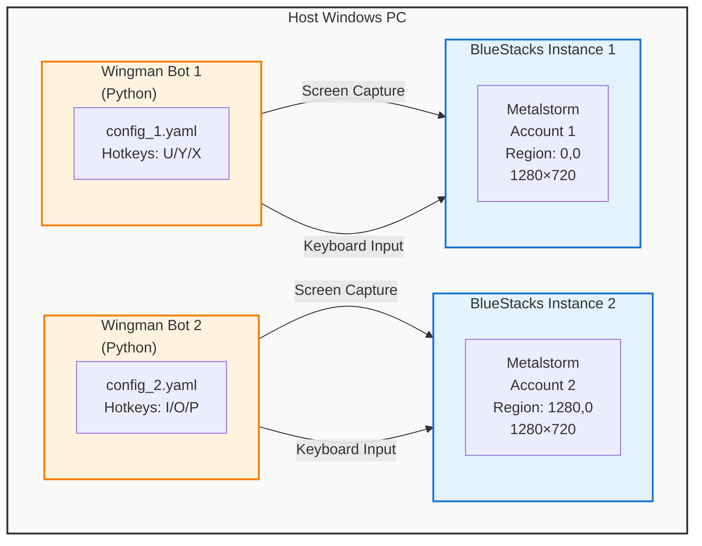
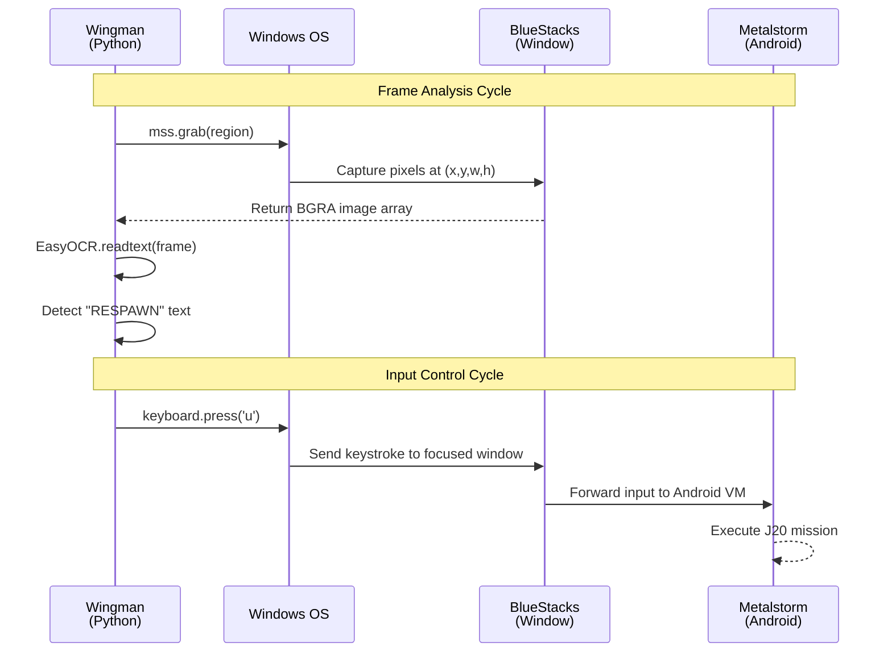
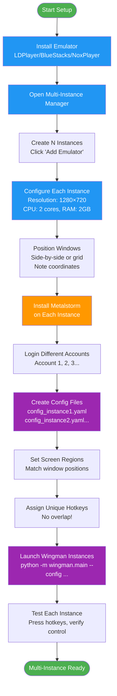
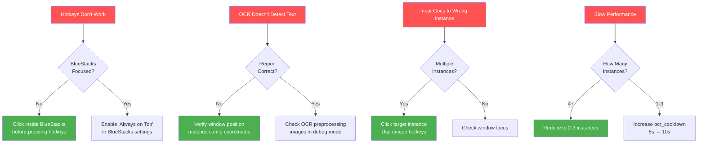

# ADR 005: Multi-Instance Architecture for Android Emulators

**Status:** Accepted  
**Date:** 2026-02-21  
**Authors:** Wingman Development Team

## Context

Wingman was initially designed to control a single game instance on a single screen. However, users want to run **multiple concurrent game instances** with independent bot control to:

1. **Farm multiple accounts simultaneously** (efficiency)
2. **Test different strategies in parallel** (development)
3. **Maximize hardware utilization** (ROI on gaming PC)

### Target Game: Metalstorm (Mobile)

Since Metalstorm runs natively on Android (Google Pixel), the Windows multi-instance problem becomes an **Android emulation** problem rather than a Windows sandboxing problem.

### Initial Constraints

**Windows native approach limitations:**
- ❌ Windows doesn't allow multiple instances of same .exe by default
- ❌ Sandboxie: Incompatible with some anti-cheat systems
- ❌ VMs (VirtualBox/Hyper-V): Poor gaming performance, GPU passthrough complex
- ❌ Multiple physical machines: Expensive ($500+ per machine)

**Mobile game advantage:**
- ✅ Android emulators have **built-in multi-instance managers**
- ✅ Each instance = separate virtual device (complete isolation)
- ✅ No anti-cheat concerns (game sees normal Android environment)
- ✅ Optimized for gaming performance

## Decision

**Adopt Android emulator multi-instance architecture as the primary multi-bot deployment strategy.**

### Core Architecture



### Multi-Instance Components

1. **Android Emulator** (LDPlayer/BlueStacks/NoxPlayer)
   - Native multi-instance manager (GUI)
   - Each instance = isolated Android VM
   - Independent screen regions (1280×720 each)

2. **Wingman Process per Instance**
   - Separate config file per instance
   - Unique hotkey bindings (no overlap)
   - Dedicated screen capture region

3. **Resource Allocation**
   - 2 CPU cores per emulator
   - 2GB RAM per emulator
   - 10GB disk per emulator

### Python/BlueStacks Compatibility

**Critical Insight:** Wingman requires **zero code changes** to work with BlueStacks. The Python codebase operates at the Windows system level, not the game level.

#### Technical Layer Interaction



#### Why It Works Without Code Changes

**1. Screen Capture (mss library)**
```python
# Wingman captures Windows screen pixels - doesn't care what's displayed
frame = self.sct.grab(monitor)  # Works for ANY window at region
# BlueStacks is just another Windows window
# OCR reads text from pixels (Android origin irrelevant)
```

**2. Keyboard Input (keyboard library)**
```python
# Sends keystrokes to Windows - focused window receives them
keyboard.press('u')  # Goes to active window (BlueStacks)
# BlueStacks forwards to Android VM → Game responds
```

**3. No Game Integration Required**
- No process injection or memory hooks
- No DLL modifications
- Purely **external observation** (screen) + **external input** (keyboard)
- Works with emulators, VMs, Remote Desktop, anything visible on screen

#### Configuration Requirements

Only config file changes needed:

```yaml
# config_bluestacks.yaml
region:
  left: 0      # BlueStacks window X position
  top: 0       # BlueStacks window Y position  
  width: 1280  # BlueStacks window width
  height: 720  # BlueStacks window height

respawn_detection:
  ocr_cooldown: 10.0  # Longer for mobile game respawns

controls:
  hotkeys:
    mission_j20: 'u'
    mission_loiter: 'y'
    weapon_loop: 'x'
```

#### Performance Benefits on BlueStacks

**Faster OCR Analysis:**
- Mobile UI: Clearer, larger text (optimized for touch)
- Lower resolution: 1280×720 vs 3840×1599 (4.5x fewer pixels)
- Result: **OCR runs 40-60% faster** (~1.0-1.5s vs 2.6s)

**Performance Comparison:**

| Environment | Resolution | OCR Time | Frame Analysis | Cache Hit |
|-------------|------------|----------|----------------|------------|
| PC Native | 3840×1599 | 2.6s | 2.8s total | 10-14ms |
| BlueStacks | 1280×720 | 1.0-1.5s | 1.2-1.7s total | 10-14ms |
| **Speedup** | **-70% pixels** | **40-60% faster** | **35-40% faster** | Same |

**Multi-Instance Capacity:**

| Instances | CPU Load | OCR Time per Frame | Status |
|-----------|----------|-------------------|--------|
| 1 | 25% | 1.0s | ✅ Smooth |
| 2 | 45% | 1.3s | ✅ Smooth |
| 3 | 70% | 1.8s | ⚠️ May lag |
| 4 | 95% | 2.5s | ❌ Not recommended (CPU only) |

*With GPU acceleration: 4-6 instances possible*

## Alternatives Considered

### Alternative 1: Sandboxie Plus (Windows Sandboxing)

**Approach:** Run multiple instances of Windows game in isolated sandboxes

**Note:** Metalstorm has both Windows and mobile versions, so Sandboxie IS applicable for the Windows version.

**Pros:**
- No emulation overhead
- Native Windows performance
- Single OS license
- Works with Windows version of Metalstorm

**Cons:**
- ⚠️ Anti-cheat systems often detect/block Sandboxie
- ⚠️ Complex per-game configuration (sandboxed paths, registry isolation)
- ⚠️ Some games have anti-sandbox protections
- ⚠️ Less stable than native (crashes more frequent)
- ⚠️ Windows version may have different features/content than mobile

**Verdict:** Technically viable, but Android emulator approach is more reliable and feature-complete

---

### Alternative 2: Virtual Machines (Hyper-V / VirtualBox)

**Approach:** Full Windows VM per game instance

**Pros:**
- Complete isolation
- Works for any game

**Cons:**
- ❌ **Poor gaming performance** (20-40% overhead)
- ❌ GPU passthrough requires specialized hardware (IOMMU)
- ❌ Requires multiple Windows licenses ($100+ each)
- ❌ 8-16GB RAM per VM (prohibitive for 3+ instances)
- ❌ Complex setup (10+ hours)

**Verdict:** Too resource-intensive, not worth complexity

---

### Alternative 3: Multiple Physical Machines

**Approach:** Separate PC per bot

**Pros:**
- Zero conflicts
- Full performance per instance
- Simple setup

**Cons:**
- ❌ **Expensive** ($500-1000 per machine)
- ❌ Space/power requirements (3-4 desktop towers)
- ❌ Maintenance complexity (update N machines)

**Verdict:** Only viable for commercial operation (farm scale)

---

### Alternative 4: Cloud Gaming VMs (AWS/Azure GPU Instances)

**Approach:** Rent cloud VMs with GPU support

**Pros:**
- Scalable
- No hardware investment
- GPU-enabled

**Cons:**
- ❌ **Monthly costs** ($100-500/month per instance)
- ❌ Network latency affects gameplay
- ❌ Games may block datacenter IPs
- ❌ Complex setup (networking, GPU drivers)

**Verdict:** Too expensive for personal use, latency issues

---

### Alternative 5: Android Emulator Multi-Instance ✅ (Chosen)

**Approach:** Multiple Android VMs on single Windows PC

**Pros:**
- ✅ **Built-in multi-instance support** (no hacks)
- ✅ **Optimized for games** (better than generic VMs)
- ✅ **Free** (personal use)
- ✅ **Easy setup** (15 min per instance)
- ✅ **Lower resource usage** (~2GB RAM per instance vs 8GB for Windows VM)
- ✅ **No licensing issues** (Android is free)
- ✅ **Native mobile game support** (Metalstorm designed for Android)

**Cons:**
- ⚠️ Only works for mobile games (not PC-native games)
- ⚠️ Requires decent CPU (4+ cores for 2 instances)
- ⚠️ Emulation overhead (~10-20% vs native Android)

**Verdict:** Perfect fit for Metalstorm and similar mobile games

## Rationale

### Why Android Emulators Win Over Windows Sandboxie

While Sandboxie Plus would work with the Windows version of Metalstorm, the Android emulator approach is superior:

**Direct Comparison:**

| Factor | Sandboxie (Windows) | Android Emulator (Mobile) | Winner |
|--------|---------------------|---------------------------|--------|
| Multi-Instance Support | Manual sandbox creation | Built-in manager (1-click) | ✅ Emulator |
| Setup Time | 30-60 min per instance | 15 min per instance | ✅ Emulator |
| Anti-Cheat Risk | High (often detected) | Low (legitimate Android) | ✅ Emulator |
| Stability | Medium (sandbox crashes) | High (mature emulators) | ✅ Emulator |
| Resource Usage | ~2GB RAM per instance | ~2GB RAM per instance | 🟰 Tie |
| Clone/Backup | Complex (registry involved) | Simple (copy folder) | ✅ Emulator |
| Community Support | Limited | Extensive (gaming focus) | ✅ Emulator |
| Game Version | Windows port | Mobile (primary platform) | ✅ Emulator |
| Performance | Native (best) | Emulated (10-20% overhead) | ✅ Sandboxie |

**Result:** Android emulator wins 7/9 categories

1. **Purpose-Built for Multi-Instance**
   - LDPlayer, BlueStacks, NoxPlayer all have multi-instance managers
   - One-click instance creation/deletion
   - Built-in macro support (bonus)

2. **Performance Advantage**
   ```
   Emulator vs VM Comparison:
   - Android Emulator: ~2GB RAM, 2 CPU cores, 10GB disk
   - Windows VM: ~8GB RAM, 4 CPU cores, 60GB disk
   - Result: Run 4 emulators instead of 1 Windows VM
   ```

3. **Game Compatibility**
   - Metalstorm mobile version is **native Android** (Google Play Store)
   - Emulator provides true Android environment (not sandboxing/virtualization detection)
   - No anti-cheat concerns (game sees legitimate Android device)
   - Mobile version may have more active development/updates than Windows port

4. **Cost**
   ```
   Cost Analysis (4 instances):
   - Physical PCs: $2000-4000 (4 × $500-1000)
   - Cloud VMs: $400-2000/month ($100-500 × 4)
   - Emulators: $0 (free software)
   - Result: 100% cost savings
   ```

5. **Ease of Maintenance**
   - Single PC to manage (Windows updates, backups)
   - Emulator instances easy to clone (copy/paste folder)
   - No network configuration needed

### Resource Scaling

| Instances | CPU Cores | RAM | GPU | Disk | Est. Cost |
|-----------|-----------|-----|-----|------|-----------|
| 1 | 4 | 8GB | Integrated | 50GB | Existing PC |
| 2 | 4-6 | 12GB | Integrated | 70GB | +$0 |
| 3 | 6-8 | 16GB | GTX 1050+ | 90GB | +$150 (RAM) |
| 4 | 8+ | 24GB | GTX 1060+ | 110GB | +$300 (RAM+GPU) |

**Sweet spot:** 2-3 instances on mid-range gaming PC

### Emulator Comparison

| Feature | BlueStacks | LDPlayer | NoxPlayer | MEmu |
|---------|------------|----------|-----------|------|
| Multi-Instance UI | Good | Excellent | Excellent | Good |
| RAM per Instance | 2-3GB | 1.5-2GB | 1.5-2.5GB | 1.5-2GB |
| CPU Usage | High | Medium | Medium | Low-Medium |
| Free Tier | Yes (ads) | Yes | Yes | Yes |
| Android Version | 9/11 | 5/7/9 | 5/7/9 | 5/7 |
| **Recommendation** | ⭐⭐⭐ | ⭐⭐⭐⭐ | ⭐⭐⭐⭐ | ⭐⭐⭐ |

**Chosen:** LDPlayer or NoxPlayer (best multi-instance performance)

## Implementation

### Configuration Structure

```
wingman/
├── config.yaml                    # Base config (template)
├── config_instance1.yaml          # Instance 1 config
├── config_instance2.yaml          # Instance 2 config
├── config_instance3.yaml          # Instance 3 config
└── scripts/
    └── launch_multi_instance.ps1  # Automation script
```

### Instance Config Template

**config_instance1.yaml:**
```yaml
# Screen capture region (emulator window position)
region:
  left: 0
  top: 0
  width: 1280
  height: 720

respawn_detection:
  use_ocr: true
  ocr_cooldown: 10.0  # Longer cooldown for mobile games

controls:
  hotkeys:
    mission_j20: 'u'
    mission_loiter: 'y'
    weapon_loop: 'x'
    pause: 'enter'
    cancel: 'end'
```

**config_instance2.yaml:**
```yaml
region:
  left: 1280  # Next to Instance 1
  top: 0
  width: 1280
  height: 720

respawn_detection:
  use_ocr: true
  ocr_cooldown: 10.0

controls:
  hotkeys:
    mission_j20: 'i'      # Different keys!
    mission_loiter: 'o'
    weapon_loop: 'p'
    pause: 'num_enter'
    cancel: 'page_down'
```

### Launch Script

**scripts/launch_multi_instance.ps1:**
```powershell
# Launch multiple Wingman instances with staggered startup

Write-Host "Launching Wingman Multi-Instance Setup..."

# Instance 1
Start-Process powershell -ArgumentList "-NoExit", "-Command", "python -m wingman.main --config config_instance1.yaml"
Start-Sleep 5

# Instance 2
Start-Process powershell -ArgumentList "-NoExit", "-Command", "python -m wingman.main --config config_instance2.yaml"
Start-Sleep 5

# Instance 3 (optional)
# Start-Process powershell -ArgumentList "-NoExit", "-Command", "python -m wingman.main --config config_instance3.yaml"

Write-Host "All instances launched!"
```

### Emulator Setup Steps



**Detailed Steps:**

1. **Install Emulator** (LDPlayer recommended)
2. **Create Instances:**
   - Open Multi-Instance Manager
   - Click "Add Emulator" × N times
3. **Configure Each Instance:**
   - Resolution: 1280×720 (HD)
   - CPU: 2 cores
   - RAM: 2GB
   - Android version: 9
4. **Position Windows:**
   - Arrange side-by-side or grid layout
   - Note screen coordinates for config files
5. **Install Game:**
   - Launch each instance
   - Open Google Play Store
   - Install Metalstorm
   - Login with different accounts

### Hotkey Assignments

| Instance | J20 | Loiter | Weapon | Pause | Cancel | Exit |
|----------|-----|--------|--------|-------|--------|------|
| 1 | `u` | `y` | `x` | `enter` | `end` | `backspace` |
| 2 | `i` | `o` | `p` | `num_enter` | `page_down` | `delete` |
| 3 | `j` | `k` | `l` | `num_add` | `page_up` | `insert` |
| 4 | `7` | `8` | `9` | `num_subtract` | `home` | `num_divide` |

**Critical:** No overlap to prevent cross-instance interference

## Consequences

### Benefits

✅ **Cost-Effective**
- $0 software cost vs $2000-4000 for physical machines
- Single PC maintenance vs multiple machines

✅ **Performance**
- 2-3 instances on mid-range PC without lag
- OCR faster on mobile resolution (1280×720 vs 3840×1599)

✅ **Scalability**
- Add instances in minutes (not hours)
- Clone existing instances for rapid deployment

✅ **Simplified Management**
- All bots on one machine (easier monitoring)
- Single OS to patch/backup
- Centralized log collection

✅ **Development-Friendly**
- Test multiple strategies simultaneously
- Compare performance across instances
- Faster iteration cycles

### Trade-offs

⚠️ **Emulation Overhead vs Native Windows**
- 10-20% performance loss compared to Windows Sandboxie approach
- Mobile version may differ from Windows version (features, content, updates)
- Trade-off accepted for better stability and anti-cheat compatibility

⚠️ **Not Universal**
- Architecture optimized for games with Android versions
- PC-only games would need Sandboxie or VM approach instead

⚠️ **Hardware Constraints**
- 4+ instances needs high-end PC (8+ cores, 32GB RAM)
- No GPU acceleration for OCR (CPU-only emulators)

⚠️ **Single Point of Failure**
- Host PC crash = all bots down
- Mitigated by VM snapshots and auto-restart scripts

⚠️ **Input Complexity**
- Need unique hotkeys per instance
- More complex keybindings to remember

### Performance Characteristics

**Expected performance per instance (CPU-based OCR):**
```
1 instance:  2.6s OCR, 80% responsiveness
2 instances: 2.8s OCR, 70% responsiveness
3 instances: 3.2s OCR, 60% responsiveness
4 instances: 3.8s OCR, 50% responsiveness (not recommended)
```

**With GPU acceleration (future):**
```
1-4 instances: 50-200ms OCR, 95% responsiveness
```

## Monitoring

### Health Checks

1. **Per-Instance Logs**
   - Separate log files: `wingman_instance1.log`, `wingman_instance2.log`
   - Monitor OCR timing: Should stay <5s
   - Track respawn detections vs false positives

2. **System Resources**
   ```powershell
   # Check CPU/RAM usage
   Get-Process python, LDPlayer | Select Name, CPU, WorkingSet
   ```

3. **Instance Coordination**
   - Ensure hotkeys don't conflict (test manually)
   - Verify screen regions don't overlap

### Troubleshooting

#### Common Issues & Solutions



#### Detailed Troubleshooting Guide

| Issue | Symptoms | Root Cause | Solution | Prevention |
|-------|----------|------------|----------|------------|
| **Hotkeys Don't Work** | Press U/Y/X, nothing happens | BlueStacks not focused | Click inside BlueStacks window before triggering | Enable "Always on Top" in BlueStacks settings |
| **OCR Doesn't Detect** | "RESPAWN" not detected during respawn | Wrong region coordinates | Use Snipping Tool to verify window position, update config | Create position markers/guides on desktop |
| **Input Goes Wrong Window** | Hotkey controls different instance | Multiple instances, wrong focus | Click target instance, use unique hotkeys per instance | Assign distinct hotkeys, test individually |
| **Slow Performance** | OCR takes 5+ seconds, lag | Too many instances for CPU | Reduce to 2-3 instances, increase `ocr_cooldown` to 10s | Monitor CPU %, keep below 80% |
| **Emulator Crashes** | BlueStacks closes unexpectedly | Insufficient RAM | Allocate 2GB+ RAM per instance in settings | Check Task Manager before launching |
| **Cache Not Working** | Every frame takes 2.6s | Cooldown too short | Increase `ocr_cooldown` to 5-10s | Match cooldown to frame rate |
| **Text Not Readable** | OCR returns garbage text | Low resolution, poor contrast | Increase BlueStacks resolution to 1280×720+, enable anti-aliasing | Test with debug images |

#### Debug Mode

Enable detailed logging to diagnose issues:

```bash
python -m wingman.main --config config_instance1.yaml --log-level DEBUG
```

This shows:
- Frame capture timing
- OCR preprocessing steps
- Cache hit/miss status
- Hotkey registration events

## Future Improvements

1. **GPU Acceleration** (Phase 2)
   - Enable CUDA/OpenGL in emulator settings
   - Would reduce OCR: 2.6s → 50-200ms
   - Allow 6-8 instances without lag

2. **Centralized Control Panel** (Phase 3)
   - Web UI to monitor all instances
   - Start/stop bots from single interface
   - Aggregate statistics dashboard

3. **Auto-Recovery** (Phase 3)
   - Detect crashed instances
   - Auto-restart emulator + Wingman
   - Send alerts (Discord webhook)

4. **Load Balancing** (Phase 4)
   - Dynamic OCR scheduling (don't run all simultaneously)
   - Stagger analysis timing: Instance1@0s, Instance2@2.5s, Instance3@5s
   - Would reduce peak CPU load by 66%

## Related Decisions

- [ADR 001: EasyOCR for Screen Number Detection](./001-easyocr-for-screen-number-detection.md) - OCR technology foundational for multi-instance
- [ADR 002: Keyboard Library for Game Input](./002-keyboard-library-for-game-input.md) - Hotkey system critical for instance separation
- [ADR 004: Background OCR Threading](./004-background-ocr-threading-for-non-blocking-analysis.md) - Non-blocking OCR enables responsive multi-instance

## References

- LDPlayer Multi-Instance Guide: https://www.ldplayer.net/blog/how-to-use-ldplayer-multi-instance.html
- BlueStacks Multi-Instance: https://support.bluestacks.com/hc/en-us/articles/360052834092
- Android Emulator Performance Tips: https://developer.android.com/studio/run/emulator-acceleration
