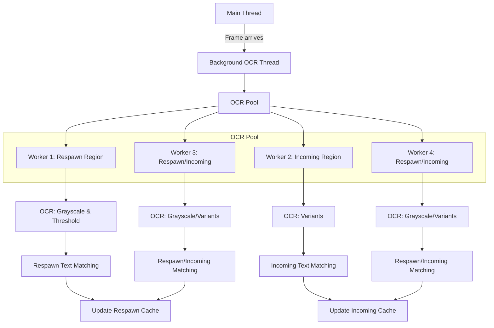
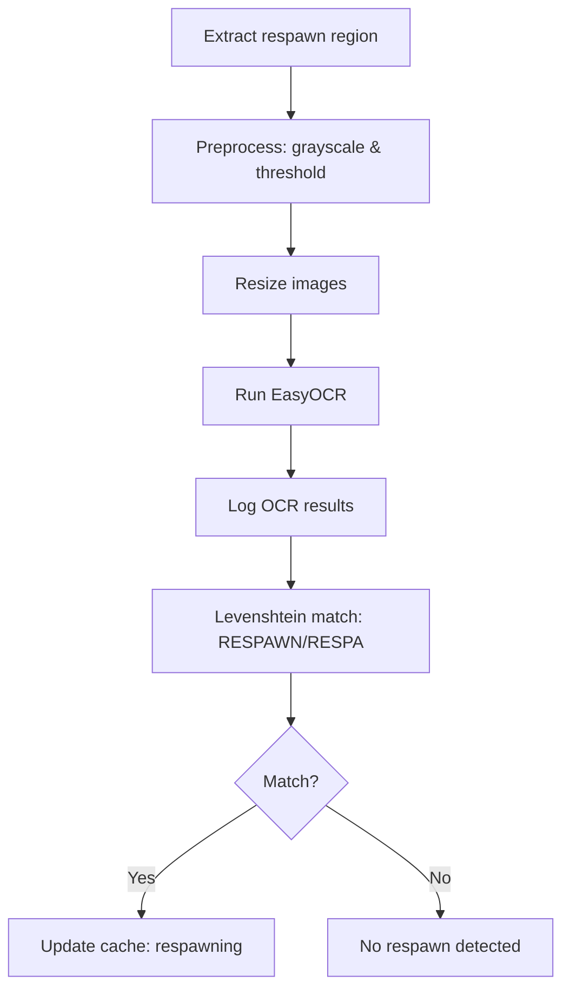
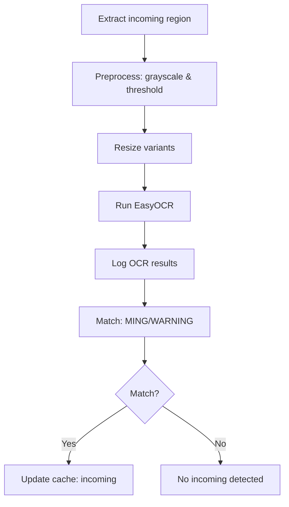

# ADR 010: Respawn & Incoming Detection Threading Fix

**Status:** Accepted  
**Date:** 2026-03-13  

## Context
Respawn detection became unreliable after threading and worker pool changes. Incoming missile detection remained fast, but respawn detection was delayed or missed. The system uses background threading and multiprocessing for non-blocking OCR analysis.

## Decision
- Improved respawn detection by:
  - Running OCR on both grayscale and thresholded images for the respawn region.
  - Relaxing Levenshtein distance tolerance for short OCR results.
  - Logging all OCR results for debugging.
- Increased worker pool size (from 2 to 4) and enabled GPU for OCR workers.
    - More workers allow multiple OCR tasks to run in parallel, reducing wait time when frames arrive quickly.
    - This ensures both respawn and incoming detection are processed promptly, even under heavy load.
    - Note: GPU acceleration is not used; all OCR processing runs on CPU. EasyOCR falls back to CPU if GPU is unavailable or unsupported.
- Reduced OCR cooldown for faster detection.

## Consequences
- Respawn detection is now robust and responsive.
- Incoming missile detection remains fast and reliable.
- Debug logs provide visibility into OCR results and matching.

## Detection Flow (Mermaid Diagram)

### Overall Threading & OCR Flow

### Respawn Detection Logic

### Incoming Detection Logic

## References
- [004-background-ocr-threading-for-non-blocking-analysis.md](004-background-ocr-threading-for-non-blocking-analysis.md)
- [wingman/analyzer.py](../../wingman/analyzer.py)
- [wingman/config.yaml](../../wingman/config.yaml)
