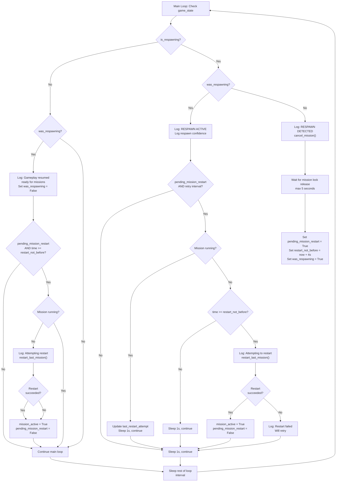

# Respawn Detection to Mission Restart Flowchart

This document illustrates the complete flow from respawn detection through mission restart in the Wingman controller.

## Key States & Timings

- **respawn_delay_after_unlock**: 4 seconds (configured in main.py)
- **restart_retry_interval**: 2 seconds between restart attempts
- **Mission lock wait**: Up to 5 seconds for lock release

## Flow Overview

## Key Branches

### 1. **Respawn Detection Phase**
- Triggered when `is_respawning` becomes true for the first time
- Immediately cancels any running mission
- Waits up to 5 seconds for the mission lock to be released
- Sets the restart timer: `restart_not_before = now + 4 seconds`

### 2. **Respawn Active Phase**
- While `is_respawning` is true, logs respawn confidence every loop
- Attempts mission restart when:
  - `pending_mission_restart` flag is set, AND
  - Retry interval (2s) has elapsed, AND
  - Mission lock is free, AND
  - 4-second delay has passed
- Retries on failure (logs "Restart failed, will retry")

### 3. **Gameplay Resume Phase**
- Triggered when `is_respawning` becomes false
- Logs "✓ Gameplay resumed - ready for missions"
- Sets `was_respawning = False` so this only triggers once
- Also attempts restart if delay has expired and lock is free
- Clears `pending_mission_restart` only after successful restart

## Important Notes

- The **4-second delay** is enforced from the moment the mission lock is released, not from the moment respawn was detected
- Both during respawn and after resume, the restart logic checks the same conditions (lock free + delay passed)
- A single `pending_mission_restart` flag persists across both respawn and resume phases
- Once restart succeeds, `pending_mission_restart` is cleared to prevent duplicate restarts
