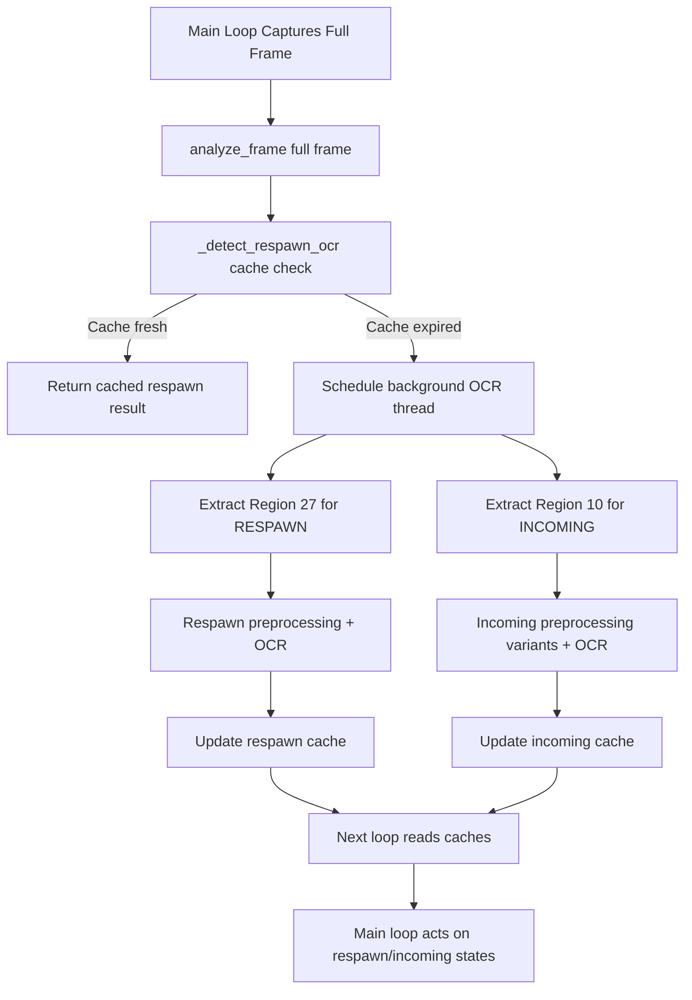
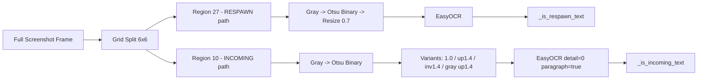
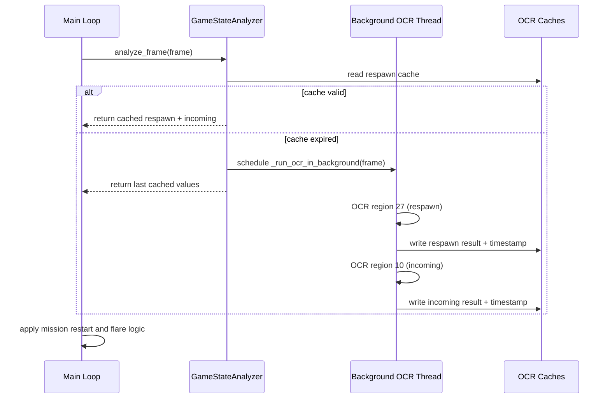

# Dual-Region OCR Architecture (RESPAWN + INCOMING)

This document describes how Wingman uses a single captured screenshot to detect two independent HUD signals in one OCR pipeline:

- `RESPAWN` state in region `27` (mission restart/cancel logic)
- `INCOMING`/`MING` warning in region `10` (flare response)

## Why This Design

- Only one screenshot is captured per loop iteration.
- One background OCR thread processes both regions to avoid duplicated capture/OCR startup overhead.
- OCR results are cached to keep the main loop non-blocking.

## High-Level Flow

## Single Screenshot, Two Regions

## Runtime Timing Model

## Key Implementation Notes

- The main loop stays responsive because OCR is asynchronous.
- Region 10 uses test-validated preprocessing variants because incoming text can be thin/faint in runtime frames.
- Respawn and incoming results are independent cache entries, both produced from the same full-frame capture.
- Debug images are written to `tests/test-output/` to compare runtime OCR inputs with test behavior.
