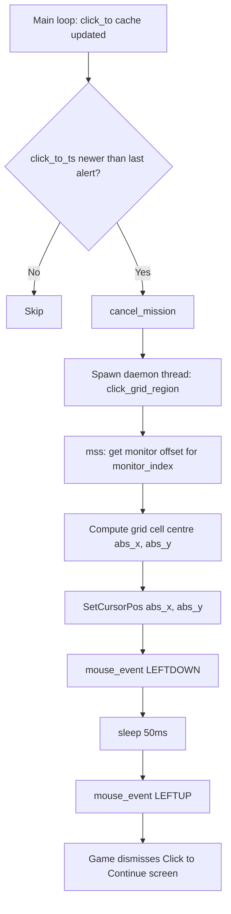

# ADR 014: Mouse Click via Win32 mouse_event for Game UI Interaction

**Status:** Accepted
**Date:** 2026-03-16

## Context

When the game reaches the end-of-match screen it shows a "Click to Continue" prompt in grid region 60. Wingman needs to click that region to dismiss the screen and return to the lobby.

The first implementation used `pyautogui.moveTo()` + `pyautogui.click()`. The click was logged as executing (coordinates appeared correct in the log) but the game never registered it — the screen did not advance.

### What was tried and why it failed

| Approach | Result |
|---|---|
| `pyautogui.moveTo()` + `pyautogui.click()` | Click sent but game did not respond |
| `ctypes.windll.user32.SetProcessDpiAwareness(2)` + pyautogui | Broke `mss` monitor enumeration; respawn OCR stopped working |
| `SetThreadDpiAwarenessContext(-4)` in daemon thread + pyautogui | Game still did not respond to clicks |
| `SendInput` with `MOUSEEVENTF_ABSOLUTE \| MOUSEEVENTF_VIRTUALDESK` | Game did not respond |

`pyautogui` internally synthesises mouse events through its own abstraction layer. For a fullscreen DirectX game the events either arrive at the wrong injection level or are filtered before reaching the game's input handler.

All **keyboard** actions in Wingman (deploy flares, fire weapon, maneuvers) use the `keyboard` library, which calls Win32 `SendInput` at the raw-input level and work reliably. The equivalent for mouse at the lowest Win32 level is `mouse_event` (legacy) combined with `SetCursorPos` for positioning.

## Decision

Replace `pyautogui` in `click_grid_region` with direct Win32 calls:

```python
ctypes.windll.user32.SetCursorPos(abs_x, abs_y)   # move hardware cursor
time.sleep(0.05)
ctypes.windll.user32.mouse_event(0x0002, 0, 0, 0, 0)  # MOUSEEVENTF_LEFTDOWN
time.sleep(0.05)
ctypes.windll.user32.mouse_event(0x0004, 0, 0, 0, 0)  # MOUSEEVENTF_LEFTUP
```

`mouse_event` is a legacy Win32 API but it injects at a lower level than pyautogui's abstraction and is sufficient for a UI click on a game overlay screen (as opposed to in-game DirectInput during gameplay).

Coordinate calculation uses the `mss` monitor list (same source used for screen capture) so the click lands on the same monitor region that the OCR is reading.

No new dependencies are introduced — `ctypes` is part of the Python standard library.

## Consequences

- "Click to Continue" is now dismissed automatically when detected in region 60.
- `pyautogui` is removed from `controller.py`; `ctypes` replaces it.
- The approach is Windows-only, consistent with the rest of the project.
- `mouse_event` is marked deprecated by Microsoft but remains supported on all current Windows versions.

## Click Flow



## References

- [wingman/controller.py](../../wingman/controller.py) — `click_grid_region` method
- [wingman/main.py](../../wingman/main.py) — click detection and dispatch
- [002-keyboard-library-for-game-input.md](002-keyboard-library-for-game-input.md)
- [006-multi-monitor-screen-selection.md](006-multi-monitor-screen-selection.md)
