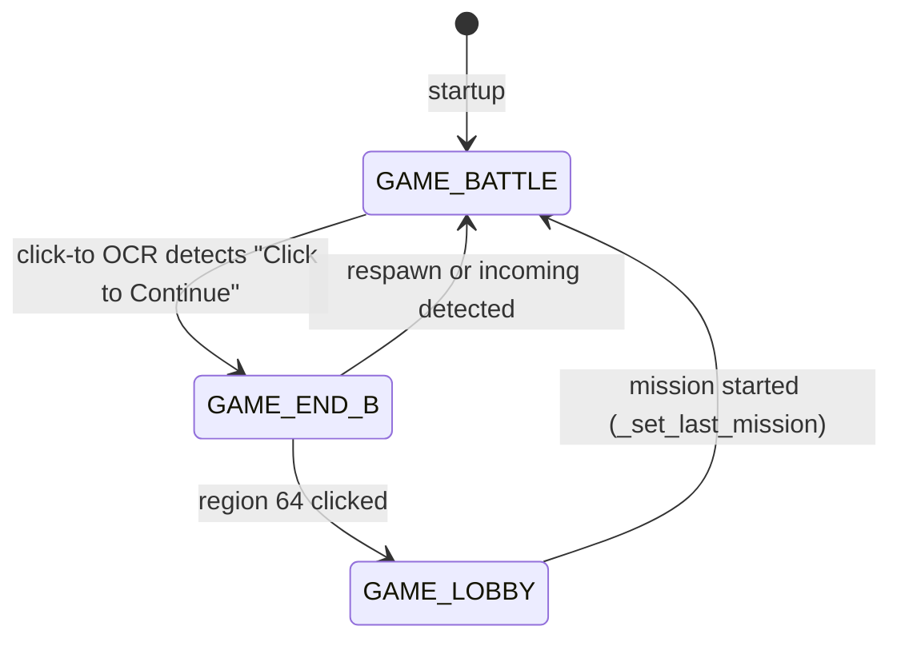

# ADR 015: Game State Machine

| Status   | Date       | Wingman Version                |
|----------|------------|--------------------------------|
| Accepted | 2026-03-16 | 1.4.3 (more automated control) |

## Context

Wingman runs several concurrent OCR scanning loops — respawn detection, incoming missile detection, and "Click to Continue" detection. Each loop consumes meaningful CPU time (~2–4s per cycle on multiprocessing workers). Early versions ran all scans continuously regardless of what the game was doing, wasting resources and causing noisy logs.

The question was whether to introduce a game state machine to gate which scans run and when.

### Rejected approach: always-on scanning

Running all OCR loops at all times is the simplest architecture. If a scan is irrelevant in the current game context (e.g. scanning for incoming missiles while sitting in the lobby), the OCR just returns no result and the cost is wasted CPU cycles. The benefit is no state machine bugs — a missed transition can never silently disable a critical scan.

### Rejected approach: time-based `GAME_END_A` state

An initial implementation introduced a `GAME_END_A` state triggered after a configurable quiet period (`battle_quiet_period: 5.0s`) with no respawn or incoming events. Click-to OCR was gated on this state.

This proved unreliable in practice — a lull in battle events during active gameplay (e.g. between missile warnings) would falsely trigger `GAME_END_A`, disabling click-to scanning prematurely. Log evidence:

```
[INFO] 🚀 INCOMING MISSILE DETECTED - Deploying flares
[INFO] 🎮 Game state: GAME_END_A → GAME_BATTLE     ← transition happened DURING active battle
[INFO] 🚀 INCOMING MISSILE DETECTED - Deploying flares
```

The time-based boundary was removed entirely. Static frame detection (pixel diff on `incoming_region`) was also removed for the same reason — it was a heuristic that could not reliably distinguish "end screen" from "brief gameplay pause".

## Decision

Implement a minimal event-driven state machine with three states:

| State | Entry condition | Exit condition |
|---|---|---|
| `GAME_BATTLE` | Default; mission started via hotkey or respawn/incoming detected | "Click to Continue" detected (→ `GAME_END_B`) |
| `GAME_END_B` | `_game_end_b = True` set by click-to OCR detection | Region 64 clicked (→ `GAME_LOBBY`), or respawn/incoming detected (→ `GAME_BATTLE`) |
| `GAME_LOBBY` | `_game_lobby = True` set after clicking region 64 | Mission started via `_set_last_mission` (→ `GAME_BATTLE`) |

All transitions are **event-driven**, not time-based.

## OCR optimisation per state

| Scan | `GAME_BATTLE` | `GAME_END_B` | `GAME_LOBBY` |
|---|---|---|---|
| Respawn OCR | ✅ runs | ✅ runs | ❌ skipped |
| Incoming missile OCR | ✅ runs | ✅ runs | ❌ skipped |
| Click-to OCR | ❌ skipped | ❌ skipped | ❌ skipped |

**Why skip all OCR in `GAME_LOBBY`**: no battle events are possible between matches. The transition back to `GAME_BATTLE` is driven by `_set_last_mission` (U/Y hotkey), not by OCR detecting an event. Skipping OCR during lobby gives the CPU a full rest period between matches, reducing thermal load.

**Why keep respawn/incoming OCR in `GAME_END_B`**: the clicking sequence takes ~3 seconds. If a respawn or incoming event occurs during that window (unlikely but possible), the system must be able to react. Respawn/incoming OCR also clears `_game_end_b`, allowing recovery if the end screen dismisses itself.

**Why click-to OCR only runs in `GAME_BATTLE`** (and not in `GAME_END_B`/`GAME_LOBBY`): once "Click to Continue" has been detected and actioned, re-scanning for it is unnecessary until the next match begins. During `GAME_BATTLE` the click-to thread runs on its own 5-second interval so its overhead is minimal.

## Pros and cons

### Pros
- Eliminates wasteful OCR during lobby — multiprocessing workers go idle, CPU cools
- Clean separation of concerns: each state has a well-defined set of active scans
- Event-driven transitions are reliable and auditable in logs
- Easy to extend: adding a new feature (e.g. "scan for scoreboard") means gating it on the right state rather than running it always

### Cons
- State can persist if the game crashes unexpectedly — `_game_lobby = True` will remain set until the next mission is started via hotkey. Recovery path: press U or Y.
- The state machine adds indirection — a bug in a transition can silently disable a scan with no obvious symptom
- More states = more complexity as the project grows; each new state interaction must be reviewed

## State transition diagram



## References

- [wingman/analyzer.py](../../wingman/analyzer.py) — `GameState` enum, `game_state` property, `_run_click_to_in_background`, `_detect_respawn_ocr`
- [wingman/controller.py](../../wingman/controller.py) — `_set_last_mission`, `click_grid_region`
- [004-background-ocr-threading-for-non-blocking-analysis.md](004-background-ocr-threading-for-non-blocking-analysis.md)
- [012-dual-region-ocr-architecture.md](012-dual-region-ocr-architecture.md)
