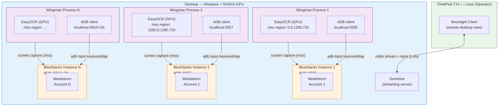

# ADR 018: ADB Input Injection for Multi-Instance Isolation and Moonlight/Sunshine Remote Control

**Status:** Proposed
**Date:** 2026-03-20
**Supersedes:** Partially supersedes [ADR 005](./005-multi-instance-architecture-for-android-emulators.md) (input layer section) and [ADR 014](./014-mouse-click-via-win32-mouse-event.md)

---

## Context

### Hardware Background

The primary operator machine is a Lenovo ThinkPad T14 2025 (AMD Ryzen AI / Intel Core Ultra, integrated GPU only). This machine cannot run GPU-accelerated EasyOCR — the ThinkPad has no NVIDIA GPU and `torch.cuda.is_available()` returns `False`. CPU-only OCR averages ~3.25s/cycle, which is marginal for a single instance and unworkable for a squadron.

A separate high-end desktop with an NVIDIA discrete GPU is available. This machine can run GPU-accelerated EasyOCR (<200ms/cycle per [ADR 017](./017-ocr-performance-gpu-vs-template-matching.md)) and has the CPU/RAM headroom to host multiple BlueStacks instances simultaneously.

The proposed deployment model:

```
ThinkPlan T14 (Linux)           Desktop (Windows + NVIDIA GPU)
┌─────────────────────┐         ┌──────────────────────────────────────┐
│  Moonlight client   │◄───────►│  Sunshine streaming server           │
│  (monitoring only)  │  stream │  BlueStacks × N  +  Wingman × N      │
└─────────────────────┘         └──────────────────────────────────────┘
```

### The Unattended Mode Input Problem

ADR 005 describes a multi-instance architecture where each Wingman instance uses the `keyboard` library and `ctypes.windll.mouse_event` (ADR 014) to send input. Both of these are **global OS-level events** that land in whichever window currently has focus.

In a single-instance, attended setup this works because the user keeps BlueStacks focused. In **unattended multi-instance** operation it breaks immediately:

- Instance A fires `keyboard.press('f')` → keystroke goes to whichever BlueStacks window the OS considers active, which may be Instance B, C, or D.
- `ctypes.windll.user32.SetCursorPos` + `mouse_event` moves the shared hardware cursor — a click from Instance A lands wherever the cursor is, regardless of which emulator it belongs to.
- All N Wingman processes simultaneously fight for the same global focus, producing unpredictable cross-instance interference that cannot be resolved by hotkey assignment alone.

The root cause: the input layer (keyboard + Win32 mouse_event) was designed for a single-instance, attended workflow. It has no concept of a target window.

### BlueStacks on Linux

BlueStacks does not support Linux. The desktop must run Windows for BlueStacks to be viable. The ThinkPad's role as a "master controller" is therefore a **remote monitoring and emergency intervention interface**, not a host for the emulators or Wingman processes.

### GPU VRAM Budget

Multiple Wingman processes each loading EasyOCR + PyTorch consume approximately 1–2 GB VRAM per instance. The practical ceiling before OOM is GPU-specific:

| GPU VRAM | Max GPU-mode Wingman Instances |
|---|---|
| 8 GB | ~4 |
| 12 GB | ~6 |
| 16 GB | ~8 |
| 24 GB | ~12 |

---

## Decision

### 1. Replace the input layer with ADB-based per-instance injection

Each BlueStacks instance exposes a unique ADB (Android Debug Bridge) port on localhost. Default port allocation:

| Instance | ADB Port |
|---|---|
| 1 | 5555 |
| 2 | 5557 |
| 3 | 5559 |
| N | 5553 + 2N |

ADB input commands send events **directly into the Android VM's input subsystem** of the targeted instance, bypassing the Windows focus model entirely. No window focus is required; all instances can receive input simultaneously and independently.

**Key replacements:**

| Current (global) | Replacement (per-instance ADB) |
|---|---|
| `keyboard.press(key)` | `adb -s localhost:PORT shell input keyevent <KEYCODE>` |
| `keyboard.release(key)` | (hold via `--longpress` or timed keyevent) |
| `SetCursorPos` + `mouse_event` | `adb -s localhost:PORT shell input tap <x> <y>` |

Coordinates for `input tap` are in Android display pixels (relative to the emulator's virtual screen), not Windows screen pixels — the coordinate space is fully contained within each instance.

### 2. Retain Moonlight/Sunshine as a monitoring and emergency control plane only

Moonlight streams the desktop display to the ThinkPad. This gives the operator:

- Visual confirmation that all BlueStacks instances are running correctly.
- The ability to manually intervene (click, type) via the Moonlight session when a Wingman instance gets stuck.
- Access to Wingman log output displayed in terminal windows on the desktop.

Moonlight/Sunshine does **not** participate in the normal Wingman control loop. It is purely an out-of-band observation channel.

### 3. Desktop OS remains Windows

BlueStacks requires Windows. The desktop runs Windows with Sunshine installed as the streaming server. The ThinkPad runs Linux with Moonlight as the streaming client. This is a supported Sunshine/Moonlight combination.

---

## Architecture



---

## Alternatives Considered

### Alternative 1: Unique hotkeys per instance (current ADR 005 approach)

ADR 005 proposed assigning distinct hotkey sets per instance (U/Y/X for instance 1, I/O/P for instance 2, etc.) as a workaround for global keyboard events.

**Why it fails for unattended mode:**
- Hotkeys still require the target BlueStacks window to be focused when the key fires.
- In unattended operation no user manually clicks to focus windows; all instances race for a single focus slot.
- Even if focus were managed, `mouse_event` for UI clicks moves a shared hardware cursor — click coordinates are correct but landing is focus-dependent.
- Does not scale: 4+ instances with non-overlapping hotkeys rapidly exhausts available keys and becomes unmanageable.

**Verdict:** Viable only for attended single-instance operation. Rejected for unattended multi-instance.

---

### Alternative 2: Win32 PostMessage / SendMessage to BlueStacks HWND

Inject `WM_KEYDOWN` / `WM_KEYUP` messages directly into the BlueStacks window message queue by HWND, bypassing focus entirely.

**Pros:**
- No new dependencies (pure `ctypes`).
- No focus required — messages target a specific window handle.

**Cons:**
- BlueStacks does not reliably route Win32 window messages to the Android VM's input system. The Android input layer inside BlueStacks uses a separate internal IPC path, not the standard Windows message queue.
- HWND lookup requires window title matching which is fragile across BlueStacks version updates.
- Mouse click equivalent (`WM_LBUTTONDOWN` / `WM_LBUTTONUP`) requires client-area coordinates that differ from the ADB display coordinate system, adding a second coordinate mapping problem.

**Verdict:** Technically complex, fragile, and not guaranteed to reach the Android layer. Rejected in favour of ADB.

---

### Alternative 3: BlueStacks Macro / Script API

BlueStacks exposes a macro recorder and a limited scripting API.

**Pros:**
- Officially supported.
- Per-instance by definition.

**Cons:**
- API surface is narrow (fixed macro playback, no real-time decision integration).
- Cannot be driven programmatically from Python without reverse-engineering undocumented endpoints.
- Ties Wingman tightly to BlueStacks, blocking migration to LDPlayer or other emulators.

**Verdict:** Too limited for dynamic, OCR-driven control loops. Rejected.

---

### Alternative 4: ADB input injection ✅ (Chosen)

ADB is the standard Android debugging and automation interface. BlueStacks exposes one ADB port per instance. Commands target a specific serial (`localhost:PORT`) and inject input at the Android kernel input layer, independent of Windows focus.

**Pros:**
- ✅ Fully isolated per instance — no focus dependency.
- ✅ Removes Windows-specific `ctypes.windll` from the hot path.
- ✅ Coordinate space is Android display pixels — independent of where the BlueStacks window sits on the Windows desktop.
- ✅ Emulator-agnostic: LDPlayer, NoxPlayer, and Genymotion all expose ADB.
- ✅ `adb` ships with Android Platform Tools (free, lightweight).
- ✅ Key hold durations achievable via `--longpress` flag or timed `keydown`/`keyup` events.

**Cons:**
- ⚠️ New dependency: Android Platform Tools (`adb` binary on PATH).
- ⚠️ ADB port must be configured per instance in config.
- ⚠️ `adb shell input` has latency (~10–30ms per command) vs in-process keyboard events (~1ms). Acceptable for game input; not acceptable for sub-millisecond timing requirements.
- ⚠️ Key hold loops (e.g., afterburner for 20 seconds) must be implemented via repeated timed keyevents rather than a single press-and-hold, or via `sendevent` at a lower level.

**Verdict:** Best fit for unattended multi-instance. Accepted.

---

## Implementation Notes

### Config changes required

Each instance config needs an `adb` section:

```yaml
# config_instance1.yaml
region:
  left: 0
  top: 0
  width: 1280
  height: 720

adb:
  port: 5555          # BlueStacks instance 1 ADB port
  host: localhost
  connect_timeout: 5  # seconds

mission:
  weapon_loop_interval: 0.5
```

### Input layer replacement scope

Only `controller.py` needs changes. The `keyboard` library can be retained **for the emergency hotkey registrations** (backspace to exit, etc.) that the operator uses from the Moonlight session — those are attended, single-focus actions. All **game input** (mission maneuvers, flares, weapon fire, UI clicks) moves to ADB.

| Method | Current | After |
|---|---|---|
| `_execute_key_press` | `keyboard.press/release` | `adb shell input keyevent` |
| `click_grid_region` | `SetCursorPos` + `mouse_event` | `adb shell input tap` |
| Emergency hotkeys (backspace, etc.) | `keyboard.on_press_key` | Unchanged (attended use) |

### Key hold implementation

`adb shell input keyevent` does not support arbitrary hold durations natively. Options:

1. **Repeated keyevent loop** — fire `KEY_F` (or equivalent keycode) at ~20Hz for the hold duration. Simple, works for all keys.
2. **`sendevent` raw events** — lower level, supports true press-and-hold but requires knowing the device's event node (`/dev/input/eventX`), which varies.

Recommended: repeated keyevent loop at 20Hz for compatibility. The 50ms granularity is indistinguishable from a held key for game input purposes.

### ADB port verification

Before starting, each Wingman instance should verify its ADB port is reachable:

```bash
adb connect localhost:5555
adb -s localhost:5555 shell echo ok
```

If the port is unreachable, fail fast with a clear error rather than silently sending input to the wrong instance.

---

## Consequences

### Benefits

✅ **True input isolation** — N instances run fully independently with no focus conflicts.

✅ **Unattended operation is now viable** — no user intervention required to maintain window focus between instances.

✅ **Coordinate system simplification** — ADB tap coordinates are in Android display space, removing the monitor-offset + DPI calculation that currently complicates `click_grid_region`.

✅ **Removes Windows-only input APIs from game control path** — `ctypes.windll` is no longer required for the core control loop, improving portability if BlueStacks is eventually replaced by an emulator available on other platforms.

✅ **Emulator portability** — ADB is standard across BlueStacks, LDPlayer, NoxPlayer, and Genymotion. Switching emulators requires no code changes.

### Trade-offs

⚠️ **ADB latency** (~10–30ms per command) vs in-process keyboard events (~1ms). Acceptable for game timing; would be a problem for sub-10ms precision tasks.

⚠️ **Key hold requires polling loop** rather than a single press-and-hold. Adds minor complexity to `_execute_key_press`.

⚠️ **New external dependency** — `adb` must be installed and on PATH on the desktop. This is a one-time setup step.

⚠️ **Desktop must be Windows** — BlueStacks is Windows-only. The Moonlight/Sunshine remote control path runs Linux on the ThinkPad but the emulator host remains Windows. Future migration to a Linux-native Android emulator (Waydroid, Genymotion) would re-open the Linux desktop option.

⚠️ **GPU VRAM ceiling** — each Wingman process loads EasyOCR + PyTorch (~1–2 GB VRAM each). Instance count is bounded by available VRAM. Monitor with `nvidia-smi -l 1` during operation.

### What does not change

- Screen capture (`mss` + `Capture`) — unchanged, still region-based per instance.
- OCR pipeline (`analyzer.py`, EasyOCR, threading model) — unchanged.
- Game state machine — unchanged.
- Moonlight/Sunshine — purely observational, not integrated into the control loop.
- Config file structure — additive only (new `adb` section).

---

## Monitoring

### nvidia-smi watch (desktop)

```powershell
nvidia-smi -l 1
```

Watch GPU memory utilization climb as Wingman instances initialize EasyOCR. If VRAM approaches the card's limit, reduce instance count before OOM kills a process.

### Per-instance ADB health check

```powershell
adb devices -l
```

All connected BlueStacks instances should appear as `localhost:555X device`. Status `offline` or absence means ADB connection dropped.

### Moonlight session

Use the Moonlight session to visually confirm:
- All BlueStacks windows are visible and rendering game content (not crashed/black screen).
- Wingman terminal windows show active log output (timestamps incrementing).
- No instance is stuck in a loop or frozen on an unexpected screen.

---

## Related Decisions

- [ADR 005: Multi-Instance Architecture](./005-multi-instance-architecture-for-android-emulators.md) — foundational multi-instance design; this ADR replaces the input layer section.
- [ADR 002: Keyboard Library for Game Input](./002-keyboard-library-for-game-input.md) — original keyboard input decision; ADB replaces keyboard for game input.
- [ADR 014: Mouse Click via Win32 mouse_event](./014-mouse-click-via-win32-mouse-event.md) — original mouse click decision; ADB `input tap` replaces `mouse_event` for game UI clicks.
- [ADR 017: OCR Performance — GPU vs Template Matching](./017-ocr-performance-gpu-vs-template-matching.md) — GPU OCR is the enabler for scaling to N instances.
