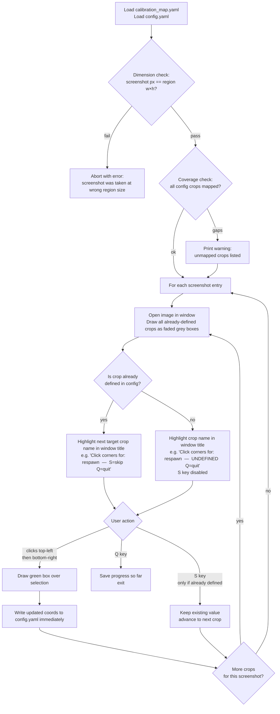
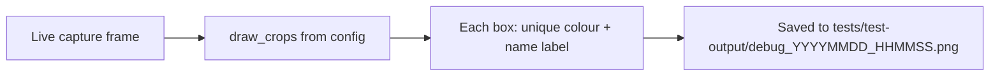

# ADR 023 — Percentage-Coordinate Crop Regions

| Status   | Date       | Wingman Version |
|----------|------------|-----------------|
| Accepted | 2026-03-26 | 1.6.0           |

## Context

The grid-based region system (ADR 003) divides the capture frame into an N×N grid and identifies areas of interest by cell number. This was a practical starting point — the V-key debug overlay makes it easy to discover region numbers without knowing pixel coordinates — but the design has accumulated compounding costs:

**Crops are larger than necessary.** A grid cell is the minimum unit of extraction. Text that falls near a cell border forces the caller to include the adjacent cell, often doubling or tripling crop area. Larger crops mean more pixels for EasyOCR to process and slower inference.

**Subgrid workarounds exist because the grid is too coarse.** `incoming_subgrid_size`, `respawn_subgrid_rows`, `respawn_subgrid_cols`, and `_crop_subregion` were added (ADR 019) specifically to recover performance lost to oversized grid cells. These are workarounds for an architectural mismatch, not features.

**The grid couples region addressing to a fixed cell count.** Changing `grid_size` renumbers every region, invalidating all configured values. Adding a region of interest in an area that doesn't align with cell boundaries requires choosing the nearest cell and accepting the mismatch.

**The system is not resolution-independent.** A region number identifies a position only relative to the current `grid_size`; if the game renders at a different resolution or the capture window is resized, the relationship between cell number and screen content is unchanged only by coincidence.

## Decision

Replace the grid-based region system with **named percentage-coordinate crops**. Each crop is defined by two `[x%, y%]` corners — top-left and bottom-right — expressed as fractions of the full capture frame dimensions (0.0–1.0). All crop definitions live in `config.yaml` under a `crops:` section.

### Config schema (new)

```yaml
# Each crop is [[x1_pct, y1_pct], [x2_pct, y2_pct]] where x is horizontal (left→right)
# and y is vertical (top→bottom), both as fractions of the capture frame (0.0–1.0).
crops:
  respawn:       [[0.44, 0.55], [0.62, 0.70]]
  incoming:      [[0.00, 0.06], [0.22, 0.19]]
  click_to:      [[0.28, 0.72], [0.72, 0.84]]
  good_luck:     [[0.24, 0.38], [0.76, 0.54]]
  event_refresh: [[0.30, 0.30], [0.70, 0.55]]
  ready_button:  [[0.44, 0.88], [0.56, 0.96]]
```

Coordinates are **scale-independent within a stable capture region**: if the game renders at a different internal resolution but the capture area (`config.yaml` `region:`) stays the same, the named crops remain correctly positioned without reconfiguration. If the capture region itself is moved or resized, crops must be recalibrated — but this is true of any coordinate scheme tied to a capture frame.

### Core extraction (new)

```python
def get_crop(frame, x1: float, y1: float, x2: float, y2: float) -> np.ndarray:
    """Extract a percentage-coordinate crop from a full frame.

    All coordinates are fractions of the frame dimensions (0.0–1.0).
    Coordinate order follows screen convention: x (horizontal) before y (vertical).
    In NumPy indexing this maps to frame[y_start:y_end, x_start:x_end].

    Args:
        frame: Full capture frame as a numpy array.
        x1: Left edge as a fraction of frame width.
        y1: Top edge as a fraction of frame height.
        x2: Right edge as a fraction of frame width.
        y2: Bottom edge as a fraction of frame height.

    Returns:
        Cropped region as a numpy array.
    """
    h, w = frame.shape[:2]
    return frame[int(h * y1):int(h * y2), int(w * x1):int(w * x2)]
```

This is a **module-level pure function** with no instance state. `GameStateAnalyzer` loads crop coordinates from config and stores them as named tuples; callers pass the coordinates directly to `get_crop`.

### Modularity requirement

`get_crop`, `draw_crops`, and the crop config-loading logic must live in a **dedicated module** (`wingman/crop_region.py`) with no imports from the rest of Wingman. `GameStateAnalyzer` and `Controller` import from `crop_region`; `crop_region` imports only `numpy` and the standard library.

This boundary makes the screen-scanning primitives reusable by any future system — a different game, a UI automation tool, a standalone calibration script — without pulling in OCR readers, game-state machines, or controller logic.

**Public surface of `wingman/crop_region.py`:**

```python
# Core types
CropCoords = NamedTuple("CropCoords", [("x1", float), ("y1", float),
                                        ("x2", float), ("y2", float)])

# Core functions
def get_crop(frame: np.ndarray, x1: float, y1: float,
             x2: float, y2: float) -> np.ndarray: ...

def load_crops(crops_cfg: dict) -> dict[str, CropCoords]: ...

def draw_crops(frame: np.ndarray,
               crops: dict[str, CropCoords]) -> np.ndarray: ...

def crop_centre(coords: CropCoords,
                frame_w: int, frame_h: int,
                abs_left: int, abs_top: int) -> tuple[int, int]: ...
```

`load_crops` converts raw config dicts into `CropCoords` named tuples and validates that all values are in `[0.0, 1.0]` and `x1 < x2`, `y1 < y2`. `crop_centre` computes the absolute screen click target from a crop and a capture-region origin — removing the coordinate arithmetic currently scattered across `controller.py`.

### Config migration (before → after)

| Before | After |
|---|---|
| `respawn_detection.region: 44` | `crops.respawn: [[x1,y1],[x2,y2]]` |
| `respawn_detection.incoming_region: 21` | `crops.incoming: [[x1,y1],[x2,y2]]` |
| `respawn_detection.click_to_region: 60` | `crops.click_to: [[x1,y1],[x2,y2]]` |
| `respawn_detection.incoming_subgrid_size: 3` | _(removed — crop is exact)_ |
| `respawn_detection.respawn_subgrid_rows/cols: 2/1` | _(removed — crop is exact)_ |
| `controls.good_luck_region: 16` | `crops.good_luck: [[x1,y1],[x2,y2]]` |
| `controls.event_refresh_region: 30` | `crops.event_refresh: [[x1,y1],[x2,y2]]` |
| `controls.ready_button_region: 64` | `crops.ready_button: [[x1,y1],[x2,y2]]` |
| `respawn_detection.grid_size: 8` | _(removed)_ |
| `debug.capture_grid_size: 8` | _(removed — debug overlay draws named boxes)_ |

### Debug overlay (V-key screenshot)

The V-key debug screenshot replaces the numbered grid overlay with labelled bounding boxes drawn from the `crops` config. Each named crop is drawn as a coloured rectangle with its name, making calibration as simple as: take a screenshot, measure the target area as a fraction of total width/height, update the two coordinates.

### Clicking by crop coordinates

`click_grid_region` currently calculates click targets from a region number:

```python
# current
abs_x = int(abs_left + (col + 0.5) * cell_w)
abs_y = int(abs_top  + (row + 0.5) * cell_h)
```

Under the new system the click target is the centre of the named crop:

```python
# new
abs_x = int(abs_left + ((x1 + x2) / 2) * cap_w)
abs_y = int(abs_top  + ((y1 + y2) / 2) * cap_h)
```

The event-refresh corner dismiss (`4 * cap_w / 8, 4 * cap_h / 8`) is also grid-derived. It becomes a named crop entry:

```yaml
crops:
  # Click-only target — not scanned by OCR. Intentionally small (4%×4%) to place the
  # click at the centre point between the old grid regions 28/29/36/37.
  # If the capture region shifts, recalibrate to the screen-centre dismiss point.
  event_refresh_dismiss: [[0.48, 0.48], [0.52, 0.52]]
```

### Calibration tooling

Calibration is performed entirely offline against static reference screenshots — the game does not need to be running. Reference images live in `tests/test_screenshots/`. A separate config file (`tests/calibration_map.yaml`) declares which crops are defined from which screenshot. A standalone tool (`tests/calibrate.py`) drives the loop: it opens each image, accepts two mouse clicks per crop, and writes the result directly into `config.yaml`. No copy-paste.

#### Calibration map

`tests/calibration_map.yaml` maps each reference screenshot to the crop names it covers. One screenshot can cover multiple crops if the same game screen contains several regions of interest.

```yaml
# tests/calibration_map.yaml
# For each entry: open the screenshot and prompt for each listed crop in order.
# Run: python tests/calibrate.py
#
# IMPORTANT: screenshots must be captured at the same region dimensions as
# config.yaml region.width × region.height. The tool validates this on startup
# and refuses to run if there is a mismatch.

calibration:
  - screenshot: respawn_screen.png      # 1920×1200
    crops: [respawn, incoming, click_to]
  - screenshot: lobby_ready.png         # 1920×1200
    crops: [ready_button]
  - screenshot: lobby_event_refresh.png # 1920×1200
    crops: [event_refresh, event_refresh_dismiss]
  - screenshot: match_start.png         # 1920×1200
    crops: [good_luck]
```

Screenshots are one-time captures taken from a real game session and committed to the repo. They must be taken with the capture `region:` configured to match `config.yaml` at the time of capture — the dimensions are embedded as a comment per entry and validated at tool startup. Calibration can be re-run at any time without the game as long as the region dimensions are unchanged.

At startup, `calibrate.py` cross-checks two things and aborts with a clear error if either fails:

1. **Dimension match** — every screenshot's pixel dimensions must equal `config.yaml region.width × region.height`. A mismatch means the screenshot was taken with a different region and percentages would be computed against the wrong frame size.
2. **Coverage check** — every key under `crops:` in `config.yaml` must appear in at least one `calibration_map.yaml` entry. An uncovered crop is flagged as a warning so it isn't silently left uncalibrated.

#### How `calibrate.py` works



Key properties:
- **Crash-safe**: config is written after each individual crop — a partial run leaves all previously completed crops intact.
- **Re-entrant**: re-running allows skipping crops whose existing box still looks correct; S is available only when a crop already has a defined value.
- **Context-aware**: all already-defined crops from `config.yaml` are drawn as faded boxes on the image, so the user can see neighbouring regions while clicking a new one.
- **S blocked for undefined crops**: pressing S on a crop with no existing value is a no-op — the tool requires a click pair before it will advance.
- **Misclick recovery**: a bad click pair produces a visible wrong box; re-run `--crop <name>` immediately to correct it. There is no undo within a session.

#### Workflow A — First-time calibration

1. **Capture reference screenshots.** For each game screen state that contains crops, take a screenshot while the game is running **with the current `config.yaml region:` in effect** and save it to `tests/test_screenshots/`. Note the region dimensions in the `calibration_map.yaml` comment for that entry.

2. **Add entries to `calibration_map.yaml`** mapping each screenshot to the crop names it should define.

3. **Run the calibration tool:**
   ```
   python tests/calibrate.py
   ```
   The tool validates dimensions and coverage, then iterates every entry in order. For each crop it prompts:
   ```
   [1/8] respawn  (respawn_screen.png)  — click top-left corner
   ```

4. **Click two corners** on the image window — top-left first, then bottom-right. A green rectangle appears. The tool writes the coordinates into `config.yaml` and advances.

5. **Press Q** to quit early; progress to that point is saved.

6. **Verify** with the V-key debug screenshot while the game is running (see below).

---

#### Workflow B — Recalibrate a single crop

```
python tests/calibrate.py --crop respawn
```

Opens the screenshot mapped to `respawn`, draws the existing box in yellow as a reference, and prompts for new corners. Writes the update immediately. Use this to recover from a misclick or to adjust a single region after a minor UI shift.

---

#### Workflow C — Full recalibration after capture region size change

When `config.yaml region.width` or `region.height` changes, the old reference screenshots are no longer valid — they were taken at different dimensions and the tool will refuse to use them. New screenshots must be captured before re-running calibration.

1. Update `config.yaml region:` to the new dimensions.
2. Capture fresh reference screenshots for every game screen state.
3. Update the dimension comments in `calibration_map.yaml`.
4. Run:
   ```
   python tests/calibrate.py
   ```
   All crops are undefined relative to the new frame; S is blocked for every entry. Complete the full click loop.
5. Verify with V.

> If only the region **position** changed (left/top moved, width/height unchanged), existing screenshots are still valid — dimensions match and percentages are correct. Re-run normally; press S on crops that still look right.

---

#### V-key debug screenshot (runtime verification)

Pressing V while Wingman is running saves a screenshot to `tests/test-output/` with all named crops drawn as labelled coloured rectangles over the live frame. This is the final verification step after calibration:



A correctly calibrated crop tightly encloses its target text. A box that is too large wastes OCR time; a box that clips text produces partial reads.

### Code changes

| File | Change |
|---|---|
| `wingman/crop_region.py` _(new)_ | New module. Contains `CropCoords`, `get_crop`, `load_crops`, `draw_crops`, `crop_centre`. No imports from the rest of Wingman — only `numpy` and stdlib. This is the portable, reusable surface of the screen-scanning subsystem. |
| `wingman/analyzer.py` | Import `get_crop`, `load_crops`, `draw_crops` from `crop_region`. Remove `get_region`, `_crop_subregion`, `draw_grid`, `grid_rows`, `grid_cols`, `respawn_region`, `incoming_region`, `click_to_region`, subgrid fields, and `capture_grid_size`. Call `load_crops(config["crops"])` in `__init__` and store result as `self.crops`. |
| `wingman/controller.py` | Import `crop_centre` from `crop_region`. Replace `ready_button_region`, `good_luck_region`, `event_refresh_region` integer fields with `CropCoords` tuples. Replace `click_grid_region` arithmetic with `crop_centre`. Add `event_refresh_dismiss` crop. Replace `draw_grid` call with `draw_crops`. Remove `REGION_*` integer-passing call sites. |
| `wingman/main.py` | Update `click_grid_region` calls to pass `CropCoords` directly. |
| `wingman/config.yaml` | Add `crops:` section (with axis-order comment); remove `respawn_detection.grid_size`, all region number keys, subgrid keys, and `debug.capture_grid_size`. |
| `tests/calibrate.py` _(new)_ | Standalone offline calibration tool. On startup: validates all screenshot dimensions match `config.yaml region.width × region.height` (aborts on mismatch) and warns on any `config.yaml crops:` key with no `calibration_map.yaml` entry. Iterates entries in map order, prompts for two clicks per crop, writes coordinates directly into `config.yaml` after each crop. S key skips only crops that already have a defined value. Flag: `--crop <name>` to recalibrate a single named crop. |
| `tests/calibration_map.yaml` _(new)_ | Maps reference screenshot filenames to the crop names they cover, with a dimension comment per entry. Determines iteration order for `calibrate.py`. |
| `tests/test_screenshots/` _(new dir)_ | Static reference screenshots captured from real game sessions. One file per distinct game screen state. Committed to the repo so calibration can be re-run without the game. |
| `tests/` | Update any test that constructs region numbers or calls `get_region`/`draw_grid`. Add unit tests for `load_crops` validation and `crop_centre` arithmetic directly against `crop_region.py`. |

## Future Capability: Target Tracking

This section describes a follow-on feature enabled by the crop architecture but **not part of this ADR's implementation scope**. It is recorded here to document the design intent that motivated some of the architectural choices above.

The percentage-coordinate system directly enables frame-to-frame enemy tracking using the HUD diamond markers.

### HUD diamond behaviour

The game renders a **green diamond** on each enemy visible on screen. When missile lock is achieved the diamond turns **red**. The diamond moves with the enemy aircraft across the frame.

### Tracking approach

Define a named crop covering the area of the HUD where enemy diamonds appear (typically the central combat zone, e.g. `tracking_zone: [[0.20, 0.15], [0.80, 0.85]]`). On each scan:

1. **Detect diamonds** — run an HSV colour filter over the crop for the green or red diamond colour range. Each contour centroid is a candidate target.
2. **Detect lock** — if any detected diamond is red (HSV hue shift from green), missile lock is confirmed.
3. **Infer heading** — compare centroid positions between the current frame and the previous frame. The delta vector `(dx, dy)` gives the target's screen-space velocity. A target moving right means `dx > 0`; anticipating the lead angle becomes possible.

```python
# Pseudocode — per scan cycle
diamonds = detect_diamonds_hsv(crop, color="green")
locked   = detect_diamonds_hsv(crop, color="red")

if locked:
    trigger_weapon_fire()

if diamonds and prev_diamonds:
    dx = diamonds[0].cx - prev_diamonds[0].cx
    dy = diamonds[0].cy - prev_diamonds[0].cy
    # dx/dy in pixels relative to crop size → convert to pct for resolution independence
```

### Why this requires the new architecture

With grid regions this would not be practical:
- A grid cell is too large — colour noise from the cockpit and sky fills the cell, drowning out the small diamond marker.
- Subgrid crops can isolate a cell but the diamond moves between cells, requiring the caller to track which cell it is currently in.
- Percentage coordinates allow the tracking zone to be sized and positioned precisely around the combat HUD with no wasted area, and the same coordinates work at any capture resolution.

### Config additions (future)

```yaml
crops:
  tracking_zone: [[0.20, 0.15], [0.80, 0.85]]  # [[x1_pct, y1_pct], [x2_pct, y2_pct]] — area scanned for HUD diamonds

tracking:
  diamond_green_hsv_lower: [40, 120, 120]
  diamond_green_hsv_upper: [80, 255, 255]
  diamond_red_hsv_lower:   [0,  150, 150]
  diamond_red_hsv_upper:   [10, 255, 255]
  min_contour_area: 20   # px² — filters noise below diamond size
```

## Consequences

**Positive:**
- OCR crops are exactly sized to the text of interest — no wasted pixels, faster inference.
- Subgrid workarounds (`_crop_subregion`, `incoming_subgrid_size`, `respawn_subgrid_rows/cols`) are deleted.
- Crops are scale-independent within a stable capture region; no recalibration needed when the game's internal render resolution changes.
- Adding a new region of interest requires only two coordinates, not grid-size arithmetic.
- `get_crop` is a pure function — trivially testable and reusable.
- `wingman/crop_region.py` has no Wingman-specific imports — it can be copied or imported into any future screen-scanning or OCR project without modification.

**Negative / migration cost:**
- All existing region numbers must be recalibrated to percentage coordinates. The V-key screenshot with the new labelled overlay is the calibration tool.
- Config schema is a breaking change; old `config.yaml` files with `region:` keys will not work until updated.

## Supersedes

ADR 003 — Grid-Based Screen Scanning Architecture.

## References

- [ADR 003](003-grid-based-screen-scanning-architecture.md) — original grid design
- [ADR 019](019-incoming-region-subgrid-ocr-optimization.md) — subgrid workaround (to be removed)
- [ADR 020](020-cpu-only-ocr-optimizations.md) — OCR performance baseline
- [wingman/analyzer.py](../../wingman/analyzer.py) — `get_region`, `_crop_subregion`
- [wingman/config.yaml](../../wingman/config.yaml) — region configuration
