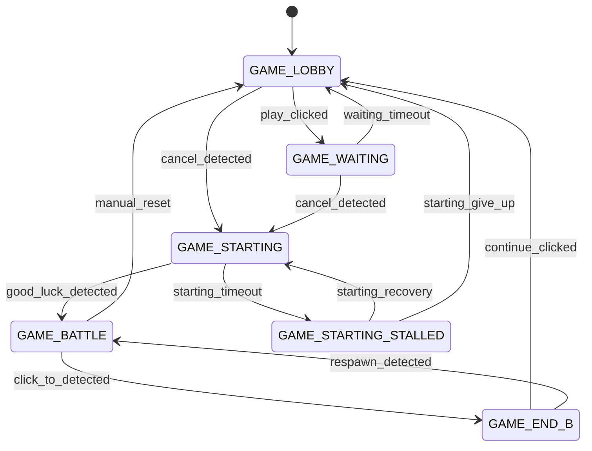

# ADR 025 — Formalise the Game State Machine

| Status   | Date       | Wingman Version |
|----------|------------|-----------------|
| Accepted | 2026-04-19 | 1.6.3           |

## Context

The game loop has six named states defined in `GameState` (enum, `analyzer.py`):

```
GAME_LOBBY → GAME_WAITING → GAME_STARTING → GAME_BATTLE → GAME_END_B → GAME_LOBBY …
                                          ↘ GAME_STARTING_STALLED
```

These states are represented today as **five separate boolean flags** on `GameStateAnalyzer`:

```python
self._game_lobby          = True
self._game_waiting        = False
self._game_starting       = False
self._game_starting_stalled = False
self._game_end_b          = False
```

`game_state` computes the current state by reading those flags in priority order. Any code that wants to transition state sets the relevant flags directly — there is no central transition method.

A grep across the three runtime files finds **46 flag mutation sites**:

| File | Mutations |
|------|-----------|
| `analyzer.py` | 13 |
| `controller.py` | 22 |
| `main.py` | 11 |

### Problems this causes

**1. Inconsistent intermediate states.** Each transition clears several flags and sets one — done with multiple assignment statements, not atomically. A background OCR thread reading `game_state` between those assignments can observe a state that matches no valid enum value (all flags False → falls through to `GAME_BATTLE` default, silently).

**2. No valid-transition enforcement.** Any code can write any combination of flags. Invalid transitions (e.g. `GAME_LOBBY → GAME_BATTLE` directly) are not prevented or logged. The only detection is downstream misbehaviour.

**3. No entry/exit hooks.** Side effects that should accompany a transition (e.g. `_start_game_starting_loop()` on entry to `GAME_STARTING`) are called manually at each transition site. If a new path to `GAME_STARTING` is added, the developer must remember to call the hook. Three such hooks are currently missing from some paths.

**4. Health override masks state.** The `game_state` property previously returned `GAME_BATTLE` whenever `_health >= 1`, overriding any explicit flag — including `_game_lobby = True`. This caused OCR to keep scanning during the entire lobby phase (fixed in v1.6.3, ADR 024 context). The root cause is that `game_state` is computed from multiple mutable flags rather than read from a single authoritative field.

**5. BT dependency.** ADR 024 requires `game_state` to be trustworthy for the py-trees behavior tree root condition (`Idle — if game_state != GAME_BATTLE`). A scattered flag system is an unreliable foundation for that check.

---

## Decision

Adopt the **`transitions`** library to formalise the FSM. Transitions are declared in a single list of dicts — one entry per edge — which serves as the single source of truth for what is valid, what fires on entry/exit, and what the trigger method is named.

Reasons to use `transitions` over a hand-rolled `transition()` method:

1. **Named trigger methods.** `analyzer.play_clicked()` is more expressive than `analyzer.transition(GameState.GAME_WAITING)` and self-documents the cause at the call site.
2. **Guard conditions built in.** `conditions=` on a transition declaration prevents the transition if a callable returns False — no extra `if` blocks needed.
3. **Entry/exit callbacks declarative.** `before=`, `after=`, `on_enter_*`, `on_exit_*` are wired in the transition table, not scattered across caller code.
4. **Auto-diagram.** `transitions` can export a Graphviz diagram of the machine — useful for keeping documentation in sync without manual Mermaid updates.
5. **Consistent library philosophy.** `py-trees` is already adopted (ADR 024) for the tactical layer; using `transitions` for the game-loop layer follows the same principle of using established libraries over hand-rolling.
6. **Pure Python, lightweight.** No native extensions; `pip install transitions` adds ~500 lines.

---

## Design

### Valid transition table

| From | To | Trigger | Hook |
|------|----|---------|------|
| `GAME_LOBBY` | `GAME_WAITING` | `play_clicked` | — |
| `GAME_LOBBY` | `GAME_STARTING` | `cancel_detected` | — |
| `GAME_WAITING` | `GAME_STARTING` | `cancel_detected` | — |
| `GAME_WAITING` | `GAME_LOBBY` | `waiting_timeout` | — |
| `GAME_STARTING` | `GAME_BATTLE` | `good_luck_detected` | `on_enter_GAME_BATTLE` |
| `GAME_STARTING` | `GAME_STARTING_STALLED` | `starting_timeout` | `on_enter_GAME_STARTING_STALLED` |
| `GAME_STARTING_STALLED` | `GAME_STARTING` | `starting_recovery` | — |
| `GAME_STARTING_STALLED` | `GAME_LOBBY` | `starting_give_up` | `on_enter_GAME_LOBBY` |
| `GAME_BATTLE` | `GAME_END_B` | `click_to_detected` | — |
| `GAME_BATTLE` | `GAME_LOBBY` | `manual_reset` | `on_enter_GAME_LOBBY` |
| `GAME_END_B` | `GAME_LOBBY` | `continue_clicked` | `on_enter_GAME_LOBBY` |
| `GAME_END_B` | `GAME_BATTLE` | `respawn_detected` | `on_enter_GAME_BATTLE` |



### Machine declaration

```python
from transitions import Machine

TRANSITIONS = [
    # source           trigger                dest
    {"trigger": "play_clicked",       "source": "GAME_LOBBY",            "dest": "GAME_WAITING"},
    {"trigger": "cancel_detected",    "source": "GAME_LOBBY",            "dest": "GAME_STARTING"},
    {"trigger": "cancel_detected",    "source": "GAME_WAITING",          "dest": "GAME_STARTING"},
    {"trigger": "waiting_timeout",    "source": "GAME_WAITING",          "dest": "GAME_LOBBY"},
    {"trigger": "good_luck_detected", "source": "GAME_STARTING",         "dest": "GAME_BATTLE"},
    {"trigger": "starting_timeout",   "source": "GAME_STARTING",         "dest": "GAME_STARTING_STALLED"},
    {"trigger": "starting_recovery",  "source": "GAME_STARTING_STALLED", "dest": "GAME_STARTING"},
    {"trigger": "starting_give_up",   "source": "GAME_STARTING_STALLED", "dest": "GAME_LOBBY"},
    {"trigger": "click_to_detected",  "source": "GAME_BATTLE",           "dest": "GAME_END_B"},
    {"trigger": "manual_reset",       "source": "*",                     "dest": "GAME_LOBBY"},
    {"trigger": "continue_clicked",   "source": "GAME_END_B",            "dest": "GAME_LOBBY"},
    {"trigger": "respawn_detected",   "source": "GAME_END_B",            "dest": "GAME_BATTLE"},
]

machine = Machine(
    model=analyzer,
    states=[s.name for s in GameState],
    transitions=TRANSITIONS,
    initial=GameState.GAME_LOBBY.name,
    ignore_invalid_triggers=False,   # raises on illegal transition
)
```

Adding a new transition = one new dict in `TRANSITIONS`. Adding a new state = one new `GameState` enum value + entries in `TRANSITIONS`.

### Entry hooks

Declared as methods on `GameStateAnalyzer`; `transitions` calls them automatically by convention (`on_enter_<STATE>`):

```python
def on_enter_GAME_LOBBY(self):
    self._lobby_play_not_visible_since = 0.0
    if self._on_cancel_mission:
        self._on_cancel_mission()          # Controller callback

def on_enter_GAME_STARTING(self):
    if self._on_start_game_starting_loop:
        self._on_start_game_starting_loop()

def on_enter_GAME_BATTLE(self):
    self._health_no_digits_since = 0.0
    if self._health is not None and self._health >= 1:
        self.alive_event.set()

def on_enter_GAME_STARTING_STALLED(self):
    logger.warning("FSM: GAME_STARTING_STALLED — Good Luck not detected in time")
```

Callbacks requiring `Controller` are injected at construction as callables — `GameStateAnalyzer` does not import `Controller`.

### `game_state` property

`transitions` sets `model.state` (a string). A thin property converts it back to the enum:

```python
@property
def game_state(self) -> GameState:
    return GameState[self.state]
```

The five boolean flags and the health override in `game_state` are **removed entirely**.

### Thread safety

`transitions` is not thread-safe by default. Trigger calls from background OCR threads and from the main loop both mutate `model.state`. Wrap trigger dispatch in a `threading.Lock`:

```python
def _trigger(self, trigger_name: str) -> bool:
    with self._state_lock:
        fn = getattr(self, trigger_name, None)
        if fn:
            return fn()
        return False
```

All call sites use `analyzer._trigger("cancel_detected")` rather than calling the trigger method directly. This is the only threading shim needed.

---

## Migration

### Phase 1 — Install `transitions`, add machine alongside flags

Add `transitions` to `pyproject.toml`. Construct the `Machine` on `GameStateAnalyzer` with the full transition list. Boolean flags remain; machine state mirrors them. `game_state` reads from `self.state` (machine), not flags.

### Phase 2 — Replace flag mutations with trigger calls

Each of the 46 flag mutation sites becomes a `_trigger("xxx")` call. The mutation code is deleted. Invalid transitions now raise `MachineError` and appear in logs immediately.

### Phase 3 — Wire entry/exit hooks

Replace manually-called side effects (`_start_game_starting_loop()`, `cancel_mission()`) with `on_enter_*` methods. Remove the manual calls from all transition sites.

### Phase 4 — Remove boolean flags

Delete `_game_lobby`, `_game_waiting`, `_game_starting`, `_game_starting_stalled`, `_game_end_b`. Any remaining guard checks switch to `analyzer.game_state == GameState.XXX`.

---

## Relation to ADR 024 (py-trees BT)

- The BT's `AnalyzerSnapshot` reads `analyzer.game_state` once per tick. With `transitions` managing state atomically (under `_state_lock`), this read is safe and authoritative.
- `on_enter_*` hooks replace the scattered manual side-effect calls — same declarative pattern the BT uses for node entry/exit.
- `manual_reset` trigger with `source="*"` handles the End-key forced reset cleanly without a `force=True` bypass.

**Sequencing:** Implement ADR 025 (FSM) first, then ADR 024 (BT).

---

## Alternatives considered

### Hand-rolled `transition()` method with frozenset table

Original plan in this ADR. Provides the same atomic state field and valid-transition enforcement, but requires writing the validation loop, hook dispatch, and logging manually. Named trigger methods are not available — call sites still pass a `GameState` enum value rather than a self-documenting trigger name. Adds no new dependency but foregoes guard conditions and auto-diagram.

**Rejected:** `transitions` provides all the same guarantees with less hand-rolled plumbing and adds named triggers that make call sites self-documenting.

### Dict-of-dicts transition matrix (dependency-free)

```python
TRANSITIONS = {
    GameState.GAME_LOBBY: {
        GameState.GAME_WAITING: "play_clicked",
        ...
    }
}
```

Readable and IDE-friendly, but still requires hand-rolling the validation, hook dispatch, and logging. No named trigger methods.

**Rejected:** Same tradeoff as hand-rolled `transition()` — less library, more plumbing.

### YAML config for transitions

Same pattern as `config.yaml` crops. Non-programmer readable but no IDE type checking, runtime-only validation, and extra loading code for what is fundamentally static configuration.

**Rejected:** Adds file I/O complexity without meaningful readability gain over the `TRANSITIONS` list in Python.

---

## Consequences

**Positive:**
- `TRANSITIONS` list is the single readable, configurable source of truth — adding a transition is one dict
- Named trigger methods (`analyzer.play_clicked()`) make call sites self-documenting
- `ignore_invalid_triggers=False` raises immediately on illegal transition — no silent failures
- Entry/exit hooks declared in the machine, not scattered across caller code
- Auto-diagram via Graphviz keeps documentation in sync with code
- Consistent with ADR 024 philosophy (established libraries over hand-rolling)
- 46 flag mutations → 46 named trigger calls

**Negative:**
- `transitions` is a new runtime dependency (pure Python, ~500 lines, no native extensions)
- Thread safety requires the `_trigger()` wrapper — trigger methods cannot be called directly from background threads
- `transitions` uses string state names internally; the `game_state` property must convert back to enum

**Neutral:**
- `GameState` enum is unchanged; strings passed to `Machine` are derived from enum names
- `_game_battle_alive` and health sub-state remain as-is — they are sub-state within `GAME_BATTLE`, not FSM states
- `manual_reset` with `source="*"` replaces the `force=True` bypass cleanly
