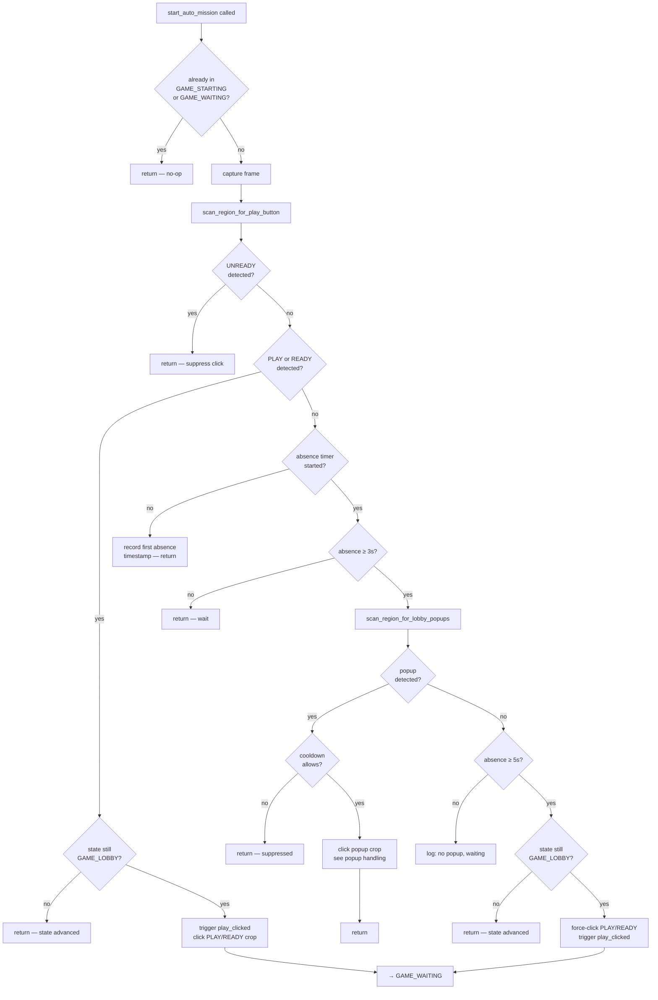
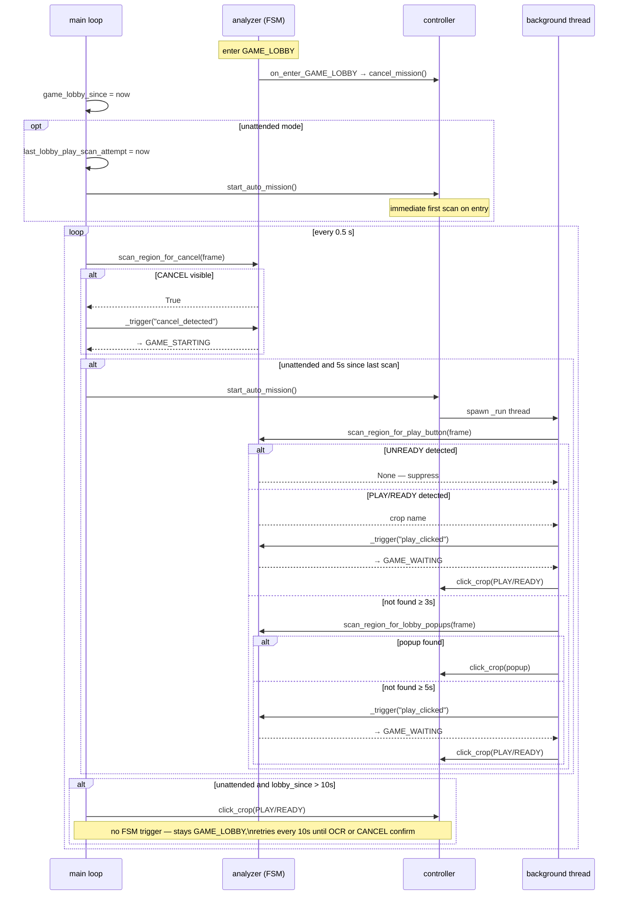

# ADR 026 — GAME_LOBBY State Machine Sequence

| Status   | Date       | Wingman Version |
|----------|------------|-----------------|
| Accepted | 2026-04-26 | 1.6.4           |

## Context

ADR 025 formalised the six-state FSM using the `transitions` library. This ADR documents in full the behaviour of the `GAME_LOBBY` state: what triggers entry, what happens on entry, how the main loop and background threads behave while the state is active, and what triggers exit. It serves as the reference for anyone extending the lobby automation path.

`GAME_LOBBY` is the idle/waiting state between matches. The system enters it after a game ends, after a matchmaking failure, or on a manual reset. The sole purpose of the lobby sequence is to detect the PLAY/READY button, dismiss any blocking popups, click it, and advance to matchmaking.

---

## Entry conditions

Four triggers reach `GAME_LOBBY`:

| Trigger | Source state | Cause |
|---------|-------------|-------|
| `continue_clicked` | `GAME_END_B` | Final continue button was clicked; click-through sequence complete |
| `waiting_timeout` | `GAME_WAITING` | 180 s elapsed with no CANCEL button detected |
| `starting_give_up` | `GAME_STARTING_STALLED` | Stalled starting loop gave up waiting for a Good Luck screen |
| `manual_reset` | any | M key (auto-mission reset) or End key forced recovery |

---

## Entry hook — `on_enter_GAME_LOBBY`

Declared on `GameStateAnalyzer` (`analyzer.py:580`); called automatically by `transitions`:

```python
def on_enter_GAME_LOBBY(self):
    if self._on_cancel_mission:
        self._on_cancel_mission()
```

`_on_cancel_mission` is `ctrl.cancel_mission` (injected from `main.py` at startup). This stops any in-flight mission immediately on lobby entry regardless of which trigger caused the transition.

The main loop (`main.py:244–251`) also runs synchronously on the first iteration that sees the new state:

```
game_lobby_since = time.time()
game_waiting_since = 0.0
ctrl.cancel_mission()                         # belt-and-suspenders alongside the hook
if unattended_active.is_set():
    last_lobby_play_scan_attempt = time.time()
    ctrl.start_auto_mission()                 # first auto-scan immediately
```

---

## OCR scanning while in GAME_LOBBY

Scans that are **active** (crops monitored):

| Crop | Purpose |
|------|---------|
| `PLAY` | Primary play button |
| `READY` | Alternate play button (squad lobby variant) |
| `UNREADY` | Suppresses click when present (someone else is not ready) |
| `CANCEL` | Matchmaking already in progress; skips straight to `GAME_STARTING` |
| `INVITED` | Friend invite popup |
| `CREATION_FAILED` | Squad creation failure popup |
| `REVEAL_ALL` | Item reveal popup |
| `TAP_HERE_TO_CONTINUE` | Mid-lobby continue prompt |
| `UNLOCK_CLOSE` | Unlock/reward popup |
| `FINAL_CONTINUE` | Final continue button variant |
| `INSPECT` | Inspect item popup |

Scans that are **skipped** in `GAME_LOBBY`:

- **Respawn OCR** — `_detect_respawn_ocr` returns `(False, 0.0, None)` immediately when state is `GAME_LOBBY` (`analyzer.py:741`).
- **Click-to OCR** — the background `_run_click_to_in_background` thread skips `GAME_END_B` and `GAME_LOBBY` (`analyzer.py:946`).
- **Incoming missile OCR** — background OCR thread skips all non-`GAME_BATTLE`/`GAME_END_B` states (`analyzer.py:804`).

---

## Main-loop polling while in GAME_LOBBY

The main loop runs every `loop_interval_sec` (default 0.5 s). Three guards run each cycle:

### 1. Unattended-mode PLAY scan (every 5 s)

```
if unattended_active and state == GAME_LOBBY and elapsed >= 5s:
    ctrl.start_auto_mission()
```

Keeps retrying until the state transitions out.

### 2. CANCEL early-exit scan (every 3 s)

```
if state == GAME_LOBBY and elapsed >= 3s:
    if analyzer.scan_region_for_cancel(frame):
        analyzer._trigger("cancel_detected")  → GAME_STARTING
```

If the player is already queued (CANCEL visible from a previous session or faster matchmaking), the lobby sequence skips `GAME_WAITING` entirely and jumps straight to `GAME_STARTING`.

### 3. Stall guard (after 10 s)

```
if unattended and state == GAME_LOBBY and lobby_since > 10s and not mission_running:
    reset lobby_since timer (retries every 10s if state persists)
    visible_crop = scan_region_for_play_button(frame)  ← OCR scan, not blind click
    re-check FSM state after OCR (start_auto_mission may have fired during scan)
    if visible_crop and state still GAME_LOBBY:
        trigger play_clicked  → GAME_WAITING
        click visible_crop
    elif visible_crop:
        skip (state advanced during OCR scan)
    else:
        skip (button not visible yet)
```

Fires when the play button remains unclicked after 10 s. It **does not click blindly** — it calls `scan_region_for_play_button` first and only clicks if OCR confirms the button is present. This prevents stray clicks when the lobby is still loading. `scan_region_for_play_button` also handles UNREADY suppression and returns the correct crop name (PLAY vs READY).

**`play_clicked` is fired** after a confirmed click, advancing the FSM to `GAME_WAITING`. This prevents any in-flight `start_auto_mission` background thread from clicking a second time — those threads re-check `game_state` after their OCR scan and abort if the state is already `GAME_WAITING`. If the click did not actually register in the game (no matchmaking started), `GAME_WAITING` recovers via `waiting_timeout` → `GAME_LOBBY` after 180 s, or re-clicks PLAY/READY after 45 s if the button reappears.

The `not ctrl.is_mission_running()` guard prevents a stray click while a mission thread is still winding down on lobby entry.

---

## `start_auto_mission` sequence

`controller.py:331`. Spawns a daemon thread (`_run`) for each call to avoid blocking the main loop.



### Popup handling detail

| Popup crop | Action |
|-----------|--------|
| `INVITED` | Click invite crop → wait 1.5 s → re-scan for PLAY/READY → click if found |
| `CREATION_FAILED` | Click dismiss crop |
| `REVEAL_ALL` | Click crop → wait 3 s → click crop again (second reveal needed) |
| `TAP_HERE_TO_CONTINUE` | Click crop |
| `UNLOCK_CLOSE` | Click crop |
| `FINAL_CONTINUE` | Click crop |
| `INSPECT` | Click crop |
| `event_refresh` | Click `event_refresh_dismiss` crop (different dismiss region) |

All popups have a **30 s per-popup cooldown** (`popup_click_allowed`/`record_popup_click`) to prevent thrashing if the popup reappears immediately.

---

## Exit transitions

| Trigger | Destination | Condition |
|---------|------------|-----------|
| `play_clicked` | `GAME_WAITING` | PLAY/READY button clicked via `start_auto_mission` |
| `cancel_detected` | `GAME_STARTING` | CANCEL button visible — matchmaking already active |
| `manual_reset` | `GAME_LOBBY` | Self-loop; resets entry hooks and timestamps |

---

## GAME_WAITING continuation

When `play_clicked` fires and the state advances to `GAME_WAITING`, the main loop initialises timestamps and immediately begins a 3-second-interval CANCEL scan. This confirms the PLAY click was registered by the matchmaking system. If CANCEL is still absent after 180 s, `waiting_timeout` fires and the system returns to `GAME_LOBBY`.

Full `GAME_WAITING` behaviour is out of scope for this ADR but is visible in `main.py:303–371`.

---

## Full GAME_LOBBY sequence diagram



---

## References

- [wingman/analyzer.py:580](../../wingman/analyzer.py#L580) — `on_enter_GAME_LOBBY`, `_detect_respawn_ocr` state guard
- [wingman/analyzer.py:263](../../wingman/analyzer.py#L263) — `_STATE_CROPS` — crops active per state
- [wingman/controller.py:331](../../wingman/controller.py#L331) — `start_auto_mission`
- [wingman/main.py:244](../../wingman/main.py#L244) — GAME_LOBBY main-loop handling, CANCEL scan, stall guard
- [ADR 025](025-formalise-game-state-machine.md) — FSM formalisation; full transition table
- [ADR 015](015-game-state-machine.md) — original state machine decision
