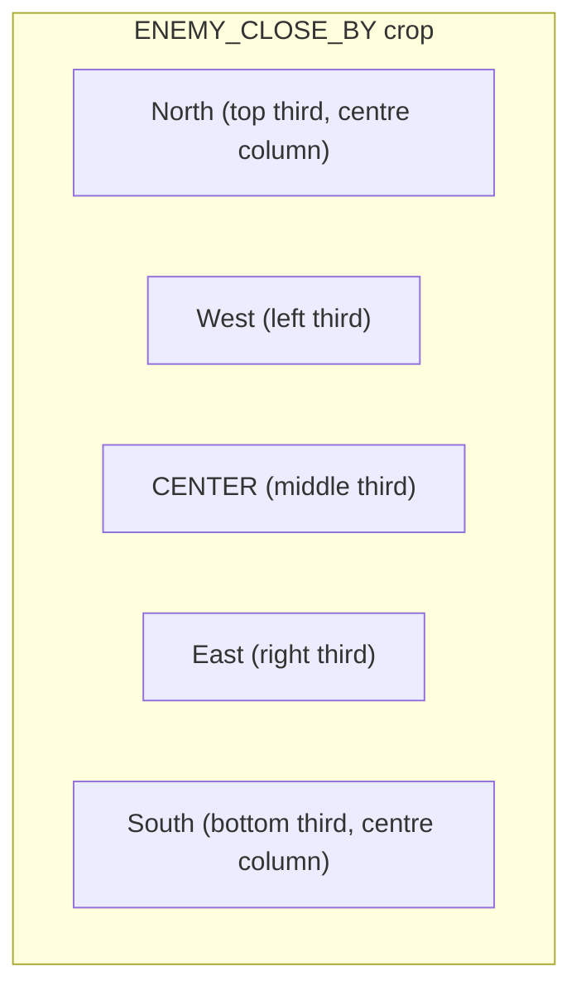

# ADR 028 — Enemy Quadrant Detection and Nose Orientation

| Status   | Date       | Wingman Version |
|----------|------------|-----------------|
| Accepted | 2026-05-02 | 1.6.5           |

## Context

The current `ENEMY_CLOSE_BY` crop returns a single boolean: red pixels present or absent. This is enough for the 30-second disengage timer (`detect_enemy_red` in `analyzer.py:1155`) but gives no information about *where* enemies are relative to the aircraft.

The J20 tactic this feature supports: fly directly above an enemy and hold missile lock. When the enemy attempts to counter, the high-angle-of-attack (AOA) engagement geometry forces them into a climb — increasing their stall probability. Maintaining a vertical stack above enemies maximises both the target-painting buff (ADR 027) and the geometric advantage.

To achieve this, Wingman needs two new capabilities:

1. **Quadrant detection** — divide the `ENEMY_CLOSE_BY` region into five sub-regions (N, S, E, W, CENTER) and count red pixels in each. The quadrant with the highest count indicates the dominant enemy bearing relative to the aircraft nose.
2. **Nose orientation** — when enemies are predominantly East or West (off-axis), use `ROLL_LEFT_KEY` / `ROLL_RIGHT_KEY` to rotate the nose toward them. When enemies are North (in front) or CENTER, no roll is needed. When enemies are only South (behind), a reverse roll is issued.

A safety constraint: roll corrections must only fire when the aircraft is at sufficient altitude. Without altitude data, rolling at low altitude risks controlled flight into terrain (CFIT). A new `ALTITUDE` crop region and a dedicated terrain-proximity guard are required before the manoeuvre is permitted.

## Decision

### 1. Quadrant layout

The `ENEMY_CLOSE_BY` crop is divided into a 3×3 grid where the five named quadrants are:



Concretely: the crop pixel array is split into thirds horizontally and vertically. Quadrant pixel counts:

| Quadrant | Row slice     | Col slice     |
|----------|---------------|---------------|
| N        | top 1/3       | middle 1/3    |
| S        | bottom 1/3    | middle 1/3    |
| E        | middle 1/3    | right 1/3     |
| W        | middle 1/3    | left 1/3      |
| CENTER   | middle 1/3    | middle 1/3    |

The dominant quadrant is the one with the highest red-pixel count. Ties default to CENTER (no action).

### 2. New analyzer method

`detect_enemy_quadrant(frame) → dict[str, int]` — returns `{N, S, E, W, CENTER}` pixel counts, or all-zeros if the crop is unavailable or an exception occurs. This replaces the call-site of `detect_enemy_red` in the main loop; the boolean check becomes `sum(counts.values()) > 0`.

### 3. Roll-to-enemy logic (`attack_mode`)

A new boolean config key `j20_mission.attack_mode` (default `false`) enables the manoeuvre. When True, the main loop calls `ctrl.orient_nose_to_enemy(dominant_quadrant)`:

| Dominant quadrant | Action                          |
|-------------------|---------------------------------|
| E                 | `roll_right(hold_seconds=0.3)`  |
| W                 | `roll_left(hold_seconds=0.3)`   |
| N or CENTER       | no action (already on-target)   |
| S                 | `roll_right(hold_seconds=0.6)`  |

`S` uses a longer hold to perform a partial reversal rather than a full 180°; the exact duration is tunable via config (`attack_mode_roll_s_hold`, default `0.6`).

The manoeuvre fires at most once per `attack_mode_cooldown` seconds (default `4.0`) to avoid thrashing.

### 4. Altitude guard

A new calibrated crop `ALTITUDE` reads the in-game altitude indicator via `_process_health_region` (the existing numeric OCR helper that already handles single-digit and multi-digit reads). The extracted integer is the altitude in game units.

A config key `j20_mission.min_safe_altitude` (default `500`) defines the floor below which `orient_nose_to_enemy` is suppressed. When altitude OCR returns `None` (read failure), the manoeuvre is also suppressed (fail-safe).

Altitude is read by the existing main-loop OCR batch (same path as `AMMO_MISSILE` / `HEALTH`) and stored under `analyzer._altitude` behind `analyzer._altitude_lock`. The main loop reads it before calling `orient_nose_to_enemy`.

### 5. Config additions

```yaml
j20_mission:
  attack_mode: false
  attack_mode_cooldown: 4.0
  attack_mode_roll_s_hold: 0.6
  min_safe_altitude: 500
```

## Consequences

**Positive**

- The J20 autonomously positions itself vertically above clustered enemies, maximising stall-geometry and target-painting buff uptime (ADR 027).
- Quadrant detection re-uses the existing `ENEMY_CLOSE_BY` crop and HSV pipeline — no new screen region is required for the enemy scan itself.
- `detect_enemy_red` remains callable unchanged; `detect_enemy_quadrant` is additive. Existing 30-second disengage logic is unaffected.
- The altitude guard prevents CFIT at the cost of suppressing the manoeuvre near the ground — the conservative, safe default.

**Negative / Trade-offs**

- **New crop required**: `ALTITUDE` must be calibrated per device/resolution. Until calibrated, `attack_mode` defaults to suppressed (altitude reads `None`).
- **Roll hold durations are approximate**: 0.3 s / 0.6 s are starting values; actual angular correction depends on in-game roll rate. These will need tuning per aircraft load-out.
- **No pitch correction**: the feature only rolls to align azimuth. Nose elevation toward the enemy (nose-down onto a target below) is intentionally excluded — a nose-down manoeuvre at low altitude is more dangerous than beneficial, and vertical alignment from above is already the desired tactic.
- **CENTER / N suppression**: if enemies are predominantly ahead or centred, no roll fires. This is correct for the tactic (already positioned) but means the algorithm does nothing when the enemy is directly in front — the padlock loop already holds lock in that case.
- **`GAME_BATTLE_MANUAL` bypass**: `orient_nose_to_enemy` must check `analyzer.game_state != GAME_BATTLE_MANUAL` before issuing any roll, consistent with the pattern in ADR 027.

## Alternatives Considered

**9-quadrant full grid** — more precise bearing information but overkill for a roll-only correction. Five named quadrants map directly to four roll decisions (or no-op), which is the full action space available.

**Pixel centroid instead of dominant quadrant** — compute the weighted centroid of all red pixels and derive a continuous bearing. More accurate but more complex; the discrete quadrant approach is sufficient for 0.3 s roll corrections and easier to tune.

**Compass heading from game HUD** — read the in-game compass bearing and fly a fixed heading above a known enemy GPS position. Requires OCR of a compass region, introduces heading tracking state, and is far more brittle than the vision-based quadrant approach.

**Using health drops as an altitude proxy** — if the aircraft is hitting terrain, health drops to 0. Rejected: using damage as the safety signal is too late; the aircraft has already crashed.
