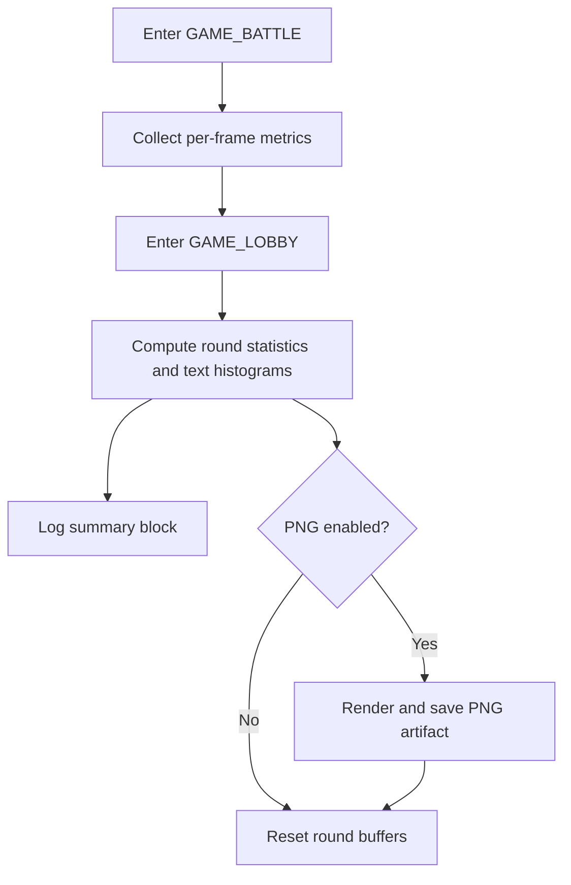

# ADR 031 — Round-End Histogram Reporting on GAME_LOBBY Entry

| Status   | Date       | Wingman Version |
|----------|------------|-----------------|
| Draft    | 2026-05-05 | 1.6.6           |

## Context

We now have repeatable evidence from `wingman.log` that OCR cycle performance is generally healthy, but health OCR spikes are frequent enough to require continuous visibility.

Current workflow is manual:
- Parse `wingman.log` after a session.
- Generate `docs/performance/wingman-performance-histogram.png` offline.
- Review anomalies after the fact.

This delays detection. We want a round-end view immediately when Wingman returns to `GAME_LOBBY`.

### Production log excerpts with timing data

The following excerpts are from `wingman.log` on 2026-05-05:

```text
2026-05-05 04:21:01,390 [DEBUG] Analyzer: Parallel OCR Timings ... Total: 0.20s
2026-05-05 04:21:02,921 [DEBUG] Analyzer: Parallel OCR Timings ... Total: 0.23s
2026-05-05 04:21:04,378 [DEBUG] Analyzer: Parallel OCR Timings ... Total: 0.19s
2026-05-05 04:21:06,034 [DEBUG] Analyzer: Parallel OCR Timings ... Total: 0.34s
2026-05-05 04:21:09,446 [DEBUG] Analyzer: Parallel OCR Timings ... Total: 0.72s
2026-05-05 04:21:14,655 [DEBUG] Analyzer: Parallel OCR Timings ... Total: 1.40s
```

Representative round boundary transitions:

```text
2026-05-05 04:20:12,963 [INFO] Game state: UNKNOWN -> GAME_LOBBY
2026-05-05 04:20:16,894 [DEBUG] Initiating transition from state GAME_LOBBY to state GAME_WAITING...
2026-05-05 04:20:20,777 [INFO] CANCEL detected (3.0s) - matchmaking confirmed -> GAME_STARTING
```

Session-level measured distribution (same log window):
- OCR total cycles: 3,955
- Mean: 0.65s
- Median: 0.59s
- 88 percent below 1.0s
- 2 percent above 1.5s
- Health spikes: 170 / 3,258 (5.2 percent)

## Decision

Implement round-end histogram reporting triggered when Wingman enters `GAME_LOBBY`, using a two-tier output model:

1. Default (always on): compact text histogram printed to logs.
2. Optional: PNG histogram generation controlled by config, disabled by default.

### Why this decision

- Round-end log output gives immediate feedback with near-zero overhead and no external dependencies.
- PNG output is useful for visual analysis and artifacts, but it adds CPU, I/O, and plotting dependency overhead that is unnecessary every round.
- A two-tier model preserves fast runtime behavior while still enabling richer diagnostics when explicitly needed.

## Tradeoff Analysis: Log Print vs PNG Generation

### Option A — Histogram as log print (text)

Benefits:
- Very low overhead (simple bucket counting + log lines).
- Works in headless/remote environments.
- No dependency on plotting libraries.
- Easy to grep and compare across rounds.
- Naturally aligned with existing structured logging.

Costs:
- Coarse visualization compared to chart image.
- Harder to inspect long-tail shape at a glance.
- Less suitable for sharing in external docs.

Operational impact:
- Best for per-round automatic reporting.

### Option B — Histogram as PNG generation

Benefits:
- Best visual clarity for distribution shape and tails.
- Easy to attach to performance docs and reviews.
- Supports richer annotations and threshold coloring.

Costs:
- Higher overhead (plot creation + file write each round).
- Additional dependency surface and potential runtime failures.
- Disk churn if written every round.
- Less useful in live terminal-only runs.

Operational impact:
- Best as periodic or on-demand artifact, not default every round.

### Selected hybrid

Adopt Option A as the default per-round mechanism and Option B as opt-in.

## Design

At each transition into `GAME_LOBBY`, emit a round summary with histogram buckets for:
- OCR total cycle time
- Health value distribution (including spike count over configured threshold)

A round is bounded by:
- Start: transition into `GAME_BATTLE`
- End/report: next transition into `GAME_LOBBY`



## Implementation Notes

### Data capture

Collect lightweight in-memory round metrics during `GAME_BATTLE`:
- OCR totals (float seconds)
- Health readings (int)

Do not parse the log file at runtime.

### Reporting trigger

On enter `GAME_LOBBY`:
- If round metrics exist, compute bucket counts and summary stats.
- Emit a compact multiline INFO block.
- If PNG mode enabled, render one figure for that round.
- Clear round buffers after reporting.

### Suggested config keys

Add to config:
- `performance.round_histogram.enabled: true`
- `performance.round_histogram.png_enabled: false`
- `performance.round_histogram.png_every_n_rounds: 0` (0 means disabled unless forced)
- `performance.round_histogram.output_dir: docs/performance`

### Suggested text buckets

OCR total buckets:
- `<0.50s`
- `0.50-0.99s`
- `1.00-1.49s`
- `>=1.50s`

Health buckets:
- `0`
- `1-99`
- `100-224`
- `225-300`
- `>300 (spikes)`

## Consequences

Positive:
- Immediate per-round visibility into performance regressions.
- Fast anomaly feedback loop during live runs.
- Keeps default runtime overhead low.

Negative / Risks:
- Additional logging volume per round.
- Optional PNG generation may impact slower systems if enabled too frequently.

Mitigations:
- Keep PNG disabled by default.
- Support `png_every_n_rounds` and explicit manual enablement.

## Alternatives Considered

1. PNG only, no text histogram.
- Rejected: too expensive and unnecessary for per-round default telemetry.

2. Text only, no PNG capability.
- Rejected: removes useful artifact path for deep-dive analysis and documentation.

3. End-of-session reporting only.
- Rejected: detection is delayed; misses round-level regressions in real time.

## Rollout Plan

1. Implement per-round in-memory metric buffers and text histogram output.
2. Gate PNG rendering behind config and default it to off.
3. Validate with 10+ rounds and compare overhead versus baseline logs.
4. Document usage in README performance section.

## References

- `wingman.log` (2026-05-05 runtime sample)
- `docs/performance/wingman-performance-histogram.png`
- `docs/adr/029-game-lobby-quick-scan-thread.md`
- `docs/adr/030-health-ceiling-from-repeated-readings.md`
