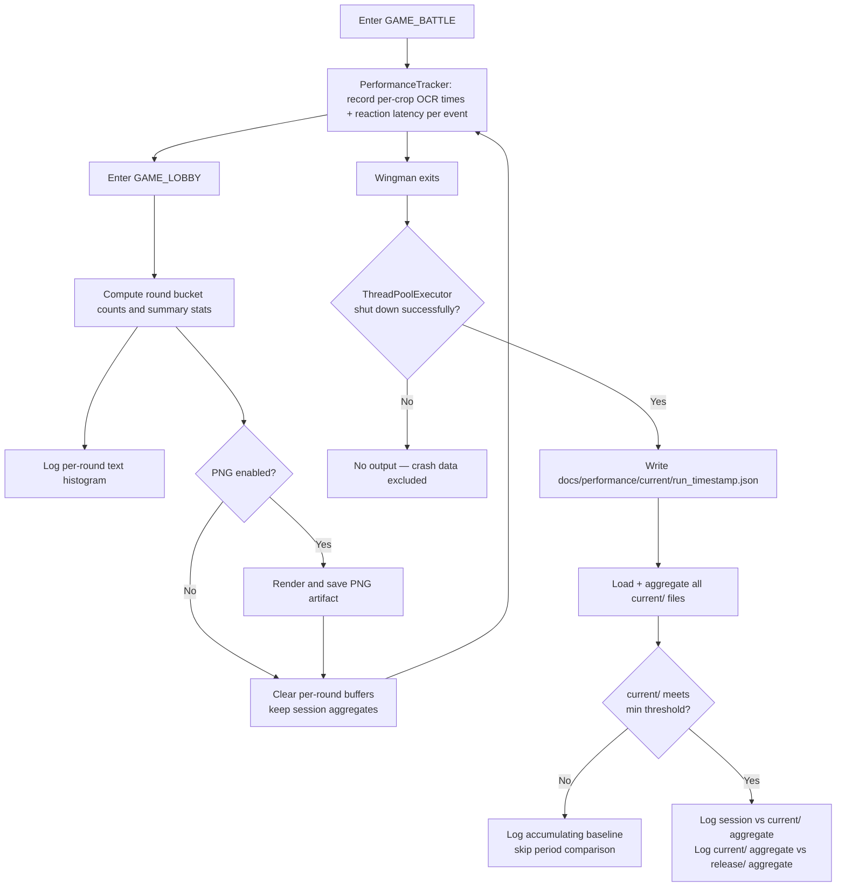

# ADR 031 — Round-End Histogram Reporting on GAME_LOBBY Entry

| Status   | Date       | Wingman Version |
|----------|------------|-----------------|
| Accepted | 2026-05-05 | 1.6.6           |

## Context

The two runtime behaviours that matter most for Wingman's effectiveness are:

1. **Per-crop OCR speed** — how long each individual crop takes to process. The debug log already records five separate timings per cycle (`incoming`, `respawn`, `health`, `ammo_flares`, `ammo_missiles`) but they are never aggregated or compared across runs. A regression in one crop is invisible in the total.
2. **Incoming → flare reaction latency** — time from the incoming missile OCR result being written to `_incoming_cache` to `deploy_flares()` being called. This crosses a thread boundary (background OCR thread sets `incoming_event`; main loop wakes and fires). It is the number that directly affects gameplay outcomes and is currently not measured at all.

Current workflow is manual:
- Parse `wingman.log` after a session.
- Review anomalies after the fact.

There is no mechanism for comparing either metric across versions. A regression introduced between releases is invisible until manually examined.

A single-session comparison against a baseline is also statistically unreliable — OCR timing varies session-to-session due to CPU load, thermal state, and which game states were hit. Reaction latency events number 5–30 per session; p95 from 30 samples is meaningless. The signal only becomes clear when data is **accumulated across many sessions**: 20 sessions × 300 cycles = 6,000 cycles per crop, where a 15% regression is statistically clear rather than noise.

We want per-crop and reaction latency histograms at round end, and an automatic two-level comparison at session exit: (1) this session against the accumulated current-period data, and (2) the current-period aggregate against the last-release baseline.

### Production log excerpts with timing data

The following excerpts are from `wingman.log` on 2026-05-05, showing the per-crop breakdown that already exists in DEBUG output:

```text
2026-05-05 04:21:01,390 [DEBUG] Analyzer: Parallel OCR Timings - Extract: 0.01s, Submit: 0.00s | Respawn OCR: 0.18s | Incoming OCR: 0.22s | Health OCR: 0.19s | Flares OCR: 0.17s | Missiles OCR: 0.17s | Total: 0.20s
2026-05-05 04:21:04,378 [DEBUG] Analyzer: Parallel OCR Timings - Extract: 0.01s, Submit: 0.00s | Respawn OCR: 0.19s | Incoming OCR: 0.24s | Health OCR: 0.20s | Flares OCR: 0.18s | Missiles OCR: 0.18s | Total: 0.19s
2026-05-05 04:21:09,446 [DEBUG] Analyzer: Parallel OCR Timings - Extract: 0.01s, Submit: 0.00s | Respawn OCR: 0.31s | Incoming OCR: 0.68s | Health OCR: 0.29s | Flares OCR: 0.19s | Missiles OCR: 0.18s | Total: 0.72s
```

The third line shows `incoming` as the outlier at 0.68s while other crops remain normal — this pattern is invisible when only the total is tracked.

Representative round boundary transitions:

```text
2026-05-05 04:20:12,963 [INFO] Game state: UNKNOWN -> GAME_LOBBY
2026-05-05 04:20:16,894 [DEBUG] Initiating transition from state GAME_LOBBY to state GAME_WAITING...
2026-05-05 04:20:20,777 [INFO] CANCEL detected (3.0s) - matchmaking confirmed -> GAME_STARTING
```

Session-level measured distribution (same log window):
- OCR total cycles: 3,955
- Per-crop means (estimated): incoming 0.21s, respawn 0.22s, health 0.19s, ammo_flares 0.17s, ammo_missiles 0.17s
- Reaction latency (incoming → flare deploy): not currently measured

## Decision

Implement round-end histogram reporting triggered when Wingman enters `GAME_LOBBY`, using a two-tier output model:

1. Default (always on): compact per-crop OCR timing histograms and reaction latency histogram printed to logs.
2. Optional: PNG histogram generation controlled by config, disabled by default.

Extend the system with a cross-version baseline track:

3. Each clean run appends a summary JSON to `docs/performance/current/`, accumulating across all sessions between releases.
4. `make wrelease` copies all `current/` files into `docs/performance/release/` and commits them as the new baseline.
5. At session exit, emit two comparisons: (a) this session vs the `current/` aggregate, and (b) the `current/` aggregate vs the `release/` aggregate — gated on a minimum sample threshold.

### Why this decision

- Per-crop timing histograms pinpoint which crop regressed rather than reporting a noisy total. One slow `incoming` OCR cycle is actionable; a 5% drift in the total is not.
- Reaction latency is the only metric that directly correlates with gameplay outcomes. It is cheap to measure (one timestamp subtraction per incoming event) and missing from all current instrumentation.
- Health value distribution is removed — it measures game state, not Wingman performance, and adds noise to regression detection.
- Round-end log output gives immediate feedback with near-zero overhead and no external dependencies.
- PNG output is useful for visual analysis and artifacts, but it adds CPU, I/O, and plotting dependency overhead that is unnecessary every round.
- Accumulating across sessions is the only way to make regression detection statistically reliable. A regression is a persistent drift, not a one-session anomaly — the two are only distinguishable with enough data.
- Two comparison levels serve different questions: "was this session an outlier?" (session vs current aggregate) and "has Wingman gotten slower since last release?" (current aggregate vs release aggregate). These are distinct and both useful.
- Gating the period comparison on a minimum threshold (5 sessions or 1,000 cycles per crop) prevents false positives from small samples early in a release cycle.
- Copying (not moving) `current/` on `wrelease` preserves all accumulated run files in place; `release/` is overwritten with a full copy of `current/` at release time.

## Tradeoff Analysis: Log Print vs PNG Generation

### Option A — Histogram as log print (text)

Benefits:
- Very low overhead (simple bucket counting + log lines).
- Works in headless/remote environments.
- No dependency on plotting libraries.
- Easy to grep and compare across rounds.
- Naturally aligned with existing structured logging.

Costs:
- Coarse visualization compared to chart image.
- Harder to inspect long-tail shape at a glance.
- Less suitable for sharing in external docs.

Operational impact:
- Best for per-round automatic reporting.

### Option B — Histogram as PNG generation

Benefits:
- Best visual clarity for distribution shape and tails.
- Easy to attach to performance docs and reviews.
- Supports richer annotations and threshold coloring.

Costs:
- Higher overhead (plot creation + file write each round).
- Additional dependency surface and potential runtime failures.
- Disk churn if written every round.
- Less useful in live terminal-only runs.

Operational impact:
- Best as periodic or on-demand artifact, not default every round.

### Selected hybrid

Adopt Option A as the default per-round mechanism and Option B as opt-in.

## Design

At each transition into `GAME_LOBBY`, emit a round summary with histogram buckets for:
- Per-crop OCR timing: `incoming`, `respawn`, `health`, `ammo_flares`, `ammo_missiles` (one histogram per crop)
- Incoming → flare reaction latency (events where an incoming alert fired and flares were deployed)

A round is bounded by:
- Start: transition into `GAME_BATTLE`
- End/report: next transition into `GAME_LOBBY`



## Cross-version Baseline Design

### Folder structure

```
docs/performance/
  current/                ← gitignored; one file per clean session, accumulates between releases
    run_20260508_091500.json
    run_20260509_143022.json
    run_20260510_200811.json
  release/                ← committed; only updated by wrelease, which copies all of current/ here
    run_20260505_141200.json
    run_20260506_090015.json
    run_20260507_194433.json
```

`current/` is gitignored and accumulates one file per clean session. Files are never deleted by Wingman — they build up across every session played between releases, providing the statistical mass that makes regression detection reliable. `release/` is only ever written by `make wrelease`, which replaces it with a full copy of `current/`. Nothing else writes to `release/`.

### Per-run summary schema

Written **once** to `docs/performance/current/run_{YYYYMMDD_HHMMSS}.json` at clean session termination. Session-level aggregates accumulate in memory across all rounds and are serialised at that single point.

`ocr_crops` contains one entry per crop name. `reaction` covers all incoming → flare events in the session. `max` is included for reaction latency because a single very slow response is operationally significant even if the mean is healthy.

```json
{
  "version": "1.6.6",
  "run_id": "20260510_143022",
  "start_ts": 1747000000.0,
  "end_ts": 1747003600.0,
  "rounds": 8,
  "ocr_crops": {
    "incoming":      {"n": 1200, "mean": 0.21, "p50": 0.19, "p95": 0.42, "p99": 0.61},
    "respawn":       {"n": 1200, "mean": 0.22, "p50": 0.20, "p95": 0.44, "p99": 0.63},
    "health":        {"n": 1200, "mean": 0.19, "p50": 0.17, "p95": 0.38, "p99": 0.57},
    "ammo_flares":   {"n": 1200, "mean": 0.17, "p50": 0.15, "p95": 0.34, "p99": 0.51},
    "ammo_missiles": {"n": 1200, "mean": 0.17, "p50": 0.15, "p95": 0.33, "p99": 0.50}
  },
  "reaction": {
    "n": 14,
    "mean": 0.54,
    "p50": 0.51,
    "p95": 0.89,
    "p99": 1.12,
    "max": 1.23
  }
}
```

### Aggregation and two-level comparison

Two folder aggregates are computed at session exit, after the run file is written:

- **Current aggregate** — all files in `docs/performance/current/` (including the one just written)
- **Release aggregate** — all files in `docs/performance/release/`

**Aggregation rules** (applied identically to both folders):

For each crop in `ocr_crops` and for `reaction`:
- `mean` — weighted mean across files, weight = `n` for that metric. Exact for averages.
- `p50`, `p95`, `p99`, `max` — use values from the **most recently dated** file (by `start_ts`). Percentiles cannot be reconstructed from summary stats without raw data.
- `total_n` — sum of `ocr_crops.incoming.n` across all files (proxy for total cycle count, used in log headers).
- `session_count` — number of files in the folder.
- `version` — from the most recently dated file (used in headers).

**Minimum threshold guard** — before emitting the period comparison (current aggregate vs release aggregate), check:
- `current/` has at least 5 session files, **and**
- `current/` `total_n` (incoming cycles) ≥ 1,000

If the threshold is not met, log one line: `"[PERIOD COMPARISON] accumulating baseline (N={session_count} sessions, {total_n} cycles — need 5 sessions and 1 000 cycles)"` and skip the comparison block. The session vs current-aggregate block is always emitted regardless of threshold (useful even with 1 session).

**Loading** happens once at session exit (not at startup), after the run file is written. There is no need to load at startup since the comparison only fires at exit.

### Comparison log output

Emitted **once at clean session termination** — not per-round. The trigger is a successful `ThreadPoolExecutor` shutdown (the `"ThreadPoolExecutor shut down successfully"` log line in `analyzer.cleanup()`). If the executor does not shut down cleanly (crash, kill signal, etc.) no output is emitted and no run file is written.

Two blocks are emitted in sequence:

**Block 1 — This session vs current-period aggregate** (always emitted after first session):
```
[SESSION vs CURRENT PERIOD | this session: 8 rounds 312 cycles | period: 9 sessions 2 788 cycles]
  crop            this session          period mean    delta
  incoming        mean 0.24s p95 0.49s   0.21s        +14% ↑
  respawn         mean 0.23s p95 0.45s   0.22s        + 5%
  health          mean 0.20s p95 0.39s   0.19s        + 5%
  ammo_flares     mean 0.18s p95 0.35s   0.17s        + 6%
  ammo_missiles   mean 0.17s p95 0.34s   0.17s        + 0%
  reaction        mean 0.58s p95 0.91s   0.54s        + 7%  (7 events this session)
```

**Block 2 — Current-period aggregate vs release baseline** (only when threshold met):
```
[PERIOD vs RELEASE v1.6.5 | current: 9 sessions 2 788 cycles | release: 21 sessions 6 300 cycles]
  crop            current mean   release mean   delta
  incoming          0.21s          0.21s        + 0%  —
  respawn           0.22s          0.22s        + 0%  —
⚠️ health           0.31s          0.19s        +63% ↑  REGRESSION
  ammo_flares       0.17s          0.17s        + 0%  —
  ammo_missiles     0.17s          0.17s        + 0%  —
  reaction          0.54s          0.54s        + 0%  —  (187 events in period)
```

Direction: `↑` = worse (higher time). `⚠️ REGRESSION` fires when any crop mean or reaction mean deviates by more than 20% in the period vs release comparison. Block 1 uses the same threshold but labels it `OUTLIER SESSION` rather than `REGRESSION` — a single outlier session is not a regression.

### `wrelease` integration

Add to the `wrelease` Makefile target, before the git commit:

```makefile
# Copy current runtime summary into release/ baseline (current/ is left untouched)
rm -rf docs/performance/release
mkdir -p docs/performance/release
cp docs/performance/current/run_*.json docs/performance/release/ 2>/dev/null; true
git add docs/performance/release/
```

`current/` is never touched by `wrelease`. Only `release/` is replaced. If no `current/` files exist (e.g. release cut before any run), `release/` is left empty and future runs skip comparison silently.

## Implementation Notes

### Module ownership

Implement as a new `wingman/performance.py` module containing a single `PerformanceTracker` class. Do not embed metric collection in `analyzer.py` or `main.py`.

Wiring:
- `main.py` constructs `PerformanceTracker` at startup, loads the baseline, and passes the instance to `GameStateAnalyzer` and the main loop.
- `analyzer.py` calls `tracker.record_ocr_crop(crop_name, seconds)` from the background OCR thread after each `future.result()` resolves. `respawn` and `incoming` futures are always submitted; `health`, `ammo_flares`, and `ammo_missiles` futures are only submitted when the corresponding crop frame is not `None`. Call `record_ocr_crop()` only when the future was actually submitted — never for futures that were skipped. `crop_name` must match the JSON key exactly: `"incoming"`, `"respawn"`, `"health"`, `"ammo_flares"`, `"ammo_missiles"`.
- `main.py` calls `tracker.record_reaction(time.time() - incoming_ts)` inside `_deploy_flares_on_new_incoming()` immediately after the `incoming_ts > last_incoming_alert_ts` check passes, before spawning the flare burst thread.
- `main.py` calls `tracker.on_enter_game_lobby()` inside the `current_game_state == GameState.GAME_LOBBY` transition block. `on_enter_game_lobby()` uses a buffer-check to determine whether a real round completed: if the per-round OCR buffer is non-empty, it emits the histogram, increments `rounds`, and clears the per-round buffers. If the buffer is empty (e.g. lobby entry at startup, or after GAME_STARTING_STALLED without ever entering GAME_BATTLE), it skips emission silently. No separate `on_enter_game_battle()` hook is needed — the buffer populates naturally from `record_ocr_crop()` calls during GAME_BATTLE and GAME_BATTLE_MANUAL.
- `analyzer.cleanup()` calls `tracker.on_session_end()` after the executor shuts down successfully (gated on the `"ThreadPoolExecutor shut down successfully"` path). `GameStateAnalyzer.__init__` must accept an optional `tracker: PerformanceTracker | None` parameter (default `None`) and store it as `self._tracker`. All `tracker.*` calls in `analyzer.py` are guarded with `if self._tracker:`.

`PerformanceTracker` owns all buffers, locks, file I/O, and baseline state. Nothing outside it accesses the raw buffers.

### Thread safety

`record_ocr_crop()` is called from background OCR threads. `record_reaction()` and `on_enter_game_lobby()` are called from the main thread. A single `threading.Lock` guards all per-round and session-level buffers.

Pattern for all mutations and reads:

```python
with self._lock:
    snapshot = list(self._round_crops["incoming"])  # copy under lock
# compute stats outside the lock
stats = _compute_stats(snapshot)
```

`on_session_end()` is called only from the main thread after all background threads have exited (post-executor-shutdown), so it acquires the lock once for the final snapshot and does not need to hold it during file I/O.

### Data capture

Collect lightweight in-memory metrics during `GAME_BATTLE`:
- Per-crop OCR time (float seconds) — one value per crop per background OCR cycle, for all five crops
- Reaction latency (float seconds) — one value per incoming missile event where flares are deployed; measured as `time.time() - incoming_cache_timestamp` at the moment the flare burst is triggered

Do not parse the log file at runtime. Do not collect health values — they measure game state, not Wingman performance.

Accumulate session-level aggregates (all rounds) in parallel with per-round buffers. Session aggregates feed the per-run JSON file.

### Reporting trigger

On enter `GAME_LOBBY`:
- If round metrics exist, compute bucket counts and summary stats.
- Emit a compact multiline INFO block.
- If PNG mode enabled, render one figure for that round.
- Clear per-round buffers after reporting. Do **not** clear session-level aggregates — they accumulate until the process exits.

On clean session termination (after `ThreadPoolExecutor` shuts down successfully):
1. Write the per-run JSON file to `docs/performance/current/`.
2. Aggregate all files in `current/` (including the one just written).
3. Emit Block 1: this session vs current-period aggregate.
4. Check minimum threshold. If not met, log the accumulating message and stop.
5. Aggregate all files in `release/`. Emit Block 2: current-period aggregate vs release aggregate.

If the executor does not shut down cleanly, none of steps 1–5 occur. This intentionally excludes crash data from the baseline.

### Per-run file lifecycle

- Written **once per clean session**, after the `ThreadPoolExecutor` shuts down successfully. A run that ends via crash, kill signal, or executor failure produces no file — crash data is excluded from the baseline.
- Path: `docs/performance/current/run_{YYYYMMDD_HHMMSS}.json` where the timestamp is session start time. Each session produces a new uniquely-named file. Files accumulate indefinitely — Wingman never deletes them. Only `make wrelease` replaces `release/`; nothing clears `current/` automatically.
- If `docs/performance/current/` does not exist, create it at write time. If creation fails, log a warning and continue — do not raise.

### Suggested config keys

Add to config:
- `performance.round_histogram.enabled: true`
- `performance.round_histogram.png_enabled: false`
- `performance.round_histogram.png_every_n_rounds: 0` (0 = disabled)
- `performance.round_histogram.output_dir: docs/performance`
- `performance.regression.min_sessions: 5` (minimum `current/` session files before period comparison fires)
- `performance.regression.min_cycles: 1000` (minimum `current/` incoming OCR cycles before period comparison fires)
- `performance.regression.threshold_pct: 20` (percent deviation that triggers `⚠️ REGRESSION` / `⚠️ OUTLIER SESSION`)

### Suggested text buckets

Per-crop OCR buckets (each crop reported separately):
- `<0.10s`
- `0.10-0.24s`
- `0.25-0.49s`
- `>=0.50s`

Reaction latency buckets:
- `<0.25s`  (sub-quarter-second — flare before missile arrives)
- `0.25-0.49s`  (acceptable)
- `0.50-0.99s`  (slow — missile likely close)
- `>=1.00s`  (very slow — missile may have hit)

Round-end log format (one block per round):

```
[ROUND 4 — OCR crop timings | 312 cycles]
  crop          <0.10s  0.10-0.24s  0.25-0.49s  >=0.50s   mean    p95
  incoming        12%      68%        16%          4%      0.21s  0.42s
  respawn          6%      72%        18%          4%      0.22s  0.44s
  health          15%      65%        17%          8%      0.19s  0.38s
  ammo_flares     18%      69%        11%          2%      0.17s  0.34s
  ammo_missiles   19%      70%        10%          1%      0.17s  0.33s

[ROUND 4 — Reaction latency | 3 events]
  <0.25s  ██████ 33%    0.25-0.49s  ████████████ 67%    0.50-0.99s  0%    >=1.00s  0%
  mean 0.38s   max 0.48s
```

## Consequences

Positive:
- Per-crop histograms identify exactly which crop regressed, not just that something got slower.
- Reaction latency is the first direct measurement of Wingman's in-game effectiveness — not testable offline.
- Accumulation across sessions gives the statistical mass needed for reliable regression detection (6,000+ cycles per crop across 20 sessions vs 300 per single session).
- Two comparison levels cleanly separate "was this session an outlier?" from "has the system drifted since last release?" — these are different questions and previously unanswerable.
- Minimum threshold guard prevents false positives from small samples early in a release cycle.
- Per-round visibility catches gross anomalies within a session before enough data accumulates for the period comparison.

Negative / Risks:
- `current/` grows indefinitely between releases. After a long release cycle, it may contain many files. Aggregation at session exit reads all of them — typically fast (JSON reads of small files) but unbounded.
- Regression detection is not available until the minimum threshold is met (5 sessions). First few sessions after a release only get Block 1.
- Reaction latency N remains small per round (0–5 events); per-round histogram is for awareness only. Statistical weight only accumulates at the period level.
- Optional PNG generation may impact slower systems if enabled too frequently.

Mitigations:
- Keep PNG disabled by default.
- Aggregation reads are lightweight (small JSON files); no mitigation needed unless `current/` exceeds ~500 files, which would require years of daily use.
- Document that the period comparison is the regression signal; per-round reaction histogram is observational.
- Include session and cycle counts in all log headers so the reader always knows the statistical weight behind each number.

## Alternatives Considered

1. PNG only, no text histogram.
- Rejected: too expensive and unnecessary for per-round default telemetry.

2. Text only, no PNG capability.
- Rejected: removes useful artifact path for deep-dive analysis and documentation.

3. End-of-session reporting only.
- Rejected: detection is delayed; misses round-level regressions in real time.

4. Single-session comparison against release baseline.
- Rejected: session-to-session variance from CPU load, thermal state, and game-state mix makes single-session comparisons unreliable. A 15% drift in one session is indistinguishable from environmental noise. Accumulation is required for the comparison to be meaningful.

## Rollout Plan

1. Implement `wingman/performance.py` with `PerformanceTracker`: per-crop buffers, reaction latency buffer, lock, round-end histogram log (buffer-check approach in `on_enter_game_lobby()`), session-end JSON write, folder aggregation, two-level comparison output.
2. Add optional `tracker: PerformanceTracker | None = None` parameter to `GameStateAnalyzer.__init__`; store as `self._tracker`. Guard all tracker calls in `analyzer.py` with `if self._tracker:`.
3. Wire `record_ocr_crop()` calls into `_run_ocr_in_background()` in `analyzer.py`: call immediately after each `future.result()` resolves, but only for futures that were actually submitted (`respawn` and `incoming` always; `health`, `ammo_flares`, `ammo_missiles` only when their future is not `None`).
4. Wire `record_reaction()` call into `_deploy_flares_on_new_incoming()` in `main.py`.
5. Wire `on_enter_game_lobby()` into the GAME_LOBBY transition block in `main.py`.
6. Wire `on_session_end()` into `analyzer.cleanup()` after `logger.info("ThreadPoolExecutor shut down successfully")`.
7. Implement folder aggregation: weighted-by-n means across all JSON files in a folder; most-recent-file percentiles.
8. Implement minimum threshold guard; log accumulating message when not met.
9. Add Block 1 (session vs current aggregate) and Block 2 (current aggregate vs release aggregate) log output.
10. Gate PNG rendering behind config and default it to off.
11. Add `wrelease` Makefile additions to copy `current/` to `release/`.
12. Add `docs/performance/current/` to `.gitignore`; confirm `docs/performance/release/` is tracked.
13. Run end-to-end validation:
    - Single run → verify round histograms appear, JSON written, Block 1 shows, Block 2 skipped (accumulating).
    - Five runs → verify Block 2 appears with period vs release comparison.
    - `wrelease` → verify `release/` updated, `current/` untouched.
    - One more run → verify Block 2 compares against new release baseline.

## References

- `wingman.log` (2026-05-05 runtime sample)
- `docs/performance/wingman-performance-histogram.png`
- `docs/adr/029-game-lobby-quick-scan-thread.md`
- `docs/adr/030-health-ceiling-from-repeated-readings.md`
- `docs/job-aids/008-performance-regression-workflow.md` — end-user workflow for accumulating data and interpreting output
