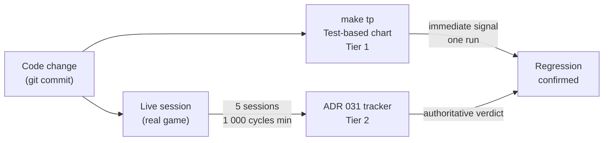

# ADR 034 — Two-Tier Performance Regression Detection

| Status   | Date       | Wingman Version |
|----------|------------|-----------------|
| Accepted | 2026-05-11 | 1.6.7           |

## Context

Wingman has two independent performance tracking systems, each added at different points in the project's history:

1. **Test-based chart** — `tests/performance_tracking.py` extracts `performance.json` from git history and renders a Plotly HTML chart of test execution times across versions (`make tp` / `make wrelease`).
2. **Runtime tracker** — `wingman/performance.py` (ADR 031) records per-crop OCR timing and reaction latency during live sessions, emits round-end histograms to the log, and compares the current session against an accumulated baseline at exit.

When ADR 031 was introduced, the question arose whether the test-based chart was still needed. The two systems were compared and found to answer different questions on different time scales. This ADR records the decision to keep both and documents why each is necessary.

---

## Decision

Keep both systems. They are complementary, not redundant. They detect different kinds of regression at different points in the development cycle.

---

## The Two-Tier Model

### Tier 1 — Test-based chart (fast feedback)

| Property | Value |
|----------|-------|
| Trigger | `make tp` after any commit |
| Data source | Static test images, EasyOCR on developer machine |
| Latency to signal | Minutes (one test run) |
| Sessions required | 0 |
| Regression threshold | Visual / eyeball |
| Best at detecting | Large regressions (2×+) in specific crop regions |
| Noise level | High for slow tests (model init dominates); low for l4 crop tests |

The most informative tests for regression detection are the `test_level4_*` crop-specific tests. They run after model warmup and exercise specific named crop regions, so their times reflect crop processing time more than initialization overhead. The slow tests (`test_level1`, `test_respawn_detection_positive/negative`) are dominated by EasyOCR model initialization variance and are better treated as correctness tests than performance benchmarks.

### Tier 2 — Runtime tracker (authoritative verdict)

| Property | Value |
|----------|-------|
| Trigger | Automatic — fires during every live session |
| Data source | Real game frames, production OCR pipeline |
| Latency to signal | 5 sessions + 1,000 cycles minimum before comparison activates |
| Sessions required | 5 (accumulation period) |
| Regression threshold | 20% above period mean (configurable) |
| Best at detecting | Subtle regressions (20–30%) in real production conditions |
| Noise level | Low — large sample, real workload, statistical baseline |

The ADR 031 tracker is the authoritative source for whether OCR performance has regressed in production. It cannot give a same-day answer after a code change — the accumulation requirement exists to prevent false positives from machine-load variance.

---

## Why Tier 1 Cannot Be Dropped

ADR 031 requires extended run time before it can confirm a regression. A code change that degrades a specific crop by 3× will not trigger the 20% threshold in a single session, and the developer may not run 5 full sessions before the next release.

The test-based chart provides an immediate signal — it can flag a potential regression in the time it takes to run `make tp`. If the `test_level4_region33_contains_lick_to_c` time doubles after a commit, that is a strong enough signal to warrant investigation before the change ships, even without ADR 031 confirmation.

The two systems together form a detection ladder: Tier 1 trips first (cheap, fast, noisy), and Tier 2 confirms (expensive, slow, accurate). Removing Tier 1 would leave a blind spot between a code change and the next release baseline.

## Why Tier 2 Cannot Be Replaced by Tier 1

The test-based chart measures OCR performance on static images under controlled conditions. It cannot measure:

- Real game frame capture latency
- Thread pool contention under live parallel load
- Reaction latency (incoming detection → flare deploy)
- Variance caused by game state transitions interrupting the OCR loop

These only appear in production data. ADR 031 captures them; the test chart cannot.

---

## What Each System Should Be Used For

| Question | Use |
|----------|-----|
| Did this commit break a crop region? | Tier 1 — `make tp`, check l4 tests |
| Is OCR slower than it was last release? | Tier 2 — check session exit comparison |
| Did reaction latency regress? | Tier 2 only — not measurable in tests |
| Is the test correct (produces right answer)? | Tier 1 — pass/fail, not timing |
| Is the machine currently slow? | Both will flag it; Tier 2 labels it ⚠️ OUTLIER SESSION |

---

## References

- [ADR 031 — Round-End Histogram Reporting](031-round-end-histogram-reporting.md)
- [Job Aid 005 — Updating the Performance Chart](../job-aids/005-update-performance-chart.md)
- [Job Aid 008 — Performance Regression Workflow](../job-aids/008-performance-regression-workflow.md)
- [Performance Doc 007 — v1.6.6 Per-Crop OCR Tracking](../performance/007-performance-wingman-1.6.6-per-crop-ocr-tracking.md)
