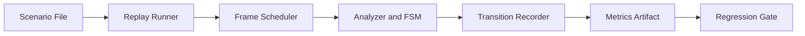

# ADR 037 - Timed Screenshot Replay Integration Testing

| Status   | Date       | Wingman Version |
|----------|------------|-----------------|
| Draft | 2026-05-24 | 1.6.9           |

## Context

Current tests cover unit behavior and selected static screenshot checks, but there is no
single deterministic integration harness that replays a full game-flow timeline and
measures end-to-end response timing for OCR-driven transitions.

Recent incidents showed that state transitions can fail or stall when signal windows are
brief. We need a repeatable way to detect this class of regressions before runtime use.

## Decision

Adopt a timed screenshot replay integration harness that feeds ordered frames at defined
intervals and validates both:

- FSM transition sequence correctness
- Transition response-time budgets

This harness will run in CI as a deterministic regression gate and will emit artifacts
compatible with the existing performance tracking workflow.

## Scope

In scope:

- Scenario format with ordered screenshot frames and per-frame timestamps
- Replay runner that drives the `main.py` orchestration path without live capture
- Assertions for expected transition sequence and timeout windows
- Per-run metrics artifact for transition latency statistics

Out of scope for this ADR:

- Replacing existing live-capture smoke tests
- Full game simulation beyond OCR/state-transition paths
- UI automation outside the Wingman analyzer/controller loop

## Scenario Model

The top-level replay object is one path.

Copilot will scan the current Wingman implementation and determine two high-value paths
to start with, for example `PATH1` and `PATH2`.

Each path is represented as a dictionary-like mapping in the form:

- `PATH1 = {(SCREENSHOTNAME, TIME_TO_INJECT), ...}`

Where:

- `SCREENSHOTNAME` is the exact screenshot filename, for example `CANCEL.png`
- `TIME_TO_INJECT` is the total number of seconds after replay start when the screenshot
  is injected into the test

An implementation may also attach optional per-step expectation fields alongside each
tuple-derived replay step:

- `expected_state`
- `expected_trigger`
- `max_settle_time_s`

All replay screenshots must come from `test_screenshots/integration_test`, and the test
must use the exact filename as the injection selector. For example, `CANCEL.png` is used
when the replay needs to inject the `CANCEL` state from `GAME_LOBBY` onto the screen.

The implementation must also create a dictionary of required screenshots for each path.
If any required screenshots are missing at implementation time, those screenshots will be
captured after ADR 037 is implemented and then added to the replay fixture set.

Paths may model different gameplay sequences. For example:

- `PATH1` may be a simple sequence with no missile incoming injection
- `PATH2` may be an alternate sequence that includes missile incoming injection events

The chosen path must determine which event sequence is injected for that run, so the same
scenario can replay a simple lane or a more complex combat lane without changing the test
fixture layout.

Injected frames persist until replaced by the next scheduled screenshot in the path.

The first implementation should replay through the `main.py` execution path so timing,
FSM transitions, controller interactions, and OCR scheduling behave as closely as possible
to a real run, with live capture replaced by scheduled screenshots.

All fixtures must be loaded from `test_screenshots/integration_test`.

Example shape:

```yaml
PATH1 = {
  (LOBBY_PLAY_VISIBLE.png, 0.0),
  (WAITING_CANCEL_VISIBLE.png, 1.2),
  (BATTLE_HUD.png, 3.5)
}

PATH2 = {
  (LOBBY_PLAY_VISIBLE.png, 0.0),
  (WAITING_CANCEL_VISIBLE.png, 1.0),
  (MISSILE_INCOMING.png, 2.2),
  (BATTLE_HUD.png, 4.0)
}
```

## Phased Rollout

1. Phase 1: Single happy-path scenario and metrics plumbing.
2. Phase 2: Add negative and edge scenarios (brief CANCEL window, delayed GOOD LUCK).
3. Phase 3: Add CI thresholds for p95 transition latency and transition completeness.
4. Phase 4: Expand scenario catalog for mission restart and GAME_END click-through paths.

## Metrics and Regression Gates

Record at least:

- Event-to-transition latency per trigger
- Scenario completion time
- Transition success ratio

Initial regression policy:

- Fail a path when any required `expected_state` or `expected_trigger` is missed.
- Fail a path when required transitions occur out of order.
- Fail a path when a required transition exceeds its declared `max_settle_time_s`.
- Warn when latency degrades beyond configured threshold until enough baseline data exists.
- Promote warning to fail once minimum-session baseline criteria are met.

Path pass/fail is evaluated per selected path, not only at the suite level.

## Architecture



## Consequences

Positive:

- Deterministic integration coverage for OCR plus FSM transitions
- Earlier detection of timing and sequencing regressions
- Comparable release-over-release transition performance data

Trade-offs:

- New test fixtures and scenario maintenance overhead
- Additional CI runtime for replay scenarios
- Threshold tuning required to avoid flaky latency failures

## Alternatives Considered

1. Keep current unit and static screenshot tests only.
   - Rejected because transition timing regressions can still escape.

2. Rely on manual runtime validation and log inspection.
   - Rejected due to low repeatability and slower feedback.

3. Build a full UI automation rig with live emulator control only.
   - Rejected as first step due to complexity and nondeterminism.

## References

- ADR 013 - Automated test architecture
- ADR 015 - Game state machine
- ADR 029 - GAME_LOBBY quick-scan thread
- ADR 034 - Two-tier performance regression detection
- ADR 035 - Runtime performance release trend chart
