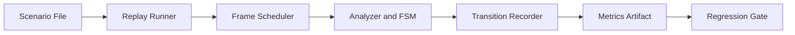

# ADR 037 - Timed Screenshot Replay Integration Testing

| Status   | Date       | Wingman Version |
|----------|------------|-----------------|
| Accepted | 2026-06-02 | 1.6.15          |

## Context

Current tests cover unit behavior and selected static screenshot checks, but there is no
single deterministic integration harness that replays a full game-flow timeline and
measures end-to-end response timing for OCR-driven transitions.

With ADR 042, runtime startup now begins in `GAME_UNKNOWN` and classifies into a known
state before normal flow continues. Replay fixtures and path assertions must remain
compatible with this startup model so replay and live capture do not diverge in expected
state sequencing.

Recent incidents showed that state transitions can fail or stall when signal windows are
brief. We need a repeatable way to detect this class of regressions before runtime use.

## Decision

Adopt a timed screenshot replay integration harness that feeds ordered frames at defined
intervals and validates both:

- FSM transition sequence correctness
- Transition response-time budgets

This harness will run in CI as a deterministic regression gate and will emit artifacts
compatible with the existing performance tracking workflow.

The replay schedule remains anchored to known gameplay states (`GAME_LOBBY`,
`GAME_WAITING`, `GAME_STARTING`, `GAME_BATTLE`, `GAME_END_B`) and does not require
fixture steps for `GAME_UNKNOWN`. Unknown-state startup classification is validated by
ADR 042 tests, then replay assertions begin from the first known-state step.

## Scope

In scope:

- Scenario format with ordered screenshot frames and per-frame timestamps
- Replay runner that drives the `main.py` orchestration path without live capture
- Replay-mode input virtualization: keyboard and mouse outputs are stubbed at the OS
  boundary and recorded as action intents
- Assertions for expected transition sequence and timeout windows
- Per-run metrics artifact for transition latency statistics
- Compatibility with `GAME_UNKNOWN` startup classification by treating replay assertions
  as post-classification checks on known states.

Out of scope for this ADR:

- Replacing existing live-capture smoke tests
- Full game simulation beyond OCR/state-transition paths
- UI automation outside the Wingman analyzer/controller loop

## Scenario Model

The top-level replay object is one path.

Initial path selection is grounded in observed production behavior from
`wingman.log` (2026-05-25 session), using two recurring high-value sequences:

- Path 1: standard lobby to battle flow, missile depletion, respawn handling, and
  automatic mission restart
- Path 2: missile depletion plus manual takeover, respawn recovery back to
  `GAME_BATTLE`, and automatic restart

Each path is represented as a YAML step list under a path key, for example:

- `PATH1: [ {screenshot_name, injection_time_s, ...}, ... ]`

Where:

- `screenshot_name` is the exact screenshot filename, for example `P1_010_WAITING_CANCEL_VISIBLE.png`
- `injection_time_s` is the total number of seconds after replay start when the screenshot
  is injected into replay

An implementation may also attach optional per-step expectation fields alongside each
replay step:

- `expected_state`
- `expected_trigger`
- `max_settle_time_s`
- `inject_trigger`

All replay screenshots must come from `test_screenshots/integration_test`, and the test
must use the exact filename as the injection selector. For example, `CANCEL.png` is used
when the replay needs to inject the `CANCEL` state from `GAME_LOBBY` onto the screen.

The implementation must also create a dictionary of required screenshots for each path.
If any required screenshots are missing at implementation time, those screenshots will be
captured after ADR 037 is implemented and then added to the replay fixture set.

Paths model different gameplay sequences and are chosen per replay run.

Fixture sourcing contract:

- PATH definitions are derived from observed production/runtime behavior in
  `wingman.log` and kept as the replay source-of-truth contract.
- Screenshots for those paths are collected via ADR 041 capture workflow (for
  example `make newpaths CAPTURE_PATH=PATH1`) while Wingman runs naturally.
- Capture may occur out of order; replay remains deterministic because this ADR
  enforces strict ordering and timing at test execution time.

### Grounded Initial Paths (from wingman.log)

The first implementation MUST ship with the following two paths and expected
checkpoints.

Observed log anchors used to derive these paths include:

- `GAME_LOBBY -> GAME_WAITING -> GAME_STARTING -> GAME_BATTLE`
- `MISSILES EMPTY - cancelling mission and ejecting`
- `GAME_BATTLE -> GAME_BATTLE_MANUAL` (manual takeover path)
- `RESPAWN DETECTED - Cancelling active missions`
- `HEALTH ALIVE - restarting mission immediately`
- `Controller: restarting last mission (J20)`
- `GAME_BATTLE -> GAME_END_B -> GAME_LOBBY`

Relative replay times are intentionally compressed from wall-clock logs while
preserving event order and critical dwell windows (for example keeping respawn
visible long enough to cross the alive-false threshold).

Required screenshot schedule:

```yaml
PATH1:
  - screenshot_name: P1_000_LOBBY_PLAY.png
    injection_time_s: 0.0
  - screenshot_name: P1_010_WAITING_CANCEL_VISIBLE.png
    injection_time_s: 1.2
    expected_state: GAME_WAITING
    expected_trigger: cancel_detected
    max_settle_time_s: 2.0
  - screenshot_name: P1_020_GOOD_LUCK_VISIBLE.png
    injection_time_s: 4.5
    expected_state: GAME_STARTING
    expected_trigger: good_luck_detected
    max_settle_time_s: 4.0
  - screenshot_name: P1_030_BATTLE_HUD_MISSILES_4.png
    injection_time_s: 6.0
    expected_state: GAME_BATTLE
    expected_trigger: battle_started
    max_settle_time_s: 3.0
  - screenshot_name: P1_040_BATTLE_HUD_MISSILES_0_HEALTH_ALIVE.png
    injection_time_s: 8.5
    expected_state: GAME_BATTLE
    expected_trigger: missiles_empty
    max_settle_time_s: 2.0
  - screenshot_name: P1_050_RESPAWN_VISIBLE_NO_HEALTH.png
    injection_time_s: 12.5
    expected_state: GAME_BATTLE
    expected_trigger: respawn_detected
    max_settle_time_s: 3.0
  - screenshot_name: P1_060_BATTLE_HUD_HEALTH_ALIVE_MISSILES_4.png
    injection_time_s: 16.8
    expected_state: GAME_BATTLE
    expected_trigger: restart_last_mission
    max_settle_time_s: 3.0
  - screenshot_name: P1_070_CLICK_TO_CONTINUE.png
    injection_time_s: 20.5
    expected_state: GAME_END_B
    expected_trigger: click_to_detected
    max_settle_time_s: 3.0
    inject_trigger: click_to_detected
  - screenshot_name: P1_080_LOBBY_AFTER_MISSION.png
    injection_time_s: 23.5
    expected_state: GAME_LOBBY
    expected_trigger: continue_clicked
    max_settle_time_s: 3.0
    inject_trigger: continue_clicked

PATH2:
  - screenshot_name: P2_000_BATTLE_HUD_MISSILES_4.png
    injection_time_s: 0.0
    inject_trigger: manual_force_battle
  - screenshot_name: P2_010_BATTLE_HUD_MISSILES_0.png
    injection_time_s: 1.6
    expected_state: GAME_BATTLE
    expected_trigger: missiles_empty
    max_settle_time_s: 2.0
  - screenshot_name: P2_020_MANUAL_TAKEOVER_MOMENT.png
    injection_time_s: 1.9
    expected_state: GAME_BATTLE
    expected_trigger: manual_mode
    max_settle_time_s: 1.5
    inject_trigger: manual_takeover
  - screenshot_name: P2_030_GAME_BATTLE_MANUAL_HUD.png
    injection_time_s: 2.3
    expected_state: GAME_BATTLE_MANUAL
    expected_trigger: manual_mode_entered
    max_settle_time_s: 2.0
  - screenshot_name: P2_040_RESPAWN_VISIBLE_NO_HEALTH.png
    injection_time_s: 6.2
    expected_state: GAME_BATTLE_MANUAL
    expected_trigger: respawn_detected
    max_settle_time_s: 3.0
  - screenshot_name: P2_050_RESPAWN_CLEAR_HEALTH_ALIVE_MISSILES_4.png
    injection_time_s: 10.1
    expected_state: GAME_BATTLE
    expected_trigger: restart_last_mission
    max_settle_time_s: 3.0
  - screenshot_name: P2_060_CLICK_TO_CONTINUE.png
    injection_time_s: 13.5
    expected_state: GAME_END_B
    expected_trigger: click_to_detected
    max_settle_time_s: 3.0
    inject_trigger: click_to_detected
  - screenshot_name: P2_070_LOBBY_AFTER_MISSION.png
    injection_time_s: 16.5
    expected_state: GAME_LOBBY
    expected_trigger: continue_clicked
    max_settle_time_s: 3.0
    inject_trigger: continue_clicked
```

Expected checkpoints for `PATH1`:

- `P1_010_WAITING_CANCEL_VISIBLE.png`: `expected_state=GAME_WAITING`,
  `expected_trigger=cancel_detected`, `max_settle_time_s=2.0`
- `P1_020_GOOD_LUCK_VISIBLE.png`: `expected_state=GAME_STARTING`,
  `expected_trigger=good_luck_detected`, `max_settle_time_s=4.0`
- `P1_030_BATTLE_HUD_MISSILES_4.png`: `expected_state=GAME_BATTLE`,
  `expected_trigger=battle_started`, `max_settle_time_s=3.0`
- `P1_040_BATTLE_HUD_MISSILES_0_HEALTH_ALIVE.png`: `expected_state=GAME_BATTLE`,
  `expected_trigger=missiles_empty`, `max_settle_time_s=2.0`
- `P1_050_RESPAWN_VISIBLE_NO_HEALTH.png`: `expected_state=GAME_BATTLE`,
  `expected_trigger=respawn_detected`, `max_settle_time_s=3.0`
- `P1_060_BATTLE_HUD_HEALTH_ALIVE_MISSILES_4.png`: `expected_state=GAME_BATTLE`,
  `expected_trigger=restart_last_mission`, `max_settle_time_s=3.0`
- `P1_070_CLICK_TO_CONTINUE.png`: `expected_state=GAME_END_B`,
  `expected_trigger=click_to_detected`, `max_settle_time_s=3.0`,
  `inject_trigger=click_to_detected`
- `P1_080_LOBBY_AFTER_MISSION.png`: `expected_state=GAME_LOBBY`,
  `expected_trigger=continue_clicked`, `max_settle_time_s=3.0`,
  `inject_trigger=continue_clicked`

Expected checkpoints for `PATH2`:

- `P2_010_BATTLE_HUD_MISSILES_0.png`: `expected_state=GAME_BATTLE`,
  `expected_trigger=missiles_empty`, `max_settle_time_s=2.0`
- `P2_020_MANUAL_TAKEOVER_MOMENT.png`: `expected_state=GAME_BATTLE`,
  `expected_trigger=manual_mode`, `max_settle_time_s=1.5`,
  `inject_trigger=manual_takeover`
- `P2_030_GAME_BATTLE_MANUAL_HUD.png`: `expected_state=GAME_BATTLE_MANUAL`,
  `expected_trigger=manual_mode_entered`, `max_settle_time_s=2.0`
- `P2_040_RESPAWN_VISIBLE_NO_HEALTH.png`: `expected_state=GAME_BATTLE_MANUAL`,
  `expected_trigger=respawn_detected`, `max_settle_time_s=3.0`
- `P2_050_RESPAWN_CLEAR_HEALTH_ALIVE_MISSILES_4.png`: `expected_state=GAME_BATTLE`,
  `expected_trigger=restart_last_mission`, `max_settle_time_s=3.0`
- `P2_060_CLICK_TO_CONTINUE.png`: `expected_state=GAME_END_B`,
  `expected_trigger=click_to_detected`, `max_settle_time_s=3.0`,
  `inject_trigger=click_to_detected`
- `P2_070_LOBBY_AFTER_MISSION.png`: `expected_state=GAME_LOBBY`,
  `expected_trigger=continue_clicked`, `max_settle_time_s=3.0`,
  `inject_trigger=continue_clicked`

Pass/fail additions for these grounded paths:

- `PATH1` fails if `restart_last_mission` is not observed after respawn clears.
- `PATH2` fails if `GAME_BATTLE_MANUAL` is not entered before respawn recovery.
- `PATH2` fails if recovery does not return to `GAME_BATTLE` before restart.
- Any path fails if `GAME_END_B -> GAME_LOBBY` click-through is not observed.

Resolved findings from review iterations:

- Removed PATH1 `EJECT_DIVE` step to avoid overlap with PATH2 manual-takeover lane.
- Added explicit full-cycle coverage through `GAME_END_B` and back to `GAME_LOBBY`.
- Added `inject_trigger` support for replay steps to seed/force deterministic transitions
  (`manual_force_battle`, `manual_takeover`, `click_to_detected`, `continue_clicked`).
- Added replay assertion event emission for `respawn_detected` in main loop respawn path.

The chosen path must determine which event sequence is injected for that run, so the same
scenario can replay a simple lane or a more complex combat lane without changing the test
fixture layout.

Injected frames persist until replaced by the next scheduled screenshot in the path.

The first implementation should replay through the `main.py` execution path so timing,
FSM transitions, controller interactions, and OCR scheduling behave as closely as possible
to a real run, with live capture replaced by scheduled screenshots.

In replay mode, controller output actions must not be sent to the operating system.
Instead, actions such as key presses and mouse clicks must be simulated and recorded as
verifiable intent events. This preserves orchestration realism while preventing real
desktop input side effects during test execution.

All fixtures must be loaded from `test_screenshots/integration_test`.

## Analyzer Fidelity Requirement

Replay paths fall into two fidelity tiers and the distinction is critical:

**Wiring tier (SMOKE_PATH)** — uses a fake analyzer that transitions state on tick
count, ignoring screenshot content entirely. This validates that `main.py` orchestration,
replay infrastructure, and assertion plumbing are wired correctly. It cannot detect OCR
or vision regressions because it never reads the frames.

**OCR regression tier (PATH1, PATH2)** — must use the real `GameStateAnalyzer` with
real curated screenshots. The analyzer reads each injected frame through the full OCR and
template-matching pipeline and drives FSM transitions from actual pixel content. Only
this tier can catch regressions such as a RESPAWN screen no longer triggering
`respawn_detected`, a crop coordinate drift, or an OCR threshold change.

Required implementation rule: PATH1 and PATH2 tests must not monkeypatch
`GameStateAnalyzer`. The real analyzer must receive each injected frame and drive all
state transitions. Assertions then verify that the correct trigger and state are reached
within `max_settle_time_s` of the injection time.

The wiring tier (SMOKE_PATH) may retain a fake analyzer for speed and to avoid GPU
dependencies in CI. The OCR regression tier requires EasyOCR and curated screenshots and
may run in a separate, slower CI job.

## Relationship to Live Capture and Unknown Startup

- ADR 041 is the source of truth for live `CAPTURE_PATH` generation.
- ADR 042 is the source of truth for startup classification from `GAME_UNKNOWN`.
- ADR 037 consumes fixtures produced by ADR 041 and validates post-classification runtime
  transitions in deterministic replay.

Cross-ADR contract:

- Live capture may start from any current screen and resume after crash/restart.
- Live capture may collect required screenshots out of sequence during natural runs.
- Replay assertions remain deterministic because they evaluate known-state transitions,
  not unknown-state detection confidence.

## Phased Rollout

1. Phase 1: Single happy-path scenario and metrics plumbing.
2. Phase 2: Add negative and edge scenarios (brief CANCEL window, delayed GOOD LUCK).
3. Phase 3: Add CI thresholds for p95 transition latency and transition completeness.
4. Phase 4: Expand scenario catalog for mission restart and GAME_END click-through paths.

## Metrics and Regression Gates

Record at least:

- Event-to-transition latency per trigger
- Scenario completion time
- Transition success ratio
- Controller action-intent trace (for example PLAY-click intent, key-press intent,
  flare-deploy intent)

Initial regression policy:

- Fail a path when any required `expected_state` or `expected_trigger` is missed.
- Fail a path when required transitions occur out of order.
- Fail a path when a required transition exceeds its declared `max_settle_time_s`.
- Warn when latency degrades beyond configured threshold until enough baseline data exists.
- Promote warning to fail once minimum-session baseline criteria are met.

Path pass/fail is evaluated per selected path, not only at the suite level.

## Architecture



## Consequences

Positive:

- Deterministic integration coverage for OCR plus FSM transitions
- Earlier detection of timing and sequencing regressions
- Comparable release-over-release transition performance data

Trade-offs:

- New test fixtures and scenario maintenance overhead
- Additional CI runtime for replay scenarios
- Threshold tuning required to avoid flaky latency failures

## Alternatives Considered

1. Keep current unit and static screenshot tests only.
   - Rejected because transition timing regressions can still escape.

2. Rely on manual runtime validation and log inspection.
   - Rejected due to low repeatability and slower feedback.

3. Build a full UI automation rig with live emulator control only.
   - Rejected as first step due to complexity and nondeterminism.

## References

- ADR 013 - Automated test architecture
- ADR 015 - Game state machine
- ADR 029 - GAME_LOBBY quick-scan thread
- ADR 034 - Two-tier performance regression detection
- ADR 035 - Runtime performance release trend chart
