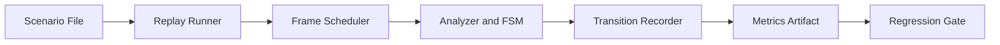

# ADR 037 - Timed Screenshot Replay Integration Testing

| Status   | Date       | Wingman Version |
|----------|------------|-----------------|
| Draft | 2026-05-24 | 1.6.9           |

## Context

Current tests cover unit behavior and selected static screenshot checks, but there is no
single deterministic integration harness that replays a full game-flow timeline and
measures end-to-end response timing for OCR-driven transitions.

Recent incidents showed that state transitions can fail or stall when signal windows are
brief. We need a repeatable way to detect this class of regressions before runtime use.

## Decision

Adopt a timed screenshot replay integration harness that feeds ordered frames at defined
intervals and validates both:

- FSM transition sequence correctness
- Transition response-time budgets

This harness will run in CI as a deterministic regression gate and will emit artifacts
compatible with the existing performance tracking workflow.

## Scope

In scope:

- Scenario format with ordered screenshot frames and per-frame timestamps
- Replay runner that drives analyzer/main-loop paths without live capture
- Assertions for expected transition sequence and timeout windows
- Per-run metrics artifact for transition latency statistics

Out of scope for this ADR:

- Replacing existing live-capture smoke tests
- Full game simulation beyond OCR/state-transition paths
- UI automation outside the Wingman analyzer/controller loop

## Scenario Model

Each replay scenario contains:

- Relative frame path
- Scheduled offset in milliseconds
- Optional expected state after processing the frame
- Optional expected trigger event

Example shape:

```yaml
scenario: lobby-to-battle
frames:
  - at_ms: 0
    image: LOBBY_PLAY_VISIBLE.png
    expect_state: GAME_LOBBY
  - at_ms: 1200
    image: WAITING_CANCEL_VISIBLE.png
    expect_trigger: cancel_detected
    expect_state: GAME_STARTING
  - at_ms: 3500
    image: BATTLE_HUD.png
    expect_trigger: good_luck_detected
    expect_state: GAME_BATTLE
```

## Phased Rollout

1. Phase 1: Single happy-path scenario and metrics plumbing.
2. Phase 2: Add negative and edge scenarios (brief CANCEL window, delayed GOOD LUCK).
3. Phase 3: Add CI thresholds for p95 transition latency and transition completeness.
4. Phase 4: Expand scenario catalog for mission restart and GAME_END click-through paths.

## Metrics and Regression Gates

Record at least:

- Event-to-transition latency per trigger
- Scenario completion time
- Transition success ratio

Initial regression policy:

- Fail on missing required transition.
- Fail on unexpected transition order.
- Warn when latency degrades beyond configured threshold until enough baseline data exists.
- Promote warning to fail once minimum-session baseline criteria are met.

## Architecture



## Consequences

Positive:

- Deterministic integration coverage for OCR plus FSM transitions
- Earlier detection of timing and sequencing regressions
- Comparable release-over-release transition performance data

Trade-offs:

- New test fixtures and scenario maintenance overhead
- Additional CI runtime for replay scenarios
- Threshold tuning required to avoid flaky latency failures

## Alternatives Considered

1. Keep current unit and static screenshot tests only.
   - Rejected because transition timing regressions can still escape.

2. Rely on manual runtime validation and log inspection.
   - Rejected due to low repeatability and slower feedback.

3. Build a full UI automation rig with live emulator control only.
   - Rejected as first step due to complexity and nondeterminism.

## References

- ADR 013 - Automated test architecture
- ADR 015 - Game state machine
- ADR 029 - GAME_LOBBY quick-scan thread
- ADR 034 - Two-tier performance regression detection
- ADR 035 - Runtime performance release trend chart
