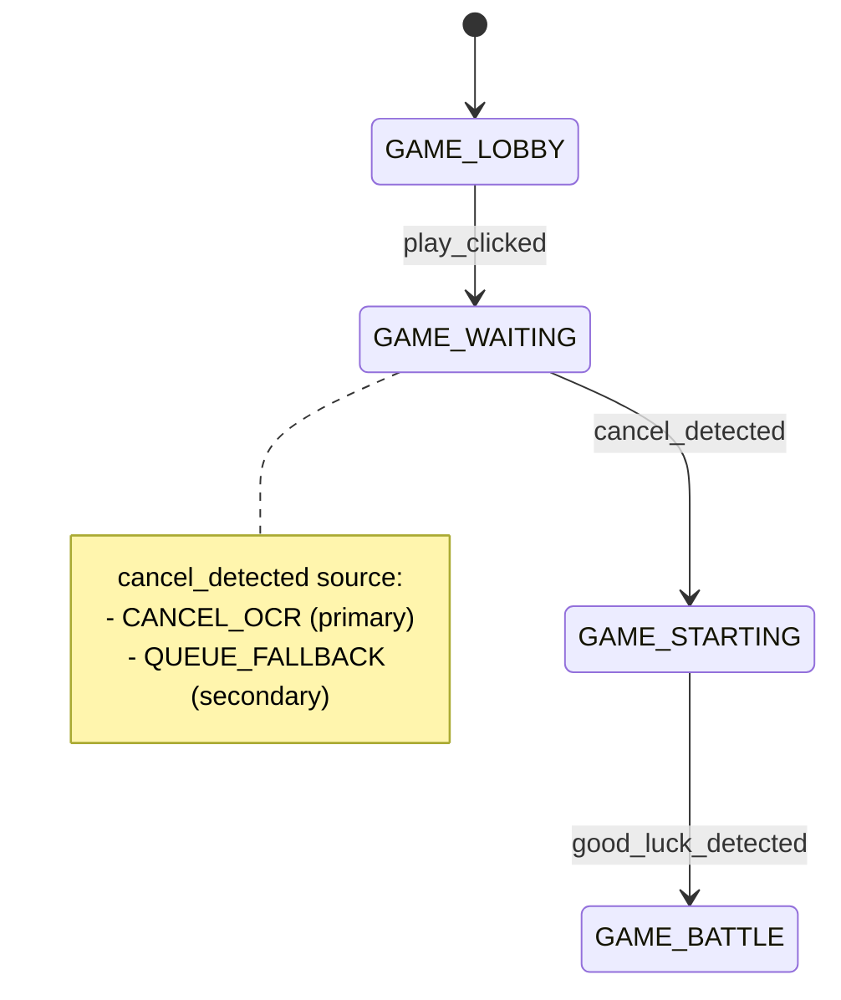

# ADR 040 - GAME_WAITING Secondary Matchmaking Confirmation

| Status   | Date       | Wingman Version |
|----------|------------|-----------------|
| Draft    | 2026-05-25 | 1.6.10          |

## Context

GAME_WAITING currently advances to GAME_STARTING only when CANCEL OCR is detected.

In recent runtime logs, the bot entered GAME_WAITING after a successful PLAY click but
never detected CANCEL for a prolonged period, despite evidence that matchmaking was
likely active (PLAY/READY repeatedly not visible). This created a single-point-of-failure
on CANCEL OCR and required manual override to progress.

## Decision

Add a secondary matchmaking confirmation signal in GAME_WAITING that can trigger the
existing `cancel_detected` transition to GAME_STARTING when CANCEL OCR is unavailable.

This ADR does not permit direct GAME_WAITING to GAME_BATTLE promotion.

Primary/secondary precedence:

1. Primary: CANCEL OCR detected in the CANCEL crop.
2. Secondary: sustained queue-active evidence (PLAY/READY not visible + visual delta in
   CANCEL region relative to a lobby baseline).

If either condition is satisfied, fire `cancel_detected` and continue normal flow through
GAME_STARTING.

## Scope

In scope:

- Secondary queue confirmation logic for GAME_WAITING only.
- Conservative thresholds and debounce to avoid false positives.
- Runtime logs that identify transition source (`CANCEL_OCR` vs `QUEUE_FALLBACK`).
- Unit/integration tests for fallback behavior and guardrails.

Out of scope:

- Direct GAME_WAITING to GAME_BATTLE transitions.
- New OCR models or detector replacements.
- Gameplay behavior changes outside waiting/starting progression.

## Why Not Good Luck or Health in GAME_WAITING

- Good Luck is a GAME_STARTING-phase signal and belongs after matchmaking confirmation.
- Health/ammo OCR is battle-oriented and not a stable waiting-phase indicator.
- Routing through GAME_STARTING preserves FSM semantics and existing mission start hooks.

## Design

### Signal Model

Add a waiting confirmation accumulator that is evaluated every 3 seconds in the existing
GAME_WAITING block:

- `waiting_fallback_score`: integer confidence score
- `waiting_fallback_consecutive`: consecutive polls with queue-like evidence
- `waiting_baseline_captured`: whether baseline image stats are initialized

Evidence components per poll:

- `cancel_detected` from existing scan (strong evidence)
- `play_visible` from existing PLAY/READY scan (negative evidence)
- `cancel_region_diff` from grayscale absolute difference vs baseline

Scoring policy (initial conservative defaults):

- CANCEL detected: immediate transition (`CANCEL_OCR`)
- PLAY/READY visible: reset score/consecutive to 0
- PLAY/READY not visible: +1
- CANCEL region diff above threshold: +1
- Require both:
  - score >= 4
  - consecutive polls >= 2

Then trigger `cancel_detected` with source `QUEUE_FALLBACK`.

### Baseline and Diff

Baseline source:

- Capture baseline from CANCEL crop while in GAME_LOBBY and PLAY/READY is visible.
- Keep the latest valid baseline in analyzer memory.

Diff metric:

- Resize to crop shape if needed.
- Convert both frames to grayscale.
- Compute normalized mean absolute difference in [0, 1].
- Initial threshold: 0.08 (tunable).

### FSM Behavior

No new states or transitions are introduced.

Fallback only invokes existing trigger:

- `GAME_WAITING --cancel_detected--> GAME_STARTING`

This preserves downstream Good Luck/health-starting logic and mission startup timing.

## Implementation Plan

1. Add baseline capture helper in analyzer for CANCEL crop when lobby conditions are valid.
2. Add analyzer helper to compute normalized diff score for current CANCEL crop.
3. In main GAME_WAITING loop, add fallback accumulator state variables.
4. Evaluate fallback only when CANCEL OCR is false.
5. Trigger `cancel_detected` via existing public trigger API and log source.
6. Reset fallback accumulator when leaving GAME_WAITING or when PLAY/READY reappears.
7. Add tests and tune thresholds with replay fixtures/log review.

## Copilot Execution Pack

### Normative Readiness Clarifications

The following items are mandatory for implementation to reduce ambiguity:

- Fallback must only run when `game_state == GAME_WAITING` and `elapsed_waiting >= 6.0s`.
- Fallback must not run if crop `CANCEL` is missing from config.
- Baseline refresh must occur only in `GAME_LOBBY` when PLAY or READY is visible.
- Baseline must be replaced when monitor/region dimensions change.
  - Implementation rule: if current CANCEL crop shape differs from stored baseline shape,
    discard baseline and require a new lobby-time baseline capture.
- Fallback accumulator must reset on:
  - any state change away from GAME_WAITING
  - PLAY/READY visible in GAME_WAITING
  - successful `cancel_detected` trigger

Required helper signatures:

- `analyzer.capture_waiting_cancel_baseline(frame) -> bool`
- `analyzer.compute_waiting_cancel_diff(frame) -> float | None`

Required trigger call from main:

- `analyzer.trigger_event("cancel_detected")`

No new FSM trigger names are permitted in this ADR.

### File-Level Changes

- `wingman/analyzer.py`
  - Add baseline storage fields and helper methods:
    - capture/refresh waiting baseline
    - compute cancel-region diff score

- `wingman/main.py`
  - Extend GAME_WAITING block with fallback accumulator logic.
  - Add source-tagged transition logs.

- `tests/test_analyzer.py`
  - Add unit tests for baseline/diff helpers.

- `tests/test_main_game_end.py` or new `tests/test_waiting_fallback.py`
  - Add flow tests for fallback transition and reset behavior.

### Proposed Config Keys

Add under `mission` with defaults:

- `waiting_fallback_enabled: true`
- `waiting_fallback_diff_threshold: 0.08`
- `waiting_fallback_score_threshold: 4`
- `waiting_fallback_consecutive_required: 2`
- `waiting_fallback_min_elapsed_s: 6.0`

### Required Logs

- `GAME_WAITING fallback: play_not_visible=%s diff=%.3f score=%d consecutive=%d`
- `GAME_WAITING fallback reset: PLAY/READY visible`
- `GAME_WAITING confirmed via QUEUE_FALLBACK (%.1fs)`
- Existing CANCEL path log remains unchanged.

### Guardrails

- Never call `manual_force_battle` from fallback logic.
- Never trigger fallback if baseline is unavailable.
- If diff computation fails, log and skip poll without changing score.
- If PLAY/READY becomes visible, reset and allow normal re-click behavior.

## Acceptance Criteria

- In GAME_WAITING, system transitions to GAME_STARTING when either:
  - CANCEL OCR is detected, or
  - fallback evidence meets configured threshold.
- No direct GAME_WAITING to GAME_BATTLE transition is introduced.
- False-positive rate is low in lobby/waiting idle scenarios.
- Existing mission start behavior remains unchanged after entering GAME_STARTING.
- New tests pass with deterministic outcomes.
- No fallback transition occurs when baseline is unavailable.

## Test Strategy

Required:

1. Unit tests:
   - baseline capture success/failure
   - diff score range and threshold behavior
2. Integration tests:
   - CANCEL missing but queue fallback true -> transition to GAME_STARTING
   - PLAY visible -> fallback score resets
   - baseline missing -> no fallback transition
  - elapsed_waiting < min_elapsed -> no fallback transition
3. Regression checks:
   - no direct WAITING to BATTLE transitions
   - existing cancel_detected path still works

Suggested commands:

1. `c:/dev-tools/github/wingman/.venv-1/Scripts/python.exe -m pytest tests/test_analyzer.py -q`
2. `c:/dev-tools/github/wingman/.venv-1/Scripts/python.exe -m pytest tests/test_main_game_end.py -q`
3. `c:/dev-tools/github/wingman/.venv-1/Scripts/python.exe -m pytest tests/test_waiting_fallback.py -q`

## Consequences

Positive:

- Removes CANCEL OCR single-point-of-failure in GAME_WAITING.
- Improves autonomous progression reliability.
- Preserves FSM correctness by keeping GAME_STARTING in the path.

Trade-offs:

- Additional tuning needed for diff threshold per UI variance.
- Slight complexity increase in waiting-loop logic.

## Alternatives Considered

1. Add Good Luck in GAME_WAITING as secondary signal.
   - Rejected: phase mismatch and timing ambiguity.

2. Add health detection in GAME_WAITING as secondary signal.
   - Rejected: not a stable waiting-phase indicator.

3. Direct fallback to GAME_BATTLE.
   - Rejected: bypasses intended FSM and mission-starting sequence.

## References

- `docs/adr/025-formalise-game-state-machine.md`
- `docs/adr/026-game-lobby-state-machine-sequence.md`
- `docs/adr/029-game-lobby-quick-scan-thread.md`
- `wingman/main.py`
- `wingman/analyzer.py`
