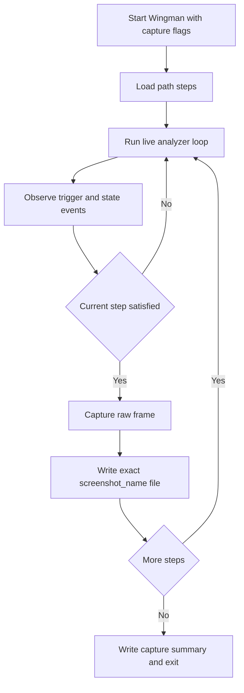

# ADR 041 — Live Replay Auto-Capture for Integration Screenshots

| Status   | Date       | Wingman Version |
|----------|------------|-----------------|
| Draft    | 2026-05-28 | 1.6.11          |

## Context

ADR 037 established replay-path driven integration testing using curated screenshots in
`test_screenshots/integration_test`.

Today, screenshot collection is still manual:

- run Wingman live
- press hotkey `V` at approximate moments
- rename files to match `tests/replay_paths/adr037_paths.yaml`
- verify missing files through replay reports

This creates avoidable operator burden and naming risk. The replay model already defines
exact filenames and expected triggers/states, so capture should be automatable.

## Decision

Add a **live auto-capture mode** that runs Wingman against the real game feed and writes
integration screenshots directly to the exact filenames declared in
`tests/replay_paths/adr037_paths.yaml`.

The mode captures each step when its condition is satisfied and stores the raw frame to:

- `test_screenshots/integration_test/<screenshot_name>`

This mode is for fixture generation only and does not replace replay test execution.

## Goals

- Eliminate manual rename/move workflow for PATH fixtures.
- Keep capture naming fully deterministic from replay path config.
- Capture frames from real runtime analyzer/FSM behavior.
- Support both PATH1 and PATH2 collection in separate runs.

## Non-Goals

- No replacement of replay assertion engine.
- No real-time OCR annotation overlays in captured fixtures.
- No automatic approval of fixture quality; operator still reviews captures.

## Proposed CLI

Add capture flags to `wingman/main.py`:

- `--capture-path-config tests/replay_paths/adr037_paths.yaml`
- `--capture-path PATH1|PATH2`
- `--capture-screenshot-dir test_screenshots/integration_test`
- `--capture-overwrite` (flag, default disabled)
- `--capture-timeout-s <seconds>` (per step timeout)
- `--capture-summary tests/test-output/capture_summary.json`
- `--capture-allow-inject` (optional, default disabled)

Optional helper:

- `--capture-start-at-step <screenshot_name>` for resume/retry.

## Capture Semantics

Each step in the selected path is captured once.

Step readiness rules:

1. If step defines `inject_trigger`, auto-capture mode does not emit inject triggers.
  It waits for real runtime behavior by default. Only when
  `--capture-allow-inject` is explicitly set may synthetic trigger injection be
  used to satisfy a step.
2. If step defines `expected_trigger`, capture when that trigger is observed.
3. If step defines `expected_state` only, capture when analyzer state matches.
4. If neither is defined, capture on first stable frame after previous step completed.

Stability rule:

- Require two consecutive identical readiness evaluations (or a short debounce window)
  before writing the file. This reduces accidental transient captures.

## Architecture

Implement a new runtime helper (`LivePathCaptureEngine`) that:

- loads selected path via existing replay path loader
- listens to analyzer transition callbacks and main-loop state updates
- tracks active step index and completion status
- requests frame snapshots from current live frame source
- writes PNG to required filename
- emits machine-readable summary (captured/missed/duration)

### Flow

## Data Contract

Summary JSON (`--capture-summary`) includes:

- selected path name
- started/ended timestamps
- per-step:
  - screenshot_name
  - captured (bool)
  - capture_time_s
  - readiness_source (`trigger` | `state` | `manual`)
  - timeout (bool)
  - notes

## Safety and Guardrails

- Default behavior keeps overwrite disabled to prevent accidental fixture clobbering.
- If target file exists and overwrite disabled, mark step skipped with reason.
- Fail capture run if any required step not captured.
- Log explicit operator guidance for next missing step on timeout.

## Alternatives Considered

1. Keep hotkey-only capture and manual rename.
   - Rejected: repetitive and error-prone.
2. Build fixtures from replay mode screenshots.
   - Rejected: replay mode consumes fixtures; it is not a source-of-truth capture path.
3. Auto-capture based only on elapsed time.
   - Rejected: brittle under OCR warmup and runtime timing variance.

## Consequences

Positive:

- Faster fixture generation and updates.
- Fewer naming mistakes and missing-file loops.
- Better alignment between runtime behavior and replay fixtures.

Trade-offs:

- Additional complexity in main runtime loop.
- Requires careful debounce logic to avoid transient/incorrect captures.
- Initial capture still needs operator to run representative game flow.

## Rollout Plan

1. Implement PATH1/PATH2 capture mode behind explicit CLI flags.
2. Validate by generating a fresh fixture set and comparing with current filenames.
3. Keep existing `V` hotkey workflow as fallback.
4. Add a short job aid section in README after implementation acceptance.

## Acceptance Criteria

- Running capture mode for PATH1 or PATH2 creates the full expected filename set for that
  path with zero manual rename.
- Capture summary reports all steps captured or explicit per-step timeout reasons.
- Existing test commands continue to pass:
  - `make test`
  - `make y`
  - OCR tests remain skippable when placeholders are present.

## Open Questions

- Should capture mode optionally save both raw and overlay versions for review?
- Do we want a minimal quality check (non-black frame, resolution match) before accepting
  a captured step?
