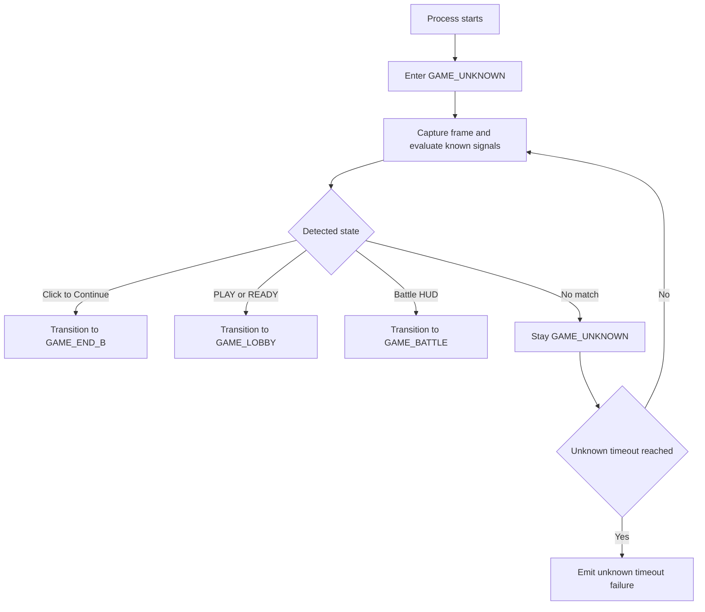

# ADR 042 - GAME_UNKNOWN Startup Detection and Resume

| Status   | Date       | Wingman Version |
|----------|------------|-----------------|
| Accepted | 2026-06-02 | 1.6.15          |

## Context

Wingman currently assumes a startup path that is biased toward known flow entry points
(such as lobby-first behavior). In real usage, the process can start or restart while
the game is already in progress, including these common cases:

- The game is in lobby and PLAY or READY is visible.
- The game is mid-mission with battle HUD elements visible.
- The game is at mission end with Click to Continue visible.
- Wingman restarts after a crash while the game remains open.

This creates two practical issues:

- Recovery friction: operators may need manual steps to realign state before automation resumes.
- Development loop friction: replay capture workflows cannot always continue from the current
  on-screen state without restarting the game flow.

Related ADRs already define replay assertions and capture-path automation, but they need a
stable startup contract so behavior is consistent when Wingman is restarted mid-session.

## Decision

Introduce a first-class `GAME_UNKNOWN` state in the game-state machine.

On process startup (and on selected recovery paths), Wingman will begin in `GAME_UNKNOWN`
and run a bounded screen classification pass to determine the active in-game state from
current visuals. Wingman then transitions to the detected state and continues normal
runtime behavior.

### Initial classification rules

When in `GAME_UNKNOWN`, evaluate the current frame using existing crop detection signals:

1. If Click to Continue is detected, classify as `GAME_END_B`.
2. Else if PLAY or READY is detected, classify as `GAME_LOBBY`.
3. Else if battle HUD indicators are detected, classify as `GAME_BATTLE`.
4. If no rule matches, remain in `GAME_UNKNOWN` and retry next loop tick.

Tie-breaking policy when multiple rules match in the same frame:

- Prioritize end-of-round state first (`GAME_END_B`), then lobby (`GAME_LOBBY`), then battle (`GAME_BATTLE`).
- Rationale: end-screen controls are terminal and should not be masked by stale HUD artifacts.

`GAME_WAITING` and `GAME_STARTING` are not direct unknown classifiers in this ADR; they
remain reachable through established triggers from `GAME_LOBBY` per ADR 040 and existing
FSM flow.

### Confidence and stability policy

To prevent transient false classification:

- Require a short debounce window (for example two consecutive positive evaluations)
  before committing transition from `GAME_UNKNOWN`.
- Continue periodic re-evaluation while still unknown.

Normative defaults for this ADR:

- `unknown_debounce_consecutive_required = 2`
- `unknown_max_wait_s = 90.0`

Unknown timeout behavior:

- If no classifier wins within `unknown_max_wait_s`, runtime remains in `GAME_UNKNOWN` and emits
  a structured timeout log.
- In capture mode, unknown timeout is a terminal failure and must appear in capture summary as
  a startup classification failure reason.

### FSM transition contract

Unknown classification must use explicit FSM triggers, not direct state mutation.

Required new triggers:

- `unknown_to_end_detected`: `GAME_UNKNOWN -> GAME_END_B`
- `unknown_to_lobby_detected`: `GAME_UNKNOWN -> GAME_LOBBY`
- `unknown_to_battle_detected`: `GAME_UNKNOWN -> GAME_BATTLE`

Rationale:

- Trigger-based transitions preserve existing transition callbacks, logging, and side effects.
- Direct assignment to `game_state` is non-compliant for unknown classification in this ADR.

### Classifier signal contract

To make behavior testable and deterministic, the initial implementation must use these
concrete signals:

- End classifier (`GAME_END_B`): existing Click to Continue detector used by runtime
  `click_to_detected` logic.
- Lobby classifier (`GAME_LOBBY`): PLAY/READY crop detection used by lobby scan logic.
- Battle classifier (`GAME_BATTLE`): health HUD visibility check plus health OCR parse success
  (non-null reading) in the current frame.

If multiple classifiers are positive in one frame, apply precedence defined above.

## Scope

In scope:

- Add `GAME_UNKNOWN` enum/state and startup default.
- Add unknown-state classifier using existing detectors/crops where available.
- Add deterministic transition ordering from unknown to known states.
- Add logs and summary signals to show unknown-entry and detected-state exit.
- Keep waiting fallback logic (ADR 040) scoped to `GAME_WAITING` only, after unknown
  classification completes.
- Add startup-timeout handling for unknown classification with deterministic failure in
  capture mode.

Out of scope:

- Full probabilistic multi-class classifier.
- New OCR model architecture.
- Automatic back-transition from known states to unknown every cycle.

## Architecture

## Consequences

Positive:

- Wingman can start and resume from any practical on-screen state without forced manual reset.
- Runtime capture loops can iterate continuously even if Wingman restarts during development.
- Crash recovery is improved when game session remains alive.
- CAPTURE_PATH runs can resume from warm sessions without forced lobby reset.

Trade-offs:

- Additional state machine complexity and startup classification logic.
- Requires careful precedence and debounce tuning to avoid misclassification.
- New tests are required to preserve deterministic behavior.

## Implementation Notes

Suggested integration points:

- Add `GAME_UNKNOWN` to the `GameState` enum and FSM transitions.
- Initialize analyzer state to unknown at startup.
- Implement a small `classify_unknown_state(frame)` helper that returns either
  `GAME_END_B`, `GAME_LOBBY`, `GAME_BATTLE`, or no-decision, and apply debounce before
  firing unknown transition trigger.
- Reuse existing crop checks where possible to avoid duplicate detection code.
- Emit explicit logs for:
  - unknown-entry
  - candidate matches
  - committed transition target
  - unknown-timeout with elapsed seconds and classifier counters

## Testing Strategy

Unit tests:

- Unknown to lobby when PLAY or READY is visible.
- Unknown to battle when health HUD is visible.
- Unknown to end state when Click to Continue is visible.
- Unknown remains unknown when no indicators are visible.
- Precedence test when multiple indicators are present.
- Debounce test for transient one-frame false positives.
- Unknown-timeout test at configured `unknown_max_wait_s`.
- Trigger contract test to verify unknown classification transitions via new FSM triggers,
  not direct state assignment.

Integration tests:

- Startup in each known screenshot fixture and assert resulting state.
- Restart simulation during capture path and assert successful resume.
- Capture-mode startup timeout produces terminal failure summary with unknown-timeout reason.

## Rollout Plan

1. Implement `GAME_UNKNOWN` with startup-only classification.
2. Add unit coverage and startup integration assertions.
3. Verify replay/capture workflows still pass existing smoke paths.
4. Promote from Draft after implementation and verification are complete.

Cross-ADR alignment tasks:

1. ADR 037: replay assertions start from known-state fixtures after unknown classification.
2. ADR 040: waiting fallback remains disabled while in `GAME_UNKNOWN`.
3. ADR 041: capture summary and readiness flow include unknown-startup handling.

Capture workflow clarification:

- Running `make newpaths CAPTURE_PATH=PATH1` or `make newpaths CAPTURE_PATH=PATH2`
  is intended to collect fixture screenshots opportunistically while Wingman is running.
- Capture may occur out of path order during live gameplay; strict in-order capture is
  not required for fixture generation.
- Deterministic timing and transition-order validation remains the responsibility of
  ADR 037 replay assertions, which consume the captured fixtures.

## Acceptance Criteria

- Wingman starts in `GAME_UNKNOWN` and transitions to the correct known state
  from representative startup screenshots.
- Runtime capture can continue from current game screen after process restart.
- Crash-restart scenario resumes control without requiring a full game-flow reset.
- Existing state-driven runtime behavior remains stable after startup classification.
- `make newpaths CAPTURE_PATH=PATH1` and `make newpaths CAPTURE_PATH=PATH2` can complete
  from either fresh launch or warm restarted sessions, provided the required runtime
  states are physically reachable on screen.
- During `make newpaths` capture runs, screenshots may be captured out of order as
  states and triggers naturally occur, and the resulting fixtures are validated by
  ADR 037 replay tests with coded timing/assertion rules.
- If startup classification cannot determine a state within `unknown_max_wait_s`, capture
  exits with deterministic unknown-timeout failure details instead of hanging.
