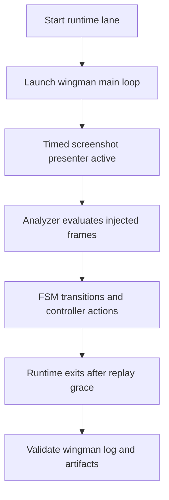

# ADR 044 — Runtime Screenshot-Driven Automation Lane

| Status   | Date       | Wingman Version |
|----------|------------|-----------------|
| Accepted | 2026-06-02 | 1.6.15          |

## Context

Current replay coverage is strong in pytest-based integration tests, but we still need
an automated lane that runs the real Wingman runtime loop in a way that is close to
`make r` and `make rd` operation.

The goal is to validate end-to-end state progression and action behavior without launching
the actual game window. In this lane, timed screenshots stand in for the game feed.

Primary target case:

- Run a PATH1-style timeline where screenshots are presented at specific times.
- Exercise real `wingman.main` orchestration and analyzer logic.
- Verify expected behavioral evidence in `wingman.log`.
- Example: when a missile-zero screenshot is injected, logs must show mission cancel and
  eject-and-dive behavior.

## Decision

Adopt a runtime automation lane that executes the real Wingman loop while a separate timed
screenshot presenter thread drives the frame source.

The lane uses replay configuration inputs and screenshot assets from
`test_screenshots/integration_test`, with PATH1 as the baseline scenario.

The lane is treated as "runtime without game":

- Wingman runs through the same main loop used by `make r` and `make rd`.
- Screenshot timing controls state trigger opportunities.
- Runtime output is validated through `wingman.log` and replay artifacts.

### Execution profile

The standard invocation for this lane is a run equivalent to `make rd`, with replay inputs
enabled and log file output retained for post-run checks.

Representative command shape:

```bash
uv run --active python -m wingman.main \
  --config wingman/config.yaml \
  --replay-config tests/replay_paths/adr037_paths.yaml \
  --replay-path PATH1 \
  --replay-screenshot-dir test_screenshots/integration_test \
  --replay-exit-after 3.0 \
  --log-file wingman.log
```

Implementation may provide a dedicated Make target later, but this ADR standardizes behavior,
inputs, and pass criteria first.

### Runtime model



## Validation Criteria

A run is passing only when all of the following are true:

- `wingman.log` contains none of these fatal signatures:
  - `Traceback`
  - `[ERROR]`
  - `Replay assertion failure`
- `tests/test-output/replay_assertions.path1.json` reports zero failed assertions.
- Expected PATH1 state progression is observed through replay assertions and logs.
- Missile-zero handling evidence exists in logs:
  - Required:
    - `MISSILES EMPTY — cancelling mission and ejecting`
    - `Controller: eject_and_dive — NOSE_DOWN + AFTERBURNER engaged`
  - Terminal outcome must include one of:
    - `Controller: eject_and_dive complete`
    - `Controller: eject_and_dive — cancelled during nose-down phase`
  - If cancellation occurs, corresponding manual takeover evidence must exist:
    - `GAME_BATTLE → GAME_BATTLE_MANUAL`
- Good Luck transition must be screenshot-driven (not replay-injected):
  - Required:
    - `Analyzer: 'Good Luck' detected in good_luck crop`
    - `Controller: 'Good Luck' detected`
  - Forbidden:
    - `Replay: injecting FSM trigger 'good_luck_detected'`

### Observed Runtime Context

Observed in current `wingman.log` sample (2026-05-30):

- `MISSILES EMPTY — cancelling mission and ejecting`: 7 occurrences
- `Controller: eject_and_dive — NOSE_DOWN + AFTERBURNER engaged`: 7 occurrences
- `Controller: eject_and_dive complete`: 6 occurrences
- `Controller: eject_and_dive — cancelled during nose-down phase`: 1 occurrence

This confirms an expected outlier lane where manual takeover can interrupt eject-and-dive.
Validation rules must accept both terminal outcomes above to avoid false failures.

Recommended artifacts per run:

- `wingman.log`
- `tests/test-output/replay_assertions.path1.json`
- `tests/test-output/replay_action_intents.path1.json`

## Implementation Contract

This section is normative for implementation.

### Required Make Targets

Add the following targets:

1. `make rr-path1`
  - Runs the runtime lane for PATH1.
  - Must execute `wingman.main` in replay mode.
  - Must always write:
    - `wingman.log`
    - `tests/test-output/replay_assertions.path1.json`
    - `tests/test-output/replay_action_intents.path1.json`
2. `make rr-validate-path1`
  - Runs validator only against the latest PATH1 artifacts.
  - Exits nonzero on any validation failure.
3. `make rr-path1-gate`
  - Runs `rr-path1` then `rr-validate-path1`.
  - This is the primary CI gate command for ADR 044 phase 1.

### Validator Script

Create `tests/runtime_replay_validate.py` with the following behavior:

1. Inputs:
  - `--log-file` (default `wingman.log`)
  - `--assertions-file` (required)
  - `--intents-file` (optional)
  - `--summary-out` (default `tests/test-output/runtime_replay_validation.path1.json`)
2. Required assertion JSON checks:
  - Root key `assertions` exists and is not null.
  - `assertions.has_failures` is false.
  - `assertions.is_complete` is true.
  - No checkpoint has `status` equal to `failed`.
3. Required negative log checks:
  - Must not contain any of:
    - `Traceback`
    - `[ERROR]`
    - `Replay assertion failure`
4. Required positive log checks:
  - Must contain:
    - `MISSILES EMPTY — cancelling mission and ejecting`
    - `Controller: eject_and_dive — NOSE_DOWN + AFTERBURNER engaged`
  - Must contain one terminal outcome:
    - `Controller: eject_and_dive complete`
     or
    - `Controller: eject_and_dive — cancelled during nose-down phase`
  - If the terminal outcome is cancellation, must also contain:
    - `GAME_BATTLE → GAME_BATTLE_MANUAL`
5. Output:
  - Writes summary JSON with pass or fail, marker counts, and failure reasons.
  - Prints a concise pass or fail report.
  - Returns exit code 0 only when all checks pass.

### Artifact JSON Contract

Validation logic must use these keys from replay assertions output:

- `assertions.has_failures`
- `assertions.is_complete`
- `assertions.checkpoints[*].status`
- `assertions.failures`

The implementation must not depend on fragile free-text parsing of checkpoint failure messages.

## Consequences

Benefits:

- Adds a deterministic, game-free regression lane close to real runtime behavior.
- Catches integration regressions that unit tests and static screenshot checks can miss.
- Produces log-first evidence that is easy to review after each run.

Risks and mitigations:

- Timing sensitivity can cause flaky results if screenshot schedules are too tight.
  Mitigation: keep conservative settle windows and stable PATH fixtures.
- Drift between this lane and interactive runtime usage.
  Mitigation: keep the same main loop and configuration defaults, changing only frame source.
- Asset quality risk from placeholder or stale screenshots.
  Mitigation: enforce real screenshot set checks before executing the lane.

## Delivery Phases

Phase 1 (required now):

1. Implement `rr-path1`, `rr-validate-path1`, and `rr-path1-gate`.
2. Add validator script and summary output.
3. Wire CI to run `make rr-path1-gate`.

Phase 2 (after PATH1 is stable):

1. Add PATH2 equivalents (`rr-path2`, `rr-validate-path2`, `rr-gate`).
2. Require both PATH1 and PATH2 gates in CI.

## Definition Of Done

ADR 044 implementation is complete when all are true:

1. Commands exist and run as defined in Required Make Targets.
2. Validator enforces all checks in Validator Script and returns correct exit codes.
3. CI runs phase-1 gate and fails on validator failure.
4. At least one successful run and one intentionally failing run are documented in PR evidence.
5. ADR 044 status is updated from `Draft` to `Accepted` only after items 1 to 4 are complete.

## Alternatives Considered

Continue pytest-only replay checks:

- Rejected as sole strategy because it does not provide the same operator-facing
  runtime logging path as `make rd`.

Use live game session only:

- Rejected for routine regression because it is nondeterministic, slower, and harder
  to run repeatedly in development and CI.

## Related ADRs

- ADR 037 defines timed replay path fixtures and integration assertions.
- ADR 041 defines live capture workflow to refresh replay screenshots.