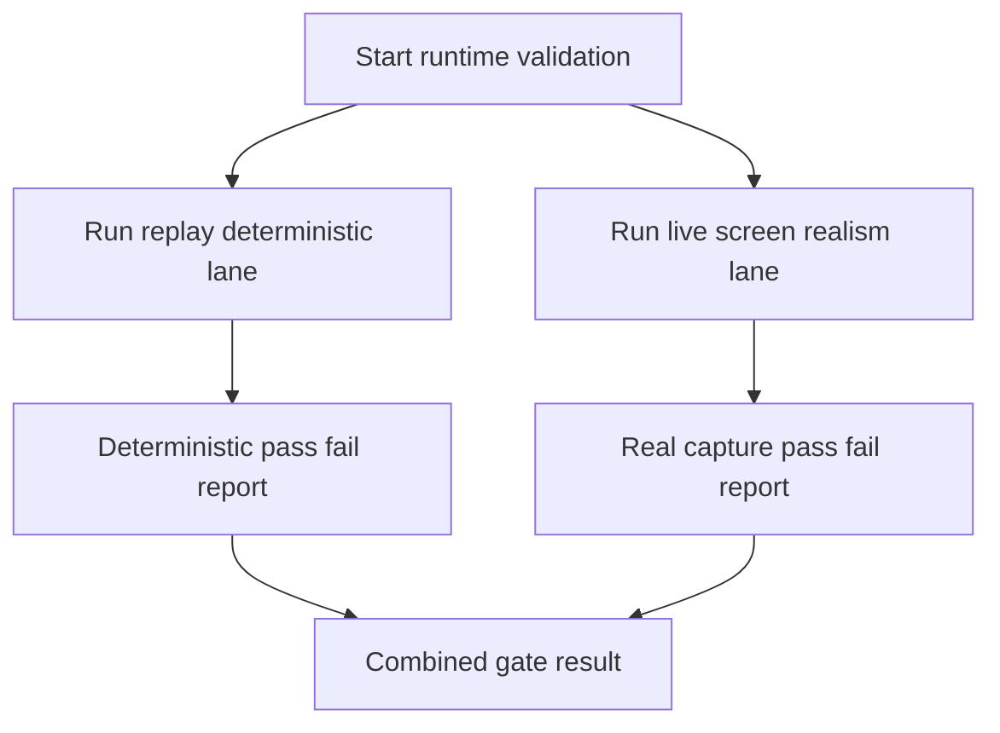

# ADR 045 — Dual Lane Runtime Validation: Replay And Live Screen

| Status   | Date       | Wingman Version |
|----------|------------|-----------------|
| Draft    | 2026-05-31 | 1.6.13          |

## Context

ADR 044 introduced a runtime automation lane and wired it into `make tp`.
The current implementation runs with `--replay-config`, which means Wingman logs
`Replay mode enabled` and uses `ScreenshotReplayCapture` as the frame source.

This validates OCR parsing and FSM behavior on deterministic timed frames, but it
does not validate real desktop capture conditions.

Gap observed:

- No live screen presentation process is used to show timed screenshots on screen.
- Runtime does not acquire frames from monitor capture in the ADR 044 lane.
- Capture-region alignment, focus behavior, and presentation timing effects on real
  frame grabbing are not exercised.

## Decision

Adopt a dual-lane validation model.

1. Keep replay lane for deterministic logic regression checks.
2. Add a live-screen lane where screenshots are presented on the desktop at scheduled
   times while Wingman runs in normal capture mode.

The live-screen lane is the realism lane for runtime behavior. The replay lane remains
for deterministic CI-stable checks.

## Lane Definitions

### Lane A: Replay Deterministic

Purpose:

- Deterministic regression checks for OCR parsing and state machine transitions.

Characteristics:

- Uses `--replay-config` and `ScreenshotReplayCapture`.
- Suitable as default CI gate.

### Lane B: Live Screen Realism

Purpose:

- Validate realistic runtime behavior with real monitor capture.

Characteristics:

- Wingman runs without `--replay-config`.
- A separate presenter process displays scheduled path screenshots in the configured
  capture region on screen.
- Assertions and log validation run after execution.

## Runtime Model

## Validation Requirements

Replay lane must continue enforcing ADR 044 rules.

Live-screen lane must additionally require:

- No `Replay mode enabled` marker in `wingman.log`.
- Good Luck detection must be OCR-driven from presented screen content.
- Missile-zero screenshot presentation must lead to eject-and-dive evidence in logs.

## Implementation Direction

Required additions:

1. Add a live presenter utility under `tests/` that:
   - Reads a timed PATH config.
   - Presents each screenshot full-frame inside the active capture region.
   - Runs on a separate thread or process.
2. Add Make targets:
   - `rr-live-path1`
   - `rr-live-validate-path1`
   - `rr-live-path1-gate`
3. Keep `rr-path1-gate` as deterministic baseline.
4. Update `make tp` policy:
   - Default includes deterministic replay lane.
   - Optional flag enables live-screen lane on desktop-capable runs.

## Consequences

Benefits:

- Separates deterministic correctness from runtime realism.
- Preserves reliable CI behavior while enabling realistic operator-level validation.
- Detects issues hidden by direct frame injection.

Risks and mitigations:

- Live-screen lane can be flaky in headless or resource-constrained environments.
  Mitigation: keep it opt-in for local preview and dedicated desktop runners.
- Increased run time for preview workflow.
  Mitigation: keep replay lane mandatory and run live lane conditionally.

## Definition Of Done

This ADR is complete when:

1. Live presenter utility exists and can run PATH1 schedule on screen.
2. `rr-live-path1-gate` passes on a desktop-capable environment.
3. Validator distinguishes replay vs live lane using explicit log markers.
4. `make tp` supports optional live-screen lane execution switch.

## Related ADRs

- ADR 037 defines timed replay path fixtures.
- ADR 041 defines screenshot capture workflow.
- ADR 044 defines the current runtime replay gate and validation contract.
