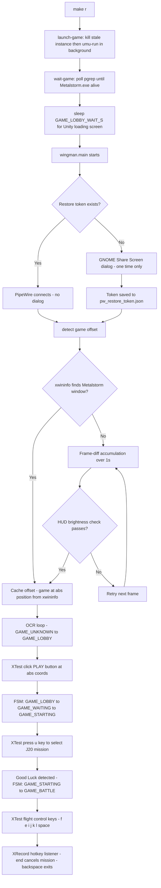

# ADR 053 — Linux One-Command Launch: `make r`

| Status   | Date       | Wingman Version |
|----------|------------|-----------------|
| Accepted | 2026-06-15 | 1.6.19          |

## Context

On Linux (GNOME Wayland, Ubuntu 24.04), the goal is a single `make r` command that:

1. Launches MetalStorm automatically (no manual Heroic click)
2. Sets up PipeWire screen capture (no manual dialog after first run)
3. Detects the game window position on-screen automatically — monitor-size agnostic
4. Starts Wingman OCR automation through to GAME\_BATTLE with working keyboard and mouse injection

ADR 049 (Linux migration) and ADR 050 (Wayland capture) each solved a piece. This ADR documents the remaining gaps: window position detection, game auto-launch, and input injection on Linux without root.

---

## Problem Statement

### 1. Game window position unknown

PipeWire captures the full 3840×1600 ultrawide monitor. MetalStorm runs at 1920×1200 somewhere within that frame. The capture code needs to know where to crop.

#### Approaches ruled out

| Approach | Result |
|---|---|
| `xdotool search` | 0 windows found when game not running |
| GNOME Shell `Eval` | Returns `(false, '')` — blocked in GNOME 46 |
| GNOME Shell `Introspect.GetWindows` | `AccessDenied` in GNOME 46 |
| PipeWire window picker (`types=2`) | MetalStorm does not appear as `xdg-toplevel` |
| Corner-based background detection | Fails when wallpaper is dark and apps cover the screen |

#### Primary method: X11 xwininfo detection

Despite MetalStorm rendering via DXVK/Vulkan, Wine/Proton still registers an XWayland window for the Wine virtual desktop. When the game is running, `xwininfo -root -tree` reveals:

```
0x8007fc "Wine Desktop" (mutter-x11-frames):  1948x1266  abs(202,170)
  └─ 0xe00009 "Wine Desktop" (steam_app_0):   1920x1200  abs(216,219)
      └─ 0x2600003 "Metalstorm" (steam_app_0): 1920x1200  abs(216,219)
```

The outermost entry (`mutter-x11-frames`) is the XWayland compositor decoration. The inner `"Metalstorm"` window at absolute position (216, 219) is the actual game surface. Crucially, the absolute position in the xwininfo output maps **1:1 to the PipeWire monitor frame coordinates** at 100% scaling with no offset transformation.

`_PipeWireBackend._detect_via_x11()` in `capture.py` runs `xwininfo -root -tree`, looks for a window titled `"Metalstorm"` or `"Wine Desktop"` with class `steam_app_0` matching the configured game dimensions (1920×1200), and returns the absolute position. This runs in ~5 ms and is re-run every 30 frames to catch window moves.

#### Fallback: frame differencing + HUD brightness check

If no matching X11 window is found (e.g. game not yet visible), the code falls back to accumulating pixel differences across 3 frame pairs, finding the largest motion blob, and verifying the candidate crop against MetalStorm's dark HUD signature (bottom 12% brightness < 45, top-right 15% brightness < 45). Browser video and other animated content fail this check. This path is retained for cases where xwininfo returns no match.

---

### 2. PipeWire portal manual interaction on first run

The XDG Desktop Portal ScreenCast session shows a GNOME "Share Screen" dialog on first use. After the user grants access, a restore token is saved to `~/.config/wingman/pw_restore_token.json`. All subsequent runs pass the token and skip the dialog entirely.

Window capture (`types=2`) was evaluated and rejected — MetalStorm does not appear in the portal's window list because DXVK surfaces do not register as `xdg-toplevel` windows. Monitor capture (`types=1`) is used; the full monitor frame is captured and the game is located via X11 detection above.

---

### 3. Game auto-launch via umu-run

Manual approaches (opening Heroic, `xdg-open "heroic://..."`, `flatpak run` Heroic) all required UI interaction. `umu-run` (the same Proton runner Heroic uses internally, installed as a standalone zipapp) launches MetalStorm directly:

```bash
GAMEID=umu-0 \
PROTONPATH=~/.var/app/com.heroicgameslauncher.hgl/config/heroic/tools/proton/GE-Proton-latest \
WINEPREFIX=~/Games/Heroic/Prefixes/Metalstorm \
~/.local/bin/umu-run ~/Games/Heroic/Metalstorm/Metalstorm.exe &
```

The `Makefile` exposes `launch-game` and `wait-game` targets with overridable variables (`UMU_RUN`, `PROTON_ROOT`, `WINE_PREFIX`, `GAME_EXE`).

`wait-game` polls `pgrep -f Metalstorm.exe` until the process appears, then sleeps `GAME_LOBBY_WAIT_S` (default 60 s) for the Unity loading screen to reach the lobby before Wingman starts.

---

### 4. pkill self-kill in Makefile

`pkill -f Metalstorm.exe` inside a Makefile recipe causes `make` to terminate because the recipe shell's `/proc/PID/cmdline` contains the literal string `Metalstorm.exe` and `pkill` matches itself. Fixed by splitting the pattern through a shell variable:

```makefile
@_p=Metalstorm; pkill -f "$${_p}.exe" 2>/dev/null || true
```

The string `Metalstorm.exe` is only formed at runtime after variable expansion and never appears as a literal substring in `/proc/PID/cmdline`.

---

### 5. Frame-diff false positive: YouTube detected as the game

After frame differencing was added, it correctly detected the game in some runs but in others identified a YouTube video in Brave browser (motion blob at (1920, 400)) instead of the game at (216, 219). YouTube renders at 30 fps, producing a large motion blob that passes the area threshold.

Fixed by adding `_PipeWireBackend._looks_like_game()`: each candidate crop is checked for MetalStorm's dark HUD signature (bottom 12%, top-right 15% mean brightness < 45). YouTube fails both checks. The HUD check threshold was tuned to 45 after measuring real MetalStorm lobby values at 35.9 and 37.2.

This issue is now less relevant because X11 xwininfo detection is the primary method and produces the correct position without motion. Frame-diff is retained as a fallback.

---

### 6. DISPLAY env var has a leading space

The DISPLAY environment variable in the VS Code terminal is ` :0` (with a leading space). Native X11 tools (xwininfo, xauth) strip whitespace silently. `python-xlib`'s `Display(" :0")` fails to connect.

Fixed by stripping DISPLAY before passing it to `Display()`:

```python
display_name = os.environ.get("DISPLAY", ":0").strip()
d = display.Display(display_name)
```

---

### 7. XAUTHORITY wildcard display number not matched by python-xlib

The mutter XWayland auth file (`/run/user/1000/.mutter-Xwaylandauth.*`) stores its MIT-MAGIC-COOKIE with an **empty display number** (wildcard):

```
veda/unix:  MIT-MAGIC-COOKIE-1  e5759901...
```

`libX11` (used by native tools) treats an empty display number as a wildcard matching any display. `python-xlib` performs an exact string match and finds no entry for `veda/unix:0`, then connects without auth and receives `Authorization required`.

Fixed by creating a temporary xauth file with an explicit `:0` entry, then setting `XAUTHORITY` to point to it:

```python
def _ensure_xauthority() -> None:
    if os.environ.get("XAUTHORITY") == _WINGMAN_XAUTH and os.path.exists(_WINGMAN_XAUTH):
        return
    src = next(glob.glob(f"/run/user/{os.getuid()}/.mutter-Xwaylandauth.*"), None)
    if not src:
        return
    r = subprocess.run(["xauth", "-f", src, "list"], capture_output=True, text=True)
    for line in r.stdout.splitlines():
        if "MIT-MAGIC-COOKIE-1" in line:
            cookie = line.split()[-1]
            subprocess.run(["xauth", "-f", _WINGMAN_XAUTH, "add",
                            ":0", "MIT-MAGIC-COOKIE-1", cookie], check=True)
            os.environ["XAUTHORITY"] = _WINGMAN_XAUTH
            return
```

`_WINGMAN_XAUTH = "/tmp/wingman_click_auth.db"` is created on first call and reused.

---

### 8. Mouse click injection on Linux

The Windows path (`ctypes.windll.user32.mouse_event`) does not exist on Linux. `pynput` is not in `pyproject.toml` and would have faced the same XAUTHORITY issue. `pyautogui` IS in `pyproject.toml` but its `mouseinfo` dependency imports `Display` at module load time — before XAUTHORITY is set — and fails.

**Solution:** Use `python-xlib`'s XTest extension directly (already installed as a transitive dependency of pyautogui). XTest injects events into the X11 server input pipeline without root and without `/dev/input` access:

```python
def _linux_click(x: int, y: int, count: int = 1) -> None:
    _ensure_xauthority()
    from Xlib import display as _xdisplay, X as _X
    from Xlib.ext import xtest as _xtest
    display_name = os.environ.get("DISPLAY", ":0").strip()
    d = _xdisplay.Display(display_name)
    _xtest.fake_input(d, _X.MotionNotify, x=x, y=y)
    d.sync()
    time.sleep(0.05)
    _xtest.fake_input(d, _X.ButtonPress, detail=1)
    d.sync()
    time.sleep(0.05)
    _xtest.fake_input(d, _X.ButtonRelease, detail=1)
    d.sync()
    d.close()
```

Click coordinates are computed as `(game_offset_x + crop_centre_x, game_offset_y + crop_centre_y)` where `game_offset` comes from `_detect_via_x11()`. This gives absolute screen coordinates in XWayland space.

---

### 9. Keyboard injection for game controls (no root required)

The `keyboard` Python library requires root or the `input` group on Linux for both injection AND listener registration. XTest injection does not require either.

**Solution:** Replace `keyboard_module` on Linux with `_LinuxXTestKeyboard`, a drop-in shim using XTest for key injection:

```python
def _linux_key_event(key: str, event_type) -> None:
    _ensure_xauthority()
    from Xlib import display as _xdisplay, X as _X, XK as _XK
    from Xlib.ext import xtest as _xtest
    xk_name = _XKEY_ALIASES.get(key.lower(), key.lower())
    keysym = _XK.string_to_keysym(xk_name)
    display_name = os.environ.get("DISPLAY", ":0").strip()
    d = _xdisplay.Display(display_name)
    keycode = d.keysym_to_keycode(keysym)
    _xtest.fake_input(d, event_type, keycode)
    d.sync()
    d.close()
```

`_XKEY_ALIASES` maps human-readable key names (`"space"`, `"backspace"`, `"end"`, etc.) to XK keysym strings (`"space"`, `"BackSpace"`, `"End"`, etc.) that `XK.string_to_keysym()` understands.

This path is activated unconditionally on non-Windows:

```python
if sys.platform != "win32":
    keyboard_module = _LinuxXTestKeyboard()
```

No `sudo`, no `input` group membership, no separate package install required.

---

### 10. Keyboard hotkey listening (physical key presses): XRecord

#### XGrabKey — tried first, rejected

`XGrabKey` with `GrabModeAsync` on the root window intercepts specific key events. The grab fires the callback correctly but **consumes the event** — the focused window (the game) never receives the key. Flight control keys (`i`, `j`, `k`, `l`) registered as hotkeys via `on_press_key` were therefore silently swallowed and had no effect in-game.

#### XRecord — adopted solution

The X11 RECORD extension (`Xlib.ext.record`) lets a client observe all keyboard events without consuming them. The game receives every keystroke; our handler is also called. Verified available in XWayland: `record_get_version()` returns `v1.13`.

The standard XRecord pattern requires two separate `Display` connections — the recording connection blocks on `record_enable_context`, and the control connection calls `record_disable_context` to stop it:

```python
# d_rec: creates + enables context (blocks until disabled)
# d_ctrl: stored on self, called from unhook_all() to stop the loop

d_rec = Display(display_name)
d_ctrl = Display(display_name)

ctx = d_rec.record_create_context(
    0, [record.AllClients],
    [{"device_events": (X.KeyPress, X.KeyPress), ...}]
)
self._ctrl_display = d_ctrl
self._record_ctx = ctx

d_rec.record_enable_context(ctx, _record_handler)  # blocks
```

#### Parsing XRecord data in python-xlib 0.15

`rq.EventField(None).parse_value` is `None` in python-xlib 0.15 — calling it throws `TypeError: 'NoneType' object is not callable`. The correct method is `parse_binary_value(data, display, length, format)`:

```python
_ef = rq.EventField(None)

def _record_handler(reply):
    if reply.category != record.FromServer:
        return
    data = reply.data
    while len(data) >= 32:  # each X11 event is 32 bytes
        event, data = _ef.parse_binary_value(data, d_rec.display, None, None)
        if event.type != X.KeyPress:
            continue
        # dispatch to registered callback...
```

#### Callback event object

The original `keyboard` module callbacks accept `callback(e)` where `e` has `.name` and `.is_injected`. `_LinuxXTestKeyboard` passes a minimal `_XKeyEvent` object:

```python
class _XKeyEvent:
    __slots__ = ("name", "is_injected", "event_type")
    def __init__(self, name: str, is_injected: bool) -> None:
        self.name = name
        self.is_injected = is_injected
        self.event_type = "down"
```

`is_injected` reflects `event.send_event` from the XRecord data. On this platform `send_event` is `False` even for XTest-injected events; the existing `_programmatic_key_count` mechanism in `_handle_maneuver_key_press` already prevents automated flight control keypresses from triggering manual-takeover logic.

---

## Decision — Complete Linux Input Stack

The following replaces the partial decisions in ADR 049 and earlier drafts of this document.

| Component | Windows | Linux |
|-----------|---------|-------|
| Screen capture | `mss` | PipeWire XDG portal, `_PipeWireBackend` |
| Game window position | `config.yaml` region | `xwininfo -root -tree` (primary), frame-diff (fallback) |
| Mouse click injection | `ctypes.windll.user32.mouse_event` | `Xlib.ext.xtest.fake_input` (ButtonPress/Release) |
| Keyboard injection | `keyboard` library | `Xlib.ext.xtest.fake_input` (KeyPress/Release) |
| Keyboard hotkey listening | `keyboard.on_press_key` | `Xlib.ext.record` (XRecord, non-consuming) |
| Root or input group required | No | No |

---

## `make r` Flow (Accepted State)



---

## Consequences

**Positive:**
- `make r` is a single command with no manual steps after the one-time PipeWire grant.
- No root, no `input` group, no `sudo` required for any input injection or hotkey listening.
- Monitor-size agnostic: xwininfo returns absolute game position regardless of display resolution or window placement.
- The Windows code path is entirely unchanged — `keyboard_module` swap is Linux-only, `sys.platform != "win32"` guards the whole shim.

**Negative / risks:**
- The game window must be on the same XWayland display as Wingman. If the game moves to a different virtual desktop or workspace, xwininfo detects the new position within 30 frames.
- XRecord observes events from all X11 clients on the same XWayland display — including other apps if they have focus. Registered hotkeys will fire from any XWayland window, not only when the game has focus. (This matches the original `keyboard` module behaviour.)
- The XAUTHORITY workaround (`/tmp/wingman_click_auth.db`) is recreated on each fresh session if the cookie rotates. The mutter auth file rotates on each login; the cached db file is stale after logout and will be recreated on the next run.

---

## Files Changed

| File | Change |
|---|---|
| `wingman/capture.py` | `_PipeWireBackend._detect_via_x11()`, `_detect_game_offset()`, `_looks_like_game()`, `game_screen_offset` property |
| `wingman/controller.py` | `_ensure_xauthority()`, `_linux_click()`, `_linux_key_event()`, `_XKEY_ALIASES`, `_XKeyEvent`, `_LinuxXTestKeyboard` (replaces `keyboard_module` on Linux) |
| `Makefile` | `launch-game`, `wait-game`, `r`, `rd`, `debug-crops` targets; pkill variable-split pattern |
| `wingman/debug_crops.py` | New: diagnostic tool — saves `/tmp/wingman_crop_<NAME>.png` and `/tmp/wingman_full_annotated.png` |

---

## References

- [ADR 049](049-linux-migration-game-and-automation-layer.md) — Linux migration: game launcher and automation layer
- [ADR 050](050-wayland-screen-capture.md) — PipeWire screen capture on GNOME Wayland
- [ADR 051](051-linux-pitch-control-joystick-binding.md) — Pitch control via joystick binding (Wine GetAsyncKeyState workaround)
- [ADR 052](052-metalstorm-keybinding-persistence.md) — MetalStorm keybinding persistence
- [Job Aid 010](../job-aids/010-run-metalstorm-on-linux.md) — Running MetalStorm on Linux setup steps
- [Job Aid 011](../job-aids/011-wingman-keybindings.md) — Linux keybindings manual configuration
- `wingman/capture.py` — `_PipeWireBackend._detect_via_x11()`, `_detect_game_offset()`
- `wingman/controller.py` — `_LinuxXTestKeyboard`, `_linux_click()`, `_linux_key_event()`
- `wingman/portal.py` — XDG Desktop Portal ScreenCast session and restore token management
- `Makefile` — `r`, `launch-game`, `wait-game` targets
