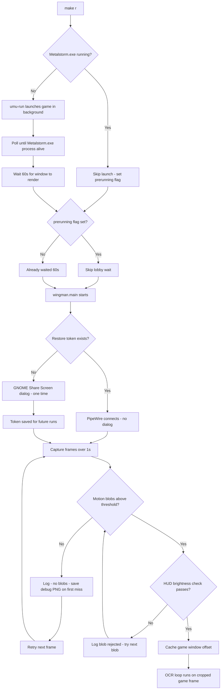

# ADR 053 — Linux One-Command Launch: `make r`

| Status   | Date       | Wingman Version |
|----------|------------|-----------------|
| Draft    | 2026-06-15 | 1.6.19          |

## Context

On Linux (GNOME Wayland, Ubuntu 24.04), the goal is a single `make r` command that:

1. Launches MetalStorm automatically (no manual Heroic click)
2. Sets up PipeWire screen capture (no manual dialog interaction after first run)
3. Detects the game window position on screen automatically
4. Starts Wingman and begins OCR-driven automation

As of ADR 050 (PipeWire capture) and ADR 049 (Linux migration), capture and game launch were each solved separately. This ADR documents the remaining gap: wiring them into a single reliable launch flow and solving game window position detection.

## Problem Statement

`make r` was not working end-to-end due to three blocking issues:

### 1. Game window position unknown

PipeWire captures the full 3840×1600 ultrawide monitor. MetalStorm runs at 1920×1200 somewhere within that frame. The capture code needs to know where to crop.

Approaches tried and ruled out:

| Approach | Result |
|---|---|
| `xwininfo -root -tree` for Wine Desktop | No Wine Desktop window exists — DXVK bypasses XWayland entirely; no X11 surface is created |
| `xdotool search` | 0 windows found (same reason) |
| GNOME Shell `Eval` | Returns `(false, '')` — blocked in GNOME 46 |
| GNOME Shell `Introspect.GetWindows` | `AccessDenied` in GNOME 46 |
| GNOME Shell `Introspect.GetRunningApplications` | `AccessDenied` in GNOME 46 |
| PipeWire window picker (`types=2`) | MetalStorm does not appear — DXVK surfaces do not register as `xdg-toplevel` with app-id |
| Corner-based background detection | Fails when desktop wallpaper is dark and entire screen is covered by apps |

**Why "Wine Desktop" X11 detection works here (and is now the primary method):**
Classic Wine applications create an X11 "Wine Desktop" window findable via `xwininfo`. Initial investigation concluded that DXVK games had zero X11 presence — but that xwininfo was run while the game was *not running*. When MetalStorm IS running via GE-Proton, `xwininfo -root -tree` reveals:

```
0x8007fc "Wine Desktop" (mutter-x11-frames):  1948x1266  abs(202,170)
  └─ 0xe00009 "Wine Desktop" (steam_app_0):   1920x1200  abs(216,219)
      └─ 0x2600003 "Metalstorm" (steam_app_0): 1920x1200  abs(216,219)
```

The outer frame (mutter-x11-frames) is the XWayland window decoration. The inner "Metalstorm" window at absolute position (216, 219) is the actual game surface. Even though DXVK renders Wayland surfaces for the game content, Wine's window-management layer still registers XWayland windows with exact position and size.

This is now the **primary detection method** in `_PipeWireBackend._detect_via_x11()`: look for an X11 window titled `"Metalstorm"` or `"Wine Desktop"` with class `steam_app_0` matching the configured game dimensions. The absolute position from xwininfo maps 1:1 to the PipeWire monitor frame coordinates (verified on a 3840×1600 single-monitor setup with 100% scaling). Frame differencing is retained as a fallback for cases where no matching X11 window is found.

**Solution adopted: frame differencing**

The game renders at 30+ fps so its pixels change between consecutive frames, while VS Code and the browser are mostly static. Two frames captured ~500ms apart produce a motion mask; the largest moving blob is the game window.

Implementation in `_PipeWireBackend._detect_game_offset()`:
- Captures 3 frame pairs spaced 200ms / 300ms / 500ms apart
- Takes the per-pixel maximum difference across all pairs (accumulation handles near-static lobby screens)
- Dilates the motion mask with a 40×40 kernel to merge nearby motion pixels into solid blobs
- Picks the largest contour; rejects if area is less than 3% of expected game area (filters cursor blinks)
- Clamps the detected top-left so the crop fits within the monitor frame

First successful detection (2026-06-15 session):
```
PipeWireBackend: game detected via frame-diff at (1920, 400) in 3840x1600 monitor
  (motion blob: 2338,1048 1502x548 area=524317)
```

A `game_window_offset: {x: null, y: null}` config option is also available as a manual override if auto-detection is needed to be bypassed.

Detection is cached after the first successful frame. The cache is invalidated every 30 frames so the position is re-verified if the window moves.

### 2. PipeWire portal required manual interaction on first run

The XDG Desktop Portal ScreenCast session shows a GNOME "Share Screen" dialog on first use. A restore token (`~/.config/wingman/pw_restore_token.json`) is saved after the user grants access; subsequent runs skip the dialog entirely.

Investigated but ruled out:
- `types=2` (Window picker): MetalStorm does not appear in the window list (same DXVK reason as above)
- `types=1` (Monitor) is the only option; full monitor frame is captured and game is located via frame differencing

After the first one-time grant, `make r` requires no dialog interaction.

### 3. Game launch timing

When MetalStorm is freshly launched via `umu-run`, the process exists within seconds but the game window is not rendered on screen for 20–30 seconds. The original 20s flat sleep was insufficient on some runs.

Changes made to `Makefile`:
- `GAME_LOBBY_WAIT_S` increased to 30s (configurable)
- Wingman itself retries frame-diff detection every 30 frames (~45s), so a transient miss at startup is recovered automatically

### 4. Makefile heredoc syntax error

The `capture-frame` Makefile target used a bash heredoc (`<< 'EOF'`) whose body lines lacked leading tabs. This caused `make r` to fail with `missing separator`. Fixed by extracting the script to `wingman/capture_frame_debug.py`.

### 5. Frame-diff false positive: YouTube video detected as MetalStorm

After frame differencing was added, it correctly detected the game in some runs but in others identified the YouTube video playing in Brave browser as the game (motion blob at (63, 267) — the left side of the ultrawide where the browser sits). This caused OCR to run on browser content instead of the game, producing no state transitions.

**Root cause:** YouTube renders at 30fps just like the game, producing a large motion blob that passes the area threshold. The frame-diff approach alone cannot distinguish game content from browser video.

**Fix:** Added `_PipeWireBackend._looks_like_game()` verification after motion blob detection. Each candidate crop is checked for two MetalStorm-specific pixel signatures:
- Bottom 12% of frame (the dark health/ammo HUD bar): mean brightness < 35
- Top-right 15% of frame (the dark radar/status area): mean brightness < 35

YouTube videos fail both checks (bright, varied color content at all positions). The detection now iterates all blobs largest-first and returns the first one that passes both checks.

### 6. `pkill -f Metalstorm.exe` killed make itself

When the `launch-game` Makefile target was updated to kill and relaunch stale game instances, using `pkill -f Metalstorm.exe` inside the recipe caused make to terminate with `Terminated`:

```
MetalStorm already running — killing stale instance before relaunch…
make: *** [Makefile:251: launch-game] Terminated
```

**Root cause:** Make passes the entire recipe string to `sh -c "..."`. The recipe literally contained the text `Metalstorm.exe` (as part of the `pgrep` check and the `pkill` call). The shell process's `/proc/pid/cmdline` therefore contains `Metalstorm.exe` as a substring. When `pkill -f Metalstorm.exe` ran, it matched and killed its own parent shell, which in turn killed make.

**Fix:** The pattern is split through a shell variable so the literal string `Metalstorm.exe` never appears in the shell's command line argument:

```makefile
@_p=Metalstorm; \
 if pgrep -f "$${_p}.exe" > /dev/null 2>&1; then \
   pkill -f "$${_p}.exe" 2>/dev/null || true; \
   sleep 3; \
 fi
```

The shell's `-c` argument contains `${_p}.exe` — the string `Metalstorm.exe` is only formed at runtime after variable expansion, so it is never present as a literal substring in `/proc/pid/cmdline`. `pkill` therefore cannot match the recipe shell.

**Rule for future Makefile recipes:** Never use `pkill -f <pattern>` where `<pattern>` appears literally in the same recipe. Split the pattern through a shell variable.

### 7. Kill-and-relaunch causes window to go behind VS Code

An earlier revision of `launch-game` always killed any running MetalStorm process and relaunched fresh, hoping the new window would come to the foreground. This caused two problems:

1. **Game crashed after relaunch**: `pkill -f "${_p}.exe"` also matches umu-run (its cmdline contains the game path), killing the parent. The subsequent new umu-run launch left wineserver in an intermediate state, causing the game process to crash shortly after appearing in pgrep.

2. **Window went behind VS Code**: Even when the game didn't crash, the new Wine window was created after VS Code already had compositor focus. On GNOME Wayland, the new window opened behind VS Code, making it invisible to PipeWire's compositor output. Frame-diff detection then saw VS Code pixels where the game should be.

**Fix:** `launch-game` skips relaunch when the game is already running. A freshly launched window from a cold start (game not running at all) does come to the foreground naturally, as GNOME gives focus to newly created windows. Wingman's detection retries continuously until the window is visible, so a slow-loading game is handled without requiring an exact lobby wait time.

## Decision

**Frame differencing + HUD verification for automatic game window detection.** No manual configuration required after the one-time PipeWire portal grant.

The detection accumulates motion across multiple frame pairs rather than a single diff to handle the MetalStorm lobby screen (which has very little visible animation). Candidate blobs are validated against MetalStorm's dark HUD signature before being accepted — this rejects browser video and other animated desktop content. All detection decisions (blob count, areas, HUD brightness values) are logged at INFO level so failures can be diagnosed without debug mode.

`launch-game` skips relaunch if the game is already running. When the game is not running, umu-run launches it fresh; the new GNOME window naturally comes to the foreground. The `pkill` variable-split pattern from issue 6 is retained for any future use but is no longer applied on every run.

A manual `game_window_offset: {x: N, y: N}` config escape hatch is retained for environments where auto-detection is unreliable. A debug frame is saved to `/tmp/wingman_detect_fail.png` on the first detection miss.

## `make r` Flow (Resolved State)



## Consequences

**Positive:**
- `make r` is a single command with no manual steps after initial PipeWire grant
- Frame-diff detection is resolution-agnostic — works regardless of monitor size or window placement
- Detection retries silently until the game window becomes visible (handles slow loading)

**Negative / Risks:**
- Game window must be visible on screen (not minimised, not on a different workspace) for detection to succeed — there is no Wayland API to programmatically focus or enumerate DXVK windows
- Detection takes ~1s at startup (frame pair accumulation)
- If the game shows a completely static screen during the detection window (unlikely but possible on very slow hardware), auto-detection fails and `game_window_offset` must be set manually

## Open Items

- Mouse click injection on Linux (pynput) — controller clicks do nothing yet
- `sudo usermod -aG input $USER` needed for keyboard hotkeys
- ADR 049 and ADR 050 should be updated to reference this ADR for the window-detection gap they left open

## References

- [ADR 049](049-linux-migration-game-and-automation-layer.md) — Linux migration: game launch via umu-run
- [ADR 050](050-wayland-screen-capture.md) — PipeWire screen capture on GNOME Wayland
- [Job Aid 011](../job-aids/011-wingman-keybindings.md) — Linux keybindings manual configuration
- `wingman/capture.py` — `_PipeWireBackend._detect_game_offset()`
- `wingman/portal.py` — XDG Desktop Portal ScreenCast session management
- `Makefile` targets: `r`, `launch-game`, `wait-game`, `find-game`, `setup-capture`
