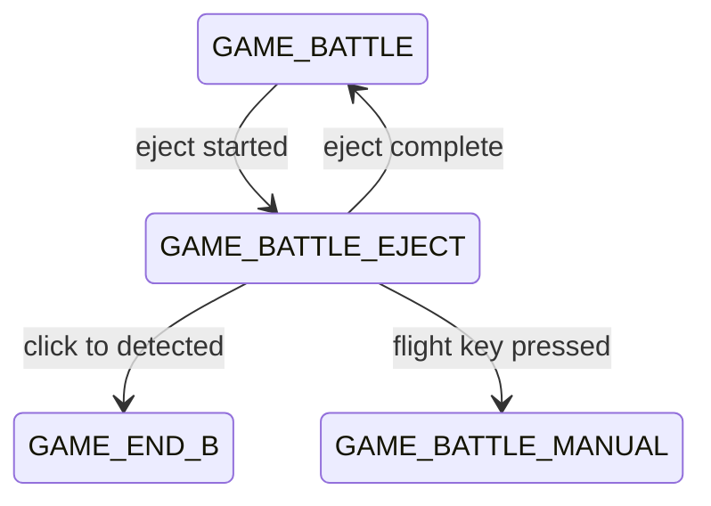

# ADR 056 — GAME_BATTLE_EJECT FSM State

| Status   | Date       | Wingman Version |
|----------|------------|-----------------|
| Accepted | 2026-06-28 | 1.6.22          |

*Accepted 2026-08-02: implemented in full (checklist below all ticked) and
live-proven across every session since. Two corrections applied at acceptance
— see "Corrections at acceptance" at the end.*

## Context

When missiles are exhausted during `GAME_BATTLE`, `ctrl.eject_and_dive()` is called from `main.py`. The method cancels the mission, holds `NOSE_DOWN` for 5 seconds, then holds `AFTERBURNER` until respawn is detected (up to 120 seconds). Throughout this entire sequence the FSM remains in `GAME_BATTLE`.

This creates several problems:

- The rest of the system has no way to detect that an eject sequence is in progress.
- `GAME_BATTLE` scans (incoming missile alerts, health checks, mission logic) continue running during a 120-second eject where they serve no purpose.
- Adding new behaviour during the eject (throttle, phase 3 actions) requires coupling directly into `controller.py`'s `_run()` closure rather than hanging it on a well-defined FSM state entry.
- Replay assertions cannot distinguish a normal battle frame from an eject frame.
- The manual takeover handler in `controller.py` already detects flight key presses during `_ejecting.is_set()` but gates the `manual_takeover` FSM event on `game_state == GAME_BATTLE` (line 728), so once `GAME_BATTLE_EJECT` exists the FSM would get stuck if the player presses a flight key during the eject.

ADR 015 and ADR 025 established the FSM and state transitions. ADR 038 introduced altitude and speed signals used during eject-and-dive. This ADR extends those decisions to make the eject sequence a first-class FSM state.

## Decision

Add `GAME_BATTLE_EJECT` as a new `GameState` enum value. Transition into it when an eject sequence starts and out of it when the sequence ends (respawn detected, timeout, or cancellation).

### FSM transitions added



### Transition triggers

| Trigger | Source | Destination | Condition |
|---|---|---|---|
| `eject_started` | `GAME_BATTLE` | `GAME_BATTLE_EJECT` | missiles empty confirmed |
| `eject_complete` | `GAME_BATTLE_EJECT` | `GAME_BATTLE` | respawn detected, timeout, or End key cancel |
| `click_to_detected` | `GAME_BATTLE_EJECT` | `GAME_END_B` | end-of-battle screen during eject |
| `manual_takeover` | `GAME_BATTLE_EJECT` | `GAME_BATTLE_MANUAL` | flight control key pressed |

### Trigger firing points

**`eject_started`** — fired in `main.py` `_handle_no_missiles()` immediately before `ctrl.eject_and_dive()`.

**`eject_complete`** — fired via an `on_complete` callback passed to `eject_and_dive()`:

```python
# main.py
analyzer.trigger_event("eject_started")
ctrl.eject_and_dive(
    on_complete=lambda: analyzer.trigger_event("eject_complete")
)
```

`eject_and_dive()` gains an `on_complete=None` parameter. The callback is invoked in the `_run()` thread's `finally` block after all keys are released, whether the eject completed normally, timed out, or was cancelled by the End key. This keeps the FSM coupling in `main.py` rather than in `controller.py`.

**`click_to_detected`** — existing transition table entry updated to include `GAME_BATTLE_EJECT` as a source:

```python
{"trigger": "click_to_detected",
 "source": ["GAME_BATTLE", "GAME_BATTLE_MANUAL", "GAME_BATTLE_EJECT"],
 "dest": "GAME_END_B"},
```

The game can end (time limit, opponent win) while an eject is in progress. Without this, the FSM would get stuck in `GAME_BATTLE_EJECT`.

**`manual_takeover`** — the existing transition table entry updated to include `GAME_BATTLE_EJECT` as a source:

```python
{"trigger": "manual_takeover",
 "source": ["GAME_BATTLE", "GAME_BATTLE_EJECT"],
 "dest": "GAME_BATTLE_MANUAL"},
```

The manual takeover gate in `controller.py` (currently `if self._analyzer.game_state == GameState.GAME_BATTLE:` at line 728) must be extended to:

```python
if self._analyzer.game_state in (GameState.GAME_BATTLE, GameState.GAME_BATTLE_EJECT):
```

Without this change, pressing a flight key during eject cancels the eject via `_eject_stop.set()` but never fires `manual_takeover`, leaving the FSM stuck in `GAME_BATTLE_EJECT`.

On `manual_takeover` from `GAME_BATTLE_EJECT`, `_eject_stop.set()` is already called by the existing handler before `trigger_event`, so the eject thread exits cleanly and the `on_complete` callback fires `eject_complete` — but because the FSM has already transitioned to `GAME_BATTLE_MANUAL`, the `eject_complete` trigger must be a no-op from that state. Add a self-loop or make the trigger a no-op when source is not `GAME_BATTLE_EJECT`:

```python
{"trigger": "eject_complete",
 "source": "GAME_BATTLE_EJECT",
 "dest": "GAME_BATTLE"},
```

Because `source` is restricted to `GAME_BATTLE_EJECT`, firing `eject_complete` from `GAME_BATTLE_MANUAL` will raise a `MachineError` unless the `transitions` machine is configured with `ignore_invalid_triggers=True` (check existing machine config). If not, wrap the callback:

```python
on_complete=lambda: (
    analyzer.trigger_event("eject_complete")
    if analyzer.game_state == GameState.GAME_BATTLE_EJECT
    else None
)
```

### Throttle activation

`AFTERBURNER_KEY = 'e'` is held throughout the eject sequence to maximise speed during the dive. This is already implemented inside `eject_and_dive()` — the key is pressed after the mission thread exits and released in the `finally` block whether the eject completes, times out, or is cancelled. No additional key management is required for the state entry; creating `GAME_BATTLE_EJECT` makes this existing behaviour visible at the FSM level.

### FSM entry hook

`on_enter_GAME_BATTLE_EJECT` is added to `analyzer.py` (alongside `on_enter_GAME_BATTLE_MANUAL`) and logs only:

```python
def on_enter_GAME_BATTLE_EJECT(self):
    logger.info("FSM: entering GAME_BATTLE_EJECT — eject sequence active")
```

No controller reference is needed in the analyzer. All key management stays in `controller.py`.

### State crop set

`GAME_BATTLE_EJECT` is added to `_STATE_CROPS` with the same crops as `GAME_BATTLE`:

```python
GameState.GAME_BATTLE_EJECT: {
    "respawn", "HEALTH", "AMMO_MISSILE",
}
```

Crop names are the config keys, which are case-sensitive. An earlier draft of
this ADR wrote `"health"`/`"ammo_missiles"`; those match no key, so
`crops_for_state()` silently filtered them out and eject-time debug
screenshots lost their HEALTH/AMMO overlays. Shipped that way and fixed as
code-review finding CR-013-6.

Respawn detection must remain active so `eject_complete` fires on respawn. Incoming and other battle scans are naturally suppressed — any branch gating on `GameState.GAME_BATTLE` will not match during eject.

### `_battle_states` membership

`GAME_BATTLE_EJECT` joins the battle-state set used to decide when target
tracking resets:

```python
_BATTLE_STATES = frozenset({GAME_BATTLE, GAME_BATTLE_MANUAL, GAME_BATTLE_EJECT})
```

`target_tracker.reset()` fires only when moving from a state **in** that set to
one **outside** it. All three battle states are members, so no reset happens on
`GAME_BATTLE → GAME_BATTLE_EJECT` or `GAME_BATTLE_EJECT → GAME_BATTLE_MANUAL`;
it fires on e.g. `GAME_BATTLE_EJECT → GAME_END_B`.

*Location note (2026-08-02):* this set lived in `main.py` as `_battle_states`
when the ADR was written. ADR 060 Phase 2 moved the rule into
`TrackingHudHandler.on_state_change()` with the set as
`tick_handlers._BATTLE_STATES`. (`mission_stats.py` keeps its own
string-keyed `_BATTLE_STATES` for ADR 059's mission-boundary accounting —
a separate concern that happens to share the name.)

`GAME_BATTLE_EJECT` is **not** added to health-check, mission-restart, or incoming-alert branches that gate on `GameState.GAME_BATTLE` specifically. Those scans are suppressed during the eject by design.

## Implementation checklist

- [x] `analyzer.py` — add `GAME_BATTLE_EJECT` to `GameState` enum
- [x] `analyzer.py` — add `GAME_BATTLE_EJECT` entry to `_STATE_CROPS`
- [x] `analyzer.py` — add `eject_started` and `eject_complete` to FSM transition table
- [x] `analyzer.py` — extend `click_to_detected` and `manual_takeover` source lists
- [x] `analyzer.py` — add `on_enter_GAME_BATTLE_EJECT` log method
- [x] `analyzer.py` — `ignore_invalid_triggers=False` confirmed; `eject_complete` callback guarded with state check in `main.py`
- [x] `controller.py` — add `on_complete=None` parameter to `eject_and_dive()`; call after key release
- [x] `controller.py` — extend manual takeover gate from `== GAME_BATTLE` to `in (..., GAME_BATTLE_EJECT)`
- [x] `main.py` — fire `eject_started` before `ctrl.eject_and_dive()` in `_handle_no_missiles()`
- [x] `main.py` — pass `on_complete` callback to `ctrl.eject_and_dive()`
- [x] `main.py` — add `GAME_BATTLE_EJECT` to `_battle_states`
- [x] `analyzer.py` — add `GAME_BATTLE_EJECT` to background OCR state gate so respawn detection runs during eject (without this, eject loop never saw `game_battle_alive=True` and ran until 120s timeout)
- [x] `tests/runtime_replay_validate.py` and `runtime_live_validate.py` — confirmed no changes needed; `missiles_empty` capture event unchanged; `PASS` after OCR gate fix

## Consequences

**Benefits**

- The FSM accurately reflects runtime: logs, replay assertions, and the HUD overlay can all display the eject phase explicitly.
- Phase 3 behaviour during eject can be added as state-entry hooks rather than embedded in `controller.py` internals.
- Unnecessary OCR work (incoming, health beyond respawn detection) is suppressed for up to 120 seconds per eject cycle.
- Manual takeover during an eject is now a clean FSM transition rather than a silent state mismatch.

**Trade-offs**

- `eject_and_dive()` gains an `on_complete` callback parameter; callers that do not pass it get the existing behaviour unchanged.
- The `eject_complete` trigger must be guarded against firing from the wrong source state (see `ignore_invalid_triggers` note above).
- Replay path YAML and validation scripts must be updated to expect the new state name in transition logs.

## References

- ADR 015 — Game State Machine
- ADR 025 — Formalise Game State Machine
- ADR 038 — Altitude and Speed Signals for Phase 3 and Eject-Dive
- `wingman/analyzer.py` — `GameState` enum, `_STATE_CROPS`, FSM transition table, `on_enter_GAME_BATTLE_MANUAL`
- `wingman/controller.py` — `eject_and_dive()`, `stop_eject_sequence()`, `_check_for_manual_takeover()` line 728
- `wingman/main.py` — `_handle_no_missiles()`, `_battle_states`


## Corrections at acceptance (2026-08-02)

Two places where this document had drifted from the shipped code:

1. **Crop-set snippet documented a defect.** The `_STATE_CROPS` example used
   lowercase `"health"`/`"ammo_missiles"`, which match no config key. That is
   what was implemented, and it silently dropped the HEALTH/AMMO overlays from
   eject-time debug screenshots until CR-013-6 caught it. The snippet now shows
   the correct `"HEALTH"`/`"AMMO_MISSILE"`.
2. **`_battle_states` location was stale.** ADR 060 Phase 2 moved the
   battle-state set and the tracker-reset rule out of `main.py` into
   `tick_handlers.py`. The section is updated, and its garbled parenthetical
   about which states are members has been replaced with the actual rule.

Neither correction changes the decision — only its description.
