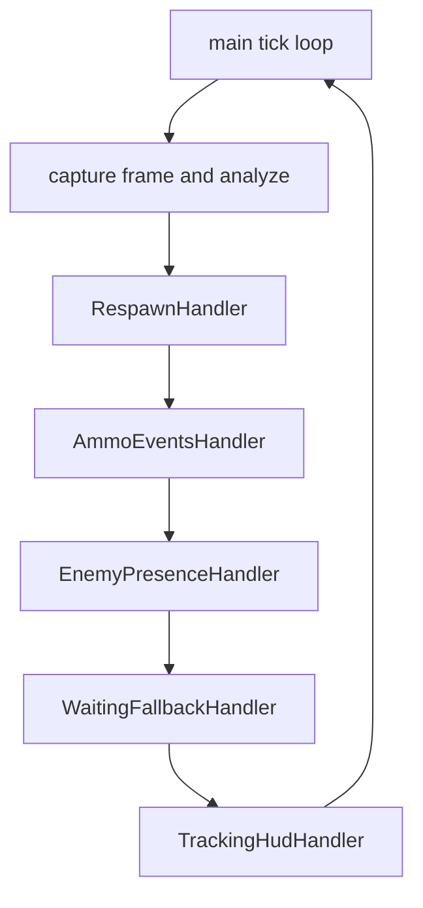

# ADR 060 — Tick-Loop Handler Objects and Typed Event Registry

| Status | Date       | Wingman Version |
|--------|------------|-----------------|
| Draft  | 2026-08-01 | 1.6.29          |

Extends [ADR 039](039-reduce-orchestration-coupling-first.md) (Accepted).
ADR 039 established the `set_on_*` orchestration API to decouple the analyzer
from the controller; this ADR supersedes ADR 039 only on the *mechanism* of
that API (single-slot setters become a typed multi-subscriber registry) and
keeps its direction-of-dependency decision intact. Also builds on the
consolidation precedent set by [ADR 059](059-health-gated-immediate-mission-restart.md).

## Status of this document

**Draft — awaiting review. No implementation has been started.** This ADR
exists so the refactor can be evaluated and approved (or rejected/deferred)
before any code changes. Each phase below is independently shippable and
independently abandonable.

## Context

Three structural pressure points have accumulated, measured on v1.6.29:

| File | Lines (v1.6.23, CR-013) | Lines (v1.6.29) | Growth |
|------|------------------------|-----------------|--------|
| `wingman/main.py` | 1195 | 1228 | +3% |
| `wingman/analyzer.py` | 2076 | 2361 | +14% |
| `wingman/controller.py` | 1851 | 2555 | +38% |

**1. `main()` is a single ~1100-line function** (`wingman/main.py:129`) whose
tick loop coordinates every runtime concern through roughly 25 loop-local
variables (`main.py:484-510`) and 10 nested closure handlers
(`_handle_no_missiles`, `_handle_alive_transition`, `_handle_low_flares`,
`_deploy_flares_on_new_incoming`, etc.), 6 of which mutate shared state via
`nonlocal`. Concerns that must not interact still share one namespace:

- **CR-013-4** (code review 013): the eject-interrupt call sat inside the
  respawn-restart dedup cooldown branch, so a respawn within 10 s of a prior
  one never released afterburner — two unrelated concerns coupled by
  accidental block nesting.
- **ADR 059's motivating failure**: three overlapping restart mechanisms in
  the same function, unaware of each other's gating assumptions, produced an
  uncommanded aircraft in production (2026-07-31 07:42). The fix — delete the
  competing paths and give one mechanism sole ownership — is the pattern this
  ADR generalizes.

**2. The analyzer's orchestration hooks are 7 single-slot setters**
(`analyzer.py:951-984`, from ADR 039) plus ~28 more informal `self._on_*`
attributes. Two concrete costs, both live today:

- `set_on_fsm_transition` holds **one** callback, so replay assertions, live
  capture, and `MissionStatsTracker` are wired as mutually exclusive
  `if/elif/else` branches (`main.py:453-478`). Mission statistics are silently
  not recorded during replay or capture runs — not by design, but because the
  slot cannot multiplex.
- Registration is stringly and unchecked: a typo'd hook name or a
  double-registration overwriting an earlier subscriber fails silently at
  runtime (the same defect class as CR-013-6's crop-key typo and CR-013's
  duplicate lobby-stall/escape loops).

**3. `controller.py` grew 38% in two weeks** (ADR 058 closed-loop eject).
`eject_and_dive` is now a multi-phase stateful sequence (nose-down hold,
telemetry confirmation, correction budget, post-release observation, decay
re-entry) implemented as a nested thread function inside a 2555-line class.

The condition stated when this refactor was first proposed — "only pays off if
more features are planned in this area" — is now met: ADR 055, 056, 058, and
059 all landed in this code within six weeks.

## Decision

Two changes, ordered cheapest-first. Phase 1 does not depend on Phase 2.

### Phase 1 — Typed event registry (analyzer orchestration)

Replace the single-slot `set_on_*` setters with one small registry owned by
the analyzer:

```python
class GameEvent(Enum):
    CANCEL_MISSION = auto()
    START_GAME_STARTING_LOOP = auto()
    LOBBY_PLAY_CLICK = auto()
    LOBBY_POPUP_CLICK = auto()
    LOBBY_STALL = auto()
    FSM_TRANSITION = auto()
    RESPAWN_DETECTED = auto()

# analyzer side
def subscribe(self, event: GameEvent, callback, *, name: str) -> None: ...
def emit(self, event: GameEvent, *args) -> None: ...
```

Properties the current mechanism lacks:

- **Multi-subscriber**: `FSM_TRANSITION` fans out to replay assertions, live
  capture, and stats simultaneously — the `if/elif/else` exclusivity in
  `main.py:453-478` disappears, and `MissionStatsTracker` records during
  replay/capture lanes too.
- **Registration-time failure**: subscribing to a nonexistent event is an
  `Enum` attribute error at wiring time, not a silent no-op at runtime.
  Duplicate `name` registration raises immediately instead of silently
  replacing the earlier subscriber.
- **Uniform dispatch guard**: `emit()` wraps each callback in the
  try/except-log pattern currently copy-pasted at every `_on_*` call site,
  and is the single place to enforce the existing rule that callbacks fired
  from background threads must not block.

The 7 ADR 039 setters migrate first; the ~28 informal `self._on_*` attributes
migrate opportunistically as their call sites are next touched (no big-bang).
The old setters remain as thin deprecated shims delegating to `subscribe()`
until the last caller is gone, so the change is non-breaking.

### Phase 2 — Per-concern tick handlers (main loop)

Extract the tick-loop body into small handler objects, one per concern, each
owning the state that today lives as loop-locals and `nonlocal`s. `main()`
keeps setup, wiring, and the loop skeleton; each tick becomes a fixed
sequence of handler calls.



Each handler receives a per-tick context (frame, game state, timestamp) and
holds its own private state:

| Handler | Absorbs today's loop state | Absorbs today's closures |
|---------|---------------------------|--------------------------|
| `RespawnHandler` | `respawn_state`, `respawn_cooldown_until`, `respawn_clear_since`, `missile_ignore_until` | respawn-detection block, `_handle_alive_transition` |
| `AmmoEventsHandler` | `no_missiles_zero_streak`, `last_flare_reload_ts`, `battle_started_ts`, padlock spread counters | `_handle_no_missiles`, `_handle_low_flares` |
| `EnemyPresenceHandler` | `enemy_last_seen_ts` | 30 s disengage block |
| `WaitingFallbackHandler` | `waiting_fallback_score`, `waiting_fallback_consecutive`, `game_waiting_since`, PLAY re-click state | `_update_waiting_fallback` wiring, re-click block |
| `TrackingHudHandler` | tracker/HUD instances, missiles snapshot reuse | tracker update plus HUD render block |

Rules that make this safe rather than cosmetic:

1. **Behavior-preserving by construction**: handlers are extracted one at a
   time, each as a pure code move (same statements, same order), with
   `make tp` (ADR 044 replay gate + ADR 045 live gate) green after every
   single extraction before the next begins.
2. **Cross-handler communication only via the Phase 1 registry or explicit
   return values** — never via shared mutable variables. Where two concerns
   genuinely interact (respawn must interrupt eject), the interaction becomes
   a visible, named event instead of block nesting. CR-013-4 could not have
   been written under this rule.
3. **Handler order is fixed and documented** in the tick loop; the current
   implicit ordering (flares before respawn, respawn `continue` short-circuit)
   is preserved and stated in each handler's docstring.

`eject_and_dive`'s extraction from `controller.py` into its own module is
explicitly **out of scope** here — ADR 058 is still stabilizing in production
and refactoring it now would confound that validation. Revisit after ADR 058
is Accepted.

## What this ADR does not change

- FSM states, transitions, and the `transitions` library usage (ADR 025).
- The analyzer/controller dependency direction (ADR 039's core decision).
- Any timing, threshold, or config value.
- Replay/capture engine interfaces (they become registry subscribers with
  identical callback signatures).

## Consequences

Positive:

- Cross-concern coupling bugs (CR-013-4, ADR 059 class) become structurally
  hard to write: a handler cannot reach another handler's state.
- Mission statistics work in replay/capture lanes for free (multi-subscriber
  FSM hook), improving ADR 044 gate observability.
- New features in this area (the active development zone per ADR 055-059)
  get an obvious, small home instead of growing `main()`.
- Each handler becomes unit-testable without booting the full loop —
  today only `_update_waiting_fallback` is testable because it is the only
  module-level pure function of the group.

Negative / risks:

- `main.py` is the riskiest file in the repo; even pure code moves can
  perturb timing-sensitive behavior. Mitigated by per-extraction gate runs
  (rule 1) and by doing Phase 1 (low risk) first to de-risk the wiring.
- Roughly +150-250 lines of scaffolding (handler classes, context object,
  registry) against the deletion of the closure/nonlocal tangle.
- Two-phase migration leaves a window where both `set_on_*` shims and the
  registry coexist; bounded by migrating all 7 ADR 039 setters in Phase 1
  itself.

## Implementation plan (for review — not started)

| Step | Scope | Gate |
|------|-------|------|
| 1.1 | Add `GameEvent` + registry to analyzer; `set_on_*` become shims | `make test` |
| 1.2 | Migrate `main.py` wiring to `subscribe()`; stats subscribes alongside replay/capture | `make tp` |
| 1.3 | Delete dead `if/elif/else` exclusivity; assert stats JSON written in a replay run | `make tp` |
| 2.1 | Extract `WaitingFallbackHandler` (lowest coupling, partially pure already) | `make tp` |
| 2.2 | Extract `EnemyPresenceHandler` | `make tp` |
| 2.3 | Extract `AmmoEventsHandler` | `make tp` |
| 2.4 | Extract `RespawnHandler` (highest risk — ADR 059 flow; last) | `make tp` + `make tp-full` |
| 2.5 | Extract `TrackingHudHandler`; delete residual loop-locals | `make tp-full` + live session |

Estimated diff size: Phase 1 ~200 lines net; Phase 2 ~600 lines moved,
~100 net new. Each step is a separate commit; any step can be the stopping
point with the codebase left consistent.

## Validation

- `make tp` green after every step (per-step column above); `make tp-full`
  before declaring Phase 2 complete.
- New unit tests: registry semantics (multi-subscriber fan-out, duplicate-name
  rejection, exception isolation per subscriber) and one behavioral test per
  extracted handler pinning its current observable behavior.
- One full live session after Phase 2 with the session summary compared
  against a pre-refactor baseline (mission count, outcomes, respawn count,
  eject episode structure — the 2026-08-01 03:33 session in
  `logs/` is the reference).
- Acceptance criterion for flipping this ADR to Accepted: all steps landed,
  gates green, and one clean production session with no behavioral deltas
  attributable to the refactor.
