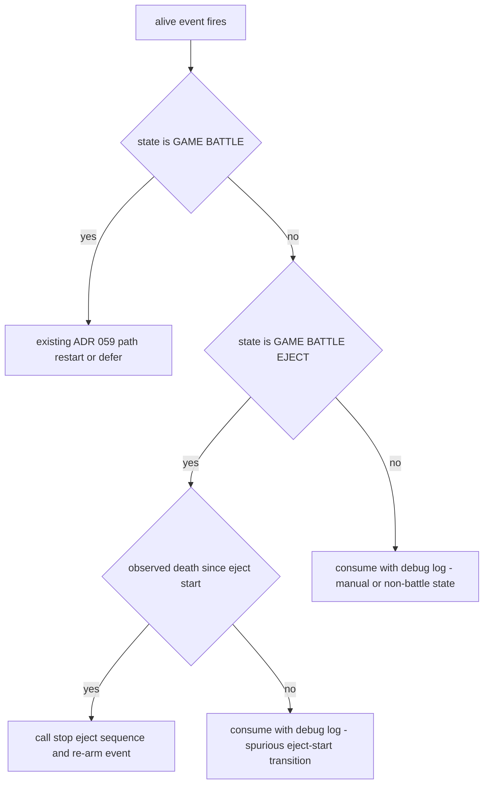

# ADR 061 — Eject Termination via Observed-Death Health Signal

| Status   | Date       | Wingman Version |
|----------|------------|-----------------|
| Accepted | 2026-08-01 | 1.6.29          |

Refines [ADR 059](059-health-gated-immediate-mission-restart.md) (Draft):
extends its alive-event re-arm rule to cover state-gate misses, which ADR 059
covers only for timing deferrals. Interacts with
[ADR 056](056-game-battle-eject-fsm-state.md) (`GAME_BATTLE_EJECT`) and
[ADR 058](058-eject-dive-confirmation-via-raw-descent-rate.md) (eject dive
loop); neither is modified. Third documented instance of the cross-concern
state-gate failure class motivating [ADR 060](060-tick-loop-handlers-and-typed-event-registry.md).

## Context

### Production incident — 2026-08-01 07:52 session

The aircraft flew straight and level at full afterburner, uncommanded, from
08:00:53 until the operator pressed Backspace at 08:01:14 — and would have
continued indefinitely (analysis below). Timeline:

| Time | Event |
|------|-------|
| 08:00:01 | Missiles empty → `eject_and_dive`; FSM → `GAME_BATTLE_EJECT` |
| 08:00:02 | Spurious alive transition (eject's synthetic health-dead reset undone by next healthy OCR read) — consumed harmlessly |
| 08:00:23 | 20 s nose budget exhausted; nose released; afterburner held "until respawn" (120 s safety deadline approx 08:02:23) |
| 08:00:40 | Dive confirmed post-release (alt rate -341 ft per s) |
| 08:00:45 | Ground impact: Health OCR reads **0**, alive=False (observed death) |
| 08:00:45-53 | Game auto-respawns in approx 8 s. Respawn OCR runs every cycle but returns only junk (`FS`, `LABBE`, `KM`, mostly empty) — **overlay never matches** |
| 08:00:53 | Health 250, missiles refilled to 4 → alive transition fires → `alive_event` set |
| 08:00:53 | `_handle_alive_transition` clears the event, passes the stability gates, then fails the `game_state == GAME_BATTLE` check (FSM still `GAME_BATTLE_EJECT`) → **returns silently: event consumed, not re-armed, no log** |
| 08:00:54-08:01:14 | Fresh aircraft, no mission thread, no pending restart, afterburner held by the eject thread → straight full-throttle flight (speed 1302 → 1842, altitude pinned) |
| 08:01:14 | Operator Backspace; shutdown releases the keys |

### The two stacked failures

1. **Respawn-overlay OCR is the sole eject-termination signal, and it missed.**
   `eject_and_dive`'s afterburner hold exits only on `_eject_stop` (set by
   `stop_eject_sequence()` from the respawn-detected path) or the 120 s
   timer. When the overlay is too brief or OCR-illegible, nothing stops the
   eject even though the aircraft already respawned.
2. **The alive event — ADR 059's *only* restart path — is consumed silently
   on a state-gate miss.** ADR 059 re-arms the one-shot event on every
   *timing* deferral (respawn flapping, stability window, teardown), but the
   `GAME_BATTLE`-only gate at `main.py:554` sits *after* the
   `alive_event.clear()`, and its miss path neither re-arms nor logs. With
   the FSM held in `GAME_BATTLE_EJECT` by failure 1, the restart signal for
   that life was destroyed.

### Why it would not have self-recovered

At approx 08:02:23 the 120 s safety would have released afterburner,
completed the eject, and returned the FSM to `GAME_BATTLE` — but the alive
event was already consumed and health was already alive, so no new dead→alive
transition would occur until the *next* death. The aircraft would idle,
inputless, until shot down. The uncommanded window was unbounded, not 120 s.

### Failure class

Identical shape to ADR 059's motivating incident (restart path
`GAME_BATTLE`-gated while the stay-manual rule held `GAME_BATTLE_MANUAL`) and
to CR-013-4 (eject interrupt nested under an unrelated cooldown): a recovery
path gated on one FSM state while a sibling mechanism holds the FSM in
another. Each instance was fixed individually; ADR 060 addresses the class.

### The trap that rules out the naive fix

"Health returned during eject → stop the eject" is wrong on its own.
`eject_and_dive` **synthetically forces health to dead at eject start**
(`controller.py:1526`, to arm the dead→alive transition for the post-respawn
restart). The next healthy OCR read undoes it, firing a spurious alive
transition approx 1 tick into *every* eject (visible at 08:00:02). The naive
fix would self-cancel every eject immediately.

The distinguishing fact: a real respawn is preceded by an **observed** death —
an explicit `Health: 0` OCR reading (`analyzer.py:1660-1662`) — while the
spurious transition is preceded only by the synthetic reset. The 3 s
no-digits fallback (`analyzer.py:1684-1686`) must also not count as observed:
the HUD is frequently obscured or unreadable mid-dive, and an OCR dropout
followed by recovery would otherwise fake a respawn.

## Decision

**1. Track death provenance in the analyzer.**

A new flag alongside `_game_battle_alive` (under `_health_lock`):

- Set **True** only when health OCR reads an explicit numeric value below 1
  **confirmed by the next reading being sub-1 or no-digits** (amended
  2026-08-01 after the 11:01 live session: transient false `Health: 0` reads
  that bounce straight back to healthy occurred 5 times in 20 minutes; a
  single unconfirmed 0 would have spuriously terminated an eject the same
  way. A lone sub-1 read that bounces cancels the pending evidence).
- Set **False** by the eject's synthetic reset, by the no-digits fallback,
  and whenever the alive transition is consumed as respawn evidence.

The alive transition (`analyzer.py:1668-1673`) latches the flag's value at
transition time so the main loop can query "was this alive transition
preceded by an observed death".

**2. During `GAME_BATTLE_EJECT`, an alive transition after an observed death
is respawn evidence: terminate the eject and keep the event.**

In `_handle_alive_transition`, replace the silent fall-through with explicit
disposition of every case:

The `stop_eject_sequence()` call releases afterburner within one poll cycle
(0.5 s); the eject thread's finally block fires `eject_complete`, the FSM
returns to `GAME_BATTLE`, and the re-armed event restarts the mission through
the unchanged ADR 059 path on the next tick. Expected recovery latency from
health-return to mission restart: 2-4 ticks (3-6 s) instead of never.

**3. No silent consumption of `alive_event`, ever.**

Every disposition branch logs (debug level for the benign consumptions, info
for eject termination). The 08:00:53 event vanished without a trace; a
one-line log would have made this a 30-second diagnosis instead of a forensic
reconstruction.

**4. Explicit non-decisions.**

- Eject termination via the health signal fires **only**
  `stop_eject_sequence()` plus the event re-arm — it does *not* emit the
  `respawn_detected` plumbing (stats respawn count, missile-ignore window,
  capture hook). Missed-overlay respawns therefore remain uncounted in
  session stats until ADR 062 Phase B makes the health signal the primary
  detector. (Resolved 2026-08-01 review: keep 061 minimal rather than
  duplicating event-emission logic that ADR 062 restructures.)
- `GAME_BATTLE_MANUAL` alive transitions are still consumed (now with a log):
  a manually flown aircraft that regains health must not trigger automation.
  ADR 059 decision 1 already routes manual-mode *deaths* back to auto.
- The respawn-detected OCR path is unchanged and remains primary — in the
  2026-08-01 03:33 session all 17 respawns were OCR-detected and this
  fallback would never have fired. This ADR adds a second exit, it does not
  re-tune the first.
- Missile-refill corroboration (missiles jumped 0 → 4 at the respawn) was
  considered as an additional guard and rejected: it adds an OCR dependency
  to a path whose purpose is surviving OCR failure, and the observed-death
  latch already excludes every known spurious source.

## Consequences

- Respawn-overlay OCR is no longer a single point of failure for eject
  termination; the uncommanded-flight window after an OCR-missed respawn
  drops from unbounded to a few ticks.
- Every eject still terminates by exactly one of: respawn OCR (primary),
  observed-death health signal (new), 120 s safety timer (unchanged
  backstop), or operator cancel.
- The synthetic-death arming trick in `eject_and_dive` keeps working, and is
  now explicitly modeled instead of being an undocumented interaction that a
  future refactor could silently break.
- One more special-case branch lands in `_handle_alive_transition` — the
  opposite of ADR 060's direction. Accepted consciously: this is a live
  uncommanded-flight bug; if ADR 060 Phase 2 proceeds, this logic moves into
  `RespawnHandler` wholesale, and rule 2 of that ADR (cross-handler contact
  only via named events) is exactly what would have prevented the bug.

## Validation

- Unit tests:
  - synthetic reset does not set the observed-death flag; explicit zero read
    does; no-digits fallback does not.
  - alive transition in `GAME_BATTLE_EJECT` with observed death calls
    `stop_eject_sequence()` and leaves `alive_event` set.
  - alive transition in `GAME_BATTLE_EJECT` without observed death (eject-start
    spurious case) consumes the event and does not touch the eject.
  - alive transition in `GAME_BATTLE_MANUAL` consumes and does not restart.
- Replay: the ADR 044 lane already exercises the OCR-detected path; add the
  missed-overlay case as a unit-level test of `_handle_alive_transition`
  (the replay screenshot set has no missed-overlay sequence to drive it
  end-to-end).
- Live acceptance: an eject ending in ground impact with a missed overlay
  must log the new eject-termination line followed by
  "HEALTH ALIVE — restarting mission immediately", with no manual
  intervention. Reference reproduction: `logs/` session of 2026-08-01 07:52
  (rotated from `wingman.log`), 08:00:01-08:01:14.
- This ADR moves to Accepted only after implementation lands, gates
  (`make tp`) are green, and one live session demonstrates either a
  fallback-path recovery or a full session with zero eject stalls.

**Accepted 2026-08-01** on the zero-eject-stalls criterion: the 11:46 and
17:34 live sessions ran all eject sequences to clean termination (respawn
OCR path), and the new disposition logic is visible working in the 17:34
log — two spurious eject-start alive transitions consumed with the expected
log lines (17:36:19, 17:36:43), none of them cancelling the eject. The
fallback branch itself has not yet fired in a live missed-overlay eject;
its behavior is pinned by unit tests.
