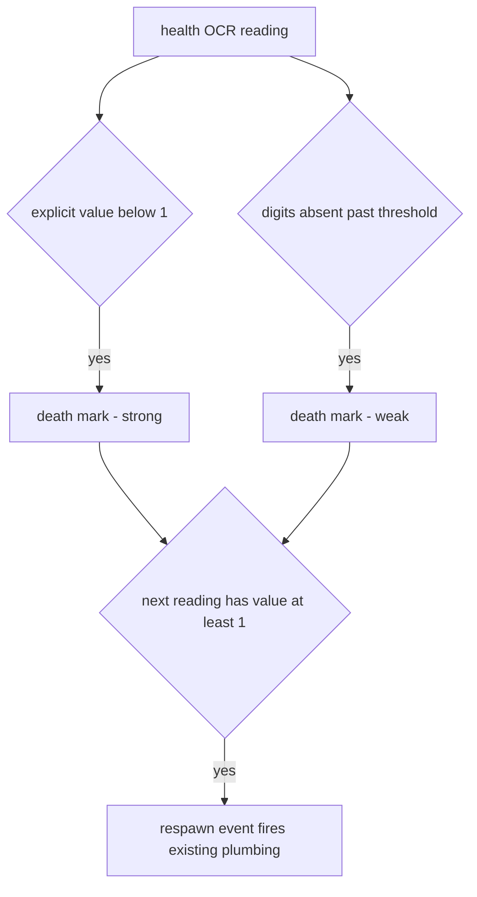

# ADR 062 — Health-Signal Respawn Detection, Retiring Respawn OCR

| Status | Date       | Wingman Version |
|--------|------------|-----------------|
| Draft  | 2026-08-01 | 1.6.29          |

Generalizes [ADR 061](061-eject-termination-via-observed-death-health-signal.md)
(Draft): the observed-death health signal, introduced there as an
eject-specific fallback, becomes the *primary* respawn detector for all
states, and the respawn-overlay OCR crop is retired after a measured
shadow-mode rollout. Refines the input signals of
[ADR 059](059-health-gated-immediate-mission-restart.md) (Draft) without
changing its restart flow. Phase C touches the
[ADR 044](044-deterministic-runtime-replay-gate.md)/ADR 045 replay-gate
assertions. ADR 061 should still be implemented first — it fixes a live
uncommanded-flight bug and builds the death-provenance machinery this ADR
reuses.

## Context

### Motivation

1. **Resource usage.** Respawn OCR runs as one of ~6 parallel crops every
   battle OCR round (mean 0.18-0.20 s of OCR work per ~1.5 s round —
   roughly 13% of battle-state OCR load). Removing it saves CPU and
   thread-pool pressure. Honest framing: it does **not** materially reduce
   round latency, which is bounded by the slowest parallel crop (telemetry,
   ~0.32 s); the win is CPU headroom and thermals, not responsiveness.
2. **Reliability at the moment that matters.** In the 2026-08-01 07:52
   incident (ADR 061), respawn OCR returned junk (`FS`, `LABBE`, `KM`)
   across the entire 8 s respawn window while the health signal identified
   the death (explicit `Health: 0`) and the respawn (`Health: 250`,
   missiles refilled) exactly. The replay screenshot
   `P1_050_RESPAWN_VISIBLE_NO_HEALTH` confirms the overlay blanks the health
   region — so "health digits return with a value of at least 1" is
   simultaneously evidence of *overlay gone* and *aircraft alive*, the two
   facts respawn OCR plus health currently establish separately.

### The trade-off, measured

The proposal accepts two costs: no independent fallback sensor, and possible
false triggers from health-reading dropouts. Session data (2026-08-01 03:33,
37 min, 17 real respawns, 18 ejects, rotated log
`logs/wingman_20260801_041134.log`) sizes the second cost:

| Signal | Count |
|--------|-------|
| Distinct health-dropout episodes (no-digits grace started) | 43 |
| Real respawns (OCR-detected, ground truth) | 17 |
| Explicit `Health: 0` reads | 11 |
| Alive transitions total | 47 |
| Alive transitions explained (17 respawns + 18 eject synthetic resets) | ~35 |
| **Unexplained dropout-recovery transitions** | **~12 (approx one per 3 min)** |

Two conclusions:

- The naive rule "readings missing → death, readings return → respawn" at
  the current 3 s no-digits threshold would fire a **phantom death/respawn
  roughly every 3 minutes of combat**. The health *spike* filter is
  irrelevant here — it rejects wrong values (464, 2250 were both caught);
  dropouts are the *absence* of values, which the filter never sees.
- The blast radius of a false trigger is bounded and self-healing: a phantom
  respawn causes cancel-mission plus restart — the same actions every real
  respawn already causes. Costs are a ~10 s combat-effectiveness gap, a
  missile-ignore window, and stats pollution — not an uncommanded-flight
  class of failure. False triggers are acceptable at *low* frequency; the
  design below is about making them rare, not impossible.

## Decision

### 1. Death marking — two evidence tiers, no synthetic sources

The analyzer marks the aircraft dead when either:

- **Strong:** health OCR reads an explicit numeric value below 1
  (ADR 061's observed-death signal), or
- **Weak:** health digits have been continuously absent for
  `health.death_no_digits_s` (new config key, default **6.0 s** — raised
  from the hardcoded 3.0 s that produced the false-trigger rate above;
  tuned to sit clearly above routine combat dropouts and clearly below the
  ~8 s respawn-overlay duration).

The eject sequence's synthetic health-dead reset (`controller.py:1526`)
never creates a death mark (ADR 061 decision 1 carries over verbatim).

### 2. Respawn inference replaces respawn OCR

The first alive-valued health reading after a death mark **is** the respawn
event. It fires the exact plumbing respawn OCR fires today — the
`respawn_detected` event name, the main-loop respawn block (stop eject,
cancel mission, manual-mode exit, `reset_health_for_respawn`,
missile-ignore window), `MissionStatsTracker` respawn counts, and the
ADR 045 capture hook (called from the same background OCR thread with the
frame that produced the alive reading) — so every consumer is unchanged.

### 3. Derived-signal replacements

Consumers that read the respawn *screen state* rather than the respawn
*event* switch to digits-presence:

- **Respawn-clear stability** (ADR 059's `respawn_clear_since` gate): keyed
  on health digits being continuously present instead of overlay OCR being
  continuously negative.
- **Ammo-update suppression during the overlay** (analyzer): ammo values are
  distrusted while health digits are missing, instead of while respawn OCR
  is positive.
- **`_handle_no_missiles` respawn suppression**: checks the death-mark state
  instead of `get_respawn_cache_result()`.

### 4. Staged rollout — measure before removing the net

- **Phase A — shadow mode.** The health-based detector runs alongside
  respawn OCR, acting on nothing, logging every would-fire decision.
  Exit criteria, evaluated over at least 3 sessions and 30 OCR-detected
  respawns: the shadow detector fires within 5 s of at least 95% of
  OCR-detected respawns, with at most 1 false fire per session.
- **Phase B — primary flip.** The health detector drives the plumbing;
  respawn OCR still runs but only logs disagreement (cheap insurance while
  confidence accumulates).
- **Phase C — retirement.** The respawn crop is dropped from battle OCR
  rounds; the ADR 044 replay-gate assertions and P1_050/P2_040 expectations
  are updated in the same change. The crop calibration stays in
  `config.yaml` (dormant) so re-enabling for diagnosis is a one-line change.

Each phase is a separate commit and a valid stopping point; failing Phase A
criteria means this ADR is rejected by its own data at near-zero cost.

## Consequences

- Battle-round OCR load drops ~13% (one of six parallel crops); round
  latency essentially unchanged (bounded by telemetry OCR).
- Health OCR becomes the single sensor for death and respawn. It already
  was the sole gate for mission restart (ADR 059 removed the
  health-guard-timeout override), so this concentrates existing risk rather
  than creating new risk — and Phase A quantifies it before commitment.
- The false-trigger profile changes from "OCR misreads overlay text"
  (~never fires falsely, but missed the 08:00 respawn entirely) to
  "sustained health dropout mimics death" (bounded, self-healing, rate
  measured in Phase A with the 6 s threshold).
- The ADR 061 eject fallback ceases to be a special case: eject termination
  rides the same respawn event as every other state.
- Replay assets: P1_050/P2_040 keep their screenshots (the overlay still
  blanks health, which is now the *asserted* signal); checkpoint names in
  the ADR 044 validator need a one-time update in Phase C.
- Mission stats respawn counts remain continuous across the cutover (same
  event, same counter).

## Validation

- Unit tests: two-tier death marking (explicit zero vs no-digits window vs
  synthetic reset), respawn event firing on first alive read after each
  death-mark tier, no event without a preceding mark, ammo suppression
  keyed on digits-absence, 6 s threshold honored from config.
- Phase A exit criteria as specified in decision 4, logged per session and
  summarized in the session stats JSON.
- `make tp` green at every phase; Phase C additionally requires
  `make tp-full` (real-OCR lane) with the updated assertions.
- Live acceptance for Accepted status: one full session in Phase C with
  respawn count matching observed gameplay and zero unexplained mission
  cancels.
