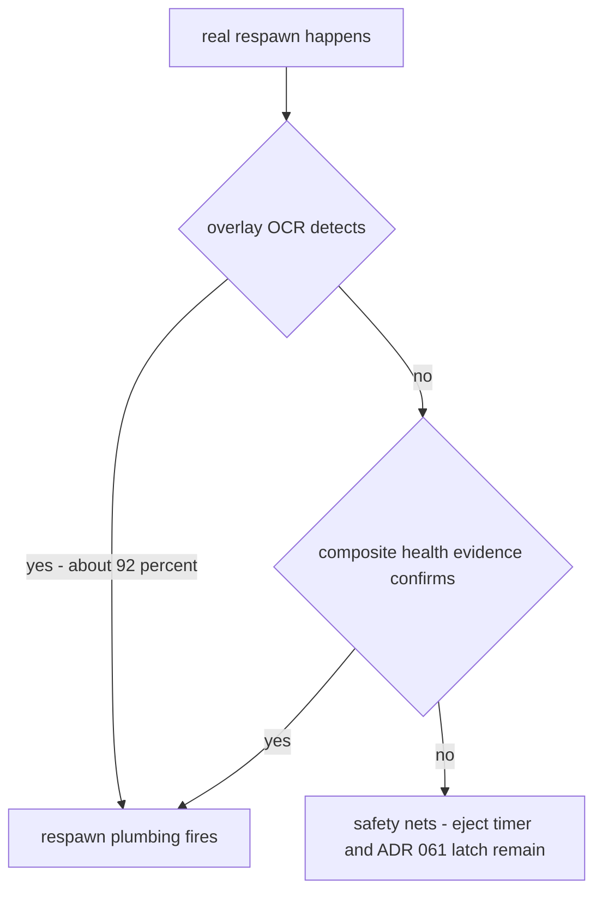

# ADR 064 — Dual-Sensor Respawn Detection with Composite Health Evidence

| Status | Date       | Wingman Version |
|--------|------------|-----------------|
| Draft  | 2026-08-02 | 1.6.29          |

Supersedes [ADR 062](062-health-signal-respawn-detection-retiring-respawn-ocr.md)
(Rejected by its Phase A data): the goal changes from *replacing* respawn OCR
to *backing it up*. Generalizes [ADR 061](061-eject-termination-via-observed-death-health-signal.md)
(Accepted) from an eject-only fallback to all battle states. Built on the
confirmed-value stream of [ADR 063](063-health-ocr-value-confirmation-filter.md)
(Accepted).

**Draft — awaiting review. No implementation started.**

## Context

### What five shadow sessions established

ADR 062's Phase A measured both sensors against 25+ real respawns
(full table in ADR 062's rejection record):

| Sensor | Recall | False fires | Failure cause |
|--------|--------|-------------|---------------|
| Respawn-overlay OCR (primary today) | ~92% (2 known misses) | ~0 | overlay text illegible to OCR (08:00 and 17:41 incidents — both caused real uncommanded-flight/manual-rescue events) |
| Health-signal shadow detector | 72% | **0 in 5 sessions** | short overlays vs the 6 s absence window; hallucinated digits on the overlay resetting the absence clock |

Neither sensor alone clears the bar a *primary* detector needs (~99%,
because a missed respawn is an uncommanded-flight event). But their failure
causes are **uncorrelated** — overlay-text legibility vs health-region
noise — and across every observed session, every real respawn was caught by
at least one of the two. The health signal's five-session zero-false-fire
record makes it safe to let it *act*, not just log.

### Why the health detector's recall is fixable (partially)

The seven Phase A misses decompose into: ~2 round-end artifacts (no
recovery phase existed — not real misses), ~4 evidence-clock failures, and
1 short-overlay case. The clock failures share one mechanism, exposed by
the 03:33–03:36 cluster: the weak tier counts *seconds without raw digits*,
and the OCR hallucinates digits on the respawn overlay — resetting the
clock exactly when absence is the signal. ADR 063 created the fix's
foundation: those hallucinated reads are all **unconfirmed**. A clock
counting *seconds without a CONFIRMED reading* runs straight through
overlay garbage, while mid-combat garbage keeps re-confirming the true
value every 2-3 reads.

## Decision

### 1. Respawn OCR stays primary — permanently

ADR 062's retirement goal (and its ~13% OCR CPU saving) is formally
abandoned. The overlay is the easiest OCR target in the HUD and measured
~92% recall; nothing in this ADR touches its path.

### 2. Composite health evidence (three upgrades to the shadow detector)

1. **Confirmed-absence clock replaces the raw no-digits clock as the weak
   tier's basis.** New config `health.death_no_confirmed_s` (default
   **8.0 s** — above the observed worst-case mid-combat confirmation gap
   in garbage regimes, below the overlay-plus-return cycle). The raw
   no-digits clock remains only for the `_game_battle_alive` flag
   (unchanged ADR 062 behavior).
2. **Decline-conditioned threshold.** When confirmed health fell by at
   least `health.decline_evidence_drop` (default **80**, i.e. ~30% of full)
   within the `health.decline_evidence_window_s` (default **6.0 s**) before
   evidence began accumulating, the required confirmed-absence window is
   halved. Rapid decline is a death prior; it converts short-overlay misses
   where the aircraft died under sustained fire. (Known limit: one-shot
   kills produce no declining reads at the 1.5 s OCR cadence — this is a
   booster, not a guarantee.)
3. **Strong tier unchanged** (ADR 061/063: confirmed sub-1 read, then
   evidence-level confirmation).
4. **Weak-tier fires require the dead→alive transition as corroboration.**
   *(Amended 2026-08-02 after Phase A′ session 1, the 05:37 session.)*
   The instrumentation immediately falsified the 8.0 s assumption: real
   mid-battle confirmed-read gaps reach **11 s** in garbage regimes
   (15 gaps over threshold in one session), overlapping real-respawn gaps
   of 8-11.4 s — **gap length alone cannot separate the two.** That session
   scored 11/12 matched (the recall win the confirmed-absence clock was
   built for) but 9 false fires, every one a *transition-less* weak fire
   (alive never dropped — mid-combat gap), while all 11 matches coincided
   with a real dead→alive transition. Weak evidence therefore only fires
   on the transition; strong-tier evidence is intrinsic and fires on any
   confirmed alive read. Accepted trade: respawns whose overlay hallucinates
   enough digits to keep the raw absence clock reset (the 03:33 class) are
   invisible to the weak tier again — the strong tier and respawn OCR
   remain their cover.

Instrumentation: the shadow summary additionally records the maximum
mid-battle confirmed-reading gap per session (`max_confirmed_gap_s`,
`confirmed_gaps_over_threshold`), which is what caught the 8.0 s
miscalibration in one session.

### 3. Promotion from shadow to active fallback

New `respawn_detection.mode: dual`: composite evidence fires the **full
respawn plumbing** (the same `respawn_detected` event, eject stop, mission
cancel, restart flow, stats) — but only when respawn OCR has not already
detected the episode (the existing `respawn_cooldown_until` dedup window
is the episode boundary). OCR firing first suppresses the fallback;
the fallback firing first is a real detection OCR missed.

### 4. Rollout — shadow-validate the new evidence first

- **Phase A′** (`mode: shadow`, no behavior change): the upgraded evidence
  model is scored by the existing harness. Exit criteria over at least 3
  sessions and 25 OCR-detected respawns: **zero false fires** (stricter
  than ADR 062's ≤1 — this detector will act) and matched ≥ **85%**
  excluding round-end artifacts (the fallback is additive to OCR's 92%;
  at uncorrelated ~8% and ~15% miss rates the combined miss rate is ~1%).
- **Phase B′** (`mode: dual`): fallback goes live. Accepted after one live
  session containing at least one fallback-caught respawn with correct
  restart, or three sessions with zero incorrect fallback fires.
- `health`/`health_only` mode values are removed (dead ADR 062 phases);
  unknown values still warn and fall back to `shadow`.

## Consequences

- The respawn-miss failure class that produced two real incidents gets a
  second, independent sensor; combined observed coverage across all
  sessions to date is 100%.
- A false fallback fire would cancel and restart a live mission — the
  reason Phase A′ requires zero false fires before activation. The
  five-session zero-false record of the current (weaker) evidence model is
  the feasibility evidence.
- The 13% OCR CPU saving is consciously forfeited; ADR 062's performance
  motivation is closed as not-worth-the-risk.
- Round-end artifact misses remain unscored and undetected by design —
  there is no recovery phase to act on.

## Validation

- Unit tests: confirmed-absence clock accumulates through unconfirmed
  reads and true absence, resets on confirmed reads; decline-conditioned
  window halving (with and without the decline prior); `dual`-mode fallback
  fires plumbing only when OCR has not (episode dedup respected); replay of
  the 03:33 garbage-overlay sequence converts from miss to fire.
- `make test` and `make tp` green; ADR 044 replay-lane behavior unchanged
  in `shadow` mode.
- Phase A′/B′ criteria as in decision 4, evaluated from the per-session
  `respawn_shadow` stats blocks.
