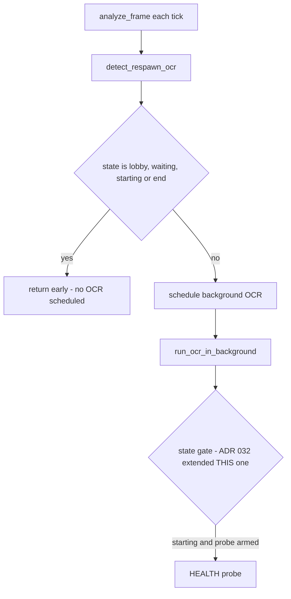

# ADR 065 — Making the GAME_STARTING Battle-Alive Probe Reachable

| Status | Date       | Wingman Version |
|--------|------------|-----------------|
| Draft  | 2026-08-06 | 1.7.1           |

Repairs [ADR 032](032-game-battle-alive-fallback-trigger.md) (Accepted), whose
decision was correct but whose implementation never executed. ADR 032 is not
modified — per the superseding-decisions rule, this ADR records what was found
and what changed.

## Context

ADR 032 designed a battle-alive fallback for `GAME_STARTING`: once health OCR
reads a value during the starting phase, the aircraft is demonstrably in the
world, so the mission can launch immediately instead of waiting on the "Good
Luck" banner and its 13 s post-banner settle.

It shipped in v1.6.6 and appeared to work — the code was present, the event was
armed, the flag was polled. In roughly twenty logged production sessions it
fired **twice**.

### What was actually wrong

ADR 032's Step 1 says:

> The OCR background thread (`analyzer.py:841`) currently skips all processing
> for states outside `GAME_BATTLE / GAME_BATTLE_MANUAL / GAME_END_B`. […] The
> guard must be extended to also execute the `HEALTH` crop scan when the state
> is `GAME_STARTING`.

That guard was extended, correctly. But there are **two state gates in series**,
and ADR 032 only knew about the second one:



`_detect_respawn_ocr` is the only thing that schedules
`_run_ocr_in_background`, and it returned early for `GAME_STARTING` **before**
scheduling anything. So the branch ADR 032 added at the second gate was
unreachable: the thread containing it never started in that state.

The two historical firings were a state race — OCR scheduled while still in
`GAME_BATTLE` and completing after the FSM had moved to `GAME_STARTING`, where
`_run_ocr_in_background` re-reads `self.game_state` and took the extended
branch. Not the designed path.

### Why it went unnoticed for three months

The probe logged only on success. A probe that never ran and a probe that ran
and saw nothing produced identical logs: silence. The same was true of the 13 s
wait, which polled `_in_starting()` only — it could not react to any signal, and
said nothing about why it waited the full window.

Reviewing the 2026-08-05 06:02 session, the 13 s wait window contained **19 log
lines total**, clustered at its two boundaries, with zero OCR activity of any
kind. Adding per-attempt logging made the cause immediate on the first run:

```
GAME_STARTING health probe summary: 0 attempts over 18.8s — NO raw read at any point
Controller: Good-Luck wait ran the full 13s without a battle-alive signal
```

Armed for 18.8 seconds; executed zero times.

## Decision

**1. A dedicated probe scheduler, not an extension of the battle OCR path.**

`_schedule_starting_health_probe(frame)` is called from `analyze_frame` while
the probe is armed. It scans the `HEALTH` crop only, on its own throttle
(`mission.starting_health_probe_interval_s`, default 0.4 s), and runs on its
own short-lived thread.

It deliberately does **not** reuse the respawn OCR scheduling path. That path
returns `self._ocr_cache['result']`, which during `GAME_STARTING` still holds
the last value written in `GAME_BATTLE` — routing the probe through it would
let a stale `is_respawning=True` leak into `GAME_STARTING` and trigger the
respawn flow spuriously. The probe returns nothing and writes only health
state.

**2. `GAME_LOBBY` and `GAME_WAITING` still skip OCR entirely.**

Only `GAME_STARTING`, and only while armed, is exempted. The cheap-matchmaking
property is the reason the gate exists, and a proposal to begin probing 5 s into
`GAME_WAITING` was rejected on measurement: in the 06:02 session `GAME_STARTING`
alone ran 87 seconds before "Good Luck", so probing from `GAME_WAITING` would
scan a crop for over two minutes while the aircraft provably does not exist.

**3. The post-"Good Luck" wait is interruptible.**

It now polls `game_battle_alive` each 0.1 s tick and exits early, logging how
much of the window it saved. This is ADR 032's Step 2, which had only ever been
implemented in the 5-second banner-scan loop, never in the 13-second settle it
was written for. Config: `mission.good_luck_wait_s` (13.0),
`mission.good_luck_bypass_on_alive` (true).

**4. Silence is no longer ambiguous.**

Every probe attempt logs, hit or miss, with elapsed-since-armed. A summary line
on disarm reports attempt count and when a raw value first appeared, or states
plainly that none ever did. The wait logs explicitly when it runs its full
length without a signal.

**5. The unreachable branch is deleted, not left in place.**

The `GAME_STARTING` branch inside `_run_ocr_in_background` is removed with a
comment pointing at its replacement. Dead code that looks live has already cost
this project once (ADR 060's orphaned `target_tracker.reset()`).

## Configuration

```yaml
mission:
  good_luck_wait_s: 13.0                  # post-banner settle; interruptible
  good_luck_bypass_on_alive: true         # end it early on battle-alive
  starting_health_probe_interval_s: 0.4   # probe throttle; currently inert —
                                          # the 1.5s loop_interval_sec binds first
```

## Consequences

- ADR 032's fallback can now execute as designed. Whether it *helps* is a
  separate, still-open question (below).
- Cost when armed: one HEALTH crop OCR (~0.2 s) every 0.4 s for the armed
  portion of `GAME_STARTING` (measured 22-83 s). Nothing changes in lobby or
  matchmaking.
- Behaviour is otherwise unchanged until a probe actually reads health. The
  replay lane went from 0 probe attempts to 12 with no other delta.

## Open question this ADR does not answer

**How early is `HEALTH` readable after "Good Luck"?** Nobody has measured it.
Every "first health" figure in the logs comes from the `GAME_BATTLE` path, which
starts only after the FSM has already advanced — those numbers record when
wingman *started looking*, not when the signal appeared.

The probe summary now produces that measurement. Three outcomes, each implying
a different next step:

| Observation | Meaning | Next step |
|---|---|---|
| First raw read well under 13 s | Time was being wasted | Bypass fires; consider lowering `good_luck_wait_s` |
| First raw read at or after 13 s | 13 s is already about right | Close the question; the constant stands |
| Still no raw read at any point | HEALTH is not on screen during `GAME_STARTING` | Different signal needed — the ammo readout is the next candidate |

The replay lane reports "NO raw read" but proves only that the plumbing works;
synthetic screenshots do not reproduce the real loading sequence. Only a live
session answers this.

### Answered — 2026-08-07 02:42 session (97 min, 16 armed windows)

**Health is readable well inside the wait.** The bypass fired in 10 of 12
windows that reached the settle:

| Outcome | Count |
|---|---|
| Bypass fired (wait cut short) | 10 |
| Ran the full 13 s | 2 |
| Probe never got a raw read | 5 windows |

Bypass fire times: 5.1, 5.8, 6.9, 7.1, 8.1, 9.1, 12.4, 12.5, 12.6, 12.8 s —
**mean 9.2 s of the 13 s window, mean saving 3.8 s, 38 s total across the
session.** This is the first row of the table above: time was being wasted, and
the bypass now reclaims it without changing the ceiling.

Two findings the measurement produced that the ADR did not anticipate:

1. **~1.5 s of every bypass is confirmation latency, not game state** — and it
   is **not** reducible by the probe throttle. First raw read lands ~1.5 s
   before the bypass fires, because ADR 063 requires two agreeing reads. The
   initial reading of this was that two 0.75 s probe intervals set the floor,
   and the throttle was cut to 0.4 s on that basis. The logs falsify it: probe
   attempts land at +0.6, +2.1, +3.6, +5.1, +6.6, +8.1 s — exactly 1.5 s apart,
   which is `loop_interval_sec`, not the throttle.

   The probe is scheduled from `analyze_frame` and receives that tick's frame,
   so it can never run faster than the main loop captures. Probing a cached
   frame more often would re-OCR identical pixels. `starting_health_probe_interval_s`
   is left at 0.4 s (harmless, and correct if the tick ever speeds up) but is
   **currently inert** — the 1.5 s tick is the binding constraint.

   Reducing the ~1.5 s would require driving the probe from its own capture,
   e.g. from the controller's game-starting loop which already polls at 0.1 s
   and holds a capture handle. Not done: it buys roughly 1 s per launch (~10 s
   per session) at the cost of a second capture path during `GAME_STARTING`.
2. **The fire times are bimodal, not spread.** Six cluster at 5-9 s and four at
   12.4-12.8 s, with nothing between. The late cluster matters for any proposal
   to lower `good_luck_wait_s`: a 10 s ceiling would truncate those four
   *before* their evidence arrived, converting evidence-based launches back
   into blind ones. See "Ceiling not lowered" below.

The 5 no-read windows correlate with unusually long arms (81.4, 81.6, 82.8,
78.2, 40.1 s versus ~23 s for successful ones) — matches where GAME_STARTING
dragged. They cost nothing: the banner path still fires and behaviour is
identical to pre-ADR-065.

### Ceiling not lowered

Lowering `good_luck_wait_s` from 13 s was considered and **rejected on this
data**. Four of ten bypasses fired at 12.4-12.8 s; a 10 s ceiling would launch
those blind, 2-3 s before health confirmed the aircraft was in the world. Even
with the faster 0.4 s cadence those cases land near 11.7-12.1 s, still above
10 s. The whole direction of ADR 058-065 has been to replace timers with
evidence, and cutting the ceiling trades evidence back for a timer in exactly
the cases where evidence arrives latest. The bypass already captures the
benefit for the common case; the 13 s ceiling stays as the no-evidence
fallback.

## Validation

- `tests/test_health_respawn.py::TestStartingHealthProbe` — probe does not run
  unarmed, arming resets the throttle, the probe never reports a respawn (stale
  cache leak), `GAME_LOBBY`/`GAME_WAITING` still skip OCR, disarm stops it.
- `tests/test_mission_cancel.py` — battle-alive cuts the Good-Luck wait short;
  the bypass can be disabled; config defaults are as documented.
- `make test` (367 passed) and `make tp` green; the ADR 044 replay lane shows
  12 probe attempts where it previously showed 0.
- **Acceptance criterion:** one live session whose probe summary reports a
  first-raw-read time, resolving the table above. This ADR stays `Draft` until
  that measurement exists.
