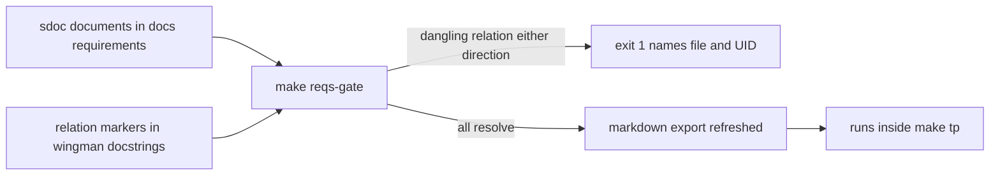

# ADR 066 — Adopt StrictDoc for Requirements Management (Phase 1)

| Status | Date       | Wingman Version |
|--------|------------|-----------------|
| Accepted | 2026-08-07 | 1.7.1           |

Records the adoption decided by [research 002](../research/002-strictdoc-requirements-management-spike.md),
the verified spike that answered all ten open questions from kobayashi_maru
Research 003 empirically. The spike carries the evidence; this ADR records the
decision and what Phase 1 implementation actually looked like.

## Decision

Adopt StrictDoc, pinned exactly to `strictdoc==0.27.1` (0.x tool — do not
float), at Phase 1 scale: two documents, twelve requirements, eleven source
markers, one gate.

| Artifact | Content |
|---|---|
| `docs/requirements/001-safety.sdoc` | `SAF-001..005` — operator preemption, no commanded flight while dead, exactly-once respawn handling, health read confirmation, bounded eject nose-down |
| `docs/requirements/002-functional.sdoc` | `FR-001..004` plus `FR-004.1` — FSM contract, tick cadence, Good-Luck launch, battle entry bound, probe observability |
| `docs/requirements/00N-*.md` | Committed markdown exports for GitHub readers, regenerated by `make reqs` |
| `strictdoc_config.py` | Project config: source traceability over `wingman/*.py`, doc discovery scoped to `docs/requirements/*.sdoc` |
| `make reqs-gate` | Validates both directions, exit 1 on any dangling relation; runs inside `make tp` (~5 s) |
| Relation markers | Eleven `relation(UID, scope=function)` docstring markers on the nine implementing functions |

Requirements state the property only; ADRs are referenced for rationale.
Tuning values stay in `wingman/config.yaml` — no constant appears in a
requirement statement. The replay YAML remains the source of truth for FSM
acceptance criteria (`FR-001` points at it, does not re-encode it).

## Implementation findings

Three things the spike did not fully anticipate, resolved during Phase 1:

1. **Numbered filenames.** CLAUDE.md mandates `NNN-` prefixes for every file in
   every `docs/` subdirectory; the spike's `safety.sdoc` would have violated
   it. Files are `001-safety.sdoc` / `002-functional.sdoc`; StrictDoc is
   indifferent to filenames (identity lives in the `UID`/`PREFIX` fields), so
   the numbering costs nothing.
2. **The Python config is not optional.** The spike named `strictdoc_config.py`
   and the initial implementation second-guessed it into `strictdoc.toml` —
   which 0.27.1 accepts but marks deprecated, with Python as the migration
   target. The spike's naming was correct; `strictdoc_config.py` (a
   `create_config()` returning `ProjectConfig`) is what ships. Config paths
   resolve relative to the invocation input path, so the gate runs against the
   repo root with doc discovery scoped in config.
3. **StrictDoc ingests `.md` as documents.** Committing the markdown exports
   beside the `.sdoc` sources initially broke the build — the exports
   re-declare the document UIDs (`Cannot create a link because lhs_node
   already exists: DOC-SAF`). Resolved by scoping `include_doc_paths` to
   `docs/requirements/*.sdoc`. The exports stay beside the sources, which is
   the friendliest layout for GitHub readers.

## Gate verification

Both failure directions were negative-tested live, not assumed:

- A deliberately dangling source marker (`relation SAF-999`) failed the export
  with exit 1: `error: Source file wingman/main.py references a requirement
  that does not exist: SAF-999.`
- A deliberately dangling sdoc Parent relation (`FR-999`) failed the same way.
- The clean tree exits 0 in ~5 s with all 36 `wingman/` source files parsed —
  fast enough to sit inside `make tp`, where it now runs.

## Consequences

- The safety properties re-derived per ADR (uncommanded flight, across ADRs
  058, 059, 061, 063, 064) now have single stated homes that the build checks
  on every `make tp`, not once at ADR acceptance. That is the failure mode
  ADR 065 documented: an acceptance criterion is checked once; a requirement
  with a gate is checked every build.
- Renaming or deleting any of the nine marked functions fails the build until
  the marker moves with it.
- `uv sync --all-groups` grows by StrictDoc's dependency set (~90 MB marginal;
  measured in the spike).
- Two authoring conventions bind future requirements: bounded measurable
  statements only (no "as soon as possible"), and no ADR duplication.

## Open items

- `SAF-001` encodes the shipped takeover precondition (mission running or
  eject active). Whether takeover should also latch from the idle-in-battle
  case — where a physical press currently passes through and autopilot later
  restarts over the operator — is an explicit open decision, recorded in
  research 002.
- The repo-wide docs cleanup research 002 measured (50 broken links, 17 ADRs
  without status headers, undeclared status vocabulary) is independent of this
  adoption and remains open.
- Accepted status requires: user review of the twelve requirement statements,
  plus a green `make tp` demonstrating the gate in the bundle.
