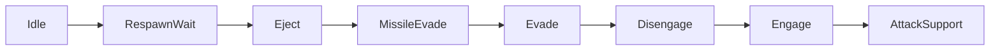
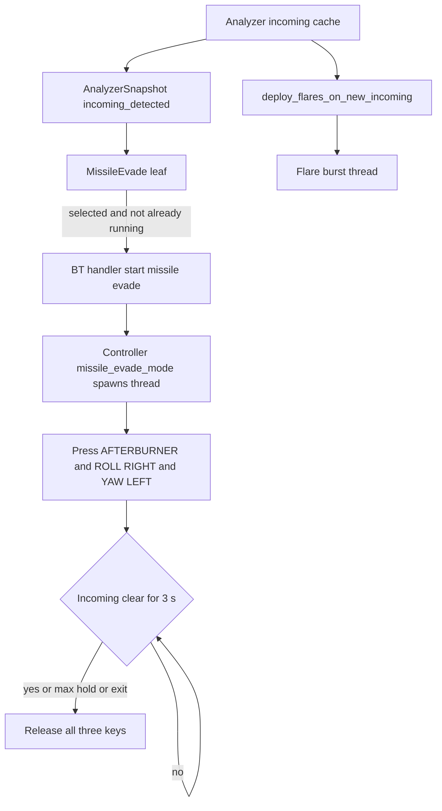

# ADR 070 — MISSILE_EVADE_MODE Behavior Tactic

| Status | Date       | Wingman Version |
|--------|------------|-----------------|
| Draft  | 2026-08-11 | 1.7.1           |

Extends [ADR 024](024-phase3-behavior-tree-architecture.md) (the Phase 3 tactic
selector) with a new actuating leaf, and builds on
[ADR 046](046-incoming-template-matching-replacement.md) (incoming template
matching) for the trigger signal. Does not supersede either.

## Context

Today the only response to an incoming missile is countermeasures: when the
analyzer's incoming cache flips true on a fresh timestamp,
`AmmoEventsHandler.deploy_flares_on_new_incoming()`
([tick_handlers.py:478](../../wingman/tick_handlers.py#L478)) fires a
three-press flare burst on a detached thread and returns. The aircraft keeps
flying whatever the current tactic commanded — usually `Engage` ring geometry,
which is a steady pursuit heading. Flares alone against a missile on a
non-manoeuvring target is the weakest case for a countermeasure.

The behavior tree already carries the trigger in its perception snapshot:
`AnalyzerSnapshot.incoming_detected`
([behavior_tree.py:51](../../wingman/behavior_tree.py#L51)) is populated every
tick from `get_incoming_cache_result()` and is currently read by no leaf. The
existing `Evade` leaf is health-threshold based and permanently disabled —
`evade_health_threshold` is unset in `config.yaml`, so
`make_evade_condition` returns `False` unconditionally (ADR 024 left it
uncalibrated). There is no tactic that reacts to a missile.

The gap is therefore: a live perception signal, an unused leaf slot above
`Engage` in the priority order, and no manoeuvre bound to either.

## Decision

Add **MISSILE_EVADE_MODE**: while an incoming missile is detected, hold
AFTERBURNER, ROLL_RIGHT and YAW_LEFT together until the incoming indicator has
been absent for 3 consecutive seconds.

### d1 — A new BT leaf, not a fourth thing bolted onto the flare handler

`MissileEvade` becomes a leaf in the ADR 024 selector. The priority order
becomes:



- Below `Idle` — outside GAME_BATTLE (manual takeover, lobby, eject state) the
  keys belong to someone else.
- Below `RespawnWait` — nothing to evade while dead.
- Below `Eject` — `eject_and_dive` owns AFTERBURNER through a closed-loop
  descent (ADR 069 d8, which presses and releases it on a descent-rate gate).
  Two owners on one key produces the exact release-ordering fault ADR 069
  documents. Eject wins; a missile during an eject is not a problem worth
  solving.
- Above `Evade`, `Disengage`, `Engage` — this is the point. Selection priority
  is what suppresses the engage-geometry roll and pitch pulses, because
  `BehaviorTreeHandler._actuate_engage` only runs when
  `selection == TACTIC_ENGAGE` ([tick_handlers.py:789](../../wingman/tick_handlers.py#L789)).
  Routing the manoeuvre through the tree — rather than firing it from the ammo
  handler — is what buys the mutual exclusion for free.

### d2 — Trigger is the same debounced incoming signal that fires flares

`snapshot.incoming_detected`, sourced from the analyzer's incoming cache: ADR
046 template matching at threshold 0.82 with OCR fallback, already debounced by
`incoming_debounce_ms: 500`. No new perception, no second detector, no
divergence between what deploys flares and what commands the evade.

Flares and evade are additive, not alternative. `deploy_flares_on_new_incoming`
is unchanged and keeps firing on the detection edge; it presses `space` on its
own thread with `ignore_cancel=True` and touches none of the three evade keys.

### d3 — The manoeuvre: three keys held simultaneously

| Key | Constant | Watched as manual-takeover signal |
|-----|----------|-----------------------------------|
| `e` | `AFTERBURNER_KEY` | No |
| `l` | `ROLL_RIGHT_KEY` | **Yes** |
| `;` | `YAW_LEFT` | No |

`YAW_LEFT` is a **yaw**-axis input — left rudder. It is exactly what its name
says. The trailing `# BARREL ROLL LEFT` comment on
[controller.py:408](../../wingman/controller.py#L408) is stale and describes the
manoeuvre someone once used the key for, not the axis it drives; it misreads as
an axis annotation and should be corrected (see step 7 of the implementation
plan). Nothing in this ADR depends on that comment.

The three inputs are therefore on three different axes — thrust, roll, yaw —
and compose rather than compete. Roll right banks the aircraft; left rudder
held into that bank yaws the nose across the roll, producing a skidding,
descending break rather than a clean turn; afterburner sustains the energy to
keep the rate up through it. That is the manoeuvre this tactic intends: a large,
sustained, cross-axis departure from the heading the missile's intercept
solution was computed against.

All three are pressed on entry and held for the whole tactic — no pulsing, no
closed-loop correction. Unlike the eject descent (ADR 069 d2, where continuous
input mushed the airframe and halved the descent rate), a missile evade has no
target attitude to converge on; it wants maximum sustained rate change for a
few seconds. There is no telemetry channel that observes missile range, so
there is nothing to close a loop against.

### d4 — ROLL_RIGHT must be held inside the programmatic-key bracket

`ROLL_RIGHT_KEY` is registered with the maneuver-key hotkey listener
([controller.py:659](../../wingman/controller.py#L659)). Held via XTest, the X
server auto-repeats it roughly every 40 ms with `send_event=False` —
indistinguishable from the player pressing `l` — and each repeat reads as a
manual takeover that cancels the mission into `GAME_BATTLE_MANUAL`.

The hold therefore uses the same bracket `disengage_roll_right` uses
([controller.py:1733-1753](../../wingman/controller.py#L1733-L1753)):
`_inc_programmatic_key` before the press, physical release first, then
`_arm_release_grace`, then `_dec_programmatic_key`. `e` and `;` are unwatched
and need no bracket.

### d5 — Termination: 3 s clear, measured on fresh negative samples

Exit when **both** hold:

- `now - last_positive_incoming_ts >= missile_evade.clear_seconds` (3.0), and
- at least `min_clear_samples` (2) incoming-cache updates have landed since that
  last positive — i.e. the cache *timestamp* advanced, not merely the result.

`last_positive_incoming_ts` is latched by the evade thread itself, not read from
the analyzer. Each poll reads the pair
`(get_incoming_cache_result(), get_incoming_cache_timestamp())`; when the result
is true the thread stores that timestamp as the last positive and resets the
fresh-sample counter to zero. A negative result whose timestamp is **greater
than the last timestamp already counted** increments the counter; a negative
result carrying a timestamp the thread has already seen is the same stale cache
entry read twice and is ignored. Entry seeds the last positive with the
detection timestamp that triggered the tactic, so the timer is well-defined from
the first poll.

The second condition exists because the incoming cache is refreshed on the
1.5 s main-loop tick, and a stalled analyzer thread leaves a stale
`(False, 0.0, None)` sitting in the cache. Without the freshness test, "no
incoming for 3 seconds" and "no perception for 3 seconds" are the same
observation, and the second one would end the evade early during precisely the
frames where detection matters.

The two conditions are deliberately near-degenerate at the shipped defaults:
two fresh samples at a 1.5 s cadence span 3.0 s, so tick jitter decides which
one binds on any given exit. **`clear_seconds` is the tuning knob**;
`min_clear_samples` is a liveness floor that exists only to reject the stalled
cache, and should be left alone. If V4 raises `clear_seconds`, the wall-clock
term becomes the binding one and the sample floor goes back to doing nothing —
which is its intended resting state.

The clear timer runs in a Controller thread that polls the analyzer directly,
**not** in the leaf condition. The tree ticks at 1.5 s; a single skipped tick
(OCR stall, lock timeout, a `continue` in the main loop) would leave three keys
physically down with nothing scheduled to release them. Every other actuating
tactic in this codebase self-terminates the same way —
`disengage_roll_right` on its own duration, `eject_and_dive` on its own closed
loop — and `ConditionTactic.terminate` is a documented no-op
([behavior_tree.py:119](../../wingman/behavior_tree.py#L119)) precisely so that
selector churn cannot abort a manoeuvre mid-flight.

### d6 — Hard cap on the hold

`missile_evade.max_hold_s` (default 15.0) releases all three keys
unconditionally. A detection stuck true — a HUD element that keeps matching the
template, a frozen frame — otherwise pins the afterburner and a full-deflection
roll down for the rest of the mission and flies the aircraft out of the arena.
This is the same failure the ADR 069 nose-hold budget guards against. The cap
firing is logged at WARNING with the elapsed time and the last incoming
timestamp; it is a detector fault, not a normal exit.

The exit path releases keys in a `finally`, and the program exit event
(`_exit_event`, as `disengage_roll_right` checks at
[controller.py:1744](../../wingman/controller.py#L1744)) breaks the hold loop so
a shutdown cannot leave keys down.

### d7 — The mission is not cancelled

`disengage_roll_right` calls `cancel_mission()` first and then pays for it: a
teardown race, a bounded 5 s wait, and a `restart_last_mission()` that is
silently skipped if the wait expires ([controller.py:1754-1772](../../wingman/controller.py#L1754-L1772)).
That cost is acceptable for a 10 s disengage that ends in a restart anyway. It
is not acceptable for a manoeuvre that is expected to last 3–6 s and happen
several times per mission.

So: no cancel. The engage-geometry pulses are already suppressed by selection
priority (d1). The search-and-destroy padlock and weapon loops keep running —
they press `p`, `a`, `f` only, no flight axis, and keeping them running is the
same call `disengage_roll_right` makes for the same reason. The residual
overlap is a scripted `j20_mission` flight leg injecting flight keys during the
evade; see V3.

### d8 — Re-trigger while already running

`missile_evade_mode()` is idempotent while the thread is alive — a second
detection does not start a second thread. A fresh positive detection during an
active evade extends it, since the clear timer is measured from the last
positive timestamp and simply moves forward. This is the desired behaviour for
a second missile arriving during the first evade.

The running flag is a `threading.Event` (`_missile_evading`) **set
synchronously by `missile_evade_mode()` before the thread is spawned**, and
cleared in the thread's `finally`. Both existing precedents set their flag
inside the spawned body — `_ejecting.set()` sits at
[controller.py:1567](../../wingman/controller.py#L1567), after the spawn — which
leaves a window where `is_running_fn()` still reports False after a start has
been issued. The 1.5 s tick masks it there. Here the guard is a stated design
property rather than an incidental one, so it is closed by construction: the
duplicate-start check and the flag set happen in the caller's thread, before any
concurrency exists.

### d9 — `mission_running` is not a precondition

`Engage` actuation is gated on `snap.mission_running`
([tick_handlers.py:790](../../wingman/tick_handlers.py#L790)) because engage
geometry only makes sense as part of a flying mission. The evade is not: a
missile tracking the aircraft is a threat whether or not a mission thread holds
the lock, and d7 means the tactic never touches mission state anyway. The
condition therefore tests only `incoming_detected`, with `Idle` (not in
GAME_BATTLE) as the sole containing gate.

### d11 — Eject preemption is bidirectional (added 2026-08-12)

**d1's mutual exclusion was one-directional and did not hold.** Selection
priority stops an evade *starting* while Eject is selected. It does nothing
about an eject that starts while an evade is *already running*:
`ConditionTactic.terminate` is a deliberate no-op
([behavior_tree.py:119](../../wingman/behavior_tree.py#L119)) and the hold
thread self-terminates only on its own clear timer (d5). So the "two owners on
one key" fault d1 claims to prevent was prevented in exactly one of the two
orderings.

The 2026-08-12 05:34:50 session hit the other one:

```
05:34:50.956  MISSILE EVADE — holding afterburner + roll right + yaw left
05:34:50.960  BT: Engage -> MissileEvade   (missiles=0, rings 0/0/0)
05:34:52.460  MISSILES EMPTY — cancelling mission and ejecting
05:34:54.012  eject rotation pulse 1/12 (rate 406 m/s, nose +55deg)   <- climbing
05:34:57.264  missile_evade complete (clear, 6.3s)
05:35:29.149  eject_and_dive — descending (-174 m/s) — afterburner engaged
```

For **4.8 s** the evade held roll-right, yaw-left and burner while
`eject_and_dive` pulsed nose-down against it. Altitude over the eject's first
six seconds: 7596 → 8663 → 9347 m — the aircraft *climbed* through a commanded
dive. The eject's burner gate gets engaged only while descending (ADR 069 d8),
so it stayed shut for **32 s**, and the whole eject took 57 s.

There is also a reverse corruption the same overlap enables: `_eject_ab_engaged`
is a plain bool, and AFTERBURNER goes through `_eject_key`'s *unguarded* path.
Had the eject engaged the burner during the overlap, this thread's `finally`
would have released the physical key while the eject's flag still read True —
the eject would believe the burner was on and never re-press it, flying the
rest of the dive without it. It did not happen here only because the burner
gate never opened during the overlap.

**Decision:** the evade yields the airframe to the eject, both ways.
`missile_evade_mode()` refuses to start while `_ejecting` is set, and the hold
loop tests `_ejecting` every poll and breaks with exit reason `eject_preempt`,
releasing all three keys. At a 0.1 s poll against the eject's 1.5 s descent
interval, the evade is out well before the burner gate can open. Eject wins,
as d1 always intended — this makes that true in both time orders.

### d12 — A tactical limit separate from the fault backstop (added 2026-08-12)

`max_hold_s` (d6) is a *runaway-detector* backstop: it fires only when a
detection is stuck true, and says so at WARNING. It is not a statement about
how long the manoeuvre is useful.

The 2026-08-12 evidence says those are different numbers. Every evade that
ended normally ran **4.6–4.9 s**. The one that ran 14.0 s (exiting on `clear`,
1.0 s short of the cap) shows what the tail costs:

| Elapsed | Altitude | Speed | Nose |
|---------|----------|-------|------|
| entry | 3991 | 1849 | +41 deg |
| +3 s | 5267 | 2009 | +50 deg |
| +6 s | 6450 | 1763 | +54 deg |
| +9 s | 7275 | 1515 | +41 deg |
| +12 s | 7561 | 1229 | +16 deg |

Climb rate decays monotonically (+1276, +1183, +825, +286 m per 3 s) and speed
falls 34%. The nose drops from +54 to +16 deg with nothing commanding it — the
aircraft simply ran out of energy. It finished slow, high and nearly level:
worse than it started, and worse than doing nothing.

So: `max_manoeuvre_s` (6.0) ends the evade as a **normal** exit at INFO, reason
`manoeuvre_limit`, releasing while incoming may still be present. `max_hold_s`
(15.0) stays as the outer fault backstop at WARNING and becomes unreachable in
normal operation — which is what a backstop should be.

They are kept as two values rather than one lowered value deliberately. Folding
the tactical limit into `max_hold_s` would log "detector fault" on every
genuinely long engagement, poisoning exactly the logs the effectiveness work
(V5) has to read.

### d13 — `pitch_down`: the descending-break variant (added 2026-08-12)

V2 established that the shipped triple produces a climbing corkscrew, not the
descending break d3 argued for, because no key in it commands pitch. `pitch_down`
adds `NOSE_DOWN_KEY` to the hold, making the manoeuvre an actual break.

**Off by default.** It is the unproven variant: it inherits none of the base
triple's live evidence, and it re-opens the ADR 069 d2 finding that continuous
nose-down mushed the airframe and halved the descent rate — a finding about a
40 s eject descent, which may or may not transfer to a 5 s evade, and that is
precisely what has to be measured before it ships on.

`NOSE_DOWN_KEY` is a watched maneuver key, so it takes the same d4 programmatic
bracket as `ROLL_RIGHT_KEY`. The bracket is now derived from
`_WATCHED_MANEUVER_KEYS` rather than hardcoded, so the hotkey registration and
the evade hold cannot drift apart — the failure that drift would produce is
silent self-cancelling missions.

### d10 — Config and its plumbing

```yaml
behavior_tree:
  missile_evade:
    enabled: true          # false = leaf reverts to selection-only, no keys
    clear_seconds: 3.0     # incoming absent this long ends the evade (d5)
    min_clear_samples: 2   # liveness floor, not a tuning knob (d5)
    max_manoeuvre_s: 6.0   # tactical limit, normal exit (d12)
    max_hold_s: 15.0       # outer fault backstop, WARNING (d6)
    pitch_down: false      # descending-break variant (d13)
```

`enabled: false` leaves the leaf in the tree with no actuator wired, matching
the ADR 024 shadow pattern — it logs the selection so agreement can be checked
against the flare-burst log before keys are ever pressed.

**The Controller cannot read this block itself.** It takes no config dict —
`__init__` accepts explicit keyword arguments only
([controller.py:455](../../wingman/controller.py#L455)) — and the ADR 024
actuator contract calls `start_fn` with **no arguments**, so the values cannot
arrive at call time either. They are constructor-injected, exactly as the eject
closed-loop parameters are: `main()` passes
`missile_evade_cfg=cfg.get("behavior_tree", {}).get("missile_evade", {})`
alongside the existing `telemetry_cfg=` at
[main.py:328](../../wingman/main.py#L328), and `Controller.__init__` unpacks it
into `self._me_clear_s` / `self._me_min_clear_samples` / `self._me_max_hold_s`
with the defaults above, mirroring the `_ecl` unpack at
[controller.py:525-538](../../wingman/controller.py#L525-L538).

The block stays under `behavior_tree` because it configures a BT tactic; that
one consumer of it happens to live in the Controller is a plumbing detail, and
duplicating the block into a Controller-shaped top-level key would put the
tactic's tuning somewhere no reader of ADR 024 would look. `enabled` is read by
`BehaviorTreeHandler` (it decides whether the actuator is wired at all), not by
the Controller.

## Architecture



Naming, fixed: **`missile_evade_mode()`** is the Controller's public entry
point. It is non-blocking — it performs the d8 duplicate check, sets
`_missile_evading`, spawns the daemon thread, and returns. The thread body is a
nested `_run()`, as `disengage_roll_right` is structured.

**`wingman/controller.py`**

- `missile_evade_mode()` — no required arguments (the ADR 024 actuator contract).
  `_run()` brackets `l` per d4, presses all three keys, polls the incoming cache
  on a 0.1 s interval as the disengage loop does, exits on the d5 clear test /
  d6 cap / `_exit_event`, and releases in `finally`.
- `is_missile_evading()` → `self._missile_evading.is_set()`, the leaf's
  `is_running_fn`, mirroring `is_ejecting()`.
- `__init__` gains `missile_evade_cfg` and the `_missile_evading` Event (d10).

**`wingman/behavior_tree.py`**

- `TACTIC_MISSILE_EVADE = "MissileEvade"`.
- `make_missile_evade_condition(is_running_fn=None)` — a **closure factory**,
  like `make_evade_condition` / `make_disengage_condition`. `ConditionTactic`
  passes its condition only the snapshot
  ([behavior_tree.py:112](../../wingman/behavior_tree.py#L112)), so the
  running-state half cannot be a second parameter; it is captured:

  ```python
  def make_missile_evade_condition(is_running_fn=None):
      def missile_evade(snapshot):
          if snapshot.incoming_detected:
              return True
          return is_running_fn is not None and is_running_fn()
      return missile_evade
  ```

  The `is_running_fn is not None` arm is what makes the selection-only
  (`enabled: false`) build fall back to the bare `incoming_detected` predicate
  with no further branching.
- Stickiness is the point of the closure: it keeps `Engage` from re-selecting on
  the first clear tick and pulsing the roll axis while the evade thread still
  owns it. No `MinimumHold` decorator — the anti-flap hold lives in the thread's
  own clear timer, and stacking a second independent hold on top would
  desynchronise selection from actuation.
- `build_tree` gains the `TACTIC_MISSILE_EVADE` actuator entry, absent →
  selection-only.

**`wingman/tick_handlers.py`**

- `BehaviorTreeHandler.__init__` gains a `stats_tracker=None` parameter. It has
  none today — only `AmmoEventsHandler` does
  ([tick_handlers.py:405](../../wingman/tick_handlers.py#L405)) — and the
  Controller holds no stats tracker either, so without this there is nowhere the
  entry event can be emitted from.
- The actuator is a **wrapper**, not the bare Controller method, following
  `_start_disengage` ([tick_handlers.py:713](../../wingman/tick_handlers.py#L713)):

  ```python
  def _start_missile_evade(self):
      self._ctrl.missile_evade_mode()
      if self._stats is not None:
          self._stats.on_event("missile_evade", time.time())
  ```

  wired as
  `TACTIC_MISSILE_EVADE: (self._start_missile_evade, ctrl.is_missile_evading)`
  when `active` and `missile_evade.enabled`. The stats call sits after the
  start so a duplicate-suppressed trigger (d8) still counts the *event*, which
  is the quantity V5 compares against `flare_burst_count`.

**`wingman/main.py`**

- Pass `missile_evade_cfg=` to the Controller (d10) and `stats_tracker=` to
  `BehaviorTreeHandler` at [main.py:488](../../wingman/main.py#L488).

**`wingman/mission_stats.py`**

- A new `missile_evade` branch in `_on_event_locked`
  ([mission_stats.py:96](../../wingman/mission_stats.py#L96)) incrementing a
  `_total_missile_evades` counter and a per-mission
  `self._current["missile_evade_count"]`, following `flare_burst_deployed`
  exactly, plus the corresponding field in the mission and session summaries.

## Alternatives considered

**Fire it from `deploy_flares_on_new_incoming` like the flare burst.** Shortest
diff — and it puts a flight manoeuvre outside the tactic selector, so it would
run concurrently with engage geometry commanding the same roll axis. The mutual
exclusion in d1 is the whole reason to involve the tree.

**Reuse the existing `Evade` leaf** by making its condition
`health < threshold or incoming_detected`. Conflates two tactics with different
triggers, different durations, and different exit criteria into one leaf whose
health branch is still uncalibrated. A separate leaf keeps ADR 024's health
Evade available for calibration later without unpicking this.

**`MinimumHold(hold_s=3.0)` around the leaf as the entire termination
mechanism.** Elegant — the decorator already means "stay selected 3 s past the
last true". But selection is not actuation: it holds only while the tree keeps
ticking, and `ConditionTactic.terminate` is a deliberate no-op, so nothing
releases the keys when the hold lapses. Rejected for the reasons in d5.

**Pulse the keys rather than hold them.** ADR 069 d2 adopted bounded impulses
for the eject descent because continuous input drove the airframe past its
velocity vector. That finding is about converging on a target attitude over
tens of seconds; a 3 s evade has no target attitude. Revisit only if V2 shows
the same drag stall.

## Implementation plan

Steps 1-5 are the seams; each names the precedent to copy, and none requires a
judgment call not already settled above.

1. `controller.py` — `missile_evade_mode()` + `is_missile_evading()` + the
   `_missile_evading` Event, with the d4 bracket, the d5 latch, the d6 cap, and
   the d8 synchronous flag set. `__init__` takes `missile_evade_cfg` (d10).
2. `behavior_tree.py` — `TACTIC_MISSILE_EVADE`,
   `make_missile_evade_condition()`, leaf placed between `Eject` and `Evade`,
   `build_tree` actuator entry.
3. `tick_handlers.py` — `stats_tracker` parameter, the `_start_missile_evade`
   wrapper, the actuator dict entry gated on `active` and
   `missile_evade.enabled`.
4. `main.py` — `missile_evade_cfg=` to the Controller, `stats_tracker=` to
   `BehaviorTreeHandler`.
5. `mission_stats.py` — the `missile_evade` event branch, its counters, and the
   summary fields.
6. `config.yaml` — the `behavior_tree.missile_evade` block, shipped
   `enabled: false` for the first shadow session.
7. Unit tests — leaf selection order (missile evade beats Engage, loses to
   Eject), the sticky condition while running, the d5 clear test *including* the
   stalled-cache case (repeated negatives carrying an unchanged timestamp must
   not end the evade), the d6 cap, key release on `_exit_event`, and the d8
   duplicate-start suppression. Controller tests run against
   `_simulate_os_input` and assert the recorded action intents, as the eject
   tests do.
6. Requirements (ADR 066) — one `FR-` for the tactic behaviour and one `SAF-`
   for the unconditional release, authored in the `.sdoc` files with
   `relation(UID, scope=function)` markers on `missile_evade_mode`, then
   `make reqs`. Next free UIDs must be read from the `.sdoc` at the time of
   writing, not assumed from this ADR.
7. `controller.py:408` — correct the stale `# BARREL ROLL LEFT` comment on
   `YAW_LEFT` to name the axis (yaw / left rudder). Comment-only; no behaviour
   change. Left as its own step because it is the one line that could mislead a
   future reader into thinking this tactic commands two opposed roll inputs.
8. `make tp` before any live session.

## Validation

Each item must be answered before the tactic is enabled in a live mission.

- **V1 — `;` is live in the current keymap.** The axis is settled (d3: yaw
  left), but `YAW_LEFT = ';'`
  ([controller.py:408](../../wingman/controller.py#L408)) is referenced
  **nowhere else in the repository** — this tactic is its first injection site.
  Confirm against the persisted MetalStorm keymap (ADR 052) that `;` is still
  bound to yaw-left in the profile the automation runs under, so a keymap drift
  degrades the manoeuvre loudly rather than silently. This is a binding check,
  not an open design question.

  *Injection-side finding, 2026-08-11 shadow session:* `;` was **not
  injectable at all** — the XTest shim resolved punctuation via
  `string_to_keysym(';')`, which returns 0 (`Linux key: unknown keysym for
  ';'`, 07:27:22, fired by cleanup's YAW_LEFT release). Fixed by mapping
  punctuation to X11 keysym names (`semicolon`) in `_XKEY_ALIASES`, with a
  regression test covering every injectable key constant. The game-keymap half
  of V1 remains open.
- **V2 — the composed manoeuvre behaves as intended.** Roll right, left rudder
  and afterburner act on three separate axes and do not cancel (d3). What is
  unmeasured is the *result*: bench-fly the triple and confirm on the HUD that
  it produces a sustained skidding break with a meaningful heading and altitude
  change over 3–6 s, rather than a mild flat skid the missile solution can
  absorb. If the departure is small, the lever to reach for is duration or an
  added pitch input — not a different axis pairing.

  *Live-fire evidence, 2026-08-12 — 5 clean evades across two sessions
  (one further evade overlapped an eject and is excluded; see d11).* Entry and
  exit telemetry, one row per evade:

  | Entry (alt / speed / nose) | Exit (alt / speed / nose) | Δalt | Δspeed | Δnose |
  |---------------------------|---------------------------|------|--------|-------|
  | 1611 / 1004 / +44 | 2911 / 999 / +49 | +1300 | -5 | +5 |
  | 5339 / 2030 / +54 | 7776 / 1588 / +59 | +2437 | -442 | +5 |
  | 8560 / 1318 / +46 | 9579 / 852 / +60 | +1019 | -466 | +14 |
  | 4336 / 1928 / +45 | 6923 / 1688 / +61 | +2587 | -240 | +16 |
  | 6377 / 1946 / +55 | 9347 / 1113 / +48 | +2970 | -833 | -7 |

  **The manoeuvre is an energy-bleeding zoom climb, not a break.** Every evade
  climbed (+1000 to +3000 m in 5–6 s). Four of five *steepened* the nose by 5
  to 16 degrees, so the triple does not merely inherit the entering flight-path
  angle as first supposed — the roll-plus-rudder pair actively slices the nose
  **up**. Speed fell in every sample with room to fall, by up to 833 KPH (1946
  → 1113, a ~40% loss) despite the burner being held throughout.

  d3's mechanism is therefore wrong in its most important respect. The
  cross-axis heading departure is real; the *descending* break is not, and
  cannot be — there is no pitch input in the triple to command one. What the
  aircraft actually does is trade its speed for altitude while corkscrewing,
  which is the opposite of what a missile-defeating break wants: slower,
  higher, and with less energy left to manoeuvre when the next missile arrives.

  This does not by itself prove the tactic is harmful — V5 (per-mission deaths)
  is still the arbiter, and a large heading change may defeat a seeker
  regardless of the vertical. But the burden has shifted: the mechanism d3
  argued from is not the mechanism in effect. Adding NOSE_DOWN to the hold is
  the obvious lever and would make it a genuine split-S-style break, but that
  is a change to d3 requiring its own evidence, and it re-opens the ADR 069
  finding about continuous pitch input mushing the airframe.
- **V3 — mission-thread overlap.** Confirm from a shadow session log whether a
  `j20_mission` scripted leg injects flight keys during an evade window. If it
  does, d7 needs revisiting — most likely a mission-maneuver suppression flag
  rather than a full `cancel_mission()`.
- **V4 — clear-window sizing.** The 3 s figure is the requested value, not a
  measured one. A shadow session recording incoming-cache timestamps across
  real engagements should show the observed gap distribution between
  consecutive missile alerts; if alerts routinely arrive 4–5 s apart, 3 s
  causes release-then-immediate-repress churn and should be raised.

  *First shadow evidence, 2026-08-11 session (34 min, 6 missions, 18 alerts):*
  alerts arrive in bursts — consecutive detections within an engagement land
  1.3–1.7 s apart (e.g. 06:59:12.2, 13.7, 15.2, 16.7), and bursts are
  separated by minutes, not 4–5 s. Selection-only MissileEvade windows lasted
  3–6 s (06:59:01→04, 06:59:13→19, 07:16:17→23). The 3.0 s clear window shows
  no churn risk at this cadence; the default stands.
- **V5 — effectiveness.** Compare per-mission health loss and death count from
  `MissionStatsTracker` across matched sessions with the tactic off and on.
  Flares-only is the baseline.

  *First numbers (deaths per mission, from the session stats JSONs):*

  | Condition | Sessions | Missions | Deaths | Deaths/mission |
  |-----------|----------|----------|--------|----------------|
  | Evade OFF (2026-08-11, shadow) | 3 | 13 | 33 | **2.54** |
  | Evade ON (2026-08-12) | 2 | 12 | 32 | **2.67** |

  **No benefit detected.** The difference is noise at this sample size, and the
  comparison is weak for a second reason: only 8 evades fired across those 12
  missions, so the large majority of deaths occurred in engagements the tactic
  never touched. A real verdict needs either many more missions or a
  per-engagement measure (did the aircraft survive the 10 s after each incoming
  alert, evade vs no evade) rather than a per-mission one. What can be said is
  that nothing so far supports the tactic paying for itself, and V2's
  energy-bleed finding supplies a mechanism by which it could cost something.

  *Instrumentation added 2026-08-12:* `MissionStatsTracker` now records one
  engagement per missile volley (alerts within 3 s are one volley, matching the
  measured 1.3–1.7 s intra-volley cadence), tags it with whether an evade
  fired, and marks it died if a respawn lands within 10 s. The session summary
  and stats JSON carry `missile_engagements` with survival split evade vs
  no-evade. This makes V5 answerable per engagement instead of per mission, so
  a handful of sessions can settle it rather than dozens.

  *Soak verdict, 2026-08-14 (5h17m unattended, 54 missions, 122 engagements):*

  | Condition | Engagements | Survived 10 s | Rate |
  |-----------|-------------|---------------|------|
  | With evade | 60 | 54 | **90%** |
  | Without evade | 62 | 42 | **68%** |

  A 22-point gap on near-balanced arms (two-proportion z ≈ 3.0, p ≈ 0.003).
  The selection caveat still applies — no-evade engagements cluster in states
  that suppress evades (eject, respawn), which are themselves risky — so this
  is strong observational evidence, not a controlled trial. Combined with the
  2026-08-13 session (82% vs 50%, n=25), the tactic now consistently
  associates with materially higher engagement survival despite V2's
  energy-bleed mechanism. Exit mix that session: 51 manoeuvre_limit /
  34 clear / 6 eject_preempt — the d12 limit is the modal exit under
  sustained barrages.

## Consequences

- The first tactic in the tree whose trigger is an event rather than a standing
  condition. `MinimumHold` was ADR 024's answer to selection flapping; this leaf
  answers it with a self-terminating actuator instead, and the two idioms now
  coexist in one selector.
- Three keys held simultaneously by a background thread is a new worst case for
  the manual-takeover guard. d4 covers `l`; if a future keybinding change makes
  `e` or `;` watched, this tactic breaks silently into self-cancelling missions.
- `AFTERBURNER_KEY` now has two owners in the codebase (eject and evade),
  mutually excluded by selector priority **and** by the d11 runtime yield.
  Selector priority alone proved insufficient: it orders *selections*, not the
  lifetimes of the threads those selections start. Any future tactic that
  touches the burner needs both — a slot in the priority chain and an explicit
  runtime check against the tactics that outrank it.
- Fuel/energy state is not modelled anywhere in wingman, so repeated
  afterburner evades have a cost the system cannot observe.
- `;` acquires a runtime caller for the first time. A key that has sat inert in
  the bindings block since it was written is now injected in battle, so any
  latent mismatch between the constant and the game's keymap surfaces here
  first (V1).
- V2 may change the manoeuvre's *magnitude* — duration, or an added axis — but
  no longer its composition. The structure (leaf, priority slot,
  self-terminating hold, clear timer) is independent of which keys are held and
  survives any such change.
