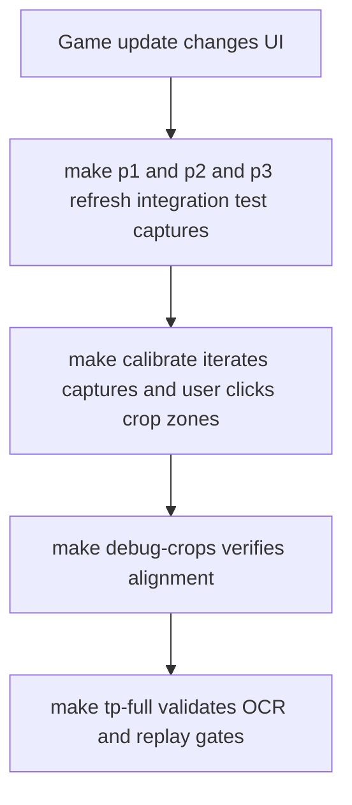

# ADR 072 — Consolidate Calibration Screenshots onto Integration-Test Captures

| Status | Date       | Wingman Version |
|--------|------------|-----------------|
| Accepted | 2026-08-13 | 1.7.1           |

## Context

The 2026-08 MetalStorm game update changed the UI layout. This is the first time since the calibration tooling was built that a full recalibration has been required: crop coordinates in `wingman/config.yaml` were stale (the respawn overlay moved up roughly 2%), and every reference screenshot no longer matched the live game. The screenshots in `test_screenshots/integration_test/` also had to be re-captured for the real-OCR gates to pass.

The recalibration exposed a structural problem: the repository maintains **two parallel screenshot inventories** that must both be refreshed after a UI change.

1. **Ad-hoc root screenshots** — roughly 40 hand-captured PNGs directly in `test_screenshots/` (`AMMO_FLARES.png`, `RESPAWN.png`, `GOODLUCK.png`, …). These are the calibration references: `tests/calibration_map.yaml` maps each one to the crop names it covers, and `tests/calibrate.py` iterates that map. Refreshing them is manual — launch the game, navigate to each screen, press V, copy the file into place.
2. **Curated path captures** — the `P1_*` / `P2_*` PNGs in `test_screenshots/integration_test/`, captured **automatically** by `make p1`, `make p2`, and `make p3` (the `newpaths` lanes driven by `tests/replay_paths/adr037_paths.yaml`). These are numbered, semantically named, dimension-validated, and refreshed by a single command per path.

Many root screenshots duplicate what a path capture already shows. `AMMO_FLARES.png` and `AMMO_MISSILE.png` both depict the battle HUD that `P1_030_BATTLE_HUD_MISSILES_4.png` captures; `RESPAWN.png` duplicates `P1_050_RESPAWN_VISIBLE_NO_HEALTH.png`. After a game update, each duplicate is a screenshot that must be re-captured by hand even though an automated capture of the same screen already exists.

The respawn screen is the extreme case. Beyond `RESPAWN.png`, the repository carried a set of variant respawn screenshots — `RESPAWNB.png`, `RESPAWNC.png` (discolored frame), `RESPAWND.png` (fuzzy-match distractor) — all pinned to the old layout. Code Review 015 (`docs/code-review/015-2026-08.md`, CR-015-01/03/04/07) found their crops OCR blank or vacuous under the new coordinates and recommended recapturing each on the new layout. Since the game update moved only the crop location — the overlay's content and rendering are unchanged — maintaining four respawn captures per layout is cost without corresponding coverage.

## Decision

Make the integration-test path captures the single source of reference screenshots for crop calibration.

1. **Repoint `tests/calibration_map.yaml` at `integration_test/` captures** wherever a `P*` screenshot shows the same UI element as a root screenshot. The `screenshot:` field carries a path relative to `test_screenshots/`, so entries become e.g. `integration_test/P1_030_BATTLE_HUD_MISSILES_4.png`.
2. **Remove the redundant root screenshots; they are no longer maintained.** Already removed in this change: `AMMO_FLARES.png`, `AMMO_MISSILE.png`, `CANCEL.png`, `continue.png`, `continue1.png`, `RESPAWNC.png`. Each is replaced by the integration-test capture of the same screen — e.g. `CANCEL.png` is replaced by `P1_010_WAITING_CANCEL_VISIBLE.png`, which `make calibrate` now presents when calibrating the `CANCEL` crop. Remaining candidates (`GOODLUCK.png`, `PLAY1.png`, `HEALTH.png`, `MINIMAP.png`) go once no calibration-map entry or test references them.
3. **Simplify respawn to a single screenshot.** Only the crop location changed in the game update, so the variant set is retired rather than recaptured: all four variants (`RESPAWN.png`, `RESPAWNB/C/D.png`) are deleted, with test references repointed at gate frames (`TEST_SCREENSHOT` → P1_050 as the positive; P1_030/P1_060 as plain negatives). This supersedes the recapture remedy CR-015 proposed for CR-015-03/04/07; per the code-review workflow, their disposition is recorded in the next review-cycle file, referencing this ADR. `P1_050_RESPAWN_VISIBLE_NO_HEALTH.png` is thus both the single respawn unit-test fixture and what `make calibrate` presents for the `respawn` crop. *(Implementation note, 2026-08-14: as originally drafted this kept root `RESPAWN.png` as the unit fixture; the root file was deleted in the same cleanup, so the gate frame serves both roles — one fewer file, same coverage.)*
4. **`make calibrate` then iterates the integration-test captures.** No behavioral change is needed in `tests/calibrate.py` beyond honoring subdirectory paths in the map — it already iterates whatever the map lists and lets the user click the two corners for each crop zone.
5. **Root screenshots remain only for screens no capture path visits** — rare popups and one-offs such as `CREATION_FAILED.png`, `INVITED.png`, `UNREADY.png` (event-refresh popup), and `INCOMING.png` (the incoming-missile warning is timing-dependent and not deterministically captured by a path). Each such file is a candidate for future inclusion in a capture path; when a path gains that screen, the map entry moves and the root file is deleted.

### Target calibration map

| Crop(s) | Old reference | New reference | Old file removed? |
|---------|---------------|---------------|-------------------|
| `respawn` | `RESPAWN.png` (+ variants B/C/D) | `integration_test/P1_050_RESPAWN_VISIBLE_NO_HEALTH.png` | yes — all four, 2026-08-14; P1_050 is also the single respawn unit-test fixture (`TEST_SCREENSHOT`), and B/D test references now point at P1_030/P1_060 as plain negatives |
| `click_to` | `continue.png`, `continue1.png` | `integration_test/P1_070_CLICK_TO_CONTINUE.png` | yes |
| `good_luck` | `GOODLUCK.png` | `integration_test/P1_020_GOOD_LUCK_VISIBLE.png` | yes (2026-08-14) |
| `PLAY` | `PLAY1.png` | `integration_test/P1_000_LOBBY_PLAY.png` | yes (2026-08-14) |
| `CANCEL` | `CANCEL.png` *(unmapped)* | `integration_test/P1_010_WAITING_CANCEL_VISIBLE.png` | yes; map entry added 2026-08-14 |
| `MINIMAP` | `MINIMAP.png` | `integration_test/P1_030_BATTLE_HUD_MISSILES_4.png` | no — calibration entry repointed 2026-08-14; `MINIMAP.png` retained as a dedicated CV test fixture (the hard lock-ring/route-line case, ADR 071) |
| `AMMO_FLARES`, `AMMO_MISSILE` | `AMMO_FLARES.png`, `AMMO_MISSILE.png` | `integration_test/P1_030_BATTLE_HUD_MISSILES_4.png` | yes |
| `HEALTH` | *(unmapped)* | `integration_test/P1_060_BATTLE_HUD_HEALTH_ALIVE_MISSILES_4.png` | map entry added 2026-08-14 |
| `incoming` | `INCOMING.png` | unchanged — no deterministic path capture yet | no |
| `event_refresh`, `event_refresh_dismiss` | `UNREADY.png` | unchanged — popup not visited by any path | no |

A side benefit: consolidation is the natural moment to close the existing `[WARN] crops with no calibration_map entry` gaps (`CANCEL`, `HEALTH`, `ALTITUDE_SPEED`, `ENEMY_CLOSE_BY`, …) by mapping each remaining crop to whichever path capture or retained root screenshot shows it.

### Post-update recalibration workflow

One capture pass now feeds both the real-OCR test lane and calibration, instead of the capture pass plus a separate manual screenshot hunt.

## Consequences

**Positive**

- After a game update, refreshing every calibration reference is `make p1` / `make p2` / `make p3` — the same commands that already refresh the OCR test fixtures. No manual screenshot collection for path-covered screens.
- Calibration references can no longer silently drift from the test fixtures: they are the same files.
- The dimension check in `tests/calibrate.py` applies to the path captures, which are produced by the configured capture region and therefore always match `region.width × region.height`.
- Roughly a dozen redundant PNGs leave the repository.

**Negative / risks**

- Path captures are taken mid-run on a timer, so a reference frame could include a transient overlay (kill feed, damage flash) partially obscuring a crop zone. Mitigation: the calibration tool shows the full frame, so the user sees the obstruction and can re-run the capture path; screenshot timing in `adr037_paths.yaml` can be tuned if a specific frame is chronically dirty.
- Coupling: renaming or re-sequencing a path screenshot now breaks `calibration_map.yaml` too. The existing startup validation ("screenshot not found" warning) surfaces this immediately.
- Screens outside the capture paths still require the manual press-V workflow; this ADR shrinks the manual set rather than eliminating it.
- Retiring the respawn variant set is an accepted loss of test coverage: without a discolored-frame capture (`RESPAWNC.png`) the ADR 021 OCR preprocessing pipeline is unguarded (CR-015-04), and without a distractor capture (`RESPAWND.png`) the fuzzy-match negative case goes untested (CR-015-03). If a future game update changes overlay rendering rather than just position, this decision should be revisited.

## Alternatives considered

- **Status quo (two inventories).** Rejected: this recalibration required re-capturing the same screens twice in two formats, and the root inventory has no refresh automation.
- **Template-based automatic recalibration** (match old crop content in the new frame and shift coordinates automatically). Attractive but unproven for large layout shifts, and a wrongly auto-shifted crop fails silently at OCR time. May be revisited once consolidated references make before/after comparison cheap.
- **Extending capture paths to cover every screen (no root screenshots at all).** Desirable end state, but popups like `CREATION_FAILED` are not deterministically reachable in an automated run today. Deferred rather than rejected.

## References

- Code Review 015 (`docs/code-review/015-2026-08.md`) — respawn recalibration fallout; this ADR supersedes the recapture remedy for CR-015-03/04/07.
- ADR 021 — discolored-frame OCR preprocessing (coverage gap accepted above).
- ADR 037 — replay path configs (`tests/replay_paths/adr037_paths.yaml`) that drive `make p1/p2/p3`.
- `tests/calibrate.py`, `tests/calibration_map.yaml` — offline calibration tool and screenshot-to-crop map.
- `wingman/config.yaml` `crops:` — calibrated output.
