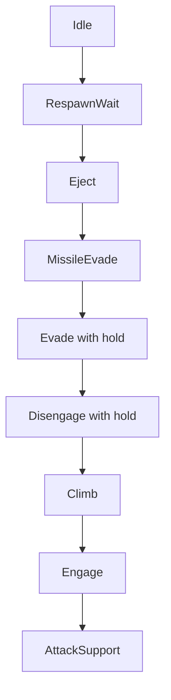

# ADR 073 — Climb Tactic: Altitude Recovery as a Behavior-Tree Leaf (Shadow-First)

| Status   | Date       | Wingman Version |
|----------|------------|-----------------|
| Accepted | 2026-08-16 | 1.8.2           |

*Accepted 2026-08-16: phases 3.2a–3.2c implemented, enabled in production
config, and live-validated across the 2026-08-15/16 sessions — 34+ confirmed
operating-altitude climbs (means 24–28 s, zero duration-cap timeouts), two
emergency-band recoveries, and ~20 clean pre-emption yields. Requirements
FR-007 / SAF-008 capture the behavior and safety properties. Scale
confirmation same day (19:06 soak, 3 h 49 m unattended, 39/39 missions,
0 errors): 176 climbs — 115 `altitude_recovered`, 36 evade pre-emptions,
24 clean stops, and one duration-cap release (0.6%) on a telemetry-blind
climb, which is the SAF-008 backstop behaving as specified.*

## Context

`mission_j20` commands a climb exactly once: `nose_up(2.0)` at the top of the
mission sequence, before the search-and-destroy loop starts. Altitude is never
commanded again for the life of the mission thread.

This leaves a structural gap on mid-mission respawns. The mission thread is
still alive (lock held, sitting in the afterburner cadence or the 300 s loiter
phase), so the respawned aircraft re-enters battle at spawn altitude with no
climb ever issued. Below `j20_mission.min_safe_altitude` (500 HUD altitude
units) the situation compounds: `EngageNavigator.update` deliberately returns
a no-op intent (`below-safe-floor`), so the Engage leaf stops steering
entirely. The aircraft is then fully uncommanded at low altitude — the
observed failure mode is circling at low altitude until terrain impact.

The codebase is mid-migration from the scripted mission sequence to
tactic-selection leaves (ADR 024; the scripted roll holds were retired into
the Engage leaf in Phase 3.1a). The remaining scripted prologue — the one-shot
climb — encodes *"climb happened at t = 0"*. The correct invariant is *"be
high"*: a condition, not a step.

Constraints inherited from prior decisions:

- Altitude reaches the tree as `AnalyzerSnapshot.altitude` — the telemetry
  stable value (ADR 038), which is `None` whenever telemetry is stale or
  unreadable. `alt=None` is routine in live logs, and roughly 1 % of telemetry
  reads are plausibility-rejected.
- The HUD is metric (ADR 067). The legacy `pitch_band` thresholds were tuned
  against a unit-compressed ratio and must not be borrowed. Climb thresholds
  are new values, expressed in raw HUD altitude units, living in
  `wingman/config.yaml` beside the other behavior-tree tuning.
- ADR 070 established the rollout template for a new tactic: selection
  evidence first, actuation behind a config flag, stickiness owned by the
  tactic thread, and an outer fault backstop.

## Decision

Introduce a **Climb** tactic leaf in the ADR 024 selector, rolled out
shadow-first in two phases.

### Selector placement



Climb sits directly above Engage and below every defensive tactic. A climb
must never fight the missile-evade roll hold, the eject dive, or the
disengage roll — those leaves win by priority. When Climb is selected, Engage
geometry is pre-empted, which is correct: below the safe floor the navigator
refuses to steer anyway.

### Condition: hysteresis band, freeze on missing telemetry

- **Enter** when `altitude < climb.enter_below_alt`.
- **Release** when `altitude >= climb.exit_above_alt` (a meaningfully higher
  value — a single threshold would flap at the boundary every telemetry tick).
- **`altitude is None` freezes the decision** — it neither enters nor
  releases. Entering blind would command climbs on OCR dropouts; releasing
  blind would flap selection during telemetry gaps and poison the shadow
  data. The actuation-phase safety net for a long blind climb is the tactic
  thread's own duration backstop (Phase 3.2b), mirroring ADR 070's
  `max_hold_s` — never the condition.
- Unset thresholds disable the leaf entirely (the Evade precedent:
  disabled until calibrated).

### Shadow phase must not perturb the selector

A selection-only leaf **inside** the tree is not shadow: whenever it selected,
it would pre-empt Engage actuation and silently pause geometry at low
altitude. Therefore, while `climb.enabled: false`:

- The leaf is **not inserted** into the selector — live selection is
  bit-for-bit unchanged.
- `BehaviorTreeHandler` evaluates an independent instance of the same
  condition against the same frozen snapshot each tick and logs transitions:
  `BT[shadow-climb]: would_select=True …` / `…would_select=False held=42s`.
  The per-tick debug line already carries `alt=`, so the shadow log plus
  existing lines are sufficient to correlate would-fire windows with
  respawns and terrain deaths offline.

### Config

```yaml
behavior_tree:
  climb:                    # ADR 073 — CLIMB tactic (shadow-first)
    enabled: false          # false = leaf absent, would-select logged; true = leaf in selector
    enter_below_alt: 500    # HUD altitude units; anchored to j20_mission.min_safe_altitude
    exit_above_alt: 1000    # hysteresis release; provisional pending shadow data
```

`enter_below_alt` is anchored to the navigator's existing safe floor so the
two systems agree on what "too low" means. Both values are provisional until
Phase 3.2a shadow data says otherwise.

### Rollout

- **Phase 3.2a (this ADR, implemented now):** condition + tree support +
  handler shadow logging, `enabled: false`. Collect live sessions; measure
  (a) how often Climb would fire, (b) what fraction of would-fire windows
  follow a respawn, (c) whether terrain deaths coincide with would-fire
  windows that had no climb commanded.
- **Phase 3.2b (implemented 2026-08-15, gated on the 3.2a evidence below):**
  `Controller.climb_mode` holds NOSE_UP + AFTERBURNER, sticky via
  `is_climbing` (the ADR 070 pattern), with the NOSE_UP programmatic-key
  bracket (d4) so XTest auto-repeats never read as a manual takeover.
  Termination: `confirm_reads` consecutive FRESH telemetry reads at or above
  `exit_above_alt` (fresh = the signal timestamp advanced — a stalled
  analyzer can never end a climb early, the d5 lesson), pre-emption by an
  eject or missile evade starting mid-climb (the d11 time-asymmetry), or the
  unconditional `max_climb_s` backstop (15 s). The mission is never touched.
  `enabled: true` shipped; `mission_j20`'s one-shot `nose_up(2.0)` prologue
  is retired when the leaf is enabled (kept for legacy disabled configs) and
  the search-and-destroy loop starts immediately. The scripted afterburner
  cadence stays for now — the climb hold provides burner during recovery.

  **3.2a evidence (three shadow sessions, 2026-08-15):** 8 would-fire
  windows; 6 respawn-adjacent at plausible spawn altitudes (369–499), all
  self-recovering in 6–9 s; 2–3 triggered by single garbage stable-values
  (alt = 1, 8, 73 mid-flight, next read 1400+). Hence `confirm_reads: 2` —
  band crossings, in BOTH directions, only count after two consecutive
  agreeing reads. One bad low must never command a climb; one bad high must
  never release a genuine one. None reads neither count nor reset a streak
  (the freeze policy applied to the debounce).

  Known parity limitation (shared with the evade hold): the climb thread
  does not watch game state, so a battle ending mid-climb holds the keys
  until a termination condition — bounded by `max_climb_s` at 15 s into the
  end screen, where key input is inert.

  **First active session (2026-08-15 19:33, 25 min):** integration verified
  non-disruptive — 5/5 missions completed, 28 respawns, 0 errors, 0 manual
  takeovers, prologue retirement confirmed in every mission start. The leaf
  never fired, and correctly so: all 14 sub-500 altitude readings occurred
  with Idle selected (eject dives and non-battle states own those); no
  in-battle low-altitude window happened at a telemetry-read moment. A
  genuine stuck-low episode remains the outstanding live-fire case.

  *Live fire, same evening (20:33 session):* the emergency band fired twice —
  both times after a missile evade left the aircraft below the entry band —
  and recovered cleanly (`altitude_recovered` in 12.8 s and 12.0 s). A third
  emergency recovery followed in the 20:37 window. The outstanding case is
  closed: both layers of the tactic have live-fired successfully.

- **Phase 3.2c (2026-08-15, live finding from the 19:33 session):** deleting
  the prologue outright was wrong — with the emergency band at 500 and spawn
  altitude around 2000, nothing commanded a climb at mission start or
  respawn restart, so the aircraft flew level at spawn altitude and mostly
  ended in terrain. The prologue returns as a **closed-loop climb to
  operating altitude**: `climb_mode(target_alt, max_s)` is parameterized,
  and `mission_j20` climbs to `climb.mission_start_alt` (7000 HUD units,
  cap `mission_start_max_s` 60 s) BEFORE starting search-and-destroy —
  on every mission start and every respawn restart. Timeout falls through
  to S&D (a blind climb must never wedge the mission); mission cancel
  aborts the climb within 0.25 s. The emergency band (500/1000) remains as
  the in-fight recovery layer. The open-loop `nose_up(2.0)` stays only for
  legacy configs with the tactic disabled.

  **Live iteration (same evening, 20:20 session):** two corrections from the
  first prologue session.
  1. *Held nose-up loops the aircraft.* The 60 s prologue climb pinned
     NOSE_UP and gained nothing — altitude oscillated 1650–2400 for the
     full minute (the aircraft pitched through vertical repeatedly). The
     hold is now a **pulse-and-observe pitch controller**: AFTERBURNER held
     throughout, NOSE_UP applied in `pitch_pulse_s` (1.5 s) pulses,
     re-applied after `pulse_observe_s` (2.5 s) only while the telemetry
     climb rate is below `min_climb_rate` (30 units/s) or unknown — the
     eject dive controller's pattern, inverted. The emergency-band success
     that same session (`altitude_recovered`, 12.8 s) predates the change
     only because +500 fits inside one zoom-climb phase.
  2. *Prologue inheritance.* A respawn restart at 20:23:51 issued the
     prologue while the emergency climb (target 1000) was still holding;
     the idempotence guard made the prologue inherit that lower-target
     climb and start S&D near 1000. The prologue now **re-issues**
     `climb_mode` until the operating altitude is confirmed, the altitude
     is unreadable, or the `mission_start_max_s` budget (raised to 90 s
     for realistic climb rates) is spent — pre-emptions and inherited
     exits loop back after a 1 s beat. Evade pre-emption during the first
     prologue climb (11.0 s, `evade_preempt`) validated the priority
     yielding in live flight.

## Consequences

- The respawn-at-low-altitude gap is closed by an invariant, not a script:
  any low-altitude state — post-respawn, mid-fight energy bleed — selects
  Climb regardless of mission-thread phase.
- One more stateful condition closure (hysteresis) lives in
  `behavior_tree.py`; the freeze-on-None policy is documented at the
  condition so the actuation phase does not "fix" it into a blind release.
- The closure's hysteresis state outlives a battle: once Idle owns selection
  the Climb leaf is no longer ticked, so an in-tree leaf would open the next
  battle on the previous battle's verdict until the first fresh altitude
  read. The shadow instance in `BehaviorTreeHandler` is explicitly reset on
  battle exit to keep the evidence clean; whether the actuated leaf should
  reset on battle exit (via `on_state_change`) or deliberately open climbing
  is a Phase 3.2b decision to be made from the shadow data.

  *Disposition (2026-08-16, at acceptance):* the persistence is kept, benign
  by construction. Two mechanisms neutralise a stale `active` at battle
  entry: the `confirm_reads` exit debounce releases it within two fresh
  above-band reads, and the 3.2c mission-start prologue commands a climb at
  every battle start anyway, masking the leaf's opening state entirely (the
  `climb_mode` idempotence guard makes the two converge on one hold). No
  reset hook is added; revisit only if the prologue is ever removed.
- Shadow logging adds one INFO line per would-select transition — negligible
  log volume, greppable for offline analysis.
- Until Phase 3.2b, behavior is unchanged; the known failure mode persists
  while evidence accumulates. This is deliberate (the ADR 024/070 rollout
  discipline).
- When 3.2b lands, Climb pre-empts Engage below the band. If shadow data
  shows low-altitude windows during active dogfights (short-ring contacts),
  the placement or the band may need revisiting before actuation.

## References

- ADR 024 — Phase 3 tactic-selection behavior tree (selector, shadow-first
  discipline, MinimumHold).
- ADR 038 — telemetry stable value; freshness gating.
- ADR 067 — metric HUD units; do not reuse compressed-ratio thresholds.
- ADR 070 — missile-evade tactic: the rollout template (config-gated
  actuation, stickiness via `is_running_fn`, outer fault backstop).
- `EngageNavigator.update` `below-safe-floor` intent — the existing
  low-altitude no-op that leaves the aircraft uncommanded.
