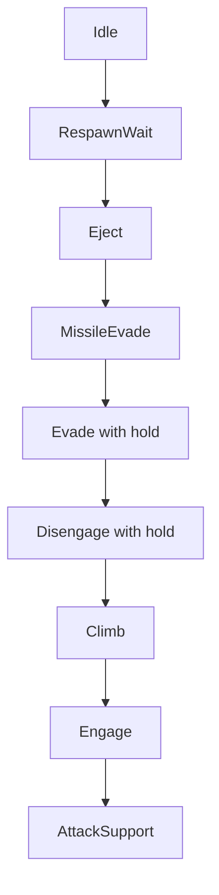

# ADR 073 — Climb Tactic: Altitude Recovery as a Behavior-Tree Leaf (Shadow-First)

| Status | Date       | Wingman Version |
|--------|------------|-----------------|
| Draft  | 2026-08-15 | 1.8.2           |

## Context

`mission_j20` commands a climb exactly once: `nose_up(2.0)` at the top of the
mission sequence, before the search-and-destroy loop starts. Altitude is never
commanded again for the life of the mission thread.

This leaves a structural gap on mid-mission respawns. The mission thread is
still alive (lock held, sitting in the afterburner cadence or the 300 s loiter
phase), so the respawned aircraft re-enters battle at spawn altitude with no
climb ever issued. Below `j20_mission.min_safe_altitude` (500 HUD altitude
units) the situation compounds: `EngageNavigator.update` deliberately returns
a no-op intent (`below-safe-floor`), so the Engage leaf stops steering
entirely. The aircraft is then fully uncommanded at low altitude — the
observed failure mode is circling at low altitude until terrain impact.

The codebase is mid-migration from the scripted mission sequence to
tactic-selection leaves (ADR 024; the scripted roll holds were retired into
the Engage leaf in Phase 3.1a). The remaining scripted prologue — the one-shot
climb — encodes *"climb happened at t = 0"*. The correct invariant is *"be
high"*: a condition, not a step.

Constraints inherited from prior decisions:

- Altitude reaches the tree as `AnalyzerSnapshot.altitude` — the telemetry
  stable value (ADR 038), which is `None` whenever telemetry is stale or
  unreadable. `alt=None` is routine in live logs, and roughly 1 % of telemetry
  reads are plausibility-rejected.
- The HUD is metric (ADR 067). The legacy `pitch_band` thresholds were tuned
  against a unit-compressed ratio and must not be borrowed. Climb thresholds
  are new values, expressed in raw HUD altitude units, living in
  `wingman/config.yaml` beside the other behavior-tree tuning.
- ADR 070 established the rollout template for a new tactic: selection
  evidence first, actuation behind a config flag, stickiness owned by the
  tactic thread, and an outer fault backstop.

## Decision

Introduce a **Climb** tactic leaf in the ADR 024 selector, rolled out
shadow-first in two phases.

### Selector placement



Climb sits directly above Engage and below every defensive tactic. A climb
must never fight the missile-evade roll hold, the eject dive, or the
disengage roll — those leaves win by priority. When Climb is selected, Engage
geometry is pre-empted, which is correct: below the safe floor the navigator
refuses to steer anyway.

### Condition: hysteresis band, freeze on missing telemetry

- **Enter** when `altitude < climb.enter_below_alt`.
- **Release** when `altitude >= climb.exit_above_alt` (a meaningfully higher
  value — a single threshold would flap at the boundary every telemetry tick).
- **`altitude is None` freezes the decision** — it neither enters nor
  releases. Entering blind would command climbs on OCR dropouts; releasing
  blind would flap selection during telemetry gaps and poison the shadow
  data. The actuation-phase safety net for a long blind climb is the tactic
  thread's own duration backstop (Phase 3.2b), mirroring ADR 070's
  `max_hold_s` — never the condition.
- Unset thresholds disable the leaf entirely (the Evade precedent:
  disabled until calibrated).

### Shadow phase must not perturb the selector

A selection-only leaf **inside** the tree is not shadow: whenever it selected,
it would pre-empt Engage actuation and silently pause geometry at low
altitude. Therefore, while `climb.enabled: false`:

- The leaf is **not inserted** into the selector — live selection is
  bit-for-bit unchanged.
- `BehaviorTreeHandler` evaluates an independent instance of the same
  condition against the same frozen snapshot each tick and logs transitions:
  `BT[shadow-climb]: would_select=True …` / `…would_select=False held=42s`.
  The per-tick debug line already carries `alt=`, so the shadow log plus
  existing lines are sufficient to correlate would-fire windows with
  respawns and terrain deaths offline.

### Config

```yaml
behavior_tree:
  climb:                    # ADR 073 — CLIMB tactic (shadow-first)
    enabled: false          # false = leaf absent, would-select logged; true = leaf in selector
    enter_below_alt: 500    # HUD altitude units; anchored to j20_mission.min_safe_altitude
    exit_above_alt: 1000    # hysteresis release; provisional pending shadow data
```

`enter_below_alt` is anchored to the navigator's existing safe floor so the
two systems agree on what "too low" means. Both values are provisional until
Phase 3.2a shadow data says otherwise.

### Rollout

- **Phase 3.2a (this ADR, implemented now):** condition + tree support +
  handler shadow logging, `enabled: false`. Collect live sessions; measure
  (a) how often Climb would fire, (b) what fraction of would-fire windows
  follow a respawn, (c) whether terrain deaths coincide with would-fire
  windows that had no climb commanded.
- **Phase 3.2b (follow-up, gated on 3.2a evidence):** wire a Controller
  `climb_mode` actuator — nose-up plus afterburner held while the leaf is
  selected, sticky via `is_running_fn` (the ADR 070 pattern), with a
  `max_climb_s` fault backstop. Flip `enabled: true`. `mission_j20` then
  shrinks by its prologue: the one-shot `nose_up(2.0)` is deleted and the
  search-and-destroy loop starts immediately, with attitude owned by the
  tree from the first tick. The afterburner cadence moves into or defers to
  the Climb leaf.

## Consequences

- The respawn-at-low-altitude gap is closed by an invariant, not a script:
  any low-altitude state — post-respawn, mid-fight energy bleed — selects
  Climb regardless of mission-thread phase.
- One more stateful condition closure (hysteresis) lives in
  `behavior_tree.py`; the freeze-on-None policy is documented at the
  condition so the actuation phase does not "fix" it into a blind release.
- The closure's hysteresis state outlives a battle: once Idle owns selection
  the Climb leaf is no longer ticked, so an in-tree leaf would open the next
  battle on the previous battle's verdict until the first fresh altitude
  read. The shadow instance in `BehaviorTreeHandler` is explicitly reset on
  battle exit to keep the evidence clean; whether the actuated leaf should
  reset on battle exit (via `on_state_change`) or deliberately open climbing
  is a Phase 3.2b decision to be made from the shadow data.
- Shadow logging adds one INFO line per would-select transition — negligible
  log volume, greppable for offline analysis.
- Until Phase 3.2b, behavior is unchanged; the known failure mode persists
  while evidence accumulates. This is deliberate (the ADR 024/070 rollout
  discipline).
- When 3.2b lands, Climb pre-empts Engage below the band. If shadow data
  shows low-altitude windows during active dogfights (short-ring contacts),
  the placement or the band may need revisiting before actuation.

## References

- ADR 024 — Phase 3 tactic-selection behavior tree (selector, shadow-first
  discipline, MinimumHold).
- ADR 038 — telemetry stable value; freshness gating.
- ADR 067 — metric HUD units; do not reuse compressed-ratio thresholds.
- ADR 070 — missile-evade tactic: the rollout template (config-gated
  actuation, stickiness via `is_running_fn`, outer fault backstop).
- `EngageNavigator.update` `below-safe-floor` intent — the existing
  low-altitude no-op that leaves the aircraft uncommanded.
