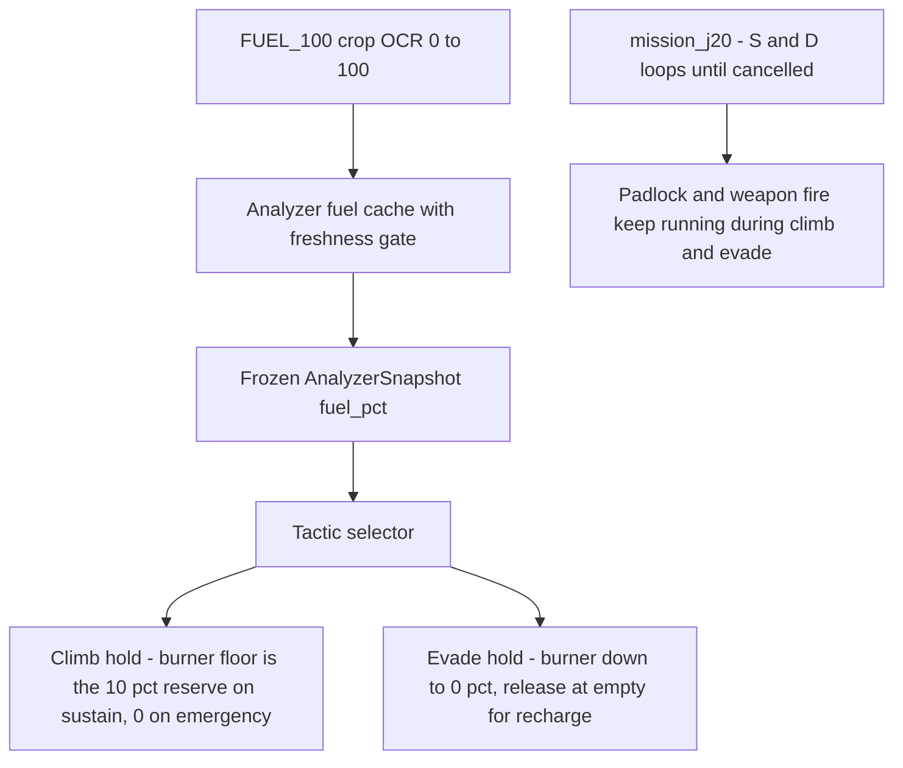

# ADR 075 — Afterburner Fuel Perception and the Fully Adaptive J20 Mission

| Status | Date       | Wingman Version |
|--------|------------|-----------------|
| Draft  | 2026-08-17 | 1.8.4           |

## Context

Two threads converge here.

**Fuel was invisible.** The aircraft's afterburner runs on a fuel percentage
the HUD shows as bare digits (`100`, no `%` symbol). The game's mechanics:

- Fuel **recharges only while the afterburner key is up**.
- At **0% the afterburner turns off** — continuing to hold the key produces
  no thrust **and prevents the recharge from starting**.

Until now Wingman held the burner on open-loop timers (the scripted
`afterburner(20)` / `afterburner(10)` schedule in `mission_j20`, the
unconditional hold in the climb tactic, the evade hold). Nothing knew the
tank state, so holds could sit at 0% blocking their own recharge, and a
missile alert could arrive with an empty tank because a routine climb had
just drained it.

**The mission script was vestigial.** After the ADR 024 3.1a geometry
cutover and the ADR 073 climb tactic, `mission_j20` still carried a scripted
afterburner schedule, a fixed 300 s loiter window, and a mission-start climb
prologue. Log review (2026-08-14 session, 9 missions / 1 h) showed the
script's tail never ran: `sequence complete` appeared 0 times — every
mission ended through the FSM (match end, respawn restart) or the tree
(eject). The remaining scripted pieces were exactly the ones with no
perception behind them.

A `FUEL_100` crop has been calibrated in `config.yaml` over the HUD fuel
readout, making fuel-aware burner discipline possible.

## Decision

### d1 — Fuel perception via the existing digit-OCR path

The `FUEL_100` crop joins the GAME_BATTLE parallel OCR cycle, processed by
the same `_process_health_region` digit reader as health and ammo (label
`fuel`, timing recorded per-crop by the performance tracker). Readings are
**range-gated to 0–100**: anything outside is digit bleed from neighbouring
HUD text and never enters the cache. `get_afterburner_fuel_pct()` returns
the cached value only while fresher than `fuel.stale_after_s` (default 6 s)
— fuel changes continuously while the burner is held, so a stale value says
nothing and reads back as `None`. Unknown fuel follows the codebase freeze
policy: it never changes burner state (d3/d4 gates act only on evidence).

### d2 — Every burner hold releases at its floor

Because a held key at 0% blocks the recharge, no hold may ride the tank to
empty and stay down. Both fuel-aware holds implement the same gate: release
the key at the floor, re-press only after the tank refills past
`floor + fuel.rearm_margin_pct` (default 5, hysteresis against flapping at
the boundary).

### d3 — Climb reserves 10% for evade manoeuvres

`climb_mode` gains a `fuel_floor_pct` parameter, threaded through to the
hold:

- **Sustain climbs** (d5) pass `climb.fuel_reserve_pct` (default **10**):
  the climb releases the burner at 10% and continues on pitch alone, so a
  missile alert always finds the reserve waiting.
- **Emergency climbs** (the ADR 073 terrain band) pass **0**: terrain
  outranks the reserve, and the d2 release-at-0 still protects the recharge.

### d4 — Evade may burn the reserve, but never blocks recharge at 0

The ADR 070 evade hold keeps AFTERBURNER pressed down to **0%** — the
reserve exists for exactly this consumer. At 0% the hold releases only the
burner key (roll/yaw stay held; the manoeuvre continues) and re-presses it
if the tank refills past the rearm margin during a long engagement.

### d5 — Sustain climb: armed aircraft work their way up

A second hysteresis band joins the Climb leaf (shared leaf, combined
condition — both bands' debounce state machines are evaluated every tick so
neither goes stale while the other holds the selection):

- `climb.sustain.enter_below_alt` (6000) / `exit_above_alt` (7000), with the
  same `confirm_reads` debounce as the emergency band (ADR 073 garbage-read
  lesson).
- Gated on **missiles > 0** (an unreadable count must not command a climb;
  an empty aircraft belongs to the Eject leaf) and **mission_running**
  (sustain is mission doctrine; the emergency band keeps firing regardless).
- The leaf's `start_fn` picks the target by the altitude the selection was
  made against: below the emergency enter threshold → Controller defaults
  (fast, short cap, floor 0); otherwise → sustain target with
  `climb.sustain.max_climb_s` (90 s) and the d3 reserve floor.

Selection priority is unchanged in order:
`Idle → RespawnWait → Eject → MissileEvade → Evade → Disengage → Climb → Engage → AttackSupport`
— the sustain band simply widens when Climb selects.

### d6 — mission_j20 is fully adaptive

The mission thread now contributes exactly two things: the
search-and-destroy loops (padlock + weapon fire) and the mission-running
state. It starts the loops and waits for cancellation — respawn restart,
eject, manual takeover, or match end. Removed outright:

- the scripted afterburner schedule (replaced by d3/d4 fuel discipline
  inside the tactics that actually need thrust);
- the fixed 300 s loiter window and never-reached `sequence complete` tail
  (mission lifetime was already FSM-owned in practice);
- the mission-start climb prologue from ADR 073 3.2c (absorbed by the d5
  sustain band, which re-selects after every respawn without mission-side
  code). ADR 073 remains Accepted; this ADR supersedes only its 3.2c
  prologue mechanism.

"While evading, search-and-destroy keeps running" was already ADR 070 d7
behavior (the evade never touches mission state; the padlock/weapon loops
poll only the cancel flag) and is now load-bearing doctrine rather than a
side effect: **climb, evade, and S&D run concurrently** — the tree owns the
airframe's attitude, the mission loops own the trigger.

## Consequences

- A missile alert during a sustain climb finds at least the 10% reserve;
  before this change the climb could hand the evade an empty tank.
- No hold can block the recharge at 0% — the worst case is flying without
  burner until the rearm margin refills.
- `mission_j20` semantics change: **there is no natural completion**. The
  mission runs until cancelled; tests asserting timer-based completion were
  updated to cancel-driven completion.
- Config moves: `climb.mission_start_alt` / `mission_start_max_s` are
  retired in favour of `climb.sustain.*`; new keys `climb.fuel_reserve_pct`
  and the top-level `fuel:` block.
- Engage geometry actuates less often below the sustain band (Climb
  outranks Engage while low and armed). The S&D loops keep firing at
  padlocked targets throughout, so trigger time is not lost — but if live
  sessions show kill rates suffering, the sustain band's enter threshold is
  the tuning knob.
- The evade's burner re-press mid-hold is new; its effect shows up in the
  existing per-engagement survival metric (ADR 055/070), which remains the
  A/B instrument for this change.
- Shadow-first (ADR 073) was **not** followed for the sustain band: it
  reuses the already-live Climb actuation path and the proven band/debounce
  mechanics, changing only when Climb selects. The first live sessions
  should be watched with the same scrutiny as a shadow phase.

## Verification

- Unit tests: fuel range gate + staleness (`test_analyzer.py`), sustain
  band selection/hysteresis/gating (`test_behavior_tree.py`), climb burner
  floor + rearm and empty-tank start (`test_climb_mode.py`), evade burner
  release at 0% with manoeuvre keys held (`test_missile_evade.py`),
  cancel-driven mission completion (`test_mission_cancel.py`).
- `make test` green (full suite); ADR 044 runtime replay gate unaffected
  (replay capture doubles carry no fuel reading — freeze policy keeps
  legacy behavior).
- Live validation pending: first unattended session should confirm (a) fuel
  OCR plausibility-reject rate, (b) burner release/re-arm cycling in the
  session log, (c) sustain climb selections after respawns, (d) survival
  split unchanged or better.

## References

- ADR 024 — Phase 3 behavior tree architecture (selector, actuation contract)
- ADR 038/067 — telemetry signals and metric HUD units
- ADR 055 — mission statistics tracker (survival A/B instrument)
- ADR 070 — missile evade tactic (d7 concurrent S&D, d8 idempotent holds)
- ADR 073 — climb tactic shadow-first (emergency band, pulse-and-observe,
  3.2c prologue superseded here)
