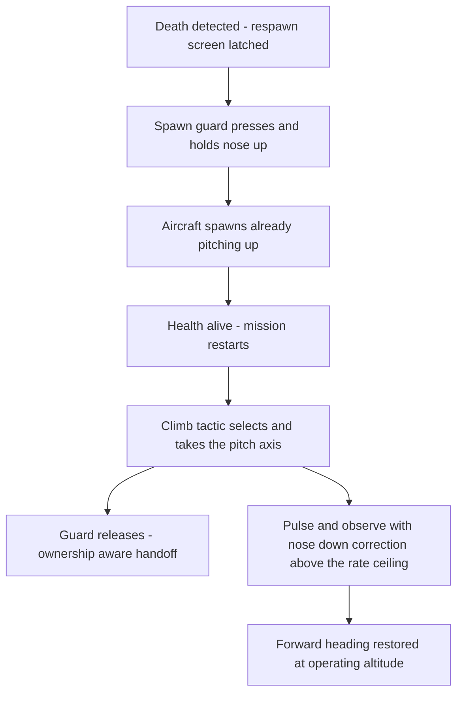

# ADR 076 — Respawn Nose-Up Guard Against Spawn-Into-Terrain Crashes

| Status   | Date       | Wingman Version |
|----------|------------|-----------------|
| Accepted | 2026-08-17 | 1.8.4           |

## Context

**The anomaly.** Some spawn points place the aircraft in an attitude and
position where flying straight ahead for the first few seconds of the new
life ends in a terrain crash — the aircraft is destroyed before any of the
perception-driven tactics can react.

**Why the current pipeline is too slow for it.** The reaction chain after a
respawn is entirely perception-gated:

1. The respawn screen clears and health OCR returns → `HEALTH ALIVE` fires
   and `restart_last_mission()` runs (`RespawnFlowHandler`,
   `tick_handlers.py`).
2. The behavior tree re-selects Climb only after the altitude band's
   `confirm_reads` debounce accepts consecutive fresh telemetry reads
   (ADR 073's garbage-read lesson — deliberately slow to trust).
3. `climb_mode` starts its thread and issues the first nose-up pitch pulse.

At a 1.5 s tick cadence with OCR latency and a 2-read debounce, the first
commanded pitch input can arrive several seconds into the new life. On a bad
spawn, time-to-impact is shorter than that. No tuning of the existing chain
closes the gap, because every stage is (correctly) evidence-gated.

**The free window.** Between death and spawn there is an interval where
keyboard input costs nothing: while the respawn screen is up the aircraft
does not exist, so flight-control keys are inert. Any input already held at
the spawn instant, however, acts on the very first simulation frames — before
any OCR read is even possible. Death detection is a signal Wingman already
has, immediately and reliably (`tick_detect`'s respawn latch).

**The interaction to design for.** Since ADR 075 d6, `mission_j20`
contributes no pitch commands — the mission thread is search-and-destroy
loops only. The pitch consumers after a spawn are the Climb tactic
(the ADR 075 d5 sustain band re-selects after every respawn) and, now, this
guard. The sustain climb will command nose-up into an aircraft that is
*already* pitching up from the pre-spawn hold. The existing pulse-and-observe
controller can decline to add more nose-up (it withholds pulses while the
climb rate is healthy), but it has no way to take pitch back out — and the
2026-08-15 20:24 session showed what unchecked nose-up does: the aircraft
loops, altitude oscillating with zero net gain. Pre-applied pitch from the
guard makes an over-rotation path real, so the adaptive climb needs a
symmetric nose-down correction to keep the overall heading forward.

## Decision

### d1 — Spawn-attitude guard: hold nose-up from death to spawn

When the respawn flow latches a death (`RESPAWN DETECTED` in
`RespawnFlowHandler.tick_detect`, both OCR and ADR 064 health-fallback
paths), the Controller starts a **spawn-attitude guard**: a stoppable daemon
thread that presses and holds `NOSE_UP_KEY` through the respawn screen, so
the aircraft's first frames of life are already pitching up.

- The hold uses the programmatic key bracket
  (`_inc_programmatic_key`/`_dec_programmatic_key`) — `i` is a watched
  manual-takeover key, and without the bracket the guard's own hold would be
  read as a human taking over (the ADR 070 d4 / climb-hold precedent).
- The thread follows the stoppable-daemon rules: `Event.wait(timeout=...)`
  tick, stop event set in `cleanup()`.
- The guard is inert by construction while the respawn screen is up (the
  aircraft does not exist), so starting it costs nothing even when the
  spawn point turns out to be benign.

### d2 — Release is ownership-aware, with hard backstops

The guard releases on the first of:

- **Handoff** — `HEALTH ALIVE` fires (the mission-restart path) plus a short
  overlap window (`release_overlap_s`, default 2.5 s) that covers the tree's
  re-selection latency, so pitch input never gaps between guard and tactic.
- **Match end / state exit** — the FSM leaves the battle context
  (`GAME_END_B`, lobby): a match end is not a respawn, and the respawn
  flow's `reset()` also stops the guard.
- **Manual takeover** — a genuine human keypress ends the guard exactly as
  it ends every other programmatic hold.
- **Backstop** — an unconditional `max_hold_s` (default 90 s) so no code
  path can leave the key held forever.

The physical key release is **ownership-aware**: if a climb hold is active
at release time, the guard decrements its bracket but skips the OS-level
key-up — the climb thread owns the key state and its own `finally` block
releases it. Two threads releasing the same key independently would let the
guard yank nose-up out from under an in-progress climb pulse. A second
*press* on an already-held key, by contrast, is harmless (the ADR 070 d8
idempotent-hold property) — which is why the climb tactic starting "again"
into the guard's held key needs no special casing.

### d3 — The adaptive climb gains a nose-down over-rotation correction

`_run_climb_hold`'s pulse-and-observe state machine currently has one-sided
authority: it applies nose-up when the telemetry climb rate is below
`min_climb_rate` and withholds it otherwise. That was sufficient when the
controller was the only source of pitch input; with the guard pre-loading
nose-up before the tactic ever runs, the climb must also be able to rotate
the aircraft *back down*:

- New config key `climb.max_climb_rate`: when the fresh telemetry climb rate
  exceeds this ceiling, the controller pulses `NOSE_DOWN_KEY` on the same
  pulse/observe cadence (`pitch_pulse_s` / `pulse_observe_s`) until the rate
  drops back inside the band.
- Between the floor (`min_climb_rate`) and the ceiling, behavior is
  unchanged: no input, let the aircraft fly.
- The correction acts only on **fresh** telemetry reads (the d5 freeze
  policy — a stale or unknown rate commands nothing, in either direction).

This keeps the net trajectory forward-and-up: the guard buys the first
seconds of terrain clearance, and the adaptive climb trades any surplus
pitch back for forward heading instead of letting it develop into the loop
the 2026-08-15 session documented. `mission_j20` itself is untouched — the
"mission tries to nose-up while already nose-up" interaction resolves inside
the Climb tactic, which is where ADR 075 moved all pitch authority.

### d4 — Priority and scope

The guard runs only inside the death→spawn window and never contends with a
live tactic: eject and evade cannot run while the aircraft is dead (the
respawn latch already calls `stop_eject_sequence()`), and if either starts
during the post-spawn overlap window the guard releases immediately — the
same yield-to-higher-priority rule the climb hold applies
(`_ejecting` / `_missile_evading` checks).

## Consequences

- Bad spawns get pitch input on the first simulation frames instead of
  several seconds later; the crash-on-spawn anomaly should disappear from
  session logs. The measurable instrument is the MissionStatsTracker
  (ADR 055): deaths within ~10 s of a `HEALTH ALIVE` event, before vs
  after.
- The nose-down ceiling (d3) also protects ordinary sustain climbs — the
  2026-08-15 looping failure mode is now actively corrected rather than
  merely avoided.
- `i` is held while the respawn screen is up. Flight keys are believed
  inert on that screen, but if the respawn UI ever binds `i`, the guard
  would trigger it every death — the first live session must confirm the
  respawn screen ignores the held key.
- Benign spawns briefly climb before the correction levels off; a few
  degrees of surplus pitch traded for guaranteed terrain clearance is the
  intended bias.
- Shadow-first (ADR 073) is **not** followed: the guard's actuation is inert
  until the spawn instant, so its entire risk window is the first seconds of
  each life — the same window the change exists to protect. First live
  sessions should be watched with shadow-phase scrutiny (the ADR 075
  precedent).
- New config keys: `climb.spawn_guard.{enabled, max_hold_s,
  release_overlap_s}` and `climb.max_climb_rate`.

## Verification

- Unit tests: guard starts on the respawn latch (OCR and health-fallback
  paths); releases on alive-plus-overlap, match-end reset, manual takeover,
  and the `max_hold_s` backstop; ownership-aware release skips the key-up
  while a climb hold is active; nose-down pulse fires above
  `max_climb_rate` on fresh reads only and never on stale/None
  (`test_climb_mode.py`, `test_behavior_tree.py`).
- `make test` green; ADR 044 replay gate unaffected (the guard actuates
  keys, which replay capture doubles already ignore).
- Live validation (2026-08-17 05:52–07:06 session, 1 h 14 min unattended,
  12 missions all click-to finish, 49 respawns):
  - Guard lifecycle: 49 starts / 49 completes — 47 `alive_handoff`
    releases, 2 `state_exit` (match end during the respawn hold), zero
    max-hold backstop firings.
  - (a) Respawn screen confirmed inert to the held key: 49 respawns with
    NOSE_UP held throughout, every one proceeded respawn → alive → restart
    with no menu or state anomalies.
  - (b) **Spawn crashes: 0 / 49** (death within 10 s of restart — the new
    MissionStatsTracker instrument).
  - (c) The d3 ceiling actively engaged: 24 nose-down pulses traded surplus
    pitch back for forward heading; no looping observed.
  - (d) No false manual-takeover detections from the hold; the 2 genuine
    takeovers in the session behaved per SAF-001.
  - The d2 ownership rule carried nearly every handoff: 48 of 49 releases
    found a climb hold owning the pitch key and correctly skipped the
    OS-level key-up — the overlap window works exactly as designed.
  - Survival split (ADR 055): 90% with evade (9/10) vs 60% without (3/5),
    consistent with the ADR 070/075 record.

## References

- ADR 055 — mission statistics tracker (spawn-crash measurement instrument)
- ADR 064 — health-fallback respawn detection (second guard trigger path)
- ADR 070 — missile evade (d4 programmatic key bracket, d8 idempotent holds)
- ADR 073 — climb tactic (pulse-and-observe pitch, confirm-reads debounce,
  2026-08-15 looping evidence)
- ADR 075 — fully adaptive J20 mission (d5 sustain band re-selection after
  respawn, d6 mission thread owns no pitch)
