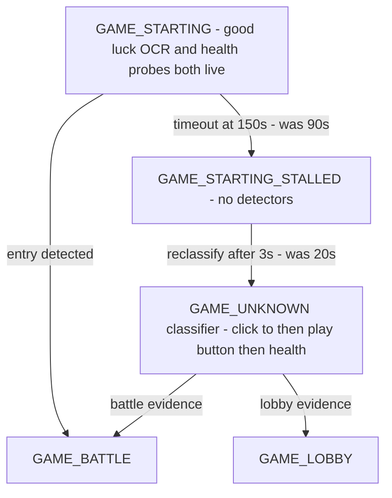

# ADR 077 — Match-Entry Tail: Longer Starting Wait, Immediate Stall Reclassification

| Status   | Date       | Wingman Version |
|----------|------------|-----------------|
| Accepted | 2026-08-17 | 1.8.4           |

## Context

The 2026-08-17 05:52–07:06 session (12 missions) hit the
`GAME_STARTING_STALLED` path on **6 of 12 match entries** — every stall
followed by a successful `GAME_UNKNOWN → GAME_BATTLE` reclassification.
That reads like a detection failure. The session log says otherwise.

**Measured match-entry durations** (`GAME_WAITING → GAME_STARTING` to
`→ GAME_BATTLE`, from the session log):

| Path | Durations |
|------|-----------|
| good-luck detected | 30.0 s, 31.5 s, 31.5 s, 36.0 s, 48.0 s, 82.5 s |
| stalled at timeout | 91.3 s, 90.9 s, 91.9 s, 92.2 s, 93.0 s, 92.9 s |

The first stalled episode in full:

```
05:57:58,156 [INFO] 🎮 Game state: GAME_WAITING → GAME_STARTING
05:58:03,927 [DEBUG] Analyzer: 'Good Luck' not found in good_luck crop   (every ~5 s)
05:59:29,113 [INFO] GAME_STARTING health probe #54 (+80.3s since armed): no digits
05:59:29,429 [WARNING] Controller: game_starting timed out after 90s without 'Good Luck'
05:59:50,671 [WARNING] GAME_STARTING_STALLED persisted for 20s — reclassifying via GAME_UNKNOWN
05:59:53,090 [INFO] FSM: GAME_UNKNOWN classified as GAME_BATTLE via unknown_to_battle_detected
```

**This is not an OCR miss.** During `GAME_STARTING`, *two* battle
detectors run continuously: the good-luck OCR scan (~5 s cadence) and the
ADR 065 health probes with `good_luck_bypass_on_alive` (~1.5 s cadence).
In the stalled episodes both correctly reported nothing — the health crop
had no digits **80+ seconds in** — because the match genuinely had not
started yet. The `GAME_UNKNOWN` classifier that later called battle uses
the *same health OCR* the probes use; it succeeded because by then the
battle had actually begun.

The real problem is two config values sitting in the wrong place relative
to the measured distribution:

- `starting_max_wait_s: 90` falls in the **middle** of the real
  match-entry tail (observed entries up to ~115 s). Half this session's
  entries timed out while matchmaking was still legitimately in progress.
- After the timeout, `starting_stalled_reclassify_after_s: 20` is **pure
  dead time**: `GAME_STARTING_STALLED` runs no detector at all (its
  on-enter is a log line — ADR 025). Battle can begin during those 20
  seconds and nothing is watching; detection resumes only when the
  `GAME_UNKNOWN` classifier takes over.

Per late entry the pipeline adds up to ~25 s of blind time (20 s stall +
classifier debounce), plus three WARNING lines for a situation that is
normal matchmaking variance.

## Decision

Config-only; no code paths change.

### d1 — `starting_max_wait_s`: 90 → 150

The timeout's only job is to eventually hand a *genuinely stuck* entry
(lobby bounce, blocking promo popup — the ADR 025/029 cases) to the
recovery pipeline. Waiting longer in `GAME_STARTING` costs nothing for
real entries, because both detectors stay live the whole window — a battle
that starts at t=100 s is caught within seconds by the probe bypass. 150 s
covers the observed tail (all six late entries produced battle evidence by
~115 s from entry) with margin.

### d2 — `starting_stalled_reclassify_after_s`: 20 → 3

`GAME_STARTING_STALLED` is announcement-only dead time; nothing scans
while it counts down. The `GAME_UNKNOWN` classifier it hands off to
carries its own consecutive-candidate debounce, so an almost-immediate
handoff is safe — the 20 s wait buys nothing. Three seconds keeps the
stall visible in the log as a distinct state without leaving the pipeline
blind.

### d3 — Accepted trade: slower recovery for the genuinely stuck case

With d1+d2 the *stuck* path (the one real lobby bounce this session, 1 of
13 entries) recovers in up to ~153 s instead of ~110 s. That case is rare
and harmless — the lobby quick-scan re-clicks PLAY and the loop resumes —
while the late-entry case is common (6 of 12 this session) and currently
eats the blind window plus warning noise every time.



## Consequences

- Match entries in the 90–150 s band take the fast path: detected within
  seconds of the battle actually starting, instead of surfacing as a
  stall-and-reclassify cycle up to ~25 s late.
- Stall warnings become a genuine anomaly signal again instead of firing
  on a third of normal entries — a session with stalls now means entries
  ran past 150 s, which is worth looking at.
- The measurement that produced this ADR is repeatable from any session
  log (the state-transition deltas above); the next unattended session is
  the before/after instrument.
- If the game's matchmaking tail ever grows past 150 s, the symptom
  returns and the same measurement names the new value — the mechanism is
  sound, only the constant is game-dependent.

## Verification

- `make test` green (config parse only; no behavior code changed).
- Live validation (three sessions, 2026-08-17 13:05 / 15:02 / 15:33,
  ~3 h combined, 30 match entries): **zero stalls**. Entries measured up
  to 96 s, 107 s, and 119 s — five entries that would have stalled under
  the old 90 s timeout took the fast path. The stuck-lobby case did not
  occur; its recovery pipeline is unchanged.
- Adjacent fix in the same change: program exit during GAME_STARTING no
  longer fires `starting_timeout` (the 12:52 shutdown artifact), with a
  regression test beside the cancel-fires-timeout test.

## References

- ADR 025 — FSM formalisation (`GAME_STARTING_STALLED`, recovery
  transitions)
- ADR 029 — lobby quick-scan thread (popup dismissal, PLAY re-click)
- ADR 065 — GAME_STARTING health-probe reachability
  (`good_luck_bypass_on_alive`, the second live detector)
- 2026-08-17 05:52 session log — measured entry distribution and stalled
  episode timelines
