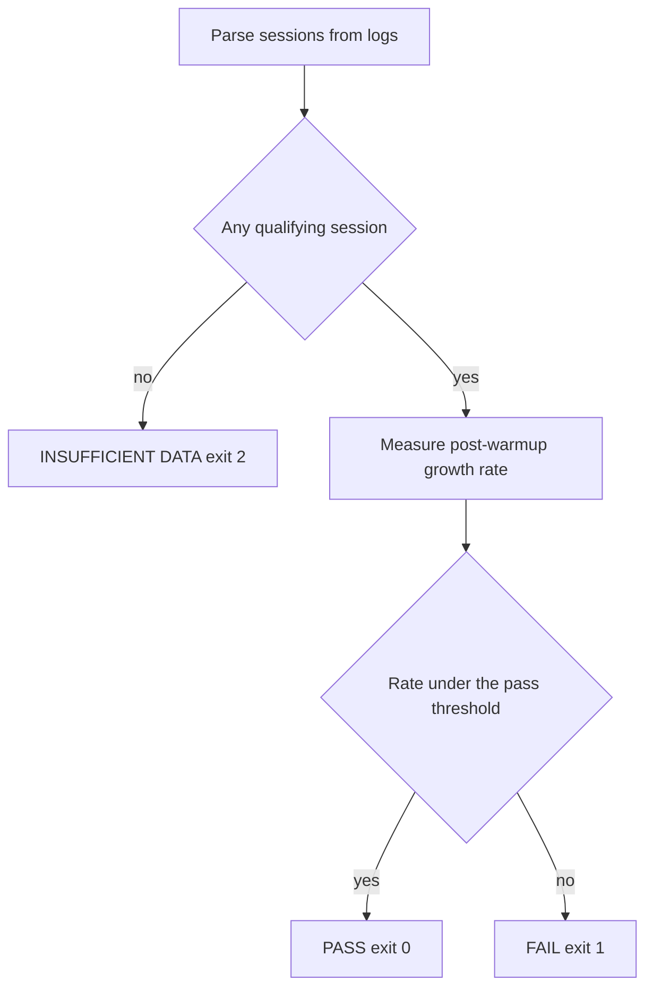

# ADR 092 — Leak Detection: Source-Site Guard and Log-Based Gate

| Status   | Date       | Wingman Version |
|----------|------------|-----------------|
| Accepted | 2026-08-25 | 1.8.5           |

**Implemented and accepted 2026-08-25.** Status table above kept at the
creation version; see the header of the Open items section for the current
state.

## Context

ADR 091 fixed a leak that ran for two months at up to 1,666 MB/h. Research 009
generalises the lesson. Neither prevents recurrence — nothing in the test suite
or the release gates would notice if the same defect, or a different one,
returned tomorrow.

The audit that motivated this ADR found three specific gaps:

1. `test_repeated_key_events_open_exactly_one_display` pins the fixed function
   only. A new per-operation handle anywhere else fires nothing.
2. `_linux_click` still constructs a `Display` per call — the identical defect,
   with no test of any kind.
3. **No test or gate fails on actual memory growth.** The `resource_monitor`
   tests feed synthetic curves to the verdict function and check it labels them
   correctly; they test the reporter, not the system, and would all pass while
   wingman leaked a gigabyte an hour. The leak was found by a two-hour live
   session, and nothing automated would catch its return.

Gap 3 is the one that matters. Research 009's central finding is that the cause
sat where nobody was looking, so a guard that only watches known patterns
institutionalises looking where we already looked.

## Decision

Build **both** mechanisms, with deliberately separated roles.

| | Source-site guard | Log-based leak gate |
|---|---|---|
| Detects | the known *cause* pattern | any leak, by *symptom* |
| Runs | every commit, in `make test` | against real session data, in `make leak-check` |
| Input | the source tree | `logs/wingman_*.log` |
| Deterministic | yes | no — depends on what has been flown |
| Catches unknown causes | no | yes |
| Latency to detection | seconds | one long session |

They are complements, not alternatives: the guard is cheap and immediate but
narrow; the gate is broad but needs a qualifying session to say anything.

## Design 1 — Source-site guard

A test that pins the set of handle-construction sites, so adding one becomes a
decision rather than a merge.

**Discovery by AST, not regex.** Walk each `wingman/*.py` for `ast.Call` nodes
whose callee resolves to a watched constructor name, recording the **enclosing
function** rather than the line number — line numbers shift on every unrelated
edit and would make the test a maintenance tax.

**The registry is `(module, function) -> count`**, with a justification per
entry. Current state, from an AST scan on 2026-08-23:

| module | function | n | justification |
|--------|----------|---|---------------|
| `input_linux.py` | `_linux_click` | 1 | per-call; low hundreds per session, and its sleeps must not be held under the injection lock (ADR 091, "Not done") |
| `input_linux.py` | `_shared_xtest_display` | 1 | **the approved factory** — one per process |
| `input_linux.py` | `_listener_loop` | 3 | once per listener start: setup, record, control connections |
| `input_linux.py` | `_record_handler` | 1 | guarded by `if new:` — only when keys are registered after the loop starts |
| `move_game_window.py` | `_connect` | 1 | one-shot tooling, not on the tick path |

The failure message must teach, not just fail:

```
New Display() construction site: wingman/foo.py:bar

If this runs per operation on the tick path, it is the ADR 091 defect —
each construction retains ~16.2 KB permanently. Use the shared factory.
If it is justified, add it to _APPROVED_SITES with the reason.
```

**Watched constructors** start as `Display` alone. The list is extensible, and
Research 009's table of candidate categories is where to look when adding to it.
Deliberately not generalised further now: a guard that fires on everything gets
disabled.

## Design 2 — Log-based leak gate

`scripts/leak-check.py`, exposed as `make leak-check`.

**Parse.** Read `logs/wingman_*.log` and the live `wingman.log`, extracting
`RESOURCE elapsed=...` lines into a per-session series.

**Anchor and qualify.** Rates are measured from a post-warm-up anchor, never
from t=0 — wingman allocates over a gigabyte loading OCR readers in the first
five minutes, and dividing that across a session manufactures a phantom leak. A
session qualifies only with a post-warm-up window of at least `min_window_h`
and at least `min_samples` samples.

**Three outcomes, never two.**



`INSUFFICIENT` is **not** a pass. This is the whole reason the gate needs care:
short sessions underread the leak by roughly tenfold — 0.75 h runs measured
+120 and +288 MB/h while the same code leaked over 1,300 MB/h in long ones. A
green light derived from a twenty-minute session retires the question while the
defect is live, which is worse than no gate at all. The existing
`resource_monitor` already refuses to attribute on short windows; this inherits
that discipline rather than inventing one.

**Signal preference.** Use `mi_use` (live allocation) when the log carries it.
Fall back to `rss` for older logs, with wider thresholds and the verdict marked
lower-confidence, because RSS includes arena retention that is not a leak — the
post-fix session showed RSS growing +109 MB/h while live allocation was flat,
and reporting that as a leak would be a false positive.

**Wingman-side and game-side must be separated.** MetalStorm leaks ~215 MB/h on
its own, consistently across every session measured. That must never fail a
wingman gate. Report it, attribute it, do not gate on it.

**Report the distribution, not just the verdict.** Print the latest qualifying
session against the median and range of prior qualifying sessions, so a slow
regression is visible before it crosses a threshold.

**Thresholds live in `config.yaml`** under a `leak_gate:` section, matching the
project convention that tuning values never sit in code or in a requirement.

## Where they run

- **Source-site guard** — `make test`. Deterministic, milliseconds.
- **Leak gate** — `make leak-check`, wired into `make tp`.

The gate is deliberately **not** in `make test`. Its result depends on a mutable
local directory and on whether anyone has flown recently; a suite that fails for
reasons unrelated to the commit gets ignored, and one that passes vacuously is
worse.

Exit-code handling differs by caller, and this is intentional:

| caller | PASS | FAIL | INSUFFICIENT |
|--------|------|------|--------------|
| `make leak-check` | 0 | 1 | 2 |
| `make tp` | continue | **block** | warn loudly, continue |
| `make wrelease` | continue | **block** | **block** |

Releasing a build whose memory behaviour has never been measured on a long
session is exactly how the last leak shipped, so `wrelease` treats absence of
evidence as a failure. `tp` runs far more often and must stay usable without a
recent soak.

## What was built

| piece | where |
|-------|-------|
| Source-site guard | `tests/test_handle_construction_sites.py` — AST scan of `wingman/*.py`, registry keyed by `(module, enclosing function)` |
| Leak gate | `scripts/leak-check.py`, `make leak-check` |
| Thresholds | `config.yaml` under `leak_gate:` |
| `tp` wiring | `leak-check-gate` prerequisite — FAIL blocks, INSUFFICIENT warns |
| `wrelease` wiring | runs first; **both** FAIL and INSUFFICIENT block |

Two design details that changed during implementation, both worth recording:

**Only two rate outcomes, not three.** The draft implied `pass_at`/`fail_at`
might produce a middle verdict. They do not: INSUFFICIENT is about whether the
*data* supports a conclusion, never about where the rate sits. `fail_at` now
only labels severity, so a borderline result reads differently from a runaway
one without inventing a third rate verdict that means neither.

**An inert session is refused, not passed.** Not in the original design, and
necessary: Anomaly 001's livelocked session shows almost no growth *because it
did no work*, and would otherwise have sailed through as a clean PASS. The gate
now rejects any session where more than half the post-warm-up samples show
`n_ocr=0`.

`--log-dir` is authoritative — the live `wingman.log` is only folded in for the
default directory, so tests can select exactly what they mean.

## Validation

The gate is unusually testable: ~170 archived logs exist with known answers.
Unit tests assert the corpus outcomes directly.

| log | window | signal | expected |
|-----|--------|--------|----------|
| `wingman_20260823_002829.log` | 6.77 h | mi_use +1491 | **FAIL** |
| `wingman_20260823_065033.log` | 2.26 h | mi_use +974 | **FAIL** |
| `wingman_20260823_124159.log` | 1.59 h | mi_use +824 | **FAIL** |
| `wingman_20260823_151050.log` | 1.34 h | mi_use +9 | **PASS** |
| `wingman_20260823_230230.log` | 3.01 h | mi_use +2 | **PASS** |
| `wingman_20260821_083045.log` | 0.75 h | — | **INSUFFICIENT** |
| any pre-2026-08-21 log | — | no RESOURCE lines | **INSUFFICIENT** |

Corpus assertions pin behaviour against real data but depend on files that are
gitignored and machine-local, so they **skip, not fail**, when the corpus is
absent. Synthetic fixtures carry the deterministic edge cases: warm-up excluded
from the rate, game-side growth not failing the wingman gate, `mi_use` preferred
over `rss`, malformed and truncated lines ignored.

**Verified 2026-08-25 against the real corpus**, all as specified:

| input | outcome |
|-------|---------|
| pre-fix 6.77h session (+1491 MB/h) | FAIL, exit 1 |
| pre-fix 2.26h session (+974) | FAIL |
| post-ADR-091 3.01h (+2) and 4.34h (-0) | PASS, exit 0 |
| 0.75h session | INSUFFICIENT, exit 2 |
| Anomaly 001 livelock session | INSUFFICIENT (inert) |
| empty log directory | INSUFFICIENT |

The source-site guard was verified by **reintroducing the ADR 091 defect** — a
per-call `Display()` in `_linux_key_event` — which fails two of its tests with
the intended explanation. A guard that cannot fail is inert, so this is checked
rather than assumed.

## Consequences

- A new per-operation handle fails at commit time with an explanation.
- A leak from **any** cause fails the release gate once a qualifying session
  exists — the property the last two months lacked.
- `make wrelease` now requires a recent long session. That is a real workflow
  cost, and it is the point.
- The guard's registry needs updating whenever a construction site is
  legitimately added. That friction is the mechanism, not a side effect.
- Neither mechanism detects a leak *during* a session. ADR 090's memory guard
  remains the only in-flight protection.

## Open items — resolved at acceptance, 2026-08-25

1. ~~**Thresholds are unexercised in anger.**~~ **Exercised on real data.** The
   gate now returns PASS on six live post-ADR-091 sessions (3.0–9.0h, −4 to
   +3 MB/h), FAIL on the archived pre-fix sessions (+974 and +1,491 MB/h),
   INSUFFICIENT on short sessions and on the Anomaly 001 livelock run. What had
   not happened was a *release* decision — see item 2.
2. ~~**`wrelease` now requires a qualifying session.**~~ **Verified.** The
   release-gate branch is Makefile recipe shell, so it would otherwise only run
   during an actual release — the worst moment to find it wrong. It is now
   tested by extracting the block **verbatim from the real recipe** and running
   it, so a copy in the tests cannot drift from what `wrelease` does:

   | input | exit | reaches the release body |
   |-------|------|--------------------------|
   | qualifying flat session | 0 | **yes** |
   | qualifying leaking session | non-zero | no — "leak gate failed" |
   | no qualifying session | non-zero | no — "never been measured" |

   A fourth test pins that the gate is the *first* step of `wrelease`, so it
   cannot drift after work that is hard to undo.
3. **Still open: `_WATCHED` covers `Display` only.** Research 009 lists other
   constructor categories; none are guarded. This is a scope limit rather than a
   defect, and does not gate acceptance — extending it needs a reason, since a
   guard that fires on everything gets disabled.

### Known at acceptance

- **No real release has run through this gate yet.** The branching is verified
  against the actual recipe text, but `make wrelease` end to end has not been
  invoked since the gate was added.
- The thresholds separate the known corpus cleanly with wide margins (−4..+3
  against a 100 pass line; +974..+1,491 against a 400 fail line). They have not
  been tested against a *marginal* leak, which is where a threshold is actually
  chosen well or badly.

## Alternatives considered

**Only the source-site guard.** Rejected: it cannot catch what it was not told
to watch, which is the exact failure mode Research 009 documents.

**Only the log gate.** Reasonable, and it was the stronger of the two if forced
to choose. Rejected because the guard is roughly twenty lines and moves
detection from hours to seconds for the pattern we know bites.

**A memory assertion in the ADR 044/045 runtime gates.** Rejected: those replay
a short path injecting a handful of key events, and the defect needed ~80,000
constructions to become visible. It would have passed throughout the leak.
Accumulating defects need a duration gate, not a unit test.

**Failing `make test` on log analysis.** Rejected — see "Where they run".

## References

- ADR 091 — the fix, and `_linux_click` recorded as deliberately not done
- Research 009 — the generalised defect class and detection lessons
- ADR 090 — the in-flight memory guard, unchanged by this ADR
- Performance 008 — the incident record and the underreading-short-sessions data
