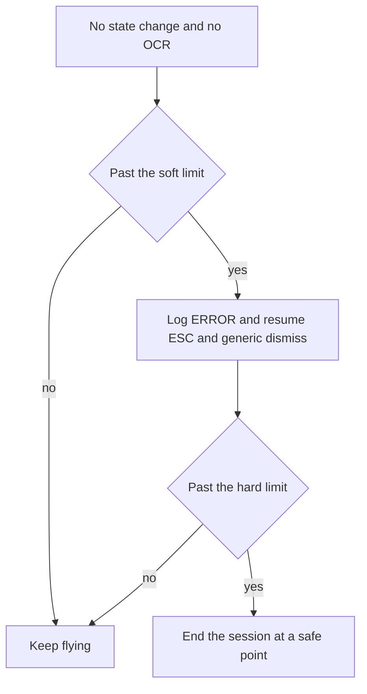

# ADR 093 — Escaping a Lobby Blackout With Nothing to Dismiss

| Status | Date       | Wingman Version |
|--------|------------|-----------------|
| Draft  | 2026-08-24 | 1.8.5           |

**Implemented 2026-08-24.** All four decisions are in the working tree with
tests; `make test` is green at 815 passed. Status stays `Draft` until the
thresholds are validated on a real session — see Open items.

## Context

The 2026-08-24 00:11 session ran 3h 27m and was **functionally dead for its last
110 minutes** — zero OCR, zero control actions, zero FSM transitions, while
still emitting ~4,000 log lines per 15 minutes.

```
min    log lines   ctrl acts   state chgs
 60         6988        1573           30
 75         6726        1671           16
 90         3978           0            0
195         3415           6            0
```

ADR 087's evidence capture worked exactly as designed and produced the answer.
`blackout_20260824_013818_stuck31s.png` and `..._stuck511s.png` are **identical**:
a full-screen **PROFILE overlay** for another player, sitting over the lobby,
with the mouse cursor resting on the player row that opened it. Wingman's own
lobby click opened it, and it never closed.

### Why all three recovery paths dead-ended

The overlay is not the lobby, not a calibrated popup, and not the exit dialog,
so each mechanism found nothing to act on:

| path | log evidence | why it failed |
|------|--------------|---------------|
| Popup dismissal | `no calibrated popup crop matched — nothing to dismiss` | nothing calibrated for this overlay |
| `STALL_EXIT_TO_DESKTOP` cancel (ADR 087 addendum) | `'STALL_EXIT_TO_DESKTOP' not found` x917 | no exit dialog on screen |
| ESC escape loop | `ESC suppressed — lobby blackout in progress` | gated OFF by the blackout itself |

The third is the trap. ADR 087 suppresses ESC during a blackout for a good
reason — ESC opens the Exit-to-Desktop modal, and firing into a blackout
re-opens it seconds after recovery cancels it, a 23s cancel-then-reopen cycle
observed 2026-08-21 10:48. But **the suppression has no ceiling.** When the
blackout is caused by something the popup scan cannot recognise, the one
mechanism that could have closed the overlay is the one that is disabled, and it
stays disabled forever.

ESC would almost certainly have closed this overlay on the first press.

### The alarm went quiet

`unknown_anomaly.max_per_episode: 5` capped captures at 31s, 151s, 271s, 391s
and 511s. That cap is correct for disk usage, but the anomaly **warning** shares
it, so the last complaint was at 511s while the fault ran another 100 minutes.
An unattended session emits nothing after the first nine minutes of a fault that
never ends.

### Not a one-off

Five earlier sessions hit the same condition: `20260821_102133`, `103701`,
`105108`, `110404`, `20260822_092108`. Every one is a short log — which now
reads as sessions killed by hand because they were stuck, not sessions that were
meant to be short. This has been silently costing runs for days, and it
corrupted the ADR 091 replication data by folding 1.9h of idle into a
3.25h memory measurement.

## Decision

Four changes, ordered from most general to most specific. The general ones
matter more: the next blackout will be caused by a different unrecognised
screen, and only the generic paths will help.

### 1. A ceiling on the ESC suppression

Once a `GAME_LOBBY` blackout outlives `blackout_esc_ceiling_s` **and** no
recovery target has been recognised in that time, the ESC suppression lifts and
the escape loop resumes.

The trade is explicit: ADR 087's cancel-then-reopen cycle is *bounded and
self-correcting* — `STALL_EXIT_TO_DESKTOP` exists precisely to cancel that
dialog, and the cycle costs 23s per iteration while classification keeps
working. The livelock is *terminal*. Churn beats paralysis, so the suppression
becomes a delay rather than a veto.

### 2. A liveness guard, in the shape of ADR 090's memory guard

The deeper defect is not this overlay. It is that **wingman cannot notice it is
doing nothing.** A guard that watches for absence of progress catches every
future livelock regardless of cause, exactly as ADR 090's memory guard bounds
every leak regardless of cause.

Trigger on **no FSM state change and no OCR activity** for `stall_limit_s`
(both, so a legitimately long battle does not trip it). Escalate:



Ending the session is the right terminal action for an unattended run: a
finished session with an honest summary is far more useful than a process that
logs for eight hours and flies for one.

### 3. Keep the alarm alive while the fault does

Decouple the warning cadence from `max_per_episode`. Captures stay capped —
disk is finite and the fifth screenshot of an unchanging screen adds nothing —
but the anomaly warning continues at a decaying interval for as long as the
condition holds, naming the elapsed time. Silence must mean healthy.

### 4. Calibrate a `STALL_PROFILE` crop

The targeted fix, listed last because it is the least valuable. Named for the
`STALL_` convention the other recovery crops follow, with its reference frame at
`test_screenshots/STALL_PROFILE.png` beside `STALL_RETRY.png` and the rest.

Detection and the click target are **separate crops**, because the overlay's
title is a label, not a button — clicking it does nothing. `STALL_PROFILE` reads
the title; `STALL_PROFILE_DISMISS` is the close control in the opposite corner.
That is the same detect-one / click-another shape as `event_refresh` and
`event_refresh_dismiss`.

This closes the specific hole. It does not close the class, which is why it is
fourth: the store, hangar, settings and match-history overlays are presumably
all capable of the same thing, and calibrating each as it bites is a treadmill.

### Not in scope — why the click happened

The overlay was opened by wingman's own lobby click landing on a player row.
Preventing that is a separate question about lobby click targeting, and fixing
recovery is worth doing regardless: a click will land somewhere unexpected
again, and the system must survive it.

## Configuration

New keys, defaults to be tuned against the next sessions:

```yaml
lobby_blackout:
  blackout_esc_ceiling_s: 120.0   # suppression becomes a delay, not a veto
liveness_guard:
  enabled: true
  stall_limit_s: 300.0            # no state change AND no OCR
  hard_limit_s: 900.0             # end the session at a safe point
unknown_anomaly:
  stuck_warn_interval_s: 300.0    # first repeat after the capture cap
  stuck_warn_max_interval_s: 1800.0   # ceiling on the doubling
```

## What was built

| decision | where |
|----------|-------|
| 1. ESC ceiling | `analyzer.blackout_esc_suppressed()`, consumed by the escape loop in `main.py`. `blackout_esc_ceiling_s: 0` restores pure ADR 087 behaviour. |
| 2. Liveness guard | `wingman/liveness_guard.py`. Progress is noted on an FSM state change or on OCR activity (via the non-draining `snapshot_since`); the hard limit ends the session at the same safe point ADR 090 uses. |
| 3. Persistent alarm | `UnknownAnomalyRecorder._warn_still_stuck` — captures stay capped, the warning repeats on a doubling interval to a ceiling. |
| 4. `STALL_PROFILE` | `config.yaml` crops, `STALL_RECOVERY_CROPS`, and the blackout gate in `_stall_recovery_targets`; handler in `main.py`. |

Tests: `tests/test_stall_profile_recovery.py` (10), `tests/test_liveness_guard.py`
(14), `TestStuckWarningPersists` in `tests/test_stall_recovery.py` (3). The OCR
regression reads the crop off the tracked reference frame rather than the
anomaly captures, which live in a gitignored directory that gets swept — pinning
it to those made it silently skip.

`test_lobby_blackout_past_dwell_opens_only_the_exit_dialog` was renamed and
rewritten rather than deleted. ADR 087's literal assertion (exactly one crop) is
superseded, but the property it was protecting is not: the test now asserts that
both eligible crops are single de-escalating clicks and that the invasive
`STALL_RETRY` and `STALL_AIRCRAFT` stay gated on a genuinely unclassifiable
state.

## Consequences

- A blackout wingman cannot recognise costs minutes, not hours.
- Every future livelock is bounded, whatever causes it.
- An unattended run that gets stuck ends with a summary instead of running
  silently to morning.
- ESC may occasionally re-open the Exit-to-Desktop dialog after the ceiling
  expires. That is accepted, bounded, and already handled.
- The liveness guard can in principle end a session during a legitimate long
  idle. Requiring *both* no state change and no OCR makes that unlikely, but the
  thresholds need validation against real sessions before this ADR is accepted.

## Open items before this can move to Accepted

1. **Thresholds are unvalidated.** 120s ESC ceiling, 300s/900s liveness limits
   and the 300s warning interval are reasoned, not measured. A session that
   trips the guard on a legitimate idle would be a false positive worth knowing
   about before this is relied on.
2. **The recovery has never fired live.** `STALL_PROFILE` is verified by OCR
   against the captured frame; nothing has yet watched it actually close an
   overlay in a running game.
3. **`_linux_click` opening the overlay is untouched** — see "Not in scope".

## Alternatives considered

**Only calibrate `STALL_PROFILE`.** Rejected — it fixes one screen. The blackout was
never really about the profile page; it was about having no path out of an
unrecognised one.

**Remove the ESC suppression entirely.** Rejected — ADR 087's cancel-then-reopen
cycle is real and was observed live. A ceiling keeps that protection where it
works and drops it only where it has become the problem.

**Blind-click a generic close position.** Rejected as a primary mechanism:
clicking an uncalibrated screen position is how the overlay got opened in the
first place. Acceptable only as a later rung, after ESC.

**Treat it as a game bug and restart the game.** Rejected — the overlay is
normal UI responding to a click. Nothing malfunctioned except wingman's ability
to leave.

## References

- ADR 087 — blackout evidence capture, the ESC suppression, and the exit-dialog
  addendum this ADR amends
- ADR 074 — `GAME_UNKNOWN` popup dismissal and the anomaly threshold
- ADR 090 — the memory guard whose shape the liveness guard copies
- Research 009 — guard the symptom generically, not only the known cause
- Evidence: `test_screenshots/STALL_PROFILE.png` (tracked). The original
  anomaly captures were swept from the gitignored
  `test_screenshots/unknown_anomalies/`.
