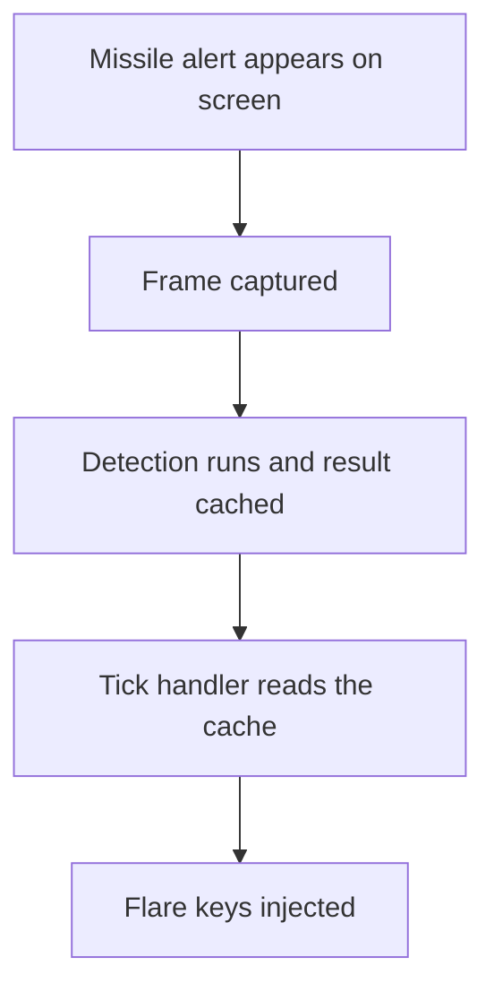

# ADR 096 — Validate the Tick-Latency Premise Before Buying Hardware

| Status | Date       | Wingman Version |
|--------|------------|-----------------|
| Draft  | 2026-08-26 | 1.8.7           |

## Context

HLDD 008 proposes a GPU-accelerated perception profile. Its central claim is
that **the 1.5 s tick, not OCR inference, is what bounds reaction latency**.
foundry ADR 022 proposes a $2,060 machine partly on the strength of it.

That claim is testable on CPU, today, for the cost of a refactor. Doing so
before the hardware arrives is the difference between a specified purchase and a
hopeful one — and this project has already recorded, twice in Performance 008,
what it costs to reason from a mechanism that fits rather than a measurement
that discriminates.

### What the existing metric already tells us

`PerformanceTracker.record_reaction` is called from `tick_handlers.py:529` as:

```python
incoming_ts = self._analyzer.get_incoming_cache_timestamp()
...
self._perf.record_reaction(time.time() - incoming_ts)
```

`incoming_ts` is set at `analyzer.py:2688`, inside `_run_ocr_in_background`,
from `current_time` — which is assigned once at `analyzer.py:2527` as
`current_time = t0`, **at the start of the background pass**, not when the
detection finishes.

So the 0.486 s recorded across 725 sessions is the interval from *the background
pass beginning* to *the tick handler acting on its result*. It bundles two
things that this experiment needs separated:

    0.486 s  =  (detection duration)  +  (wait for the tick handler to pick it up)

It is therefore evidence for HLDD 008's premise but not proof of it: a large
number here is consistent with a slow detector as well as with a slow dispatch.
Splitting it is the first thing the instrumentation below must do, and it is why
"just read the existing metric" is not a substitute for this work.

**But it is only one of three segments.** The full path is:



| segment | what it costs | instrumented today |
|---------|---------------|--------------------|
| A to B — frame age at capture | unknown | **no** |
| B to C — capture to background-pass start | unknown | **no** |
| C — detection duration | unknown | partially (`incoming_processing_time`) |
| C to D — wait for tick pickup | — | **no, not separately** |
| (C + C-to-D combined) | **0.486 s mean** | yes, as `reaction` |
| D to E — injection | sub-millisecond after ADR 091 | no, but bounded |

Only the combined figure is measured, and it is the one that most needs
splitting. The design decision rests on the sum of all four.

## What the measurement found

Step 1 shipped. `reaction` is now recorded as three segments, and over 174
samples on 2026-08-26:

| Segment | p50 | Share |
|-----------------------|--------:|------:|
| capture to pass start | 0.0005 s | 0.2 pct |
| **detect** | **0.2504 s** | **99.7 pct** |
| dispatch | 0.0003 s | 0.1 pct |

Against the registered criteria this reads as **premise refuted**: the tick is
not what bounds reaction latency. But the first draft of this ADR then drew a
conclusion the data does not support — that the GPU case was refuted with it.
It is not. The measurement moved the cost *into* the component a GPU
accelerates, which strengthens the hardware argument rather than ending it.

### Where the 0.25 s actually goes

Decomposing further on 2026-08-28:

| Work | Cost | Note |
|-------------------------------|-----------:|------|
| `cv2.matchTemplate`, 8 templates | **3.0 ms** | about 329 Hz achievable on CPU today |
| EasyOCR, one crop | **250 to 700 ms** | median 300 ms, p95 480 ms |
| Ratio | **82x** | |

`pool_depth` is **0** throughout, so this is not scheduling backlog waiting to
be relieved by more threads. It is neural-network compute, on CPU, and it is the
whole of the number.

That splits the problem in two, which the first framing flattened into one:

- **The incoming and flare path is template matching.** It is already cheap
  enough to run at hundreds of Hz on CPU. HLDD 001 asks for a terrain loop at
  **10 to 20 Hz using pure OpenCV operations** — that target is met by the
  hardware already in the machine.
- **Every state-derived decision is OCR-bound.** Health, ammo, fuel, telemetry,
  respawn and missiles each cost about 300 ms of inference. The behaviour tree
  cannot decide faster than it can perceive, so decision rate is gated by
  exactly the workload a GPU changes.

## Decision

**D1. The instrumentation ships and stays.** Done. Reaction latency is
attributable rather than inferred, permanently.

**D2. The CPU fast lane is cancelled.** Not because the idea was bad, but
because the measurement removed its justification: the lane existed to decouple
the incoming detector from the tick, and that detector costs 3 ms. There is
nothing meaningful to recover there, and `main.py:1082` already runs an
event-driven path. Building it now would add a second capture consumer and a
second actuation path to a safety-critical loop for no measured gain.

**D3. The premise is restated, not discarded.** HLDD 008 claimed the 1.5 s tick
bounds reaction latency. The correct statement is that **neural inference bounds
perception rate**, and perception rate bounds decision quality. Both HLDD 008
and foundry ADR 022 must be corrected to argue from the second claim. The
purchase is not refuted by this ADR; its stated reason was.

**D4. Three measurements before the money.** The corrected premise is
plausible and unproven, and this document exists precisely to stop a $2,060
decision resting on a plausible unproven claim.

## The experiments still owed

**E1 — split `detect` into its parts.** It is still one bucket. Separate
template match, per-crop OCR, and fusion, so the 0.25 s is attributable the way
the outer segments now are. Cheap, and it makes E2 comparable.

**E2 — get a GPU baseline before buying a GPU.** We have never run EasyOCR with
`gpu=True`. VEDA has no GPU, so every speedup figure in HLDD 008 is inference
from published benchmarks, not measurement of *our* crops. An hour on a rented
GPU instance costs a couple of dollars and turns the central number of a $2,060
decision from a projection into a measurement. This is the one that matters.

**E3 — state the rate each blocked capability needs.** HLDD 001 names 10 to 20
Hz for terrain. HLDD 003 and HLDD 005 do not name a figure. Without targets,
"much faster" cannot be checked against anything, and the corrected premise
stays unfalsifiable.

## Registered success criteria

Fixed before the experiment ran, and left here unedited because this document's
history now includes three confident explanations that measurement destroyed —
two in Performance 008, and this ADR's own first conclusion.

Baseline: **0.486 s** mean `reaction` across 725 sessions.

| end-to-end result | reading |
|-------------------|---------|
| under 0.20 s | premise confirmed. The tick was the constraint |
| 0.20 to 0.35 s | partial. Instrument further before concluding |
| over 0.35 s | premise refuted. HLDD 008's framing needs rewriting before any purchase |

The segment measurement settled it without the fast lane: detect alone is
0.2504 s and dispatch is 0.0003 s, so no fast lane could have moved the total
by more than a third of a percent. The criteria table asked the right question
and the cheaper half of the experiment answered it.

## Consequences

- Reaction latency is attributable across every segment, permanently.
- The fast lane is not built, and the complexity it would have added to the
  actuation path is not incurred.
- HLDD 008 and foundry ADR 022 both currently justify hardware with a premise
  measured false. They are wrong as written even though their conclusion may
  well be right, and must be corrected before the purchase proceeds.
- The GPU question is narrowed to something answerable: not "is the tick slow"
  but "what does neural inference cost on a card, for our crops". E2 answers it
  for a couple of dollars.

## Alternatives considered

**Buy the hardware and measure afterwards.** Rejected — the same order of
reasoning that produced two refuted hypotheses in Performance 008, and it costs
$2,060 to be wrong instead of a rented hour.

**Accept this ADR as "GPU unjustified".** Rejected, and it was the first draft's
error. The measurement localises the cost inside neural inference; concluding
against the accelerator from that is a non sequitur.

**Build the fast lane anyway, for terrain.** Rejected as premature: pure OpenCV
already reaches hundreds of Hz on CPU, so the terrain loop HLDD 001 specifies
does not need a new lane to be proved out — and E3 has not yet said what rate it
actually needs.

## Validation

- **V1** — the three segments are recorded and sum to the measured end-to-end latency. **Done**, 174 samples.
- **V2** — E1: `detect` split into template, OCR and fusion. **Pending.**
- **V3** — E2: EasyOCR measured on a GPU against our own crops, reported beside the CPU figures above. **Pending.**
- **V4** — E3: a named target rate for each capability HLDD 008 claims is blocked. **Pending.**
- **V5** — HLDD 008 and foundry ADR 022 restated in terms of inference cost rather than tick rate. **Pending.**

## References

- HLDD 008 — the premise under test, and the design this is the first lane of
- foundry ADR 022 — the purchase this de-risks
- Performance 008 — two refuted hypotheses, and why criteria are registered first
- ADR 091 — why actuation is no longer a meaningful term
- `wingman/analyzer.py:168` — the template match this lane runs
- `wingman/tick_handlers.py:529` — where `reaction` is recorded today
