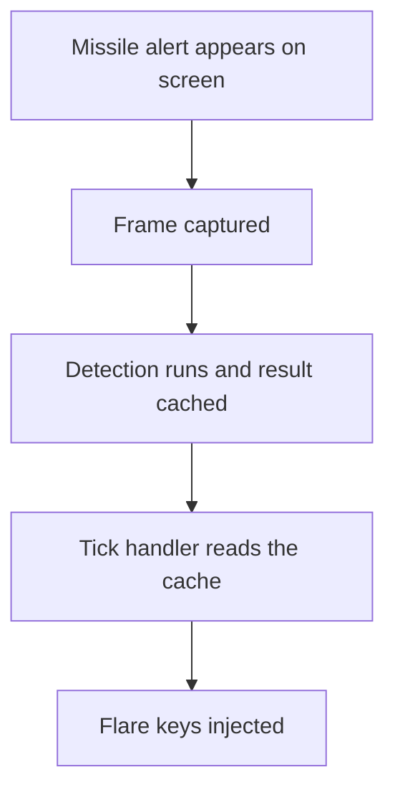

# ADR 096 — Validate the Tick-Latency Premise Before Buying Hardware

| Status | Date       | Wingman Version |
|--------|------------|-----------------|
| Draft  | 2026-08-26 | 1.8.7           |

## Context

HLDD 008 proposes a GPU-accelerated perception profile. Its central claim is
that **the 1.5 s tick, not OCR inference, is what bounds reaction latency**.
foundry ADR 022 proposes a $2,060 machine partly on the strength of it.

That claim is testable on CPU, today, for the cost of a refactor. Doing so
before the hardware arrives is the difference between a specified purchase and a
hopeful one — and this project has already recorded, twice in Performance 008,
what it costs to reason from a mechanism that fits rather than a measurement
that discriminates.

### What the existing metric already tells us

`PerformanceTracker.record_reaction` is called from `tick_handlers.py:529` as:

```python
incoming_ts = self._analyzer.get_incoming_cache_timestamp()
...
self._perf.record_reaction(time.time() - incoming_ts)
```

`incoming_ts` is set at `analyzer.py:2688`, inside `_run_ocr_in_background`,
**at the moment the detection result is cached**. So the 0.486 s recorded across
725 sessions is not detection latency and not end-to-end latency — it is the gap
between *a detection existing* and *the tick handler acting on it*.

That is the tick tax, measured, with no inference in it at all. It is already
strong evidence for HLDD 008's premise, and it was recorded by accident rather
than by design.

**But it is only one of three segments.** The full path is:



| segment | what it costs | instrumented today |
|---------|---------------|--------------------|
| A to B — frame age at capture | unknown | **no** |
| B to C — capture to detection | unknown | partially (`incoming_processing_time`) |
| C to D — cache to tick pickup | **0.486 s mean** | yes, as `reaction` |
| D to E — injection | sub-millisecond after ADR 091 | no, but bounded |

Only the third is measured. The design decision rests on the sum.

## Decision

Build the **fast lane on CPU** and instrument the whole path, as a gated
experiment, before any GPU work or purchase.

### 1. Instrument the segments that are dark

Extend the reaction record from a single number to the three intervals above,
so the total is attributable rather than inferred. `incoming_processing_time`
already exists at the detection site; frame timestamp needs carrying from
capture through to the detection result.

This alone is worth doing: it turns "0.486 s reaction" into a statement about
where the time actually goes, which no amount of design discussion can produce.

### 2. A CPU-only fast lane for `incoming`

A dedicated thread running the incoming template match at `rate_hz`, independent
of the main tick, firing flares directly on detection.

The two things that make this cheap are already true:

- **The detector is not OCR.** `analyzer.py:168` is
  `cv2.matchTemplate(incoming_binary, template_binary, cv2.TM_CCOEFF_NORMED)`
  on one small crop. Nothing about running it at 10 Hz needs a GPU.
- **Frames are already shared.** `_PipeWireBackend.grab_from_thread()` returns
  the latest frame under a lock, so the fast lane needs no second capture and
  introduces no contention with the main loop's capture.

```yaml
fast_lane:
  enabled: false        # experiment only; off by default
  rate_hz: 10.0
  crops: [incoming]     # deliberately one crop
```

**Off by default, one crop, no OCR.** The scope is deliberately the narrowest
thing that can answer the question. Terrain, target tracking and the rest are
out of scope here — they are what the GPU is for, and they cannot be tested this
way.

### 3. Do not double-fire

The main loop's `AmmoEventHandler` path stays exactly as it is. The fast lane
and the tick path must not both order a flare burst for the same alert.

The existing `_last_incoming_alert_ts` guard is the natural point of
coordination: whichever lane sees the alert first records it, and the other sees
a timestamp that is not newer and returns. That guard already exists and already
does this job between ticks; the change is making it shared rather than
tick-local.

Flares are safety-critical and cheap to waste but not free — a double burst
costs countermeasures the aircraft may need seconds later. The test for this is
not "did it fire faster" but "did it fire exactly once".

## Registered success criteria

Fixed before the experiment runs, for the same reason Performance 008's
diagnostic criteria were: this document's own history includes two confident
explanations that measurement destroyed.

Baseline: **0.486 s** mean `reaction` across 725 sessions, and whatever the
newly instrumented end-to-end figure turns out to be on the unmodified build —
which must be captured **first**, on a session with the fast lane disabled.

| end-to-end result, fast lane on | reading |
|---------------------------------|---------|
| under 0.20 s | **premise confirmed.** The tick was the constraint. The largest win is banked on CPU, and the GPU case narrows to terrain and headroom |
| 0.20 to 0.35 s | **partial.** Something else contributes materially; instrument segments A-B and B-C before concluding |
| over 0.35 s | **premise refuted.** The tick is not dominant, and HLDD 008's framing needs rewriting before any purchase |

Secondary, all of which must hold regardless of the latency result:

- **Exactly one flare burst per alert.** A double-fire invalidates the run.
- **No regression in mission outcome** — click-to finish rate stays at the
  100% the recent sessions show.
- **No regression in wingman memory** — ADR 092's gate still passes; a new
  thread capturing at 10 Hz is a plausible leak site.
- **CPU cost recorded.** The fast lane's own load is the number that says
  whether this scales to the other loops without a GPU, which is the second
  thing this experiment can tell us.

## Consequences

- The GPU purchase becomes specified rather than speculative. Either the win is
  already banked and the card is bought for terrain, or the premise is wrong and
  HLDD 008 changes before money is spent.
- Reaction latency becomes attributable across all four segments, permanently —
  useful well beyond this experiment.
- A second capture consumer and a second actuation path exist, both gated off by
  default. That is real complexity added to a safety-critical path for an
  experiment, which is why it is one crop and one config flag.
- If the premise is confirmed, the fast lane is not throwaway: it is the first
  lane of HLDD 008's scheduling design, built and measured on CPU.

## Alternatives considered

**Buy the hardware and measure afterwards.** Rejected — it is the same order of
reasoning that produced two refuted hypotheses in Performance 008, and it costs
$2,060 to be wrong instead of a refactor.

**Simulate the improvement from existing logs.** Rejected: the 0.486 s figure
measures only the dispatch segment, so a model built on it would assume the
answer to the question being asked.

**Raise the tick rate globally instead of adding a lane.** Rejected — it would
run OCR for all 33 crops at the higher rate, which is exactly the cost the lane
split exists to avoid, and would confound the measurement with OCR load.

## Validation

- **V1** — with `fast_lane.enabled: false`, behaviour and timings are identical
  to the current build.
- **V2** — with it enabled, exactly one flare burst is ordered per alert.
- **V3** — the four-segment breakdown sums to the measured end-to-end latency.
- **V4** — the fast lane thread is stoppable via a `threading.Event` and is
  joined in `cleanup()`, per the project's daemon-thread rule.
- **V5** — a fast-lane failure never takes down the tick: exceptions are logged
  and the lane degrades to the existing tick path.

## References

- HLDD 008 — the premise under test, and the design this is the first lane of
- foundry ADR 022 — the purchase this de-risks
- Performance 008 — two refuted hypotheses, and why criteria are registered first
- ADR 091 — why actuation is no longer a meaningful term
- `wingman/analyzer.py:168` — the template match this lane runs
- `wingman/tick_handlers.py:529` — where `reaction` is recorded today
