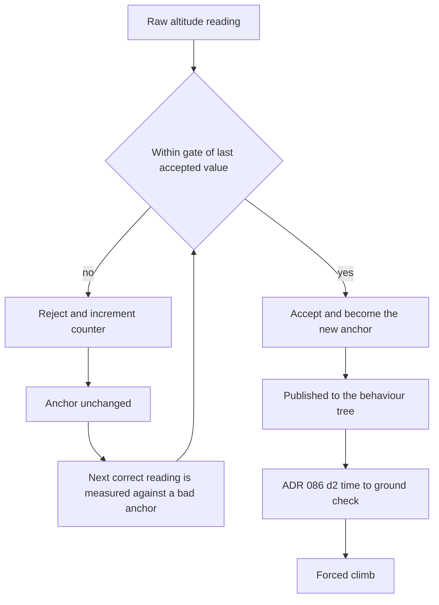

# ADR 097 — Altitude Plausibility Gate: Units and Anchor Poisoning

| Status   | Date       | Wingman Version |
|----------|------------|-----------------|
| Accepted | 2026-08-28 | 1.8.7           |

## Context

The session of 2026-08-27 19:13 through 2026-08-28 01:35 fired 55 `DIVE RECOVERY`
events (ADR 086 d2). **24 of them (43 percent) are physically impossible**, with
claimed descent rates from 1036 to 2414 m/s. Every one announced "2s to ground".

A jet does not descend at 2.4 km/s. These are not dives.

### What was actually happening

Correlating each event against the tactic selected in the ten seconds before it:

| Tactic before the dive | Count |
|------------------------|------:|
| Climb                  | 31    |
| Engage                 | 17    |
| AttackSupport          | 7     |
| MissileEvade           | 0     |

Not one followed a missile evade. The largest group fired while the aircraft was
climbing, which is self-contradictory on its face.

The 21:35:38 event, traced through the raw OCR readings:

| Time     | Raw altitude | Raw speed | Filter | Reported |
|----------|-------------:|----------:|--------|----------|
| 21:35:35 | 6007 m       | 1314      | accept | climbing at plus 231 m/s |
| 21:35:37 | 6700 m       | 1139      | accept | climbing |
| 21:35:38 | **1187 m**   | 863       | **accept** | **DIVE RECOVERY, minus 1834 m/s, "3s to ground"** |
| 21:35:41 | 7394 m       | 595       | reject | anchor held at the bad value |
| 21:35:42 | 7498 m       | 385       | reject | anchor held at the bad value |
| 21:35:43 | 7561 m       | —         | accept | recovered |

The aircraft was above 6 km and climbing throughout. It was never near the
ground. One bogus altitude read of 1187 m produced a fake 5513 m drop, and ADR
086 d2 dutifully forced a ground-avoidance climb for an aircraft at 7.5 km.

Across the session the telemetry filter rejected **375 readings**, with accepted
speeds ranging over 137, 385, 595, 1999, 2652 within minutes of each other. The
telemetry crop is unstable generally, not only on altitude.

## The two defects

### D1 — the altitude gate is 5.28x too permissive (units)

`TelemetryFilter._altitude_bound_fps()` at `telemetry.py:339` bounds the
per-second altitude change by the physics argument that vertical speed cannot
exceed total speed. The argument is right. The arithmetic is not:

```python
return bound_mph * MPH_TO_FPS        # 5280 / 3600 = 1.4667
```

The HUD is metric. It reads "NNNN KPH" over "NNNN m" — verified against the
integration screenshots and already documented in this same module by ADR 067,
whose docstring on `pitch_angle_deg` states plainly that using `MPH_TO_FPS` here
"compresses the ratio by 3.6 x 1.4667 equals 5.3x".

That correction was applied to `pitch_angle_deg`. It was never applied to the
plausibility gate, which still multiplies a KPH figure by the mph-to-fps factor
and compares the result against a delta in metres. The gate is therefore looser
than physics permits by 3.6 times 1.4667, or **5.28x**.

Worked against the 21:35:38 admission, with speed 1139 and dt about 3.0 s
(`ocr_every_n_ticks: 2`) and `plausibility_margin: 1.5`:

- Bound as computed: 1139 times 1.4667 equals 1671, times 1.5 times 3.0 s gives an allowance of **7518 m**.
- Bound under coherent metric units: 1139 KPH is 316 m/s, times 1.5 times 3.0 s gives an allowance of **1424 m**.

The observed jump was 5513 m. It passes the first by a wide margin and fails the
second by a factor of 3.9. **Correct units alone reject this reading.**

The gate also scales with the *last accepted speed*, so a speed misread high — and
this session accepted 1999 and 2652 — widens the altitude gate in proportion. Two
independently noisy OCR crops are wired so that an error in one licenses an error
in the other.

### D2 — a bad accept inverts the filter (anchor poisoning)

`_update_signal` gates each reading against the last accepted value. That value is
the sole anchor. Once a wrong reading is accepted, the filter defends it: the two
correct readings that followed (7394 and 7498) were rejected precisely *because*
they disagreed with the bogus 1187.

For roughly three seconds the filter was inverted — discarding truth and
publishing the error. The rejection counter records this as healthy filtering. It
is the opposite. Nothing in the design notices that consecutive rejects agree
closely with each other while disagreeing with the anchor, which is the signature
of a poisoned anchor rather than a noisy sensor.



## What the evidence changed

This ADR was drafted proposing that correcting the units (D1) would fix the
gate, with an absolute ceiling (D2) as a secondary guard set at 400 m/s.
Implementing it showed both halves of that were wrong, and the corrections
below are what shipped.

**Correcting the units alone rejects 7 of the session's 31 real dives.** The
physics premise is itself unsound: a stalled or falling aircraft descends faster
than its forward airspeed. This module already knows that — `pitch_angle_deg()`
clamps its ratio to plus or minus 1 precisely so a falling aircraft saturates at
90 degrees instead of raising `ValueError`. Vertical rate is not bounded by
displayed speed in the regime where dives matter, so no correction of the
conversion factor makes a speed-derived gate the right instrument.

**The 400 m/s ceiling was a guess, and it was wrong by 2.5x.** Calibrating it
against the session's 9020 accepted rate samples shows a clean bimodal split:
97.3 percent of descents fall below 1000 m/s and decay smoothly (p50 180, p75
381, p90 662, p97 871), then the population breaks — p98 is 1505 — into a
distinct artefact cluster running to 2414 m/s. Measured against the dive events
themselves the separation is exact: **the plausible dives top out at 919 m/s and
the impossible ones start at 1036 m/s.**

## Decision

**D1. The altitude gate is an absolute vertical-rate ceiling, and speed does not
enter it.** This drops the "vertical speed cannot exceed total speed" premise
rather than repairing its arithmetic, for the reason above. It also severs a
coupling worth losing: the old gate widened with the last accepted speed, so a
misread on one OCR crop (this session accepted speeds of 1999 and 2652)
licensed a misread on the other. Two independently noisy signals no longer
compound.

**D2. The ceiling is 1000 m/s** (`telemetry.max_alt_rate_mps`), sitting in the
gap the data shows between 919 and 1036. It is the operative allowance and is
**not** multiplied by `plausibility_margin` — a 1.5x margin on an
empirically-derived boundary would lift it to 1500 m/s and readmit the
artefacts.

**D3. Detect anchor poisoning by agreement, not only by count.** When
consecutive rejected readings agree with each other to within
`reseed_agreement_m` (150 m) while disagreeing with the anchor, the anchor is
the wrong value and the filter reseeds. The existing count rule needs three
rejections to reach the same conclusion; agreement reaches it in two.
Out-of-envelope readings remain unseedable, so a consistent stream of garbage
cannot agree its way into becoming the seed.

**D4. Do not touch `pitch_band()`.** It still computes its ratio with the legacy
`MPH_TO_FPS` (`telemetry.py:213`), and its `steep_min_sin` and `level_max_sin`
thresholds were tuned against that compressed ratio. Correcting the constant
without re-tuning would silently move every band boundary. Separate change,
separate calibration evidence.

## Consequences

Replaying the full session — all 5147 raw readings, accepted and rejected,
merged from both log sources and timestamped to the millisecond:

| Configuration | Rejected | Descent samples | Artefacts published | Max rate |
|---------------|---------:|----------------:|--------------------:|---------:|
| Old gate      | 596 (11.6 pct) | 1638 | 90 | 13581 m/s |
| D2 ceiling    | 851 (16.5 pct) | 1537 | 0  | 989 m/s   |
| D2 plus D3    | 851 (16.5 pct) | 1536 | 0  | 989 m/s   |

**All 90 artefacts are gone and the cost is about 11 genuine descent samples.**
The descent series falls by 101, of which 90 were the artefacts themselves, so
roughly 0.7 percent of the real signal is lost. Rejections rise by 255, which is
the artefacts plus the readings immediately downstream of them that no longer
get gated against a poisoned anchor.

D3 fires 306 times across the session, each time recovering the anchor one
reading sooner than the count rule would. It barely moves the aggregate counts —
1537 descent samples versus 1536 — because the ceiling prevents most anchors
from being poisoned in the first place. Its value is latency, not volume: it
shortens each poisoned window by a sample, and a poisoned window is one in which
the aircraft's true altitude is being withheld from ADR 086 d2.

The 24 impossible `DIVE RECOVERY` events should not recur. Each currently
hijacks whatever the behaviour tree was doing to force a climb, so the cost was
never merely a noisy log.

## Validation

- V1. Full-session replay, above. 90 artefacts before, 0 after; max published descent rate 989 m/s, inside the ceiling. **Done.**
- V2. The 21:35:38 sequence unit-tested end to end: 1187 rejects, and the following 7394 is accepted rather than turned away against a poisoned anchor. **Done** (`tests/test_altitude_gate_adr097.py`).
- V3. Rejections rise 11.6 to 16.5 percent while genuine descent samples fall 0.7 percent — the rise is the artefacts, not the signal. **Done.**
- V4. ADR 038's 2026-07-30 starvation case: the corrected gate must not suppress dive confirmation. The fastest real dive (919 m/s) is admitted and the slowest artefact (1036 m/s) is rejected, both pinned as tests. **Done.**
- V5. Live sessions. **Done** — see below.

### V5 result: eight live sessions, 2026-08-28

Measured over every session in which ADR 086 d2 existed. Sessions before
2026-08-21 are excluded from the baseline: the feature had not shipped, so
including them dilutes the pre-fix rate by more than half and makes the effect
look weaker than it is.

| Window | Sessions | Hours | Impossible | Genuine | imp/h | gen/h |
|----------|---------:|------:|-----------:|--------:|------:|------:|
| Pre-fix  | 46 | 97.09 | **194** | 607 | 2.00 | 6.25 |
| Post-fix | 8  |  7.47 | **0**   |  47 | 0.00 | 6.29 |

At the pre-fix rate, 7.5 post-fix hours should have produced about 15 impossible
events. Zero occurred; P(that by chance) is 3.3e-07.

**The genuine dive rate is unchanged: 6.25/h before, 6.29/h after — 101 percent
retained.** This is the number that matters most, because the risk in this
change was never the artefacts but the ADR 038 starvation case, where too tight
a gate produces zero dive confirmations and drives blind nose-down re-issues.
That has not happened. The gate rejects artefacts and nothing else.

The ceiling behaves as calibrated. Maximum published descent rate fell from
2683 m/s to 879 m/s, with no post-fix sample above the 1000 m/s boundary —
consistent with the split the calibration found, plausible dives topping out at
919 m/s and artefacts starting at 1036 m/s.

## References

- ADR 086 — climb exit attitude and time-to-ground recovery (the consumer that acts on this signal)
- ADR 067 — metric HUD units; corrected `pitch_angle_deg`, left this gate untouched
- ADR 038 — the original plausibility filter, its ordering, and the 2026-07-30 starvation case
- ADR 058 — anticipated the "systematically compressed by a units mismatch" class
- Evidence: `wingman.log`, 2026-08-27 19:13 through 2026-08-28 01:35
