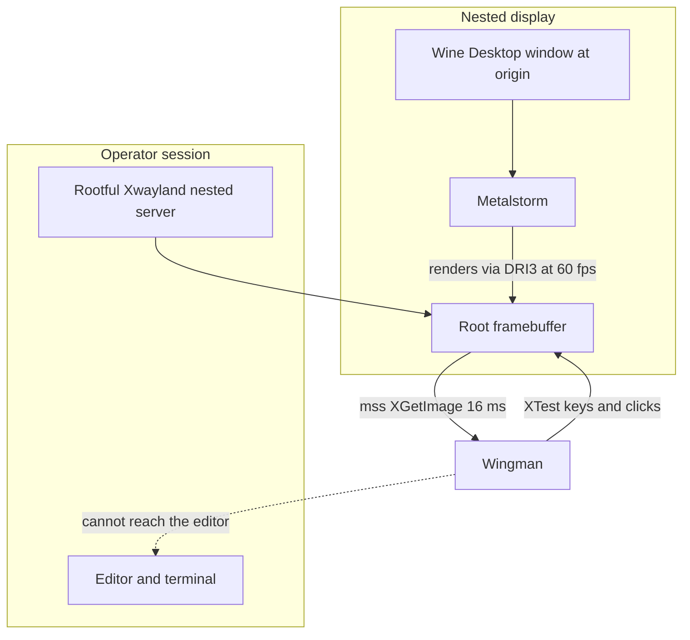

# ADR 099 — Nested Display Lane for Unattended Operation

| Status | Date       | Wingman Version |
|--------|------------|-----------------|
| Draft  | 2026-08-29 | 1.8.7           |

## Context

ADR 098 stops wingman typing into the operator's editor. It does not let wingman
keep flying while the operator works — it trades the corruption for a dead
session, which is the honest reading of its own closing paragraph.

The follow-on question was asked directly: can the game run minimised, so the
desktop is free? `scripts/sendevent-probe.py` was built to investigate the
obvious candidate, XSendEvent, which addresses a window instead of the focus.

**That framing was wrong, and the probe would not have settled it.** Focus is one
of three positional couplings, and the weakest one:

| Path | Mechanism | Survives an unfocused window? | Survives a minimised one? |
|------|-----------|-------------------------------|---------------------------|
| Keys | XTest at the X focus | No — ADR 098 | No |
| Mouse | XTest warp to absolute screen coords, `input_linux.py:116` | No | No |
| Capture | `mss` over a monitor rect, `capture.py:53` | Yes | **No** |

XSendEvent, at best, fixes row one. The mouse warp is addressed to a screen
coordinate and cannot be aimed at a window at all, and an unmapped window
contributes no pixels to any framebuffer — `capture.py:373` already tells the
operator "make sure MetalStorm is visible on screen (not minimised)".

The binding constraint is the framebuffer, not the focus. So the question is not
"how do we address the game window" but "how does the game get a framebuffer
that stays real while the operator is not looking at it".

## Decision

**D1. Run the game on its own nested X display, not on the operator's.** A
display where the game is the only client has no focus contention to resolve, a
root window that is exactly the game, and a framebuffer maintained by the X
server rather than by what the compositor happens to be showing.

**D2. The nested server is rootful Xwayland, not Xephyr.** This is not a
preference; Xephyr cannot run the game at all. See the experiment below.

**D3. Select the lane by environment, not by code.** The whole lane is
`DISPLAY` plus `XDG_SESSION_TYPE`, both already read from the environment by
`input_linux.py:114`, `input_linux.py:227`, `focus_guard.py` and all three
capture backends. Nothing in the injection path changes.

**D4. `DISPLAY` is split: injection moves, observation does not.** `DISPLAY`
does three jobs in this codebase — capture, injection, and the XRecord hotkey
listener that watches the operator's real keypresses. The first two must follow
the game onto the nested display. The third must NOT: point it at the nested
display and `backspace`, `end` and the `i/j/k/l` takeover keys are only seen
while the nested window has focus, which is exactly when the operator is not
working elsewhere. Manual takeover is a safety property, so capture takes an
explicit display (`mss(display=...)`) and injection an explicit override, while
the listener keeps reading `os.environ["DISPLAY"]`.

**D5. The switch is `nested.enabled` in config, not a parallel make target.**
A single environment variable cannot express D4 — it sets one display for all
three consumers, which is why the first implementation silently broke hotkeys.
Config can. It also keeps `r`, `rd`, `r1` and `r2` as the only run targets, so
the Makefile and wingman cannot disagree about the lane. `NESTED=0` / `NESTED=1`
overrides one run, which matters because a single global flag would otherwise
force two simultaneous accounts into the same lane.

**D6. ADR 098's guard follows the injection display.** Keeping the guard is not
enough — it resolves its own display from `focus_guard.display` or `DISPLAY`, so
under D4 it interrogates the operator's screen while injection targets the
nested one. It then finds no game window, concludes "not the game", and
suppresses everything. An explicit `focus_guard.display` still wins.

**D7. Keep ADR 098's guard.** It is unnecessary on the nested lane, since the
game always holds focus there, but it remains the protection for the on-screen
lane and costs one query per tick.

## The mechanism is verified, not assumed

### Xephyr fails, at the GPU boundary

Xephyr is the obvious nested X server and it does not work. The game never
started:

```
fsync: up and running.
vulkan: No DRI3 support detected - required for presentation
Note: you can probably enable DRI3 in your Xorg config
```

No `Metalstorm.exe` process, no window on the nested display. Xephyr provides
glamor for 2D but implements no DRI3, and DXVK requires DRI3 to present. There
is no flag that turns this on. `xdpyinfo` on the Xephyr display lists Composite,
GLX, Present, MIT-SHM and XTEST — and no DRI3.

`gamescope`, the tool built for exactly this job, has no candidate in Ubuntu
24.04.

*(The launch log is overwritten on every launch, so this excerpt is quoted from
the session transcript of 2026-08-29 rather than from a file still on disk.)*

### Rootful Xwayland works

Xwayland is already installed — it is what serves the operator's own `:0`. Run it
**rootful** rather than rootless and it keeps a real root framebuffer, and it has
DRI3 because that is how every X11 game already renders on this machine:

```
DRI3   GLX   Present   Composite   MIT-SHM   XTEST
```

The game launched, and the window landed where the configured capture region
already expects it:

```
0x400004 "Wine Desktop": ("steam_app_0")  1920x1200+0+0  +0+0
   0x1c00001 "Metalstorm": ("steam_app_0")  1920x1200+0+0  +0+0
```

With no window manager on the nested display there is nothing to reposition the
window, so it maps at the origin. `game_window_offset` becomes exactly zero
rather than something to detect — the frame-diff and xwininfo offset machinery
that `_PipeWireBackend` needs has nothing to do here.

### Capture reads it

The question Xephyr never got far enough to answer. `mss` over the nested root:

```
grab 43.8 ms  shape=(1200, 1920, 3)  mean=137.3  min=9  max=255  nonzero=6912000
grab timing: mean=16.3 ms  max=19.0 ms
```

Real pixels, and live ones — sampled once a second during a battle:

```
t+1s  mean_abs_diff=  9.28  LIVE
t+2s  mean_abs_diff= 49.40  LIVE
t+3s  mean_abs_diff= 44.14  LIVE
```

The game's own HUD reported **FPS 60** throughout. This is the result that
matters: a rootful Xwayland composites its X clients into a root window that
`XGetImage` can read, which a rootless one on `:0` does not.

### The first implementation broke the hotkeys, silently

Worth recording because it is the whole reason D4 and D5 exist. The lane was
first built as a parallel `make rdn` target that set `DISPLAY=:3` for the whole
process. Capture worked, injection worked, the FSM ran clean, zero ERROR lines
— and every operator hotkey was dead, because `input_linux.py:389` resolves the
XRecord listener's display from the same variable. Nothing in the logs said so.

The config-driven form is not a tidier spelling of the same thing; it is what
makes the correct behaviour expressible at all. Confirmed on 2026-08-29 with
the lane active under a plain `make rd`:

```
ADR 099: injection routed to display ':3' (hotkeys still observed on ':0')
ADR 099: nested lane ACTIVE - capture and injection on :3, hotkeys observed on :0
wingman pid 405505  env DISPLAY=:0
📋 Clicking PLAY at (1638, 1093) [game offset 0,0] x1
🎮 Game state: GAME_LOBBY → GAME_WAITING
```

The process environment says `:0`, so the listener watches the operator's
keyboard, while capture and the PLAY click land on `:3`.

### The guard then suppressed everything

The second failure of the same shape, and worth recording because the first fix
caused it. With the lane correct and ADR 098's guard enabled, every click was
suppressed:

```
ADR 098: focus guard ACTIVE - injection suppressed when the game does not have focus
📋 Clicking PLAY at (1638, 1093) [game offset 0,0] x1
FocusGuard: game does not have focus (None) - suppressed click injection (1 so far)
GAME_WAITING: CANCEL not found (10.5s) and PLAY visible — re-clicking (click missed)
...
FocusGuard: game does not have focus (None) - suppressed click injection (10 so far)
✓ GAME_WAITING confirmed via QUEUE_FALLBACK (154.2s)
```

The guard was asking `:0` whether the game had focus. The game was on `:3`. It
answered correctly and suppressed correctly, and the result was a guard that
silently disabled the automation it protects — 154 s of clicking at a PLAY
button that never received a click.

After D6, same command, same account:

```
ADR 099: focus guard follows injection to display :3
🎮 Game state: GAME_LOBBY → GAME_WAITING
✓ GAME_WAITING confirmed via QUEUE_FALLBACK (17.0s)
```

Zero suppressions, and matchmaking confirmed in 17.0 s against 154.2 s.

The pattern across both failures is the same: **every consumer of `DISPLAY` has
to be asked which display it means.** Capture, injection, hotkey observation and
now the focus guard were four, and three of them were wrong at some point.

### The full loop runs on it

```
2026-08-28 23:59:26 🎮 Game state: UNKNOWN → GAME_UNKNOWN
2026-08-28 23:59:41 🎮 Game state: GAME_UNKNOWN → GAME_LOBBY
2026-08-28 23:59:43 🎮 Game state: GAME_LOBBY → GAME_WAITING
2026-08-28 23:59:46 🎮 Game state: GAME_WAITING → GAME_STARTING
2026-08-29 00:00:53 🎮 Game state: GAME_STARTING → GAME_BATTLE
2026-08-29 00:02:24 🎮 Game state: GAME_BATTLE → GAME_BATTLE_EJECT
```

Clicks, keys, OCR and the behaviour tree all on the nested display:

```
📋 Clicking PLAY at (1638, 1093) [game offset 0,0] x1
Controller: game_starting - pressed 'u' key
Altitude: 5595 | Speed: 1629 | Nose: +65° (steep_climb)
BT[active]: tactic Climb → AttackSupport
BT[active]: selected=MissileEvade missiles=2 rings=0/1/0
```

Zero ERROR lines across the session.

## Using the lane

The lane is switched in `wingman/config.yaml`:

```yaml
nested:
  enabled: true
  display: ":3"
  size: "1920x1200"
```

There are no nested-specific run targets. `make r`, `make rd`, `make r1` and
`make r2` all honour the config, bracketing the game launch with `nested-setup`
and `nested-focus`, both of which are no-ops when the lane is off.

```
make rd              # honours nested.enabled
make rd NESTED=0     # force the on-screen lane for one run
make rd NESTED=1     # force the nested lane for one run
make nested-status   # is the lane up, and what holds focus
make nested-stop     # tear the nested server down
```

`nested-setup` and `nested-focus` deliberately run *without* the nested env.
Xwayland is itself a Wayland client and needs the operator's `WAYLAND_DISPLAY`
to attach its root window to; stripping that variable is correct for the game
and fatal for the server, so the two cannot share an environment.

## Topology



- The operator's keystrokes and wingman's injection never share a display.
- Wingman's XTest calls are made against the nested server, so they cannot reach
  the editor regardless of what the host is focused on.

## Consequences

**The ADR 098 hazard is closed by construction rather than by suppression.** The
guard stops injection when focus leaves; this removes the shared channel
entirely, and wingman keeps flying instead of stopping. Verified during the
session: host `:0` input focus was `None` — a native Wayland window — while the
game ran at 60 fps and wingman flew it.

**A latent defect was surfaced and fixed.** `Capture.game_screen_offset`
consulted only `_PipeWireBackend`, so on the mss path every click failed:

```
[ERROR] click_crop: game window offset not known yet (3 retries)
```

This was never nested-specific — **clicks were broken on any Linux X11 session**.
`_MssBackend` now derives the offset from `get_monitor_rect()`, which is exact
rather than a guess: frames come from that rect, so its origin is the offset. An
explicit config value still wins, and Windows never reaches the code path
(`sys.platform != "win32"` guards both call sites). This fix stands independent
of the nested lane and is separable from it.

**Cost.** OCR cycle totals, same log line, both lanes:

| Lane | n | median | p95 | max |
|------|--:|-------:|----:|----:|
| On-screen `:0` PipeWire, 2026-08-25 | 8 | 0.310s | 0.370s | 0.380s |
| Nested `:3` mss, 2026-08-29 | 1643 | 0.270s | 0.440s | 1.840s |

No penalty is visible against a 1.5 s tick. **The baseline has n=8 and is not a
credible comparison** — it is the only same-format sample on disk. A controlled
measurement is V4 below, and this table should not be cited as evidence until
that exists.

**What this does not do.** It does not make the game minimisable — that is
untested, V3. It adds a second display to reason about in every future capture
or injection change, and the lane depends on an explicit `XSetInputFocus`
because there is no window manager on the nested display. Every run target
asserts it via `nested-focus` after `wait-game`, so the launch path is covered;
a game that restarts *on its own* mid-session still drops focus, which is V6.

## Traps

Each of these fails in a way that does not look like the cause:

1. **`DISPLAY` serves three consumers that do not want the same value** —
   capture, injection, and the XRecord hotkey listener. Moving all three is the
   bug D4 exists to prevent, and it is invisible in the logs. This is why the
   backend is now selected from config (`Capture(display=...)`) rather than
   inferred from `XDG_SESSION_TYPE`, which was the earlier lever.
2. **`make r` and `make rd` kill and relaunch the game** via
   `GAME_LAUNCH_DEPS`. Attaching to an already-running nested game needs
   `GAME_LAUNCH_DEPS=` or the session restarts under you.
3. **No window manager means `PointerRoot` focus.** Keys route to whatever is
   under the nested pointer. Set focus explicitly.
4. **Wine picks its Wayland driver if `WAYLAND_DISPLAY` is set**, bypassing the
   nested display entirely. It must be unset for the launch.

## Validation

- V1. Live: the full FSM path lobby through battle runs on the nested display with zero ERROR lines. **Done, 2026-08-29.**
- V2. Live: host X input focus is elsewhere while the game renders at 60 fps and the behaviour tree flies. **Done, 2026-08-29.**
- V3. Live: minimise the nested server window and confirm the game keeps rendering and wingman keeps flying. **Not done** — GNOME Shell `Eval` is disabled and neither `wmctrl` nor `xdotool` is installed, so this needs the operator. The risk is the compositor withholding frame callbacks from an unmapped surface and DXVK throttling to zero fps.
- V4. Measure: a controlled per-crop OCR and tick-latency comparison between lanes, against the ADR 096 premise and the ADR 045 live-screen timings, with comparable sample sizes.
- V5. Unit: the mss offset resolves from the monitor rect, an explicit config offset still wins, and Windows click paths are unaffected. **Not yet written.**
- V7. Unit: the focus helper picks the virtual desktop over Wine's helper windows, ignores windows outside the game session, and `start` is idempotent. **Done, 2026-08-29** — `tests/test_nested_display.py`, 16 tests.
- V6. Live: confirm the lane survives a game restart. The launch path is covered — every run target runs `nested-focus` after `wait-game` — but nothing reasserts focus if the game restarts by itself mid-session. **Partially done, 2026-08-29.**

- V8. Unit: injection follows the configured display while observation keeps reading `DISPLAY`, and the override clears. **Done, 2026-08-29** — `tests/test_input_linux.py`.
- V9. Unit: config drives the lane, `NESTED=0/1` overrides it, and a missing or malformed config fails closed (lane off). **Done, 2026-08-29** — a half-applied lane would capture the nested display while injecting into the operator's, which is the ADR 098 corruption reintroduced.
- V10. Live: a plain `make rd` activates the lane from config, with the process environment still on the operator's display. **Done, 2026-08-29.**
- V11. Unit + live: the focus guard follows the injection display, an explicit `focus_guard.display` still wins, and the on-screen lane is untouched. **Done, 2026-08-29** — `tests/test_focus_guard.py`; live `make r1` showed 0 suppressions against 10 before.

`make test` passes 999 tests, 2 skipped.

## Status of the XSendEvent line of investigation

`scripts/sendevent-probe.py` and its tests are unaffected and still run. The
question they ask is now largely moot: the nested lane solves the mouse path,
which XSendEvent could never address, and does it without putting a synthetic
event path into injection. The probe should be run or retired deliberately
rather than left as pending work implying an open decision.

## References

- ADR 098 — the focus guard this supersedes in practice for unattended runs; kept for the on-screen lane
- ADR 091 — the shared XTest display, which follows `DISPLAY` onto the nested server unchanged
- ADR 096 — the tick-latency premise that V4 must not regress
- ADR 045 — the live-screen capture gate, whose timings assume the on-screen lane
- ADR 054 — why the game window is never dragged; moot on a nested display with no window manager
- Research 005 — the Wine virtual desktop that makes the game a single addressable X window
- `scripts/focus-probe.py`, `scripts/sendevent-probe.py` — the experiments this redirects
- Evidence: `wingman.log` 2026-08-28 23:59 through 2026-08-29 00:06
