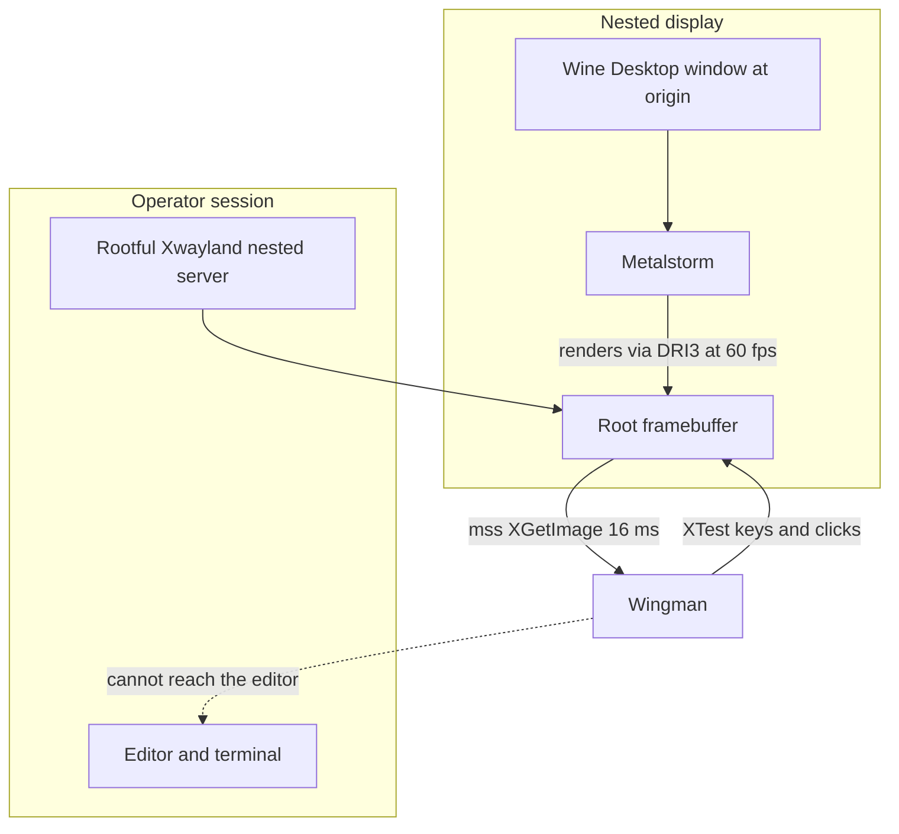

# ADR 099 — Nested Display Lane for Unattended Operation

| Status | Date       | Wingman Version |
|--------|------------|-----------------|
| Draft  | 2026-08-29 | 1.8.7           |

## Context

ADR 098 stops wingman typing into the operator's editor. It does not let wingman
keep flying while the operator works — it trades the corruption for a dead
session, which is the honest reading of its own closing paragraph.

The follow-on question was asked directly: can the game run minimised, so the
desktop is free? `scripts/sendevent-probe.py` was built to investigate the
obvious candidate, XSendEvent, which addresses a window instead of the focus.

**That framing was wrong, and the probe would not have settled it.** Focus is one
of three positional couplings, and the weakest one:

| Path | Mechanism | Survives an unfocused window? | Survives a minimised one? |
|------|-----------|-------------------------------|---------------------------|
| Keys | XTest at the X focus | No — ADR 098 | No |
| Mouse | XTest warp to absolute screen coords, `input_linux.py:116` | No | No |
| Capture | `mss` over a monitor rect, `capture.py:53` | Yes | **No** |

XSendEvent, at best, fixes row one. The mouse warp is addressed to a screen
coordinate and cannot be aimed at a window at all, and an unmapped window
contributes no pixels to any framebuffer — `capture.py:373` already tells the
operator "make sure MetalStorm is visible on screen (not minimised)".

The binding constraint is the framebuffer, not the focus. So the question is not
"how do we address the game window" but "how does the game get a framebuffer
that stays real while the operator is not looking at it".

## Decision

**D1. Run the game on its own nested X display, not on the operator's.** A
display where the game is the only client has no focus contention to resolve, a
root window that is exactly the game, and a framebuffer maintained by the X
server rather than by what the compositor happens to be showing.

**D2. The nested server is rootful Xwayland, not Xephyr.** This is not a
preference; Xephyr cannot run the game at all. See the experiment below.

**D3. Select the lane by environment, not by code.** The whole lane is
`DISPLAY` plus `XDG_SESSION_TYPE`, both already read from the environment by
`input_linux.py:114`, `input_linux.py:227`, `focus_guard.py` and all three
capture backends. Nothing in the injection path changes.

**D4. `DISPLAY` is split: capture and injection move; observation spans BOTH
displays.** `DISPLAY` does three jobs here — capture, injection, and the XRecord
hotkey listener that watches the operator's real keypresses. The first two
follow the game onto the nested display. The third is not a single display at
all.

*Amended 2026-08-29.* This first read "observation does not move", and that was
wrong in a way that killed every hotkey. `:0` is a **rootless** Xwayland: it
receives key events only while an X11 client holds focus. Before the lane the
game was that client, so the operator's keys reached `:0` and XRecord saw them.
Moving the game to `:3` removed the only X client that was ever focused, and
`:0` went silent — backspace, `z` and the SAF-001 manual takeover all dead, with
no error anywhere. The operator's next stop was Ctrl-C.

Keeping the listener on the operator's display was **necessary but not
sufficient**. The correct rule is: **observe every display the operator's keys
can reach**, which includes the injection display, because when the operator
looks at the nested window their keys are delivered into that server and are
visible only there. One listener thread per display
(`input_linux._observe_display_names`).

Observing the injection display means wingman also sees its own injected keys.
That is not new — it is the pre-nested topology, where injection and observation
shared one display, and `_programmatic_key_counts` already exists to discount
those presses per-key with a post-release grace window for XTest auto-repeat.
`is_injected` alone is unreliable and was never the guard.

Capture takes an explicit display (`mss(display=...)`) and injection an explicit
override. Native-Wayland windows (e.g. VS Code) remain invisible to every X11
listener — a pre-existing limitation this does not change.

**D4a. Hotkeys are filtered per display.** Observing both displays (D4) creates
two problems that a single listener never had, and both were live defects:

| Display | Filter | Why |
|---|---|---|
| Nested | Ignore keys wingman injects | There they are wingman's own keystrokes. Filtering by display is race-free; counting presses and debiting them on observation is not, because XRecord delivery is asynchronous — the maneuver path needs a post-release grace window for exactly that reason |
| Operator | Require `ctrl+alt` | A bare keypress there is ordinary typing |

The second is the one that bit. Before the lane, the game held focus on the
operator's display, so bare single-letter hotkeys were unreachable by ordinary
typing — the keys went to the game. Moving the game to its own display freed the
operator's keyboard, which is the entire point, and in the same stroke made
every hotkey fire from ordinary typing.

Observed 2026-08-30 08:27: stray `m` presses forced `GAME_LOBBY` three times,
cancelling matchmaking, and the session never reached battle in five minutes.
`z` would have closed MetalStorm outright, and `backspace` stopped it. A lane
built so the operator can use their machine had made the machine unusable.

Bare keys still work on the nested display: typing there requires focusing the
game window, which is an explicit act. **With no nested lane both filters are
inert**, so the on-screen lane is unchanged.

Verified live 2026-08-30 09:06: bare `v` on the operator display produced no
screenshot, `ctrl+alt+v` produced one, bare `v` on the nested display produced
one, and seven `u` injections by wingman fired no hotkey at all.

**D4b. Manual takeover on the nested display is by arrow key.** SAF-001 names
arrow keys alongside `i/j/k/l`, and wingman never injects them, so on the
injection display they carry no ambiguity.

`i/j/k/l` cannot serve there. SAF-001.1's echo discrimination assumes an
injected key echoes back promptly, which held while injection and observation
shared one display. Under the nested lane with 13 OCR workers, echoes were
measured arriving **1.67 to 9.74 s after release** against a 1.0 s grace window
— four spurious takeovers in 23 minutes on 2026-08-30, each dropping the
aircraft out of automation mid-round.

Widening the grace is not a fix: it would suppress the *operator's* presses for
the same seconds, against SAF-001's 2.0 s cessation bound. The `i/j/k/l` path
is not lost — it moves to the operator's display, where wingman injects nothing
and `ctrl+alt` separates it from typing.

**D5. The switch is `nested.enabled` in config, not a parallel make target.**
A single environment variable cannot express D4 — it sets one display for all
three consumers, which is why the first implementation silently broke hotkeys.
Config can. It also keeps `r`, `rd`, `r1` and `r2` as the only run targets, so
the Makefile and wingman cannot disagree about the lane. `NESTED=0` / `NESTED=1`
overrides one run, which matters because a single global flag would otherwise
force two simultaneous accounts into the same lane.

**D6. The nested server is torn down with the game, on any operator-initiated
stop.** The server exists only to host it, so closing one without the other
strands an empty black "Xwayland on :N" window on the operator's desktop — the
visible residue of a session that otherwise ended cleanly. Ordered after the
game close (tearing the display down first yanks the game's display out from
under it), and gated on the same `close_game` flag, since killing the server
while the game is deliberately left running would close the game anyway.

"Operator-initiated" means the deferred finish-round exit (`z`) **or Backspace**
— not a guard exit, and not the startup-stall exit, which says in as many words
that the game is left up for inspection. All three set `exit_requested`, so
Backspace carries its own flag rather than being inferred from it; keying the
teardown off `exit_requested` would silently contradict the stall path.

**Backspace is two-stage, and the first stage keeps the game.** The window the
operator wants gone *is* the game's display, so the two cannot be closed
separately — but closing the game on the first press would end a battle the
operator may want to keep flying by hand.

- **First press** ends the session: automation stops, every injectable key is
  released, and the summary, performance artifacts and mission stats are
  written. MetalStorm and the nested display stay up. Wingman does NOT exit —
  it drops into **standby**, holding nothing but its hotkey listeners, because
  once the process is gone nothing is left to observe a second press. This is
  what lets a session be ended mid-battle without interrupting manual control.
- **Second press**, any time later, closes MetalStorm and then the nested
  display, and exits.
- **Ctrl-C during standby** leaves everything up.

The handler is debounced at 0.5 s: X auto-repeats a held key at roughly 25 Hz,
and an undebounced handler reads one long press as both stages, closing the game
the operator meant to keep. `close_game: false` opts out of standby entirely —
there would be nothing for the second press to do.

Standby costs a parked process. `analyzer.cleanup()` joins the OCR pool before
it starts, and a `malloc_trim(0)` hands the freed arenas back to the OS —
measured at **2065 MB to 778 MB**, since glibc otherwise retains them (the
reason for `MALLOC_ARENA_MAX=2`, ADR 090). The residue is torch and the EasyOCR
models, which stay mapped; 62 threads remain but the process measures 0% CPU.

The process match is **exact on argv[1]**, never a substring of the command
line: the operator's own session is served by `Xwayland :0`, and a loose match
that caught it would take their entire desktop down. `:3` is also a substring of
`:30`.

**D7. ADR 098's guard follows the injection display.** Keeping the guard is not
enough — it resolves its own display from `focus_guard.display` or `DISPLAY`, so
under D4 it interrogates the operator's screen while injection targets the
nested one. It then finds no game window, concludes "not the game", and
suppresses everything. An explicit `focus_guard.display` still wins.

**D8. Keep ADR 098's guard.** It is unnecessary on the nested lane, since the
game always holds focus there, but it remains the protection for the on-screen
lane and costs one query per tick.

## The mechanism is verified, not assumed

### Xephyr fails, at the GPU boundary

Xephyr is the obvious nested X server and it does not work. The game never
started:

```
fsync: up and running.
vulkan: No DRI3 support detected - required for presentation
Note: you can probably enable DRI3 in your Xorg config
```

No `Metalstorm.exe` process, no window on the nested display. Xephyr provides
glamor for 2D but implements no DRI3, and DXVK requires DRI3 to present. There
is no flag that turns this on. `xdpyinfo` on the Xephyr display lists Composite,
GLX, Present, MIT-SHM and XTEST — and no DRI3.

`gamescope`, the tool built for exactly this job, has no candidate in Ubuntu
24.04.

*(The launch log is overwritten on every launch, so this excerpt is quoted from
the session transcript of 2026-08-29 rather than from a file still on disk.)*

### Rootful Xwayland works

Xwayland is already installed — it is what serves the operator's own `:0`. Run it
**rootful** rather than rootless and it keeps a real root framebuffer, and it has
DRI3 because that is how every X11 game already renders on this machine:

```
DRI3   GLX   Present   Composite   MIT-SHM   XTEST
```

The game launched, and the window landed where the configured capture region
already expects it:

```
0x400004 "Wine Desktop": ("steam_app_0")  1920x1200+0+0  +0+0
   0x1c00001 "Metalstorm": ("steam_app_0")  1920x1200+0+0  +0+0
```

With no window manager on the nested display there is nothing to reposition the
window, so it maps at the origin. `game_window_offset` becomes exactly zero
rather than something to detect — the frame-diff and xwininfo offset machinery
that `_PipeWireBackend` needs has nothing to do here.

### Capture reads it

The question Xephyr never got far enough to answer. `mss` over the nested root:

```
grab 43.8 ms  shape=(1200, 1920, 3)  mean=137.3  min=9  max=255  nonzero=6912000
grab timing: mean=16.3 ms  max=19.0 ms
```

Real pixels, and live ones — sampled once a second during a battle:

```
t+1s  mean_abs_diff=  9.28  LIVE
t+2s  mean_abs_diff= 49.40  LIVE
t+3s  mean_abs_diff= 44.14  LIVE
```

The game's own HUD reported **FPS 60** throughout. This is the result that
matters: a rootful Xwayland composites its X clients into a root window that
`XGetImage` can read, which a rootless one on `:0` does not.

### The first implementation broke the hotkeys, silently

Worth recording because it is the whole reason D4 and D5 exist. The lane was
first built as a parallel `make rdn` target that set `DISPLAY=:3` for the whole
process. Capture worked, injection worked, the FSM ran clean, zero ERROR lines
— and every operator hotkey was dead, because `input_linux.py:389` resolves the
XRecord listener's display from the same variable. Nothing in the logs said so.

The config-driven form is not a tidier spelling of the same thing; it is what
makes the correct behaviour expressible at all.

**The first fix was itself wrong.** Pinning the listener to `:0` was declared
working on the strength of the startup banner and the process environment —
never on a keypress. It was not working. `:0` is a rootless Xwayland and sees
keys only while an X11 client holds focus; the lane had just removed the only
such client. Every hotkey stayed dead for two more rounds of changes, and the
operator's report was "key presses are not working now in wingman". The proof
was already in their log: `Exiting` comes from `except KeyboardInterrupt`, so
the session had been stopped with Ctrl-C, and no `FINISH ROUND` line appeared
at all.

Verified on 2026-08-29 by injecting the hotkey into the nested server and
watching wingman act on it — the first time this was tested rather than
asserted:

```
XKey: observing hotkeys on display ':0'
XKey: observing hotkeys on display ':3'
injected z on :3
🏁 FINISH ROUND: requested in GAME_WAITING — no round in progress, stopping now
🏁 FINISH ROUND: stopping in GAME_WAITING — no round in progress (ADR 094)
Stats saved to: docs/performance/current/run_20260829_105443_acct1_stats.json
```

Wingman exited and closed MetalStorm. A banner is not evidence that a key
works; only a key working is.

### The guard then suppressed everything

The second failure of the same shape, and worth recording because the first fix
caused it. With the lane correct and ADR 098's guard enabled, every click was
suppressed:

```
ADR 098: focus guard ACTIVE - injection suppressed when the game does not have focus
📋 Clicking PLAY at (1638, 1093) [game offset 0,0] x1
FocusGuard: game does not have focus (None) - suppressed click injection (1 so far)
GAME_WAITING: CANCEL not found (10.5s) and PLAY visible — re-clicking (click missed)
...
FocusGuard: game does not have focus (None) - suppressed click injection (10 so far)
✓ GAME_WAITING confirmed via QUEUE_FALLBACK (154.2s)
```

The guard was asking `:0` whether the game had focus. The game was on `:3`. It
answered correctly and suppressed correctly, and the result was a guard that
silently disabled the automation it protects — 154 s of clicking at a PLAY
button that never received a click.

After D6, same command, same account:

```
ADR 099: focus guard follows injection to display :3
🎮 Game state: GAME_LOBBY → GAME_WAITING
✓ GAME_WAITING confirmed via QUEUE_FALLBACK (17.0s)
```

Zero suppressions, and matchmaking confirmed in 17.0 s against 154.2 s.

The pattern across all three failures is the same: **every consumer of
`DISPLAY` has to be asked which display it means — and the answer may be more
than one.** Capture, injection, hotkey observation and the focus guard were
four, and three of the four were wrong at some point. Observation was wrong
twice: once by moving with the game, then again by being pinned to the operator
when it needed both.

### The full loop runs on it

```
2026-08-28 23:59:26 🎮 Game state: UNKNOWN → GAME_UNKNOWN
2026-08-28 23:59:41 🎮 Game state: GAME_UNKNOWN → GAME_LOBBY
2026-08-28 23:59:43 🎮 Game state: GAME_LOBBY → GAME_WAITING
2026-08-28 23:59:46 🎮 Game state: GAME_WAITING → GAME_STARTING
2026-08-29 00:00:53 🎮 Game state: GAME_STARTING → GAME_BATTLE
2026-08-29 00:02:24 🎮 Game state: GAME_BATTLE → GAME_BATTLE_EJECT
```

Clicks, keys, OCR and the behaviour tree all on the nested display:

```
📋 Clicking PLAY at (1638, 1093) [game offset 0,0] x1
Controller: game_starting - pressed 'u' key
Altitude: 5595 | Speed: 1629 | Nose: +65° (steep_climb)
BT[active]: tactic Climb → AttackSupport
BT[active]: selected=MissileEvade missiles=2 rings=0/1/0
```

Zero ERROR lines across the session.

## Using the lane

The lane is switched in `wingman/config.yaml`:

```yaml
nested:
  enabled: true
  display: ":3"
  size: "1920x1200"
```

There are no nested-specific run targets. `make r`, `make rd`, `make r1` and
`make r2` all honour the config, bracketing the game launch with `nested-setup`
and `nested-focus`, both of which are no-ops when the lane is off.

```
make rd              # honours nested.enabled
make rd NESTED=0     # force the on-screen lane for one run
make rd NESTED=1     # force the nested lane for one run
make nested-status   # is the lane up, and what holds focus
make nested-stop     # tear the nested server down
```

`nested-setup` and `nested-focus` deliberately run *without* the nested env.
Xwayland is itself a Wayland client and needs the operator's `WAYLAND_DISPLAY`
to attach its root window to; stripping that variable is correct for the game
and fatal for the server, so the two cannot share an environment.

## Topology



- The operator's keystrokes and wingman's injection never share a display.
- Wingman's XTest calls are made against the nested server, so they cannot reach
  the editor regardless of what the host is focused on.

## Consequences

**The ADR 098 hazard is closed by construction rather than by suppression.** The
guard stops injection when focus leaves; this removes the shared channel
entirely, and wingman keeps flying instead of stopping. Verified during the
session: host `:0` input focus was `None` — a native Wayland window — while the
game ran at 60 fps and wingman flew it.

**A latent defect was surfaced and fixed.** `Capture.game_screen_offset`
consulted only `_PipeWireBackend`, so on the mss path every click failed:

```
[ERROR] click_crop: game window offset not known yet (3 retries)
```

This was never nested-specific — **clicks were broken on any Linux X11 session**.
`_MssBackend` now derives the offset from `get_monitor_rect()`, which is exact
rather than a guess: frames come from that rect, so its origin is the offset. An
explicit config value still wins, and Windows never reaches the code path
(`sys.platform != "win32"` guards both call sites). This fix stands independent
of the nested lane and is separable from it.

**Cost.** OCR cycle totals, same log line, both lanes:

| Lane | n | median | p95 | max |
|------|--:|-------:|----:|----:|
| On-screen `:0` PipeWire, 2026-08-25 | 8 | 0.310s | 0.370s | 0.380s |
| Nested `:3` mss, 2026-08-29 | 1643 | 0.270s | 0.440s | 1.840s |

No penalty is visible against a 1.5 s tick. **The baseline has n=8 and is not a
credible comparison** — it is the only same-format sample on disk. A controlled
measurement is V4 below, and this table should not be cited as evidence until
that exists.

**What this does not do.** It does not make the game minimisable — that is
untested, V3. It adds a second display to reason about in every future capture
or injection change, and the lane depends on an explicit `XSetInputFocus`
because there is no window manager on the nested display. Every run target
asserts it via `nested-focus` after `wait-game`, so the launch path is covered;
a game that restarts *on its own* mid-session still drops focus, which is V6.

## Traps

Each of these fails in a way that does not look like the cause:

1. **`DISPLAY` serves four consumers that do not want the same value** —
   capture, injection, the XRecord hotkey listener, and the focus guard. Moving
   them all is the bug D4 exists to prevent, and it is invisible in the logs.
   Observation is not even a single display: a rootless Xwayland sees keys only
   while an X11 client has focus, so it must watch the nested display too. This is why the
   backend is now selected from config (`Capture(display=...)`) rather than
   inferred from `XDG_SESSION_TYPE`, which was the earlier lever.
2. **`make r` and `make rd` kill and relaunch the game** via
   `GAME_LAUNCH_DEPS`. Attaching to an already-running nested game needs
   `GAME_LAUNCH_DEPS=` or the session restarts under you.
3. **No window manager means `PointerRoot` focus.** Keys route to whatever is
   under the nested pointer. Set focus explicitly.
4. **Wine picks its Wayland driver if `WAYLAND_DISPLAY` is set**, bypassing the
   nested display entirely. It must be unset for the launch.

## Validation

- V1. Live: the full FSM path lobby through battle runs on the nested display with zero ERROR lines. **Done, 2026-08-29.**
- V2. Live: host X input focus is elsewhere while the game renders at 60 fps and the behaviour tree flies. **Done, 2026-08-29.**
- V3. Live: minimise the nested server window and confirm the game keeps rendering and wingman keeps flying. **Not done** — GNOME Shell `Eval` is disabled and neither `wmctrl` nor `xdotool` is installed, so this needs the operator. The risk is the compositor withholding frame callbacks from an unmapped surface and DXVK throttling to zero fps.
- V4. Measure: a controlled per-crop OCR and tick-latency comparison between lanes, against the ADR 096 premise and the ADR 045 live-screen timings, with comparable sample sizes.
- V5. Unit: the mss offset resolves from the monitor rect, an explicit config offset still wins, and Windows click paths are unaffected. **Not yet written.**
- V7. Unit: the focus helper picks the virtual desktop over Wine's helper windows, ignores windows outside the game session, and `start` is idempotent. **Done, 2026-08-29** — `tests/test_nested_display.py`, 16 tests.
- V6. Live: confirm the lane survives a game restart. The launch path is covered — every run target runs `nested-focus` after `wait-game` — but nothing reasserts focus if the game restarts by itself mid-session. **Partially done, 2026-08-29.**

- V8. Unit: injection follows the configured display while observation keeps reading `DISPLAY`, and the override clears. **Done, 2026-08-29** — `tests/test_input_linux.py`.
- V9. Unit: config drives the lane, `NESTED=0/1` overrides it, and a missing or malformed config fails closed (lane off). **Done, 2026-08-29** — a half-applied lane would capture the nested display while injecting into the operator's, which is the ADR 098 corruption reintroduced.
- V10. Live: a plain `make rd` activates the lane from config, with the process environment still on the operator's display. **Done, 2026-08-29.**
- V14. Live: the FIRST Backspace ends the session and leaves MetalStorm and the nested display up, with wingman idle in standby; the SECOND closes both and exits. **Done, 2026-08-29** — standby measured 0% CPU and 778 MB after malloc_trim released 1288 MB.
- V16. Live: no spurious takeover across a full session — wingman's own roll injections never enter GAME_BATTLE_MANUAL.
- V15. Live: on the operator's display a bare hotkey is inert and `ctrl+alt` fires it; on the nested display bare keys fire; wingman's own injections fire nothing. **Done, 2026-08-30.**
- V13. Live: Backspace closes the game and then the nested server. **Done, 2026-08-29** — Xwayland `:3` pid 1153947 before the press, `GONE` after, with the operator's `:0` untouched.
- V12. Live: the finish-round exit closes the game and then the nested server, leaving no window behind, with the operator's own `:0` untouched. **Done, 2026-08-29** — recorded Xwayland `:3` pid 1117382 before the press, `GONE` after; `Nested display: :3 closed`.
- V11. Unit + live: the focus guard follows the injection display, an explicit `focus_guard.display` still wins, and the on-screen lane is untouched. **Done, 2026-08-29** — `tests/test_focus_guard.py`; live `make r1` showed 0 suppressions against 10 before.

`make test` passes 999 tests, 2 skipped.

## Status of the XSendEvent line of investigation

`scripts/sendevent-probe.py` and its tests are unaffected and still run. The
question they ask is now largely moot: the nested lane solves the mouse path,
which XSendEvent could never address, and does it without putting a synthetic
event path into injection. The probe should be run or retired deliberately
rather than left as pending work implying an open decision.

## References

- ADR 098 — the focus guard this supersedes in practice for unattended runs; kept for the on-screen lane
- ADR 091 — the shared XTest display, which follows `DISPLAY` onto the nested server unchanged
- ADR 096 — the tick-latency premise that V4 must not regress
- ADR 045 — the live-screen capture gate, whose timings assume the on-screen lane
- ADR 054 — why the game window is never dragged; moot on a nested display with no window manager
- Research 005 — the Wine virtual desktop that makes the game a single addressable X window
- `scripts/focus-probe.py`, `scripts/sendevent-probe.py` — the experiments this redirects
- Evidence: `wingman.log` 2026-08-28 23:59 through 2026-08-29 00:06
