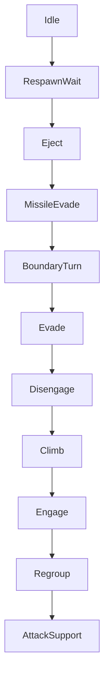

# ADR 107 — Boundary Turn Tactic

| Status | Date       | Wingman Version |
|--------|------------|-----------------|
| Draft  | 2026-09-03 | 1.8.8           |

> Implemented 2026-09-03. V1-V7 covered by tests. **V8 met on the first full
> session; V9 and V10 FAILED** — the tactic fires every time and does not move
> the aircraft. See *Outcome*.

## Context

ADR 101 made a running climb roll away from the arena edge. Two sessions of
measurement say that mechanism cannot do the job, for two independent reasons.

**It usually is not there.** On 2026-09-03 the instrumentation asked for a turn
14 times and the controller actually rolled 4 times. Ten requests reached no
aircraft, because ADR 101 D7 scopes the turn to a *running climb* and no climb
was running. That is a larger gap than any tuning of the turn itself.

**When it is there, rolling is not enough.** The crossing captured as
`rtb_20260903_035810_crossing1.png`:

```
03:57:57  turn requested at 0.49R (fwd +0.45)     ← controller logged "rolling away"
03:58:06  budget spent after 8s, still 0.10R (closest 0.10R)
03:58:10  crossed — RETURN TO BATTLE
```

Eight seconds of held roll while distance fell 0.486R to 0.100R, monotonically.
`closest == final` means the aircraft never got any further away at all. The
trace shows why the roll was inert: Climb owned the pitch axis and held the nose
up throughout, and banking without pulling does not change the flight path.

The same trace shows what took the aircraft there:

```
     t     dist     fwd    alt      rings   friendly  tactic
2098.9    0.480  -0.479   2035   [0, 0, 5]     5      Climb
2109.4    0.430  +0.385   4614   [0, 0, 8]    11      Climb
2119.9    0.035  -0.032   5730   [0, 0, 3]     9      Engage
```

Every contact in the LONG ring, short and mid empty for the whole approach; 5 to
11 friendlies present. The aircraft was chasing distant enemies toward the edge
while recovering altitude, and no tactic in the tree had any opinion about the
boundary.

## Decision

**D1. A first-class tactic, not a modifier on another one.** `BoundaryTurn`
joins the selector with its own condition and its own actuation. It is chosen
because the edge is close, whatever else would otherwise have run — which is the
whole of the fix for the ten requests that reached nothing.

**D2. It owns pitch as well as roll.** This is the reason the tactic has to
outrank Climb rather than cooperate with it. A turn is bank *plus* pull; ADR 101
could only bank, because Climb held the nose up, and the measurement above is
what that costs. Owning the aircraft is not a side effect of the priority
change, it is the point of it.

**D3. Priority: below the lethal-in-seconds tactics, above everything else.**



The argument is timers, not taste. A missile kills in seconds. The boundary
announces itself with a visible countdown — `RETURN TO BATTLE: 10` in the
captured frame — so it is urgent but not instant, and it yields to the things
that are.

**D4. The ADR 073 emergency altitude band still outranks it.** Hitting the
ground is certain; the countdown is a countdown. Climb's emergency band is
therefore hoisted above `BoundaryTurn` while the ordinary altitude-recovery
climb stays below it. Low-and-near-the-edge is the one case where the ordering
is not obvious, and it needs a stated answer rather than an emergent one.

**D5. Reuse the ADR 101 rev 2 condition.** Enter when the boundary is inside
`boundary_turn_frac` and `forward` is positive; hold until the aircraft is
receding — `dist` risen `boundary_turn_recede_frac` above the closest approach of
this turn. That logic is already measured: releasing on the `forward` sign
instead flipped 27% of ticks and read wrongly on 51% of ticks that were actually
closing.

The snapshot gains `boundary_dist` and `boundary_forward`. It currently has no
boundary fields at all — `behavior_tree.py` does not mention the boundary
outside an unrelated docstring — which is why nothing in the tree could act.

**D6. A minimum hold, as Disengage has.** Without it the leaf chatters at the
band edge and the aircraft rolls in and out of a turn it never completes. The
existing `MinimumHold` decorator applies unchanged.

**D6a. The condition is NOT sticky while the actuation runs, and deselection
ends the turn.** *(Added 2026-09-03, after the first live session.)*

MissileEvade and Climb make their condition sticky while their thread runs,
because they pursue a goal of their own — a missile cleared, an altitude
reached. Copying that here was wrong in kind: this tactic has no goal but the
reading, so the condition IS the closed loop and stickiness means the loop can
never open.

Shipped that way, all nine turns of the first session burned the full 12 s cap
and restarted — four back to back on one approach, about sixty seconds of
continuous bank-and-pull — while the range oscillated:

```
0.246 0.309 0.376 0.416 0.484 0.467 0.445 0.411 0.434 0.377 0.341
0.237 0.216 0.241 0.312 0.359 0.400 0.432 0.514 0.443 0.420
```

From a 0.216R minimum the release threshold is 0.276R, cleared two ticks later
at 0.312R. The turn should have ended in about three seconds and could not.

So the condition consults only the reading, and `BehaviorTreeHandler` calls
`stop_boundary_turn()` when the selection leaves the leaf — nothing else ends
the thread early. `MinimumHold` still supplies the anti-flap floor, so the
minimum turn is the hold, not the cap.

**D7. Hand the airframe back flyable (SAF-010).** Taking pitch means giving it
back, and ADR 086 exists because a climb released at +73 degrees coasted 1500 m,
stalled at 24 KPH and hit the ground. The exit push that protects the climb
protects this too, and reusing it is a requirement rather than a nicety.

**D8. Retire ADR 101 D1 and D7.** The roll-during-climb mechanism is superseded,
not kept as a fallback: two writers on the roll axis with different conditions is
the kind of interaction that produces a defect nobody can reproduce. ADR 101
stays as the record of what was tried and what the measurement said.

## Consequences

Wingman gains a tactic that can take the aircraft off a target. That is a real
behavioural change — an engagement will be broken to avoid the edge, and
sometimes the engagement was winnable. The judgement is that leaving the arena
costs more than one contact.

The boundary becomes a tree input, so it is testable the way every other tactic
is: a snapshot with `boundary_dist` set, a tick, an assertion on the selection.
None of the existing ADR 101 behaviour could be tested that way.

Two more writers on pitch — `BoundaryTurn` and Climb — means the SAF-010 exit
path now has two callers. That is the main new risk, and it is why D7 reuses the
existing push rather than writing a second one.

This does not address the deeper cause visible in the trace: an aircraft that
chases long-ring-only contacts toward the edge with friendlies behind it. Regroup
would steer inward but sits below Engage. That is ADR 028 territory and a
separate decision.

## Alternatives considered

**Keep ADR 101's roll and raise the budget.** The natural next tuning step, and
the measurement rules it out: 8 s of roll produced *zero* distance gain, with
`closest == final`. A longer budget multiplies an effect that was not there.

**Reuse Disengage.** It already exists above Engage and already means "stop
chasing". But `disengage_roll_right` holds `ROLL_RIGHT` for 10 s — the same
roll-only mechanism that just failed — so it would inherit the defect while
looking like a smaller change.

**Give Regroup the job.** It steers inward and friendlies were present for the
whole approach. But it fires only when *no* enemy is visible, and the aircraft
was chasing 2 to 9 long-ring contacts. Rewriting its condition to mean two
different things would make both harder to reason about.

**Do nothing and let the countdown handle it.** The game does recover the
aircraft — all 8 crossings on 2026-09-02 ended in `back inside`. But the
excursion wastes 10 to 20 seconds of a 4-minute round, and the rate is what
ADR 106 exists to reduce.

## Validation

- **V1.** A snapshot with the boundary close and ahead selects `BoundaryTurn`
  over Climb, Engage, Regroup and AttackSupport.
- **V2.** It yields to `MissileEvade`, `Eject` and `RespawnWait`.
- **V3.** It yields to Climb's emergency altitude band, and outranks the
  ordinary altitude-recovery climb.
- **V4.** A negative `forward` read does not drop the turn; recession does.
- **V5.** The minimum hold prevents selection chatter at the band edge.
- **V5a.** A running actuation does not force the condition true, and losing the
  selection stops the turn. Regression on the 2026-09-03 session, where every
  turn ran to its cap because it did.
- **V6.** The airframe is handed back inside the flyable pitch band, by the same
  exit push ADR 086 specifies.
- **V7.** With no boundary reading the leaf never selects — blindness is not an
  emergency.
- **V8 — live.** Turn requests and actual actuations match, closing the 10-of-14
  gap. Not yet observed.
- **V9 — live.** `dist` rises during a `BoundaryTurn`, which ADR 101's roll never
  achieved. Not yet observed.
- **V10 — the metric.** ADR 106's crossings-per-mission falls below 0.05 and
  holds across five sessions. That table spans this change deliberately.

## Outcome (2026-09-03, 7h10m, 74 missions)

**V8 met.** 65 turns engaged, 65 actuated — 100%, against 29% before. The
delivery gap this ADR was written to close is closed, and the D6a stickiness fix
gave durations a real spread (1.5 s to 16.5 s, median 10.5 s) instead of a
uniform cap.

**V9 and V10 failed.** 0.11 crossings per mission against a 0.10 baseline, and
where a turn was actually running the range went 0.45R to 0.06R and 0.27R to
0.03R. 46% of turns ran to the 12 s cap without receding.

**D2 is not supported by the evidence.** Its argument — that ADR 101's roll was
inert because Climb owned pitch, so a tactic owning both axes would turn the
aircraft — is the reason this ADR exists. With both axes held, the aircraft still
closes. Something upstream of the axis question is wrong: the keys may not be
arriving during a turn, or the airframe may not rotate the way the model assumes.

**Instrumentation added rather than tuning.** Raising the cap or widening the
band would add force to a lever with no measured effect. Two lines now record
what actually happened on every turn — not only the ~8 a session that end in a
crossing, but the ~60 that do not, which is where the evidence was missing:

- `Controller: boundary turn complete (Ns) — nose -40..+10deg (swing 50), ...`
  from sampled telemetry, reported as RANGE rather than endpoints because a nose
  that swings out and back reads as no change on endpoints alone.
- `BOUNDARY TURN range: 0.45R → 0.07R (closest 0.06R, 6 ticks, never receded)`

Together they split "the turn does not work" into three answerable cases: the
keys did not arrive, the aircraft did not rotate, or it rotated and the range did
not follow. Until one of those is picked out, further tuning is guesswork.

## D5 revised — release hysteresis (2026-09-03)

D5 made recession the release rule: range risen `recede_frac` above the closest
approach of the turn. That answers **"is the turn working"**, and it was wrongly
used to answer **"are we safe now"**.

Measured over 105 turns once ADR 108 made the detector trustworthy:

| | |
|---|---:|
| median release range | 0.34R |
| released inside 0.30R | 40% |
| released inside 0.20R | 27% |

One turn logged `0.02R → 0.06R (closest 0.02R, receded)` — a 0.06 margin
satisfied while handing back an aircraft still on the edge, free to drift
straight back over. Nine of that session's twelve crossings happened with the
turn running.

The release is now a hysteresis band, as Climb's altitude band already was:

- leave at `release_frac` (0.60), wider than the `turn_frac` (0.50) entry so the
  leaf cannot flap on one threshold;
- or on recession, but only once `min_clear_frac` (0.35) away. Below that the
  aircraft is on the edge whatever the trend says.

This was invisible before ADR 108. With the detector blind 81% of the time,
turns rarely ran long enough to release on recession at all.

## Negative result: the turn is roughly break-even (2026-09-04)

Once ADR 108 made the detector trustworthy and the sampler was corrected, the
turn could be measured properly for the first time. Over **33 paired turns** —
each pairing the controller's attitude summary with the handler's range line,
which sit one tick apart in the log and need no new instrumentation:

| | n | median swing | median range gained |
|---|---:|---:|---:|
| speed >= 1000 KPH | 6 | 26 deg | **-0.01R** |
| speed < 1000 KPH | 27 | 21 deg | **+0.00R** |

**The aircraft rotates and the range does not move.** Roughly half of all turns
swing the nose 30 degrees or more and 8 of 20 swing past 60, so control
authority is not the constraint. The range simply does not follow.

Two earlier readings of this are now retracted:

- **"The keys are not arriving"** — disproved. The swings are real; every
  `swing 0` before 2026-09-04 was a sampler artifact, one telemetry reading
  counted a dozen times.
- **"High energy defeats the turn"** — proposed here on 8 samples where fast
  turns gained 0.04R and slow ones 0.10-0.48R, and NOT supported at 33. Both
  speed groups now sit at a median of zero. The `swing 89 deg, +0.48R` line that
  suggested it was the tail of a distribution, not the pattern.

### The 2026-09-04 burst settles it

Five crossings in 62 seconds, roughly one every 15. The traces name the tactic
holding the aircraft through each 30-second window:

| crossing | tactics across the 20 ticks |
|---|---|
| 1 | Climb 11, **BoundaryTurn 7**, Engage 1, Regroup 1 |
| 2 | **BoundaryTurn 15**, Climb 5 |
| 3 | **BoundaryTurn 20** |
| 4 | **BoundaryTurn 20** |

On crossings 3 and 4 the turn had **exclusive control for the entire window and
the aircraft crossed anyway**. That disposes of the last competing explanation —
that the turn was fighting Engage or Climb steering back toward contacts. There
was no competitor. The manoeuvre does not move the range even uncontested.

**The upstream cause is in the same traces.** 18 or 19 of every 20 ticks show
contacts in the LONG ring only, short and mid empty, with 4 to 9 friendlies
present. The aircraft is pursuing enemies it can see only at distance, which sit
at or beyond the arena edge — the same signature as the first crossing trace
recorded for this ADR.

So the shape of the problem is: long-ring-only pursuit takes the aircraft to the
edge, and a tactic that only TURNS cannot undo a tactic that keeps reselecting
the target. D3 placed BoundaryTurn above Engage to stop exactly this, and it does
win selection — it simply cannot win the geometry.

That points at ADR 028's Regroup condition, which fires only when NO enemy is
visible and therefore never fires here, rather than at any parameter of this
tactic. It is the case this ADR explicitly declined to address, and the evidence
now says it is the case that matters.

The remaining candidate is geometric rather than aerodynamic: `dist` is the
range to the NEAREST point on a long boundary arc, and near that arc a heading
change moves the nearest point almost as much as it moves the aircraft. If so
the tactic is steering against a measure that cannot register its effect, and
neither a longer budget, an earlier entry, nor a thrust cut would help.

**No tuning follows from this.** Three sessions of adjustment around this tactic
have not moved crossings per mission out of the 0.10-0.34 band it occupied
before ADR 107 existed. The next step is to establish whether the metric can
respond to the manoeuvre at all, not to adjust the manoeuvre further.

## Files changed

| File | Change |
|---|---|
| `wingman/behavior_tree.py` | `TACTIC_BOUNDARY_TURN`; `boundary_dist` / `boundary_forward` on the snapshot; `make_boundary_condition`; the leaf, inserted by name above Evade; `emergency_active` published on the climb closure for D4 |
| `wingman/controller.py` | `boundary_turn_mode` / `is_boundary_turning`; stop on manual takeover and cleanup; ADR 101's `set_boundary_turn` and the roll-during-climb removed (D8) |
| `wingman/tick_handlers.py` | boundary read moved ahead of the snapshot and cached; actuator registered; ADR 101's `_drive_boundary_turn` removed (D8) |
| `wingman/config.yaml`, `config_schema.py` | `behavior_tree.boundary`, `climb.boundary_turn_max_s`; ADR 101's `minimap.boundary_turn_*` retired |
| `tests/test_behavior_tree.py` | 11 tests: entry, hold through sign flips, recession, band exit, freeze on blindness, D4 yield, priority above Climb/Engage and below Eject/RespawnWait |
| `tests/test_climb_mode.py` | 4 tests: banks AND pulls, SAF-010 handback, idempotence, manual takeover |

## References

- ADR 101 — the roll-during-climb mechanism this supersedes, and the rev 2
  recede condition D5 reuses
- ADR 106 — the crossings-per-mission series this is judged by, and the frame
  capture that produced the evidence above
- ADR 073 / ADR 086 / SAF-010 — the climb, its emergency band, and the flyable
  handback D7 requires
- ADR 070 — MissileEvade, the tactic D3 places above this one
- ADR 028 — Regroup, and the long-ring chase this ADR does not fix
- `test_screenshots/unknown_anomalies/rtb_20260903_035810_crossing1.png`
