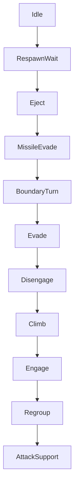

# ADR 107 — Boundary Turn Tactic

| Status | Date       | Wingman Version |
|--------|------------|-----------------|
| Draft  | 2026-09-03 | 1.8.8           |

## Context

ADR 101 made a running climb roll away from the arena edge. Two sessions of
measurement say that mechanism cannot do the job, for two independent reasons.

**It usually is not there.** On 2026-09-03 the instrumentation asked for a turn
14 times and the controller actually rolled 4 times. Ten requests reached no
aircraft, because ADR 101 D7 scopes the turn to a *running climb* and no climb
was running. That is a larger gap than any tuning of the turn itself.

**When it is there, rolling is not enough.** The crossing captured as
`rtb_20260903_035810_crossing1.png`:

```
03:57:57  turn requested at 0.49R (fwd +0.45)     ← controller logged "rolling away"
03:58:06  budget spent after 8s, still 0.10R (closest 0.10R)
03:58:10  crossed — RETURN TO BATTLE
```

Eight seconds of held roll while distance fell 0.486R to 0.100R, monotonically.
`closest == final` means the aircraft never got any further away at all. The
trace shows why the roll was inert: Climb owned the pitch axis and held the nose
up throughout, and banking without pulling does not change the flight path.

The same trace shows what took the aircraft there:

```
     t     dist     fwd    alt      rings   friendly  tactic
2098.9    0.480  -0.479   2035   [0, 0, 5]     5      Climb
2109.4    0.430  +0.385   4614   [0, 0, 8]    11      Climb
2119.9    0.035  -0.032   5730   [0, 0, 3]     9      Engage
```

Every contact in the LONG ring, short and mid empty for the whole approach; 5 to
11 friendlies present. The aircraft was chasing distant enemies toward the edge
while recovering altitude, and no tactic in the tree had any opinion about the
boundary.

## Decision

**D1. A first-class tactic, not a modifier on another one.** `BoundaryTurn`
joins the selector with its own condition and its own actuation. It is chosen
because the edge is close, whatever else would otherwise have run — which is the
whole of the fix for the ten requests that reached nothing.

**D2. It owns pitch as well as roll.** This is the reason the tactic has to
outrank Climb rather than cooperate with it. A turn is bank *plus* pull; ADR 101
could only bank, because Climb held the nose up, and the measurement above is
what that costs. Owning the aircraft is not a side effect of the priority
change, it is the point of it.

**D3. Priority: below the lethal-in-seconds tactics, above everything else.**



The argument is timers, not taste. A missile kills in seconds. The boundary
announces itself with a visible countdown — `RETURN TO BATTLE: 10` in the
captured frame — so it is urgent but not instant, and it yields to the things
that are.

**D4. The ADR 073 emergency altitude band still outranks it.** Hitting the
ground is certain; the countdown is a countdown. Climb's emergency band is
therefore hoisted above `BoundaryTurn` while the ordinary altitude-recovery
climb stays below it. Low-and-near-the-edge is the one case where the ordering
is not obvious, and it needs a stated answer rather than an emergent one.

**D5. Reuse the ADR 101 rev 2 condition.** Enter when the boundary is inside
`boundary_turn_frac` and `forward` is positive; hold until the aircraft is
receding — `dist` risen `boundary_turn_recede_frac` above the closest approach of
this turn. That logic is already measured: releasing on the `forward` sign
instead flipped 27% of ticks and read wrongly on 51% of ticks that were actually
closing.

The snapshot gains `boundary_dist` and `boundary_forward`. It currently has no
boundary fields at all — `behavior_tree.py` does not mention the boundary
outside an unrelated docstring — which is why nothing in the tree could act.

**D6. A minimum hold, as Disengage has.** Without it the leaf chatters at the
band edge and the aircraft rolls in and out of a turn it never completes. The
existing `MinimumHold` decorator applies unchanged.

**D7. Hand the airframe back flyable (SAF-010).** Taking pitch means giving it
back, and ADR 086 exists because a climb released at +73 degrees coasted 1500 m,
stalled at 24 KPH and hit the ground. The exit push that protects the climb
protects this too, and reusing it is a requirement rather than a nicety.

**D8. Retire ADR 101 D1 and D7.** The roll-during-climb mechanism is superseded,
not kept as a fallback: two writers on the roll axis with different conditions is
the kind of interaction that produces a defect nobody can reproduce. ADR 101
stays as the record of what was tried and what the measurement said.

## Consequences

Wingman gains a tactic that can take the aircraft off a target. That is a real
behavioural change — an engagement will be broken to avoid the edge, and
sometimes the engagement was winnable. The judgement is that leaving the arena
costs more than one contact.

The boundary becomes a tree input, so it is testable the way every other tactic
is: a snapshot with `boundary_dist` set, a tick, an assertion on the selection.
None of the existing ADR 101 behaviour could be tested that way.

Two more writers on pitch — `BoundaryTurn` and Climb — means the SAF-010 exit
path now has two callers. That is the main new risk, and it is why D7 reuses the
existing push rather than writing a second one.

This does not address the deeper cause visible in the trace: an aircraft that
chases long-ring-only contacts toward the edge with friendlies behind it. Regroup
would steer inward but sits below Engage. That is ADR 028 territory and a
separate decision.

## Alternatives considered

**Keep ADR 101's roll and raise the budget.** The natural next tuning step, and
the measurement rules it out: 8 s of roll produced *zero* distance gain, with
`closest == final`. A longer budget multiplies an effect that was not there.

**Reuse Disengage.** It already exists above Engage and already means "stop
chasing". But `disengage_roll_right` holds `ROLL_RIGHT` for 10 s — the same
roll-only mechanism that just failed — so it would inherit the defect while
looking like a smaller change.

**Give Regroup the job.** It steers inward and friendlies were present for the
whole approach. But it fires only when *no* enemy is visible, and the aircraft
was chasing 2 to 9 long-ring contacts. Rewriting its condition to mean two
different things would make both harder to reason about.

**Do nothing and let the countdown handle it.** The game does recover the
aircraft — all 8 crossings on 2026-09-02 ended in `back inside`. But the
excursion wastes 10 to 20 seconds of a 4-minute round, and the rate is what
ADR 106 exists to reduce.

## Validation

- **V1.** A snapshot with the boundary close and ahead selects `BoundaryTurn`
  over Climb, Engage, Regroup and AttackSupport.
- **V2.** It yields to `MissileEvade`, `Eject` and `RespawnWait`.
- **V3.** It yields to Climb's emergency altitude band, and outranks the
  ordinary altitude-recovery climb.
- **V4.** A negative `forward` read does not drop the turn; recession does.
- **V5.** The minimum hold prevents selection chatter at the band edge.
- **V6.** The airframe is handed back inside the flyable pitch band, by the same
  exit push ADR 086 specifies.
- **V7.** With no boundary reading the leaf never selects — blindness is not an
  emergency.
- **V8 — live.** Turn requests and actual actuations match, closing the 10-of-14
  gap. Not yet observed.
- **V9 — live.** `dist` rises during a `BoundaryTurn`, which ADR 101's roll never
  achieved. Not yet observed.
- **V10 — the metric.** ADR 106's crossings-per-mission falls below 0.05 and
  holds across five sessions. That table spans this change deliberately.

## References

- ADR 101 — the roll-during-climb mechanism this supersedes, and the rev 2
  recede condition D5 reuses
- ADR 106 — the crossings-per-mission series this is judged by, and the frame
  capture that produced the evidence above
- ADR 073 / ADR 086 / SAF-010 — the climb, its emergency band, and the flyable
  handback D7 requires
- ADR 070 — MissileEvade, the tactic D3 places above this one
- ADR 028 — Regroup, and the long-ring chase this ADR does not fix
- `test_screenshots/unknown_anomalies/rtb_20260903_035810_crossing1.png`
